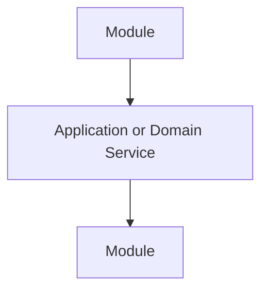
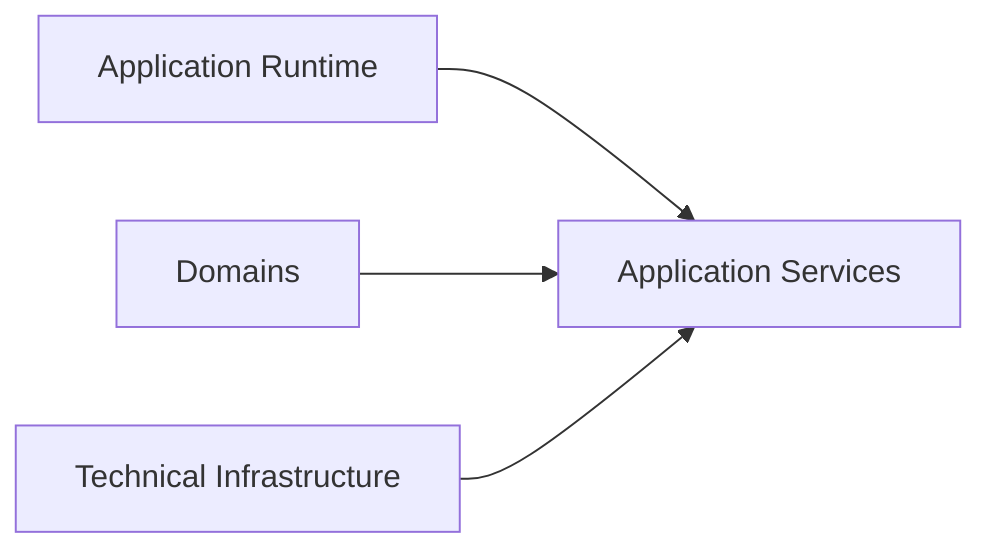

# Loose Coupling

## Status

Current

---

# Purpose

This document defines the loose coupling principles used throughout the KJVOnly application.

Loose coupling allows independent parts of the application to collaborate while remaining responsible only for their own behavior.

The goal is to enable the application to evolve through composition rather than through tightly connected implementations.

---

# Principle

Application responsibilities should collaborate through stable abstractions rather than direct knowledge of one another.

Each part of the application should understand only the responsibilities it owns and the public interfaces exposed by other owners.

An abstraction should depend upon behavior rather than implementation.

As the application evolves, implementations may change.

The collaboration between responsibilities should remain stable.

---

# Preferred Collaboration

The application favors collaboration through well-defined boundaries.

Preferred mechanisms include:

* Application Services,
* Domain Services,
* shared identifiers,
* application events,
* navigation context,
* and public interfaces.

Conceptually:

Modules collaborate through shared abstractions.

They should not directly manipulate one another.

---

# Coupling Heuristics

When introducing a dependency, determine whether the collaborating responsibilities truly need to know about one another.

A useful heuristic is:

> **Could either implementation be replaced tomorrow without requiring changes to the other?**

If the answer is **yes**, the collaboration is likely sufficiently decoupled.

If the answer is **no**, the abstraction should be reconsidered.

Dependencies should exist because one responsibility requires another capability.

They should not exist merely because one implementation happens to call another.

---

# Preferred Communication Patterns

The application prefers communication through stable abstractions.

Examples include:

## Application Services

Shared application capabilities used across multiple Domains.

Examples include:

* pane management,
* workspace services,
* theme management,
* navigation,
* and Bible location references.

---

## Domain Services

Behavior owned by one Domain.

Examples include:

* Bible chapter retrieval,
* Notes management,
* Reading Plan progress,
* and other domain-specific operations.

---

## Application Events

Application events notify interested participants that something has changed.

The sender does not know who receives the event.

Interested components decide whether they should respond.

---

## Shared Identifiers

Domains collaborate through identifiers rather than shared implementation.

For example, Notes and Reading Plans may reference Bible locations without understanding Bible storage or Bible Modules.

---

## Navigation Context

Modules may initialize another Module by supplying navigation context.

The source Module provides context.

The target Module determines how that context should be interpreted.

The source Module does not depend upon the target Module's internal implementation.

---

# Common Anti-Patterns

The following patterns introduce unnecessary coupling and should generally be avoided.

## Direct Component References

One Module should not directly manipulate another Module's component instance.

Instead, request application behavior through an Application Service, Domain Service, or application event.

---

## Shared Internal State

Modules should not depend upon another Module's private runtime state.

Shared state should belong to its appropriate owner and be exposed through a stable interface.

---

## Ownership Violations

A responsibility should not manipulate implementation details owned by another responsibility.

For example:

* Modules should not manipulate the Pane tree.
* Domains should not manipulate rendering.
* Rendering should not manipulate Domain behavior.
* Infrastructure should not define application behavior.

Instead, collaborate through the interfaces exposed by the appropriate owner.

---

## Technology Coupling

Application behavior should not become coupled to specific implementation technologies.

For example:

* Domains should not depend upon IndexedDB.
* Modules should not depend upon relay communication.
* Workspace behavior should not depend upon CSS Grid.

Those technologies implement application behavior.

They do not define it.

---

# Big Takeaway

Loose coupling allows responsibilities to collaborate without becoming dependent upon one another.

Conceptually:

Each responsibility owns its own behavior.

Collaboration occurs through stable abstractions rather than direct implementation knowledge.

As long as ownership remains clear and communication occurs through well-defined interfaces, the application can evolve by replacing implementations without changing the relationships between its major responsibilities.
