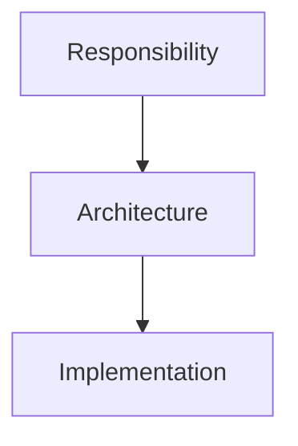

# Architecture  Before Implementation

## Status

Current

---

# Purpose

This document defines one of the fundamental design principles used throughout the KJVOnly application.

When designing software, responsibilities should be identified before choosing or describing their implementation.

The goal is to build an architecture around stable concepts rather than implementation details.

---

# Principle

Design should begin by identifying responsibilities.

Implementation should exist to realize those responsibilities.

Responsibilities define the architecture.

Implementations fulfill it.

As implementations evolve, the underlying responsibilities should remain stable.

---

# Responsibilities and Implementations

Every implementation exists because it fulfills a responsibility.

For example:

```text
Workspace Runtime
    ↓
Current implementation
    +page.svelte
```

```text
Layout Generation
    ↓
Current implementation
    CSS Grid
```

```text
Presentation Stack
    ↓
Current implementation
    Popup overlay
```

```text
Resource Resolution
    ↓
Current implementation
    Nostr + Blossom
```

The responsibility should be described first.

The implementation should be described second.

This distinction allows the application to evolve without redefining its architecture.

---

# Designing at the Correct Level

Software should be discussed using the highest level of abstraction that accurately describes its responsibility.

Conceptually:



When reviewing or designing code, ask:

> **What responsibility is this implementation fulfilling?**

If that question cannot be answered clearly, the implementation may be introducing an abstraction that has not yet been identified.

---

# Stable Concepts

Implementation technologies naturally change over time.

Examples include:

* UI frameworks,
* storage technologies,
* transport protocols,
* rendering techniques,
* networking libraries,
* and serialization formats.

The responsibilities they implement often remain unchanged.

For example, the application will always require:

* layout generation,
* workspace management,
* navigation,
* domain behavior,
* persistence,
* and resource resolution.

The implementation of those responsibilities may change repeatedly throughout the life of the application.

The responsibility should remain stable.

---

# Naming Responsibilities

Names should describe **what** a responsibility does rather than **how** it is currently implemented.

Prefer:

```text
Layout Generation

Presentation Stack

Workspace Runtime

Application Services

Domain Objects

Resource Resolution
```

Instead of:

```text
CSS Grid

Popup

+page.svelte

Svelte Stores

IndexedDB Wrapper

Relay Client
```

Implementation names are appropriate when discussing implementation details.

Architectural discussions should begin with responsibilities.

---

# Refactoring

Refactoring should improve implementations without changing responsibilities.

When replacing an implementation, first verify that the responsibility remains the same.

If the responsibility has not changed, the surrounding architecture should require little or no modification.

This principle allows implementations to evolve while preserving a stable conceptual model.

---

# Common Anti-Patterns

The following practices often make software harder to evolve.

## Designing Around Technologies

Avoid defining architecture in terms of frameworks, libraries, or storage technologies.

Those technologies implement responsibilities.

They do not own them.

---

## Naming by Implementation

Names that describe implementation details often become misleading after refactoring.

Prefer names that describe enduring responsibilities.

---

## Leaking Implementation Details

Responsibilities should expose behavior rather than revealing how that behavior is implemented.

Callers should depend upon stable abstractions rather than implementation technologies.

---

# Big Takeaway

Architecture defines responsibilities.

Implementation realizes those responsibilities.

Conceptually:


A responsibility should outlive any individual implementation.

When software is organized around responsibilities rather than technologies, implementations can be replaced, improved, or rewritten while the application's architecture remains stable.

This principle encourages software that is easier to understand, easier to evolve, and easier to maintain.
