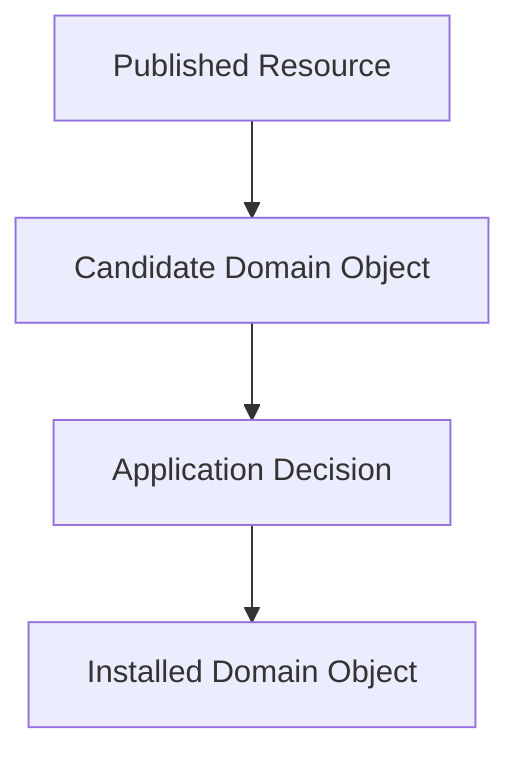

# Local Authority

## Status

Current

---

# Purpose

This document defines the principle of **Local Authority**.

It establishes that the application is the authoritative owner of its installed Domain Objects.

External systems may propose changes.

Only the application decides what becomes part of its local model.

---

# Principle

The application owns its local state.

Published Resources represent information available from external systems.

They do not automatically become part of the application.

Every Published Resource is treated as a candidate.

The application evaluates that candidate before deciding whether it becomes the installed Domain Object.

The network proposes.

The application decides.

---

# Why

External systems are inherently distributed.

Relays may:

* deliver duplicate Resources,
* deliver older Resources,
* receive updates at different times,
* or become temporarily unavailable.

The application must therefore determine which representation becomes its authoritative local model.

This responsibility cannot belong to the network.

It belongs to the application.

---

# Conceptually

Every Published Resource follows the same process.

Only accepted candidates become part of the application's local state.

---

# Consequences

This principle provides several important benefits.

The application:

* remains usable while offline,
* maintains a consistent local model,
* ignores outdated Resources,
* accepts newer Resources,
* and remains independent from the behavior of any individual relay or transport mechanism.

The application's behavior is therefore determined by its installed Domain Objects rather than by the current state of the network.

---

# Heuristic

When deciding where application truth should exist, ask:

> **Who owns the installed Domain Object?**

If the answer is:

> **The application**

then the application must also own the decision of whether a newly received representation replaces it.

External systems may propose.

Only the application determines its authoritative local model.

---

# Big Takeaway

The application owns its installed Domain Objects.

The network provides candidate representations.

The application determines which representations become part of its authoritative local model.

Local Authority preserves a stable application state while allowing the application to participate in a decentralized resource network.
