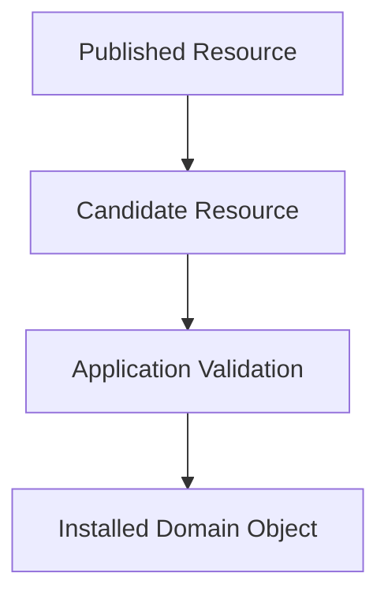

# Local Authority

## Status

Current

---

# Purpose

This document defines the principle of **Local Authority**.

The application is the sole authority over its local model.

External systems may propose new information, but only the application determines what becomes part of its installed Domain Objects.

---

# Principle

The application owns its local model.

Every representation received from outside the application is treated as a candidate.

Only after it has been validated and accepted does it become part of the application's installed Domain Objects.

The network proposes.

The application decides.

---

# Why

The application is designed to operate independently of any individual network, relay, storage provider, or transport mechanism.

External systems may:

* deliver duplicate Resources,
* deliver outdated Resources,
* deliver conflicting Resources,
* become temporarily unavailable,
* or fail to deliver Resources entirely.

The application cannot assume that externally received information is authoritative.

Authority belongs to the application.

---

# Conceptually

Every externally received Resource follows the same process.

Only validated and accepted Resources become part of the application's local model.

---

# Validation

Receiving a Resource does not make it authoritative.

Before a Resource becomes part of the application's local model it may be subject to validation such as:

* authentication,
* authorization,
* schema validation,
* ownership verification,
* conflict resolution,
* version comparison,
* and application-specific policy.

The exact validation process depends upon the Domain and the type of Resource being installed.

The principle remains the same:

> **External information is never trusted simply because it exists.**

---

# Consequences

This principle allows the application to:

* operate while offline,
* maintain a consistent local model,
* ignore invalid or outdated Resources,
* install newer accepted Resources,
* and remain independent of any particular transport or synchronization mechanism.

The application operates on its accepted local Domain Objects, not directly on information from external systems.

---

# Heuristic

When information enters the application, ask:

> **Did this originate outside the application's local model?**

If the answer is **yes**, treat it as a candidate.

Validate it.

Apply application policy.

Only after it has been accepted should it be installed.

The network proposes.

The application decides.

---

# Big Takeaway

Local Authority ensures the application remains the authoritative owner of its local model.

External systems distribute information.

They do not determine application state.

Only the application decides which Resources become installed Domain Objects.

This allows the application to remain predictable, resilient, and independent while participating in a decentralized resource network.
