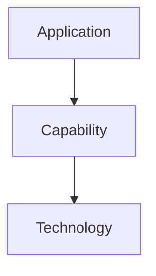

# Capabilities Before Technologies

## Status

Current

---

# Purpose

This document defines the principle of **Capabilities Before Technologies**.

It establishes that software architecture should model the capabilities required by the application before selecting the technologies used to implement them.

Architectural responsibilities should remain stable even as implementation technologies evolve.

---

# Principle

Applications depend upon capabilities.

Capabilities are implemented using technologies.

A capability represents **what** the application requires.

A technology represents **how** that capability is realized.

Architecture should therefore model capabilities rather than individual technologies.

---

# Why

Technologies change.

Capabilities rarely do.

For example, an application may require:

* persistent storage,
* networking,
* serialization,
* compression,
* background execution,
* or cryptographic operations.

These capabilities remain necessary regardless of whether they are implemented using:

* IndexedDB,
* SQLite,
* WebSockets,
* HTTP,
* Web Workers,
* browser APIs,
* or future technologies.

By modeling capabilities first, the architecture remains stable while implementation technologies evolve independently.

---

# Conceptually

The application depends upon the capability.

The capability is implemented by one or more technologies.

The technology should never become part of the application's conceptual architecture.

---

# Examples

Instead of designing around:

* IndexedDB,
* HTTP,
* WebSockets,
* Web Workers,
* or browser APIs,

design around:

* persistence,
* networking,
* background execution,
* serialization,
* compression,
* and platform integration.

The technology may change.

The capability remains.

---

# Heuristic

When introducing a new responsibility, ask:

> **Would this capability still exist if the implementation technology changed completely?**

If the answer is **yes**, the capability belongs in the architecture.

If replacing the technology would require changing the application's conceptual model, the architecture has become coupled to its implementation.

---

# Big Takeaway

Applications should depend upon capabilities.

Capabilities should depend upon technologies.

Technologies should not define the application's architecture.

Stable architectures describe **what** the application requires.

Implementation technologies determine **how** those requirements are fulfilled.
