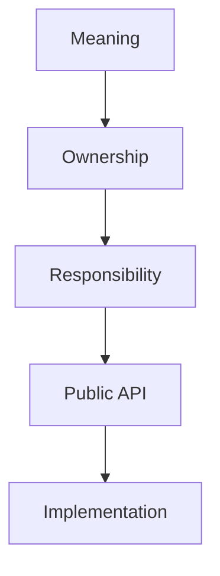
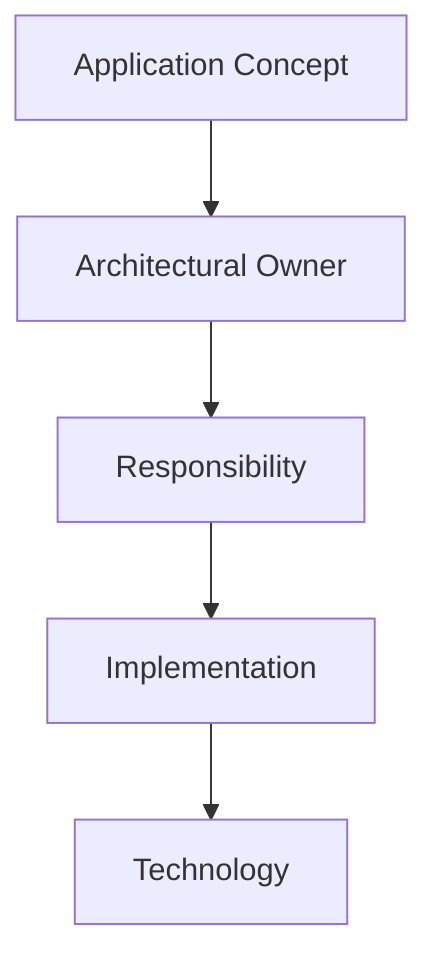
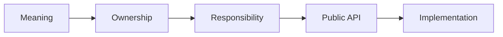

# Responsibility Before Implementation

## Status

Current

---

# Purpose

This document defines the principle of **Responsibility Before Implementation**.

It establishes that software design should begin with meaning, ownership, and responsibility before choosing implementation mechanisms.

The goal is to build architecture around stable concepts rather than technical roles, frameworks, patterns, or technologies.

---

# Principle

Design should begin by identifying what a concept means and who owns it.

Only after ownership and responsibility are clear should the implementation be chosen.

Conceptually:



Meaning defines what the concept represents.

Ownership defines where that concept belongs.

Responsibility defines what the owner must do.

The public API defines how other parts of the application may interact with that responsibility.

Implementation determines how the responsibility is realized in code.

---

# Meaning Before Mechanism

Implementation terminology should not drive architectural design.

Terms such as:

* Service,
* Store,
* Factory,
* Repository,
* Event,
* Adapter,
* Worker,
* Component,
* and Controller

describe implementation roles.

They do not define architectural ownership.

For example:

```text
Pane Service
```

does not belong to an abstract Services layer simply because it is implemented as a service.

Pane behavior belongs to the Workspace Runtime.

The service is one way the Workspace Runtime exposes that behavior.

Likewise:

```text
Chapter Service
```

belongs to the Bible Domain because Bible owns chapter behavior.

The fact that Notes or Reading Plans may consume that service does not transfer ownership.

---

# Ownership Before Organization

Repository organization should follow architectural ownership rather than technical role.

Prefer:

```text
domains/
    bible/
        services/
        stores/
        factories/

    notes/
        services/
        stores/
```

over:

```text
services/
stores/
factories/
```

when the technical-role organization would hide the owner of the behavior.

The primary question should be:

> **Who owns this responsibility?**

Only after answering that question should the implementation be placed into a technical role within that owner.

---

# Public API Before Internal Implementation

Architectural owners may expose behavior through a public API.

The public API represents the stable boundary available to other parts of the application.

For example:

```text
Bible Domain

    Public API
        Chapter Service
        Bible Location Reference
        Bible Verse

    Internal Implementation
        Store adapters
        parsers
        serialization details
        Module internals
```

Another Domain may depend upon the Bible Domain's public API without depending upon its internal implementation.

This allows collaboration without transferring ownership.

The implementation mechanism used to expose the public API may change.

The ownership and meaning should remain stable.

---

# Responsibilities and Implementations

Every implementation exists because it fulfills a responsibility.

For example:

```text
Workspace Runtime
    ↓
Current implementation
    +page.svelte
```

```text
Layout Generation
    ↓
Current implementation
    CSS Grid
```

```text
Module Presentation
    ↓
Current implementation
    Svelte components
```

```text
Persistence
    ↓
Current implementation
    IndexedDB
```

```text
Resource Networking
    ↓
Current implementation
    Nostr and Blossom
```

The responsibility should be understood first.

The implementation should be described second.

This distinction allows implementations to evolve without redefining the architecture.

---

# Designing at the Correct Level

Software should be discussed using the highest level of abstraction that accurately describes the responsibility.

Conceptually:



When reviewing or designing code, ask:

> **What concept does this represent?**

Then:

> **Who owns it?**

Then:

> **What responsibility does that owner have?**

Only then ask:

> **How should it be implemented?**

If implementation terminology is required before ownership can be explained, the design may be operating at the wrong abstraction level.

---

# Stable Concepts

Implementation technologies and patterns naturally change over time.

Examples include:

* UI frameworks,
* storage technologies,
* transport protocols,
* dependency injection,
* repositories,
* service implementations,
* rendering techniques,
* and networking libraries.

The concepts and responsibilities they implement often remain unchanged.

For example, the application may always require:

* Workspace composition,
* Bible behavior,
* Notes behavior,
* persistence,
* resource installation,
* background maintenance,
* and user interface consistency.

The mechanisms used to implement those responsibilities may change repeatedly throughout the life of the application.

Architecture should remain centered on the stable concepts.

---

# Naming Responsibilities

Names should describe enduring meaning whenever the architectural concept is being discussed.

Prefer:

```text
Workspace Runtime

Bible Domain

Resource Installation

Background Processing

Persistence

Module Presentation
```

over architectural categories such as:

```text
Services

Repositories

Managers

Helpers

Controllers
```

Technical-role names remain useful within an architectural owner.

For example:

```text
Bible Domain
    Chapter Service
```

is useful because the owner is already clear.

The problem occurs when the technical role becomes the architecture.

---

# Heuristic

When introducing new code, ask the following questions in order:

```text
What does this mean?

↓

Who owns it?

↓

What responsibility does that owner have?

↓

What should the owner expose publicly?

↓

What implementation mechanism best fulfills it?
```

Do not begin with:

> Should this be a service?

> Should this be a repository?

> Should this use dependency injection?

Those questions belong later.

The architectural question comes first:

> **Who owns this behavior?**

---

# Common Anti-Patterns

## Technical Roles as Architectural Owners

Avoid creating architectural layers merely because implementations share a technical role.

A global `services/` directory can easily combine unrelated ownership:

```text
PaneService
ChapterService
ThemeService
InstallationService
```

These services belong to different architectural owners even though they share an implementation pattern.

---

## Usage Determines Ownership

A responsibility does not become shared merely because multiple parts of the application use it.

For example, Notes may consume Bible chapter behavior.

Bible still owns that behavior.

Usage creates a dependency.

It does not transfer ownership.

---

## Technology Defines Architecture

Avoid defining conceptual architecture using implementation technologies.

IndexedDB implements persistence.

It does not define Persistence.

Nostr implements Resource transport capabilities.

It does not define the Resource Architecture.

Svelte implements presentation.

It does not define Module Presentation.

---

## Premature Abstraction

Do not create a shared architectural owner simply because similar implementations exist in several places.

Shared ownership should emerge from shared meaning.

Implementation similarity alone is insufficient.

---

# Big Takeaway

Architecture begins with meaning.

Meaning determines ownership.

Ownership determines responsibility.

Responsibility determines the public boundary.

Implementation fulfills that responsibility.

Conceptually:



Services, Stores, Factories, Repositories, Events, Components, and other technical roles are implementation mechanisms.

They should exist beneath architectural owners rather than becoming architectural owners themselves.

When software is organized around meaning and responsibility, implementation patterns can evolve without changing the conceptual architecture.

Understand the concept first.

Identify its owner second.

Choose the mechanism last.
