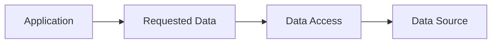

# Request Data, Not Location

## Status

Current

---

# Purpose

This document defines the principle of **Request Data, Not Location**.

It establishes that application behavior should request the information it requires rather than determining where that information should be obtained.

This separates application behavior from storage technologies, transport protocols, and retrieval strategies.

---

# Principle

The application requests data.

It does not request locations.

Application behavior should express **what** information is required.

It should not determine **where** that information resides.

Finding the appropriate source is the responsibility of the data access layer rather than the caller.

---

# Why

The location of data is an implementation detail.

A Domain Object may originate from:

* a local store,
* a published Resource,
* memory,
* a future storage technology,
* or another data source.

The application should receive the same Domain Object regardless of where it was obtained.

By requesting data rather than locations, application behavior remains independent from storage and transport technologies.

---

# Conceptually

The caller requests the required data.

Data Access determines how that request is satisfied.

The source remains an implementation detail.

---

# Examples

Instead of requesting:

* a record from IndexedDB,
* a relay event,
* an HTTP endpoint,
* or a specific storage location,

request:

* a Bible Chapter,
* a Note,
* a Reading Plan,
* a Strong's Entry,
* or another Domain Object.

The caller should express the required information rather than the mechanism used to retrieve it.

---

# Heuristic

When requesting information, ask:

> **Am I requesting the data I need, or am I requesting a place to look for it?**

If the request names a storage technology, transport mechanism, or physical location, the abstraction is likely too low.

The request should instead describe the information required by the application.

---

# Big Takeaway

Application behavior should request data.

Data Access determines where that data is obtained.

By separating the request from its source, the application remains independent from storage technologies, transport protocols, and retrieval strategies while preserving a stable and consistent architectural model.
