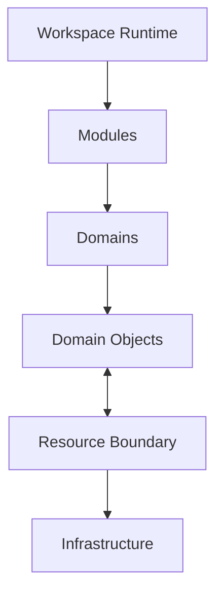
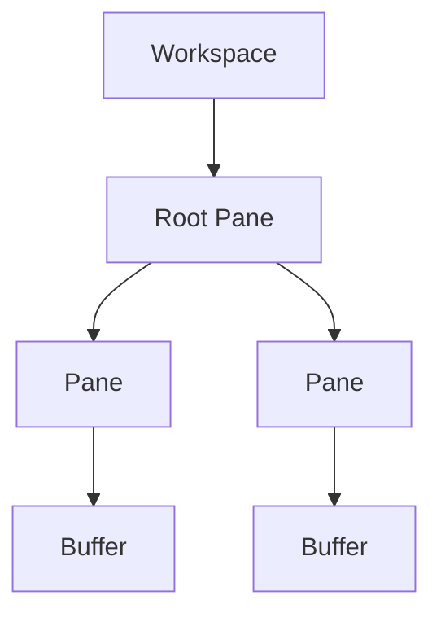
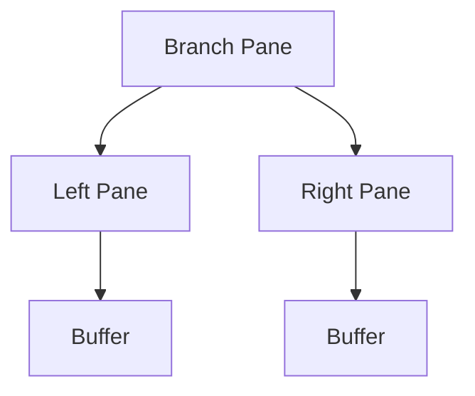
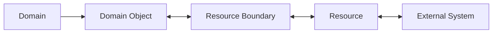
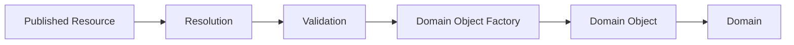

# Application Overview

## Status

Current

---

# Purpose

This document provides a high-level overview of the KJVOnly Application Architecture.

It introduces the primary concepts used throughout the application and establishes the terminology used by the remaining Application Architecture documents.

Rather than describing individual source files or implementation details, this document explains how the application's major responsibilities fit together.

The application is organized around enduring responsibilities such as:

* the Workspace Runtime,
* Domains,
* Modules,
* Domain Objects,
* Public APIs,
* persistence,
* background processing,
* user interface behavior,
* the Resource Boundary,
* and supporting Infrastructure.

Together these responsibilities define how the application operates.

---

# Scope

This document provides the conceptual map for the Application Architecture.

It introduces:

* the Application Runtime,
* the Workspace model,
* Panes,
* Buffers,
* Modules,
* Domains,
* Domain Objects,
* Public APIs,
* the Resource Boundary,
* Infrastructure,
* and the relationships between them.

Detailed responsibilities are described by the architecture documents that follow.

Implementation details belong to the Implementation documentation.

---

# Big Takeaway

The KJVOnly application is organized around a persistent Workspace Runtime.

The Workspace is represented by a recursive Pane tree.

Leaf Panes host Buffers.

Buffers provide the runtime and navigation context used to instantiate Modules.

Modules present capabilities owned by Domains.

Domains own the application's business behavior and Domain Objects.

When Domain Objects must be represented outside the application, they cross the Resource Boundary as Resources.

Infrastructure provides the technical capabilities used to realize these responsibilities.

Each responsibility remains independently owned and collaborates through Public APIs and other stable communication mechanisms.

---

# Application Model

At a high level:



Each concept has a distinct responsibility.

The **Workspace Runtime** manages the application's active study environment.

**Modules** present capabilities to the user.

**Domains** own application behavior and Domain Objects.

**Domain Objects** represent information within the application.

The **Resource Boundary** defines how Domain Objects are represented outside the application.

**Infrastructure** realizes technical capabilities such as Nostr communication, Blossom integration, IndexedDB persistence, workers, networking, and serialization.

These responsibilities should remain distinct even when their implementations are physically close together.

---

# Application Runtime

The application is implemented as a single-page application.

Although SvelteKit provides routing capabilities, routes are not the primary composition model for the application.

The root application hosts a persistent Workspace Runtime.

User interaction primarily occurs by modifying that Workspace rather than navigating between independent pages.

Opening Scripture, following a reference, searching the Bible, viewing Notes, or working through a Reading Plan changes the current Workspace.

Conceptually, the application behaves more like a desktop application than a traditional page-oriented website.

---

# Workspace Runtime

The Workspace Runtime owns the active study environment.

Its responsibilities include:

* Workspace management,
* Pane management,
* Buffer management,
* layout coordination,
* Module composition,
* runtime events,
* and user interaction flow.

The Runtime understands how application capabilities are presented.

It does not own Domain behavior.

A Bible chapter remains Bible behavior regardless of how many Panes display it.

A Note remains Notes behavior regardless of where it appears in the Workspace.

This separation allows the Runtime and Domains to evolve independently.

---

# Workspace Model

A Workspace represents a complete study environment.

The Workspace is modeled as a recursive Pane tree.

Conceptually:



The Pane tree describes the logical arrangement of the Workspace.

Changing the Workspace means changing that tree.

The rendered user interface is a visual representation of the current Workspace state.

---

# Pane Tree

Each Pane is either:

* a branch Pane,
* or a leaf Pane.

A branch Pane divides available space between child Panes.

A leaf Pane hosts a Buffer.

Conceptually:



This recursive model supports nested layouts while preserving a single root representation of the Workspace.

Operations such as splitting, replacing, or deleting Panes modify this structure.

---

# Workspace Operations

The Runtime provides a small set of primitive Workspace operations.

These include:

* splitting a Pane,
* replacing a Pane's Buffer,
* deleting a Pane,
* reorganizing the Pane tree,
* rebuilding layout information,
* and updating Pane dimensions.

More complex interactions are composed from these primitives.

For example, opening another Bible Reader may require the Runtime to split a Pane, create a Buffer for the new Module instance, and update the Workspace layout.

The Runtime owns these operations.

Domains request them through the Runtime's Public API rather than manipulating the Pane tree directly.

---

# Rendering

The Pane tree represents logical layout.

The current implementation transforms that tree into a CSS Grid representation for rendering.

Conceptually:

```text
Pane Tree
    │
    ▼
Layout Representation
    │
    ▼
Rendered Workspace
```

The architectural responsibility is **layout and rendering**.

CSS Grid is the current implementation.

This distinction allows rendering technology to evolve without redefining the Workspace model.

---

# Stable Runtime State

The Workspace Runtime is designed to preserve active Module state when unrelated parts of the Workspace change.

A user may have several Bible Reader instances open at different locations and scroll positions.

Opening another Module should not unnecessarily recreate unaffected Module instances.

Stable Pane and Buffer identity allow the Runtime to preserve state such as:

* scroll position,
* selection,
* navigation context,
* and Module-specific interaction state.

The architectural requirement is stable runtime identity.

The mechanism used to realize that requirement is an implementation concern.

---

# Buffers

A Buffer represents the runtime context hosted by a leaf Pane.

It provides the information required to instantiate and maintain a Module instance.

That context may include:

* Bible location,
* Reading Plan context,
* Note context,
* search context,
* or other Module-specific navigation information.

The Buffer does not own Domain behavior.

It carries the context required for a Module to present Domain capabilities within the Workspace.

Conceptually:

```text
Pane
    ↓
Buffer
    ↓
Module Instance
```

---

# Modules

Modules provide the visible capabilities presented to the user.

A Module is an instantiable application feature hosted by a Buffer within a Pane.

Examples include:

* Bible Reader,
* Bible Search,
* Notes,
* Notes Search,
* and Reading Plans.

Multiple instances of the same Module may exist simultaneously.

For example, several Bible Reader instances may display different chapters while a Bible Search instance remains open in another Pane.

Each instance has its own runtime context.

The Module presents behavior.

It does not own that behavior.

---

# Domains

Domains own cohesive areas of application meaning.

Current Domains include:

* Bible,
* Notes,
* Reading Plans,
* and Settings.

A Domain owns the responsibilities that derive their meaning from that Domain.

For example, the Bible Domain owns:

* Bible content,
* Bible navigation,
* Bible references,
* Strong's information,
* Bible annotations,
* and Bible search.

Bible Search is therefore not a separate Domain.

It is a capability of the Bible Domain.

Likewise, Notes Search belongs to the Notes Domain.

A capability does not become a Domain simply because it has its own Module.

---

# Modules and Domains

Domains and Modules serve different purposes.

A Domain owns behavior.

A Module presents Domain capabilities.

A Domain may expose multiple Modules.

Conceptually:

```text
Bible Domain
    Bible Reader Module
    Bible Search Module

Notes Domain
    Notes Module
    Notes Search Module

Reading Plans Domain
    Reading Plans Module
```

The user interacts with Modules.

Those Modules collaborate with their owning Domain.

For example, a Bible Reader Module presents Bible behavior owned by the Bible Domain.

The Module does not become the owner of chapter retrieval, Scripture navigation, annotations, or other Bible responsibilities simply because it presents them.

---

# Domain Objects

Domain Objects are the application's representation of Domain information.

Examples include:

* Bible Chapters,
* Notes,
* Reading Plans,
* Annotations,
* Strong's information,
* and other Domain-owned data.

Application behavior operates on Domain Objects rather than transport- or storage-specific representations.

A Domain should not need to understand:

* Nostr events,
* Blossom descriptors,
* relay query results,
* IndexedDB records,
* or other Infrastructure representations.

Those are implementation concerns.

Within the application, the Domain Object is the meaningful representation.

---

# Public APIs

Ownership establishes boundaries between responsibilities.

Public APIs provide the primary mechanism for collaborating across those boundaries.

When one responsibility requires behavior owned elsewhere, it should request that behavior through the owner's Public API rather than depending upon its implementation.

For example:

* a Module requests Domain behavior through the Domain's Public API,
* a Domain requests Workspace behavior through the Runtime's Public API,
* and cross-Domain collaboration occurs through the Public API of the Domain that owns the behavior.

Shared use does not imply shared ownership.

A service, store, repository, factory, component, or adapter may implement part of a Public API.

Those are implementation roles.

The Public API is the architectural boundary.

---

# Shared Concepts

Not every concept used by multiple parts of the application becomes a new owner.

Some concepts provide a shared language between independently owned responsibilities.

Examples include:

* Bible location references,
* identifiers,
* navigation context,
* and application events.

Shared use does not automatically imply shared ownership.

The important question remains:

> **Who gives this responsibility meaning?**

Once ownership is identified, other responsibilities collaborate through the appropriate Public API or stable shared representation.

---

# The Resource Boundary

The Resource Boundary defines how Domain Objects leave and re-enter the application.

Inside the application, responsibilities operate on Domain Objects.

When those objects must be:

* published,
* synchronized,
* discovered,
* installed,
* imported,
* exported,
* archived,
* or shared,

they are represented as Resources.

Conceptually:



The Resource Boundary is not a second architecture.

It is the communication boundary between the application's internal Domain model and external representations.

---

# Domain Resource Model

The Domain Resource Model defines the conceptual model used at the Resource Boundary.

It describes concepts such as:

* Resource identity,
* Resource representations,
* discovery,
* resolution,
* installation,
* publication,
* synchronization,
* lifecycle,
* Domain Object reconstruction,
* and serialization.

These concepts define how Domain Objects can exist beyond a single running application while preserving their meaning when they return.

The detailed model is documented in `02_resource-boundary`.

---

# Crossing the Resource Boundary

When externally distributed information enters the application, it arrives as a Resource representation.

That representation is resolved and validated before becoming part of the application's local Domain model.

Conceptually:



Publication travels in the opposite direction.

A Domain Object is serialized into the appropriate Resource representation before being communicated externally.

The application continues to operate on Domain Objects throughout this process.

Resources exist for communication across the boundary.

---

# Local Authority

Resources received from external systems are candidates.

They do not automatically become part of the application's local model.

Before installation, externally received information may be validated for:

* identity,
* authorization,
* schema correctness,
* version,
* integrity,
* and Domain-specific policy.

Only accepted Resources become installed Domain Objects.

This preserves Local Authority:

```text
External system proposes.
Application validates.
Application accepts or rejects.
```

The application operates on its accepted local Domain Objects rather than directly on information from external systems.

---

# Infrastructure

Infrastructure provides the technical capabilities used to realize application responsibilities.

Examples include:

* Nostr communication,
* Blossom communication,
* IndexedDB,
* background workers,
* networking,
* serialization,
* compression,
* and browser APIs.

Infrastructure does not define application meaning.

For example:

```text
Resource Publication
    ↓
Current implementation
    Nostr
```

```text
Local Persistence
    ↓
Current implementation
    IndexedDB
```

```text
Workspace Layout
    ↓
Current implementation
    CSS Grid
```

The responsibility is architectural.

The technology is implementation.

---

# Data Access

Application responsibilities request the information they need.

They should not determine where that information must be found.

For example, a caller requests:

```text
Bible Chapter
```

rather than:

```text
IndexedDB record
Relay event
Blossom object
```

The implementation determines how the request is satisfied.

The caller receives the Domain Object it requires.

This preserves the principle:

> **Request data, not location.**

---

# Background Processing

Long-running or deferred work belongs to Background Processing.

Examples may include:

* resource downloads,
* synchronization,
* search indexing,
* maintenance,
* and other operations that should not block user interaction.

Background Processing performs work on behalf of architectural owners.

It does not become the owner of the Domain behavior merely because the work executes asynchronously.

Ownership remains with the responsibility that gives the work meaning.

---

# Persistence

Persistence preserves application state across runtime sessions.

Different kinds of information may require different persistence strategies.

The Application Architecture defines what must persist.

Infrastructure determines how that persistence is realized.

For example, the application may require durable Domain storage while IndexedDB provides the current implementation.

Persistence responsibilities should therefore remain independent of any individual storage technology.

---

# Current Implementation

The current implementation predates portions of the documented architecture.

Some responsibilities remain distributed across packages organized by technical role, including services, transport code, storage code, and workers.

This does not change architectural ownership.

A service remains an implementation mechanism.

A transport adapter remains Infrastructure.

A Domain responsibility remains owned by its Domain even when its current implementation resides elsewhere.

The migration strategy is therefore incremental:

```text
Identify responsibility
    ↓
Determine ownership
    ↓
Define Public API
    ↓
Move implementation toward its owner
```

Existing separation between typed application models and transport-specific representations provides a strong foundation for that migration.

---

# Evolution

The Application Architecture is intended to remain stable while implementation evolves.

The Workspace Runtime may move out of the root Svelte component.

Rendering technology may change.

Persistence technology may change.

Nostr or Blossom implementations may change.

Services may be reorganized.

Workers may be replaced.

None of those changes should redefine the enduring responsibilities of the application.

Implementation should move toward the architecture.

The architecture should not continually move toward the implementation.

---

# Ownership

Ownership is determined by responsibility.

The relevant question is not:

> **Which architectural layer should contain this code?**

It is:

> **Who gives this responsibility meaning?**

Examples include:

* Workspace behavior → Workspace Runtime
* Pane behavior → Workspace Runtime
* Bible Search → Bible Domain
* Bible annotations → Bible Domain
* Notes behavior → Notes Domain
* Reading Plan behavior → Reading Plans Domain
* relay communication → Infrastructure
* IndexedDB implementation → Infrastructure

Ownership may exist at different levels of the architecture.

A Domain may own behavior.

The Runtime may own behavior.

A subsystem within either may own a narrower responsibility.

The important rule is that every responsibility has a clear owner.

---

# Repository Organization

The repository should evolve to reflect architectural ownership.

Physical organization is an implementation decision.

Ownership is an architectural decision.

During migration, code may temporarily live outside the package that best represents its owner.

That is acceptable.

What matters is that new design decisions begin with ownership rather than existing file location.

Over time:

* Domain behavior should move toward its Domain,
* Runtime behavior should move toward the Runtime,
* Infrastructure should remain beneath the responsibilities it implements,
* and cross-owner collaboration should occur through Public APIs.

Files may move.

Packages may change.

Technologies may change.

Responsibilities should remain clear.

---

# Summary

The KJVOnly Application Architecture is organized around enduring responsibilities.

The Workspace Runtime owns the study environment.

Domains own application behavior.

Modules present Domain capabilities.

Buffers provide runtime context.

Domain Objects represent information within the application.

Public APIs preserve ownership boundaries while allowing collaboration.

The Resource Boundary represents Domain Objects for communication with external systems.

Infrastructure realizes the technical capabilities required by those responsibilities.

Architecture defines responsibility.

Implementation realizes it.
