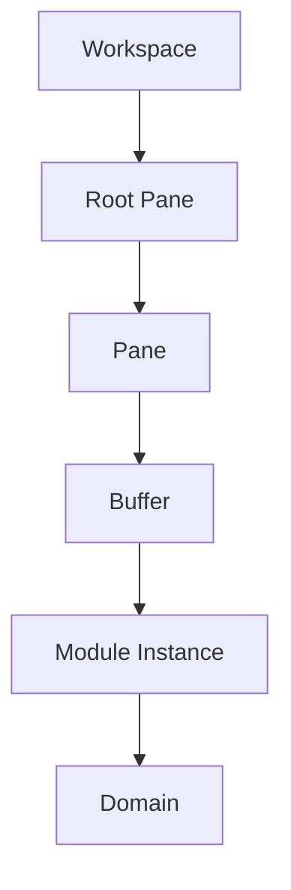
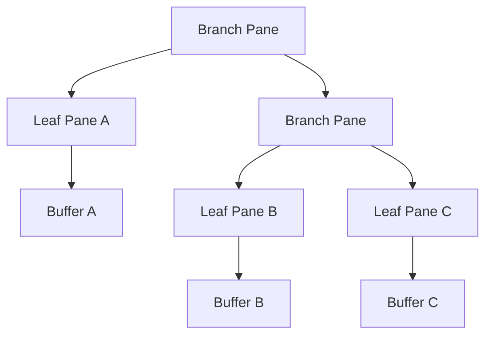
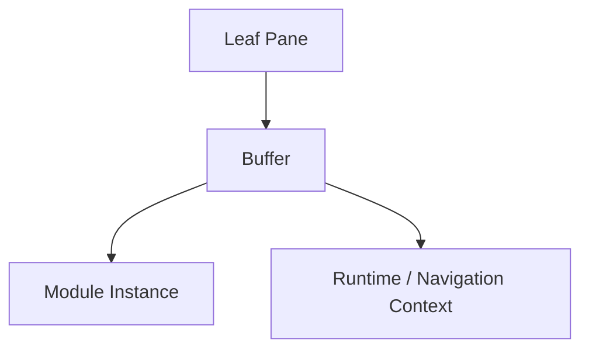
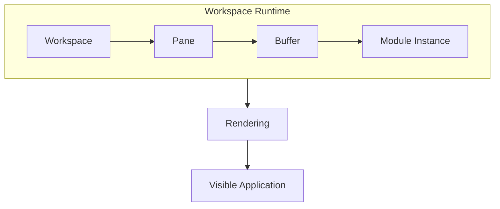
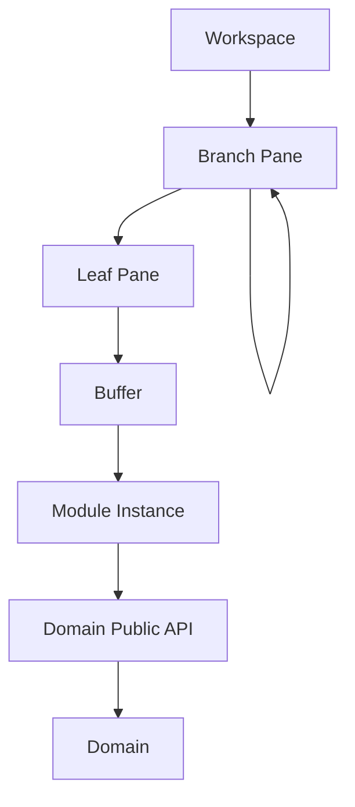

# Workspace Runtime

## Status

Current

---

# Purpose

This document defines the architecture of the **Workspace Runtime**.

The Workspace Runtime provides the persistent execution environment in which the user interacts with the application.

It owns the runtime structures required to:

* organize the visible Workspace,
* host Module Instances,
* preserve independent interaction state,
* coordinate Workspace operations,
* and present multiple application capabilities simultaneously.

This document describes those responsibilities independently from their current implementation.

The current implementation primarily resides within the application's root Svelte route, but the architecture described here is independent of any framework, component hierarchy, or source file organization.

---

# Scope

This document defines:

* the responsibilities of the Workspace Runtime,
* Runtime Objects,
* Workspaces,
* Panes,
* Buffers,
* Module Instances,
* Workspace operations,
* runtime identity,
* navigation context,
* runtime events,
* runtime persistence,
* and the relationship between the Runtime and application Domains.

It does not define:

* Domain behavior,
* Domain Objects,
* resource distribution,
* persistence technologies,
* rendering technologies,
* or the implementation of individual Modules.

Those responsibilities are described elsewhere in the Application Architecture and Resource Boundary documentation.

---

# Principle

The Workspace Runtime owns the execution environment of the application.

It determines:

* what Module Instances are active,
* where they are presented,
* what runtime context belongs to each instance,
* and how the Workspace changes over time.

It does not own the application behavior presented by those Module Instances.

That behavior remains owned by the appropriate Domain.

Conceptually:

```text
Workspace Runtime
    │
    ├── Workspace
    │
    ├── Panes
    │
    ├── Buffers
    │
    └── Module Instances
            │
            ▼
         Domains
```

The Runtime owns execution and composition.

Domains own application behavior.

Modules present Domain capabilities within the Runtime.

---

# Background

KJVOnly does not organize its primary user experience around route navigation.

Instead, the application maintains a persistent Workspace.

Opening Scripture, following references, searching the Bible, working with Notes, or viewing a Reading Plan changes the current Workspace rather than navigating to an independent page.

This allows multiple activities to exist simultaneously.

For example, a Workspace may contain:

```text
Bible Reader
Bible Search
Notes
Reading Plan
Bible Reader
```

at the same time.

Each activity maintains its own runtime context while participating in one Workspace.

This model behaves more like a desktop application than a conventional page-oriented website.

The Workspace Runtime exists to coordinate that environment.

---

# Responsibilities

The Workspace Runtime owns responsibilities associated with the execution and composition of the visible application.

These include:

* Workspace state,
* Pane-tree management,
* Buffer management,
* Module Instance placement,
* runtime identity,
* focus and selection,
* navigation context transport,
* Workspace operations,
* runtime events,
* layout coordination,
* Module Instance lifecycle,
* and restoration of persisted Workspace state.

The Runtime does not own:

* Bible behavior,
* Notes behavior,
* Reading Plan behavior,
* Settings behavior,
* Domain Objects,
* resource resolution,
* resource publication,
* synchronization policy,
* storage technologies,
* transport technologies,
* or other Domain and Infrastructure responsibilities.

The Runtime provides the environment in which Domain capabilities are presented.

---

# Runtime Model

The Workspace Runtime is built from four primary Runtime Objects:

* Workspace
* Pane
* Buffer
* Module Instance

Conceptually:



These objects answer different runtime questions.

| Runtime Object  | Question                                        |
| --------------- | ----------------------------------------------- |
| Workspace       | What study environment is currently active?     |
| Pane            | Where can something be presented?               |
| Buffer          | What active interaction occupies that location? |
| Module Instance | What capability is being presented to the user? |

The Domain sits outside the Runtime Object hierarchy.

The Module Instance presents capabilities belonging to that Domain.

---

# Runtime Objects

Runtime Objects describe the current execution state of the application.

They are different from Domain Objects.

A Domain Object represents information meaningful to a Domain.

Examples include:

* a Bible Chapter,
* a Note,
* a Reading Plan,
* or Bible annotation data.

A Runtime Object represents how application capabilities are currently organized for interaction.

Examples include:

* a Workspace,
* a Pane,
* a Buffer,
* or a Module Instance.

Conceptually:

```text
Domain Object
    What information does the application understand?

Runtime Object
    How is the application currently presenting and interacting with it?
```

These models have different owners and different lifecycles.

---

# Workspace

A Workspace is the root Runtime Object.

It represents one complete active study environment.

A Workspace owns:

* one root Pane,
* the recursive Pane tree reachable from that root,
* the Buffers hosted by leaf Panes,
* the active Module Instances represented by those Buffers,
* and the runtime state required to coordinate them.

Conceptually:

```text
Workspace

    Root Pane

        Recursive Pane Tree

            Buffers

                Module Instances
```

The current implementation treats the root Pane and surrounding logic as the Workspace.

A dedicated `Workspace` object does not currently need to exist for the architectural concept to be valid.

The implementation may introduce a concrete Workspace representation later without changing its responsibility.

---

# Workspace Identity

A Workspace represents one independent runtime context.

Its identity should remain distinct from:

* the Domain Objects displayed inside it,
* the Modules instantiated inside it,
* and any Resource used to obtain application data.

This distinction allows the same Domain Objects or Module types to appear in multiple Workspaces without coupling those Workspaces together.

For example:

```text
Workspace A
    Bible Reader → Genesis 1
    Bible Reader → John 1
    Bible Reader → John 3
    Notes

Workspace B
    Bible Reader → Romans 8
    Bible Search
```

Both Workspaces may use the same Domains.

They remain separate runtime environments.

---

# Current Workspace

The current application exposes one active Workspace.

That Workspace persists for the lifetime of the running application.

The runtime model intentionally allows this to evolve into multiple independent Workspaces.

The architecture therefore models Workspace explicitly even though the current implementation has only one active instance.

---

# Multiple Workspaces

The Runtime model naturally supports multiple independent Workspaces.

Conceptually:

```text
Workspace A
    Root Pane
        Pane Tree

Workspace B
    Root Pane
        Pane Tree

Workspace C
    Root Pane
        Pane Tree
```

Each Workspace owns its own Runtime Object graph.

This allows future capabilities such as:

* named study Workspaces,
* saved Workspace snapshots,
* switching between study contexts,
* restoring previous research,
* maintaining independent study environments,
* and resuming a study session where it was left.

These capabilities extend the Workspace abstraction.

They do not require a different runtime architecture.

---

# Pane

A Pane represents one structural node within the Workspace tree.

Panes define the logical division of the Workspace.

Every Workspace has one root Pane.

All other Panes are reachable recursively through that root.

A Pane does not need to understand:

* Bible Chapters,
* Notes,
* Reading Plans,
* search results,
* Domain Objects,
* Nostr,
* Blossom,
* or storage.

Its responsibility is structural.

---

# Pane Responsibility

A Pane answers one question:

> **How is this part of the Workspace structured?**

There are two conceptual Pane forms:

* Branch Pane
* Leaf Pane

A Branch Pane contains child Panes.

A Leaf Pane hosts a Buffer.

Conceptually:

```text
Pane
    │
    ├── Branch Pane
    │       ├── Pane
    │       └── Pane
    │
    └── Leaf Pane
            └── Buffer
```

---

# Branch Pane

A Branch Pane divides its available region between two child Panes.

It contains:

* a first child Pane,
* a second child Pane,
* and the direction of the split.

The current implementation refers to the child positions as `left` and `right`.

Those names describe their positions in the tree rather than necessarily their final visual orientation.

Depending on the split direction, the child Panes may appear:

* beside one another,
* or above and below one another.

A Branch Pane does not host a Buffer directly.

Its responsibility is the structural relationship between its child Panes.

---

# Leaf Pane

A Leaf Pane represents one active region of the Workspace.

It has:

* a stable Pane identity,
* and one Buffer.

Conceptually:

```text
Leaf Pane

    Buffer

        Module Instance
```

The Pane determines **where** an interaction appears.

The Buffer determines **which active interaction** occupies that Pane.

---

# Recursive Pane Tree

Branch and Leaf Panes form a recursive tree.

A Branch Pane may contain:

* two Leaf Panes,
* two Branch Panes,
* or one Branch Pane and one Leaf Pane.

For example:



The Pane tree is the logical representation of Workspace layout.

Rendering derives a visual layout from this structure.

Rendering technology does not define the Pane tree.

---

# Pane Identity

Leaf Panes have stable identities.

Stable Pane identity allows the Runtime to:

* find a Pane,
* target Workspace operations,
* replace its Buffer,
* split it,
* delete it,
* associate it with a rendered region,
* and preserve its identity when surrounding layout changes.

A Pane may change:

* position,
* dimensions,
* neighbors,
* or depth within the tree

while remaining the same Pane.

This distinction is important for preserving unaffected runtime state during Workspace changes.

---

# Current Pane Representation

The current implementation represents Pane state using a recursive interface similar to:

```typescript
export interface Pane {
  id: string | any;
  left: Pane | any;
  right: Pane | any;
  split: string | any;
  buffer: any;
  updateBuffer: Function | any;
  toggle: boolean | any;
}
```

The same structure currently represents both Branch and Leaf Panes.

Conceptually:

| Property | Branch Pane | Leaf Pane |
| -------- | ----------: | --------: |
| `id`     |          No |       Yes |
| `left`   |         Yes |        No |
| `right`  |         Yes |        No |
| `split`  |         Yes |        No |
| `buffer` |          No |       Yes |

Some properties exist because of the current rendering implementation rather than the enduring Pane model.

A future implementation may introduce explicit Branch and Leaf Pane types.

That change would refine implementation without changing the Pane responsibility.

---

# Pane Model and Pane Component

The Pane Runtime Object and the component that renders it are different concepts.

The **Pane Runtime Object** belongs to the Workspace model.

It describes:

* identity,
* tree relationships,
* split direction,
* and Buffer assignment.

The **Pane component** is part of the rendering implementation.

It presents the Runtime Object visually.

Conceptually:

```text
Pane Runtime Object
        │
        ▼
Rendering Implementation
        │
        ▼
Visible Pane
```

The Runtime model therefore remains independent from the rendering framework.

---

# Buffer

A Buffer represents one active interaction within the Workspace.

Every Leaf Pane hosts one Buffer.

The Pane determines where the Buffer appears.

The Buffer identifies and preserves the runtime context required for one Module Instance.

Conceptually:



This separation allows Pane structure and Module interaction state to evolve independently.

---

# Buffer Responsibility

A Buffer owns the runtime context associated with one active Module Instance.

This includes responsibilities such as:

* stable Buffer identity,
* Module type,
* Module initialization context,
* navigation context,
* selection state,
* focus-related state,
* keyboard interaction state,
* and other transient state necessary to preserve the active interaction.

A Buffer does not own:

* Domain behavior,
* Domain Objects,
* Pane-tree structure,
* Resource lifecycle,
* persistence technology,
* synchronization,
* or publication.

The Buffer is a Runtime Object.

Its purpose is to preserve an active interaction independently from the Pane structure around it.

---

# Buffer Identity

Every Buffer has a stable identity independent from its Pane.

This allows multiple instances of the same Module type to coexist.

For example:

```text
Buffer A
    Bible Reader
    Genesis 1

Buffer B
    Bible Reader
    Romans 8
```

Both Buffers represent Bible Reader interactions.

Their Module type is the same.

Their runtime identities and navigation contexts are different.

---

# Current Buffer Representation

The current implementation uses a `Buffer` class similar to:

```typescript
export class Buffer {
  key: string = uuid4();
  name: string = '';
  component: any;
  componentName: Modules = Modules.NULL;
  keyboardBindings: Map<string, Function> = new Map<string, Function>();
  selected: boolean = false;
  bag: any = {};
  onFocus: Function = () => {};
}
```

Several properties reflect the current Svelte implementation rather than the enduring Buffer model.

For example:

* `component` references the current rendering implementation,
* `componentName` identifies the Module implementation,
* and `bag` currently carries runtime and navigation context.

The enduring responsibility is:

> **A Buffer identifies and preserves one active Module interaction and its runtime context.**

The implementation may evolve without changing that responsibility.

---

# Navigation Context

A Buffer may carry navigation context required to initialize or continue a Module interaction.

The current implementation stores this information in the Buffer's `bag`.

Examples include:

* a Bible location reference,
* a Bible version,
* selected verses,
* Reading Plan navigation context,
* search context,
* Note context,
* Module initialization parameters,
* or other information required by the target Module.

For example:

```typescript
{
  bibleLocationRef: '1_1',
  bibleVersion: 'kjv'
}
```

The Workspace Runtime carries this context.

It does not interpret its Domain meaning.

The target Module interprets the context through the concepts exposed by its Domain.

---

# Navigation Context Is Not Domain Ownership

Passing Domain-related information through a Buffer does not transfer ownership to the Runtime.

For example, a Buffer may carry:

```text
Bible Location Reference
```

The Workspace Runtime needs to preserve and transport that value.

It does not need to understand what Genesis 1 means or how Bible navigation works.

Likewise, a Reading Plan Module may provide a Bible navigation context when opening a Bible Reader.

The Runtime transports the context between interactions.

The relevant Domain remains responsible for interpreting its meaning.

---

# Pane and Buffer Independence

Panes and Buffers have separate identities.

A Pane represents Workspace structure.

A Buffer represents an active interaction.

This distinction supports several important operations.

---

## Replace

A Buffer may be replaced without replacing the Pane.

```text
Before

Leaf Pane A

    Buffer A
        Bible Reader
```

```text
After

Leaf Pane A

    Buffer B
        Notes
```

The Pane retains its structural identity.

Only the active interaction changes.

---

## Split

When a Leaf Pane is split, its existing Buffer can remain active in one of the resulting child Panes.

A new Buffer is introduced for the second child.

```text
Before

Leaf Pane A

    Buffer A
```

```text
After

Branch Pane

    Leaf Pane A
        Buffer A

    Leaf Pane B
        Buffer B
```

The existing interaction can therefore survive the layout change.

---

## Delete

When a Leaf Pane is deleted, the Buffer hosted by that Pane is removed from the active Workspace.

Buffers hosted by unrelated Panes remain unchanged.

---

# Module

A Module defines a reusable presentation capability.

Examples include:

* Bible Reader,
* Bible Search,
* Notes,
* Notes Search,
* and Reading Plans.

A Module is not a Domain.

A Domain owns application behavior.

A Module presents some portion of that behavior to the user.

---

# Module Instance

A Module Instance represents one active execution of a Module within a Buffer.

For example:

```text
Bible Reader Module

    Instance A
        Genesis 1

    Instance B
        Romans 8

    Instance C
        Psalms 23
```

The Module is reusable.

Each Module Instance has its own runtime identity and context.

This allows multiple independent interactions with the same Domain to coexist inside one Workspace.

---

# Module Responsibility

A Module Instance is a conceptual wrapper around a domain behavior.

A Module does not own the Domain behavior it presents.

For example:

```text
Bible Reader Module
        │
        │ presents
        ▼
Bible Domain capability
```

The Bible Domain owns Scripture behavior.

The Bible Reader presents it.

---

# Modules and Domains

A Domain may expose one or more Module types.

Conceptually:

```text
Bible Domain

    Bible Reader Module

    Bible Search Module


Notes Domain

    Notes Module

    Notes Search Module


Reading Plans Domain

    Reading Plans Module
```

This distinction is important.

The user opens Modules.

Modules present Domain capabilities.

Domains own the behavior and Domain Objects that give those capabilities meaning.

Search therefore does not need to become its own Domain.

Bible Search belongs to Bible.

Notes Search belongs to Notes.

---

# Runtime and Domain Boundary

The Runtime and Domains have different responsibilities.

The Workspace Runtime understands:

* Workspaces,
* Panes,
* Buffers,
* Module Instances,
* runtime operations,
* focus,
* selection,
* navigation context,
* and presentation coordination.

A Domain understands:

* its Domain Objects,
* its rules,
* its operations,
* and its enduring application behavior.

Conceptually:

```text
Workspace Runtime
        │
        │ hosts
        ▼
Module Instance
        │
        │ hosts 
        ▼
Domain Behavior
```

Neither responsibility needs access to the other's internal implementation.

---

# Runtime Public API

Workspace behavior should be exposed through the Workspace Runtime's Public API.

A Module may need to request operations such as:

* open a Module,
* split a Pane,
* replace a Buffer,
* close a Pane,
* select a Pane,
* focus a Buffer,
* or change the active Workspace.

The requesting Module should not manipulate the Pane tree directly.

It expresses the requested operation through the Runtime's public boundary.

The Runtime remains responsible for deciding how that operation modifies its Runtime Objects.

---

# Current Runtime Services

The current implementation may expose Runtime capabilities through services such as a Pane service.

Those services are implementation mechanisms.

They are not separate architectural owners.

Conceptually:

```text
Workspace Runtime
    │
    └── Public API
            │
            └── Current implementation
                    Pane Service
```

If the implementation changes, the Runtime continues to own Pane behavior.

The service does not own it merely because it implements or exposes it.

---

# Module Independence

Module Instances should remain loosely coupled.

A Module should not:

* directly manipulate another Module Instance,
* depend upon another Module's component implementation,
* mutate another Buffer's internal state,
* or reach into another Domain's implementation.

Cross-boundary collaboration should use mechanisms such as:

* Public APIs,
* Application Events,
* shared identifiers,
* and Navigation Context.

Ownership determines the boundary.

Loose coupling preserves it.

---

# Cross-Domain Interaction

A Module may initiate an interaction involving another Domain without assuming ownership of that Domain's behavior.

For example:

```text
Reading Plans Module
        │
        │ requests Bible Reader
        │ with navigation context
        ▼
Workspace Runtime
        │
        ▼
Bible Reader Module
        │
        ▼
Bible Domain
```

The Reading Plans Module provides the information necessary to initiate the interaction.

It does not control the Bible Reader's implementation.

It does not implement Bible behavior.

The Bible Domain remains responsible for interpreting Bible-specific information.

---

# Opening a Module

Opening a Module is a Workspace operation.

A Module may request another Module Instance to be introduced into the Workspace.

The Runtime decides whether that request results in:

* a new Pane,
* a replacement Buffer,
* or another supported Workspace operation.

Conceptually:

```text
Source Module
        │
        │ Request
        ▼
Workspace Runtime Public API
        │
        ▼
Workspace Operation
        │
        ├── Split Pane
        │
        └── Replace Buffer
        │
        ▼
Target Module Instance
```

The requester describes its intent.

The Runtime owns the Workspace modification.

---

# Opening a Module With Navigation Context

A Module request may include Navigation Context.

Conceptually:

```text
Source Module

    Module Request
        +
    Navigation Context

            │
            ▼

Workspace Runtime

            │
            ▼

New Buffer

            │
            ▼

Target Module Instance
```

For example, a Reading Plans Module may request a Bible Reader with context describing the next reading.

The Runtime carries that context into the new Buffer.

The Bible Reader and Bible Domain interpret the Bible-specific meaning.

This allows collaboration without direct Module-to-Module control.

---

# Workspace Operations

The Workspace evolves through operations on Runtime Objects.

Primary operations include:

* find Pane,
* split Pane,
* replace Buffer,
* delete Pane,
* open Module,
* focus or select Buffer,
* restore Workspace,
* and update layout.

Each operation modifies Runtime state.

It does not directly modify Domain Objects.

---

# Find Pane

Most structural operations begin by locating a Pane.

A Pane is identified by its stable identity.

The Runtime searches recursively from the Workspace root until the target Pane is found.

Conceptually:

```text
Root Pane
    │
    ▼
Search Pane Tree
    │
    ▼
Matching Pane
```

Finding a Pane is a Runtime operation.

It requires no knowledge of the Domain capability presented in that Pane.

---

# Split Pane

Splitting a Pane introduces another visible region into the Workspace.

Conceptually:

```text
Before

Leaf Pane A
    Buffer A
```

becomes:

```text
After

Branch Pane

    Leaf Pane A
        Buffer A

    Leaf Pane B
        Buffer B
```

The existing Buffer should remain intact wherever possible.

Only the minimum Runtime structure required for the new Pane is introduced.

This preserves the state of unaffected Module Instances.

---

# Replace Buffer

Replacing a Buffer changes the active interaction presented by one existing Leaf Pane.

The Pane retains:

* its structural identity,
* its location in the Pane tree,
* and its relationship to surrounding Panes.

Its Buffer changes.

Conceptually:

```text
Leaf Pane
    │
    ├── Before
    │       Bible Reader Buffer
    │
    └── After
            Notes Buffer
```

The Pane tree itself does not need to change.

---

# Delete Pane

Deleting a Leaf Pane removes that Pane and its Buffer from the active Workspace.

Because the Pane tree is recursive, the deleted Pane's sibling replaces their parent Branch Pane.

Conceptually:

```text
Before

Branch Pane
    Leaf Pane A
    Leaf Pane B
```

```text
Delete Pane B
```

```text
After

Leaf Pane A
```

If the remaining sibling is itself a Branch Pane, that subtree replaces the removed parent.

Only the minimum surrounding Runtime structure should change.

Unrelated Panes, Buffers, and Module Instances remain intact.

---

# Focus and Selection

The Workspace Runtime owns the coordination of active focus and selection.

This may support:

* keyboard input,
* command targeting,
* active-Pane presentation,
* Buffer focus,
* and switching attention between Workspace regions.

Focus and selection are Runtime state.

They do not alter ownership of the Domain information presented inside the selected Module.

---

# Runtime Events

The Workspace Runtime may use Application Events as one mechanism for communication.

Events allow a responsibility to announce that something occurred without requiring direct knowledge of every interested consumer.

Examples may include:

* Workspace changed,
* Pane opened,
* Pane closed,
* Buffer selected,
* Module opened,
* or other application-level events.

An event does not transfer ownership.

The owner of the underlying responsibility remains unchanged.

---

# Domain Events and Module Updates

Modules may also respond to events originating from Domain behavior.

For example, after a Note is changed, other Notes Module Instances may need to refresh their presentation.

Conceptually:

```text
Notes Domain
      │
      │ change occurs
      ▼
Application Event
      │
      ├── Notes Module A
      └── Notes Module B
```

The Module that initiated the change does not directly instruct every other Module Instance to update.

The Domain owns Notes behavior.

Events allow interested presentation instances to react without becoming directly coupled.

---

# Runtime Identity

Stable identity is essential to the Workspace Runtime.

The Runtime distinguishes between:

* Workspace identity,
* Pane identity,
* Buffer identity,
* and Module Instance identity.

These identities serve different purposes.

```text
Workspace Identity
    Which study environment?

Pane Identity
    Which structural region?

Buffer Identity
    Which active interaction?

Module Instance
    Which execution of a Module?
```

Keeping these identities distinct allows Workspace structure to change without unnecessarily destroying active interactions.

---

# Preserving Module State

One of the Runtime's important responsibilities is preventing unrelated Workspace changes from recreating unaffected Module Instances.

For example, a user may have:

```text
Pane A
    Bible Reader
    Genesis 1
    Scroll position 72%

Pane B
    Bible Reader
    Romans 8
    Scroll position 14%
```

Opening a third Pane should not reset either reader.

The Runtime should preserve existing identities and state wherever possible.

The architectural requirement is stable Runtime identity.

The specific rendering mechanism used to preserve component instances belongs to the rendering implementation.

---

# Runtime Persistence

Runtime state may be persisted so the user's Workspace can be reconstructed after the current execution ends.

Examples include:

* Pane-tree structure,
* Buffer assignments,
* Module types,
* Module initialization context,
* navigation context,
* active selection,
* and other reconstructable Workspace state.

The persisted representation should describe the Runtime state necessary to rebuild the Workspace.

It should not depend on live component instances.

Conceptually:

```text
Runtime State
      │
      ▼
Persist
      │
      ▼
Application Restart
      │
      ▼
Restore Runtime Objects
      │
      ▼
Recreate Module Instances
```

---

# Runtime Persistence and Other Application State

Not every value persisted alongside Workspace state is owned by the Workspace Runtime.

For example, the current implementation may persist values such as:

* theme,
* dark mode,
* Bible version,
* or other preferences

near persisted Workspace information.

Physical storage location does not determine architectural ownership.

If a setting derives its meaning from the Settings Domain, Settings remains its owner.

If a Bible preference derives its meaning from the Bible Domain, that ownership remains unchanged.

The Runtime persists only the context it owns or needs to reconstruct the Workspace.

---

# Buffer Persistence

A persisted Buffer should contain the serializable information required to reconstruct its active Module Instance.

This may include:

* Buffer identity,
* Module type,
* navigation context,
* selection state,
* and other serializable runtime information.

It should not persist the live rendered component.

Conceptually:

```text
Persisted Buffer

    Module Type

    Runtime Context

    Navigation Context

        │
        ▼

Restore

        │
        ▼

Module Instance
```

This keeps persisted Runtime state independent from the presentation framework.

---

# Runtime State and Domain Objects

Runtime persistence and Domain persistence are separate responsibilities.

Runtime state answers:

> **What was the user's active Workspace?**

Domain state answers questions such as:

> **What Notes exist?**

> **What Reading Plan progress exists?**

> **What Bible annotations exist?**

Restoring a Workspace may cause Module Instances to request Domain Objects again.

The Runtime does not need to embed those Domain Objects into its own persisted state merely because they are displayed within the Workspace.

---

# Rendering Boundary

The Workspace Runtime defines the logical organization of the active application.

Rendering determines how that organization becomes visible.

Conceptually:



The Runtime owns:

* the logical Pane tree,
* Buffer placement,
* Module Instance placement,
* and Runtime state.

Rendering owns the technical process that presents that state.

---

# Current Rendering Implementation

The current implementation uses:

* recursive Svelte rendering,
* dynamic Module components,
* and CSS Grid.

These technologies implement the Runtime model.

They do not define it.

Conceptually:

```text
Pane Tree
      │
      ▼
Layout Derivation
      │
      ▼
CSS Grid
      │
      ▼
Rendered Workspace
```

The detailed rendering model is described in:

```text
003-runtime-rendering.md
```

---

# Layout Coordination

Workspace operations may require layout to be recalculated.

Examples include:

* splitting a Pane,
* deleting a Pane,
* restoring a Workspace,
* or resizing the available application region.

The logical Runtime model changes first.

Rendering derives the new visible representation second.

Conceptually:

```text
Workspace Operation
        │
        ▼
Update Runtime Objects
        │
        ▼
Derive Layout
        │
        ▼
Render Workspace
```

This follows the broader architectural principle of defining responsibility before implementation.

The Pane tree defines the structure.

CSS Grid realizes it.

---

# Runtime Ownership

Ownership within the Runtime follows the same principle used throughout the application:

> **Ownership belongs to the responsibility that gives the behavior meaning.**

Examples:

```text
Workspace lifecycle
    → Workspace Runtime

Pane-tree modification
    → Workspace Runtime

Buffer assignment
    → Workspace Runtime

Module Instance placement
    → Workspace Runtime

Focus coordination
    → Workspace Runtime

Bible search
    → Bible Domain

Bible annotations
    → Bible Domain

Notes behavior
    → Notes Domain
```

A technical service implementing one of these behaviors does not become its architectural owner.

---

# Operation Ownership

The Workspace Runtime owns operations that modify Runtime Objects.

These include:

* Pane-tree modification,
* Buffer placement,
* Module Instance placement,
* focus and selection coordination,
* Workspace restoration,
* and layout coordination.

Modules may request these operations through the Runtime's Public API.

They do not assume ownership of the operations themselves.

Domains remain independent from Pane-tree structure.

A Domain should not need to understand how many Panes exist or how those Panes are arranged.

---

# Runtime Extensibility

The Runtime is intentionally built around a small number of enduring concepts:

```text
Workspace
    ↓
Pane
    ↓
Buffer
    ↓
Module Instance
```

New application capabilities should fit within this model rather than requiring the Runtime to understand Domain-specific behavior.

A new Module can be introduced without changing the Pane model.

A new Domain can expose Modules without changing Workspace structure.

Multiple Workspaces can be introduced without redefining Pane or Buffer responsibilities.

Alternative rendering technologies can be introduced without redefining Runtime Objects.

This is the primary extensibility property of the Workspace Runtime.

---

# Future Evolution

The current implementation may evolve substantially.

Potential changes include:

* extracting Workspace coordination from `+page.svelte`,
* introducing a concrete Workspace object,
* introducing stronger Branch and Leaf Pane types,
* formalizing the Runtime Public API,
* introducing named Workspace snapshots,
* supporting multiple Workspaces,
* refining Buffer and Navigation Context types,
* moving technical services beneath their architectural owners,
* and replacing rendering implementation details.

These changes should refine the implementation.

They should not require redefining the Runtime's enduring responsibilities.

---

# Current Implementation and Architecture

The current implementation predates portions of the documented architecture.

Some Runtime responsibilities currently exist in:

* `+page.svelte`,
* Pane-related services,
* Svelte components,
* Buffer implementation code,
* event handlers,
* local persistence code,
* and other technically organized locations.

Physical location does not determine ownership.

When current code is refactored, the process should be:

```text
Identify responsibility
        │
        ▼
Determine owner
        │
        ▼
Define or use Public API
        │
        ▼
Move implementation toward owner
```

The goal is not to rewrite the Runtime.

The goal is to allow the implementation to increasingly reflect the Runtime architecture already present in the application.

---

# Design Rules

The Workspace Runtime should follow several rules.

## Runtime Owns Runtime State

Workspace structure, Pane relationships, Buffer placement, Module Instance placement, focus, and selection belong to the Runtime.

---

## Domains Own Domain Behavior

The Runtime may host a Bible Module.

It does not own Bible behavior.

The Runtime may host a Notes Module.

It does not own Notes behavior.

---

## Modules Present Capabilities

Modules provide the user-facing interaction with a Domain capability.

They do not become the architectural owner of that capability.

---

## Buffers Carry Context

Buffers preserve runtime and navigation context.

They should not interpret Domain meaning that belongs elsewhere.

---

## Panes Remain Structural

Panes organize the Workspace.

They should not become aware of the Domain capability displayed within them.

---

## Cross-Boundary Collaboration Uses Public APIs

A Module requesting a Workspace operation should use the Runtime's Public API.

A Module requesting Domain behavior should use the Domain's Public API.

Implementation internals should remain private to their owner.

---

## Preserve Stable Identity

Workspace changes should preserve unaffected Runtime Objects wherever possible.

Layout changes should not arbitrarily reset independent interactions.

---

## Implementation Follows Architecture

Svelte, CSS Grid, services, event handlers, and local storage are implementation mechanisms.

They should realize the Runtime model rather than define it.

---

# Conceptual Model

The complete Runtime relationship can be summarized as:



The Workspace Runtime owns everything required to maintain the Runtime Object hierarchy.

The Domain begins beyond the Module's public collaboration boundary.

---

# Big Takeaway

The Workspace Runtime is the persistent execution environment of KJVOnly.

It is built from four primary Runtime Objects:

```text
Workspace
    ↓
Pane
    ↓
Buffer
    ↓
Module Instance
```

The Workspace owns the active study environment.

Panes define its structure.

Buffers preserve independent runtime and navigation context.

Module Instances present Domain capabilities.

Domains own the application behavior presented by those Modules.

The Runtime and Domains collaborate through Public APIs and other stable communication mechanisms without depending upon one another's internal implementations.

The Workspace Runtime should remain independent from:

* individual Domain behavior,
* resource distribution,
* persistence technologies,
* rendering technologies,
* and other implementation mechanisms.

Technologies may change.

Implementations may move.

New Domains and Modules may be introduced.

The Runtime model should endure.
