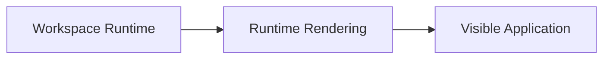
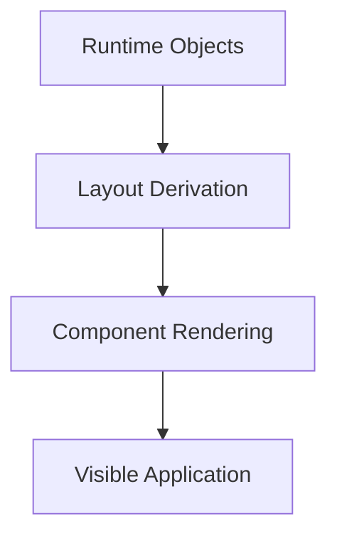
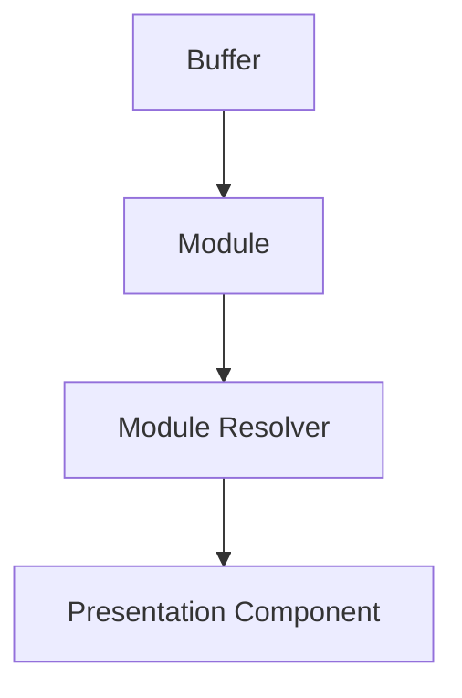
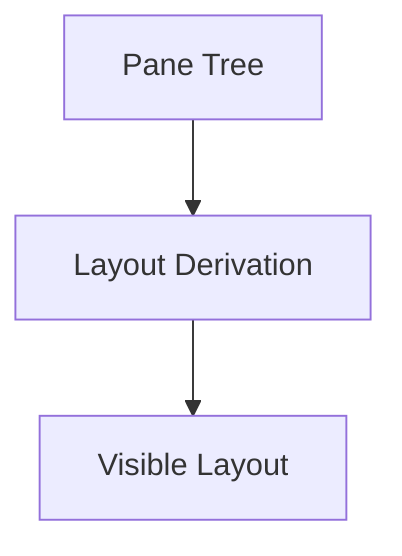
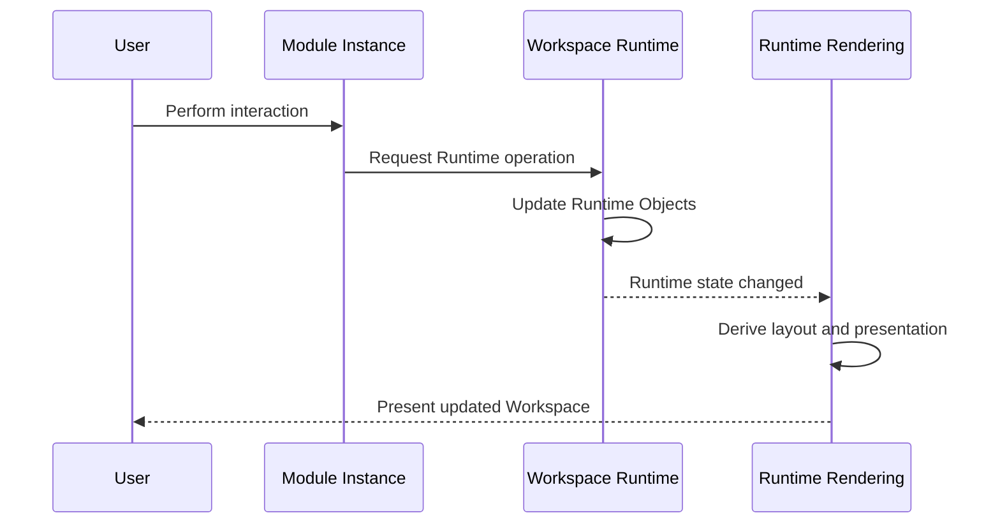
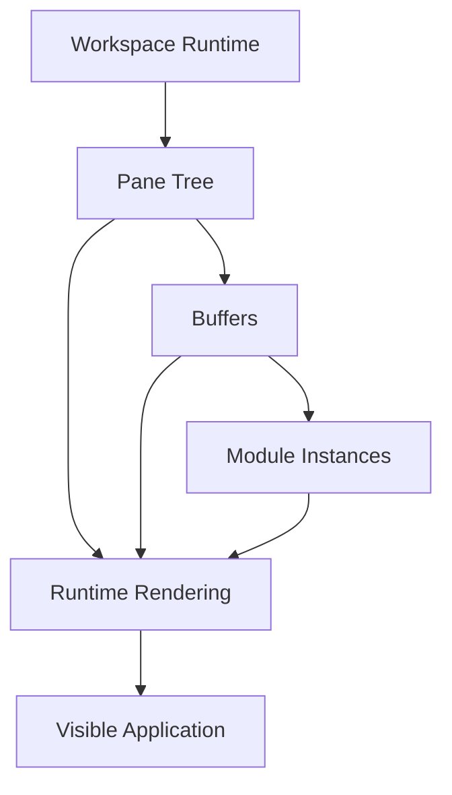

# Runtime Rendering

## Status

Current

---

# Purpose

This document defines how the Workspace Runtime is presented as the visible application.

The Runtime Object model is defined by **002-workspace-runtime.md**.

This document does not redefine that model.

Instead, it describes how:

```text
Workspace
    ↓
Pane
    ↓
Buffer
    ↓
Module Instance
```

is projected into a visible and interactive user interface.

---

# Scope

This document defines:

* the rendering responsibility,
* recursive Pane rendering,
* Module presentation resolution,
* layout derivation,
* Runtime identity during rendering,
* incremental rendering,
* and the current Svelte and CSS Grid implementation.

It does not define:

* Runtime Objects,
* Workspace operations,
* Buffer ownership,
* Navigation Context,
* Domain behavior,
* Domain Objects,
* Resource Boundary behavior,
* persistence,
* or synchronization.

Those responsibilities are defined elsewhere.

---

# Principle

Rendering is a projection of Runtime state.

Conceptually:

```text
Workspace Runtime
        │
        ▼
Runtime Objects
        │
        ▼
Rendering
        │
        ▼
Visible Application
```

The Runtime determines what exists.

Rendering determines how it becomes visible.

---

# Rendering Responsibility

Rendering owns presentation.

Its responsibilities include:

* recursively presenting the Pane tree,
* deriving visible layout,
* rendering Leaf Pane contents,
* resolving Module presentation components,
* preserving presentation identity for stable Runtime Objects,
* and reflecting Runtime changes in the visible application.

Rendering does not own:

* Workspace structure,
* Pane-tree modification,
* Buffer assignment,
* Module Instance placement,
* Domain behavior,
* Domain Objects,
* persistence,
* synchronization,
* or publication.

---

# Rendering Boundary

The Workspace Runtime provides the logical model.

Rendering consumes that model.

Conceptually:



Rendering should not introduce another authoritative model of the Workspace.

It presents the Runtime model that already exists.

---

# Rendering Pipeline

At a high level:



Runtime Objects define the logical structure.

Layout derives visible regions from that structure.

Components present the active Module Instances within those regions.

---

# Recursive Pane Rendering

The Runtime defines the Workspace as a recursive Pane tree.

Rendering mirrors that recursion.

A Branch Pane produces child Pane presentations.

A Leaf Pane produces one visible region containing the presentation associated with its Buffer.

Conceptually:

```text
Pane Rendering

    Branch Pane
        Pane Rendering
        Pane Rendering

    Leaf Pane
        Module Presentation
```

No separate rendering hierarchy is required.

The Runtime structure naturally drives the component hierarchy.

---

# Branch Pane Rendering

A Branch Pane does not directly present a Module Instance.

Its rendering responsibility is structural.

It provides presentation regions for its child Panes.

Conceptually:

```text
Branch Pane
    │
    ├── Child Pane Presentation
    │
    └── Child Pane Presentation
```

The logical child relationship belongs to the Workspace Runtime.

Rendering determines how that relationship appears visually.

---

# Leaf Pane Rendering

A Leaf Pane represents one terminal presentation region.

Its Buffer identifies the active Module Instance to present.

Conceptually:

```text
Leaf Pane
    ↓
Buffer
    ↓
Module Instance
    ↓
Presentation Component
```

Rendering does not need to understand the Domain behavior wrapped by the Module Instance.

It only needs to resolve and present the appropriate Module presentation.

---

# Module Presentation Resolution

A Buffer identifies the Module Instance occupying a Leaf Pane.

Rendering resolves that Module to its presentation implementation.

Conceptually:



The architectural responsibility is:

> **Resolve the presentation associated with the active Module Instance.**

The current implementation uses Svelte components.

That is an implementation mechanism.

---

# Dynamic Module Composition

The visible application is composed dynamically from the Module Instances currently active in the Workspace.

For example:

```text
Workspace

    Bible Reader

    Notes

    Bible Search
```

may later become:

```text
Workspace

    Bible Reader

    Bible Reader

    Reading Plans

    Notes
```

Rendering does not require a fixed page composition.

It presents whatever Module Instances are currently represented by the Runtime.

---

# Multiple Module Instances

Several instances of the same Module type may be active simultaneously.

For example:

```text
Bible Reader
    Genesis 1
```

and:

```text
Bible Reader
    Romans 8
```

are different Module Instances.

Rendering must preserve their independent identities and presentation state.

Module type alone does not identify an active instance.

---

# Module Registration

The rendering implementation requires a way to associate Module types with their presentation components.

Conceptually:

```text
Module Type
    ↓
Module Registration
    ↓
Presentation Component
```

Adding a new Module should not require changes to:

* Pane recursion,
* Workspace operations,
* Buffer behavior,
* or layout generation.

Only the Module presentation registration should need to understand the new rendering component.

---

# Layout Derivation

The Pane tree defines logical Workspace structure.

Rendering derives visible layout from that tree.

Conceptually:



The Pane tree remains the source of Workspace structure.

Rendered layout is derived from it.

---

# Recursive Layout

Every Branch Pane divides one logical region into two child regions.

Those children may then divide their own regions recursively.

For example:

```text
Root Pane

    Horizontal Split

        Left Pane

        Right Branch

            Vertical Split

                Top Pane

                Bottom Pane
```

Rendering traverses this recursive structure to derive the final two-dimensional layout.

---

# Layout Is Derived State

Visible layout should not become another source of truth.

Workspace operations change Runtime Objects first.

Rendering derives the new presentation afterward.

Conceptually:

```text
Workspace Operation
        ↓
Pane Tree Changes
        ↓
Layout Derivation
        ↓
Rendered Workspace
```

This avoids maintaining independent Runtime and layout models that must later be synchronized.

---

# Current Layout Implementation

The current application realizes Workspace layout using CSS Grid.

Conceptually:

```text
Pane Tree
    ↓
Layout Algorithm
    ↓
CSS Grid
    ↓
Visible Workspace
```

The Workspace Runtime does not understand:

* CSS Grid,
* rows,
* columns,
* template areas,
* or browser layout primitives.

Those concepts belong to the rendering implementation.

---

# Layout Algorithm

The current implementation analyzes nested Pane splits and derives a two-dimensional CSS Grid capable of representing them.

Nested horizontal and vertical divisions must ultimately be mapped into one grid.

The exact algorithm is implementation-specific.

The enduring architectural requirement is:

> **The visible layout is derived from the Pane tree rather than maintained as an independent Workspace model.**

---

# Runtime Identity During Rendering

Runtime Objects have stable identities.

Rendering must respect those identities.

Relevant identities include:

* Pane identity,
* Buffer identity,
* and Module Instance identity.

Visual position does not define identity.

A Pane may move or resize while remaining the same Pane.

A Buffer may move with that Pane while remaining the same active interaction.

---

# Identity Before Position

For example:

```text
Before

Pane A
    Buffer A
        Bible Reader
```

may become:

```text
After Split

Branch Pane

    Pane A
        Buffer A
            Bible Reader

    Pane B
        Buffer B
            Notes
```

`Pane A` and `Buffer A` are still the same Runtime Objects.

The Bible Reader Module Instance should therefore remain active.

Only the surrounding layout changed.

---

# Stable Component Identity

Preserving Runtime identity allows rendering to preserve presentation state such as:

* scroll position,
* focus,
* selection,
* transient component state,
* keyboard interaction state,
* and other presentation-specific state.

A Workspace change affecting one Pane should not unnecessarily recreate unrelated Module presentations elsewhere.

---

# Incremental Rendering

Most Runtime operations affect only part of the Workspace.

Examples include:

* splitting one Pane,
* deleting one Pane,
* replacing one Buffer,
* opening one Module Instance,
* or changing active selection.

Rendering should preserve unaffected presentation instances whenever their Runtime Objects remain unchanged.

The architectural requirement is stable presentation for stable Runtime identity.

The exact framework optimization strategy is implementation.

---

# Rendering Updates

Rendering follows Runtime changes.

Conceptually:



Rendering does not own the Workspace operation.

It presents the resulting state.

---

# Rendering and Domain Behavior

Rendering presents interactions with Domain behavior.

It does not own that behavior.

For example, a Bible Reader presentation may:

* display Scripture,
* collect user input,
* invoke Bible Domain behavior,
* and present the result.

The Bible Domain remains responsible for:

* Scripture behavior,
* annotations,
* navigation rules,
* search behavior,
* and Bible Domain Objects.

The fact that the behavior is visible inside a component does not transfer ownership to rendering.

---

# Rendering and Runtime Behavior

The same rule applies to Runtime behavior.

A UI control may allow the user to:

* split a Pane,
* close a Pane,
* open a Module,
* or select another Buffer.

The control requests behavior through the Workspace Runtime's Public API.

The component does not become the owner of the Workspace operation merely because the user activated it there.

---

# Rendering and Public APIs

Presentation crosses ownership boundaries through Public APIs.

Conceptually:

```text
Presentation
    │
    ├── Workspace Runtime Public API
    │       ↓
    │   Runtime behavior
    │
    └── Domain Public API
            ↓
        Domain behavior
```

Rendering remains focused on presentation.

It does not need access to the owner's internal implementation.

---

# Current Rendering Implementation

The current rendering implementation uses:

* Svelte,
* recursive Pane components,
* dynamic Module component resolution,
* CSS Grid,
* stable Pane identities,
* stable Buffer identities,
* and component preservation.

These technologies realize the rendering responsibility.

They do not define it.

---

# Current Pane Components

Pane components present Pane Runtime Objects.

A Pane component may:

* determine whether the Pane is a Branch or Leaf,
* recursively present children,
* apply derived layout information,
* and render the Module presentation associated with a Leaf Pane's Buffer.

The component presents Runtime state.

It does not own the Runtime state.

---

# Current Module Components

A Module presentation may currently be implemented as a Svelte component.

Conceptually:

```text
Domain Behavior
        ↓
Module Instance
        ↓
Presentation Component
        ↓
Visible Interaction
```

The component is an implementation of presentation.

It is not the Domain behavior.

It is not the Module concept itself.

---

# Rendering Performance

Rendering performance is important because several Module Instances may remain active simultaneously.

Stable Runtime identity and incremental updates help reduce unnecessary component recreation.

Architecturally, the important requirements are:

* Runtime identity remains stable,
* unaffected interactions remain intact,
* layout is derived from Runtime structure,
* and rendering does not maintain an independent authoritative Workspace model.

Specific optimization techniques may change over time.

---

# Rendering Independence

Rendering technology should remain replaceable.

The Workspace Runtime should not depend on whether rendering uses:

* Svelte,
* another component framework,
* CSS Grid,
* another layout system,
* or another future presentation mechanism.

Likewise, Domains should not depend upon rendering technology.

The responsibility is architectural.

The technology is implementation.

---

# Future Evolution

Rendering may evolve through capabilities such as:

* alternative layout algorithms,
* stronger Module registration,
* virtualization,
* detached presentation surfaces,
* multiple simultaneous Workspace views,
* improved incremental rendering,
* or alternative component technologies.

These changes should remain beneath the same rendering responsibility.

They should not require the Workspace Runtime or Domains to be redesigned.

---

# Design Rules

## Rendering Presents Runtime State

The Workspace Runtime defines what exists.

Rendering presents it.

---

## Runtime Objects Are Defined Elsewhere

Workspace, Pane, Buffer, and Module Instance are defined by **002-workspace-runtime.md**.

This document consumes those concepts rather than redefining them.

---

## Layout Is Derived

Visible layout is derived from the Pane tree.

It is not an independent Workspace model.

---

## Identity Is Stable

Rendering should preserve existing presentation state when the corresponding Runtime Objects remain unchanged.

---

## Rendering Does Not Own Behavior

Rendering may invoke Runtime or Domain behavior through Public APIs.

It does not assume ownership of those responsibilities.

---

## Rendering Technologies Are Implementation

Svelte and CSS Grid are current implementation choices.

They do not define the architecture.

---

# Conceptual Model

The complete rendering relationship can be summarized as:



The Workspace Runtime defines the active structure.

Rendering projects that structure into the visible application.

---

# Big Takeaway

Runtime Rendering has one responsibility:

> **Present the Workspace Runtime.**

The Runtime defines:

```text
Workspace
    ↓
Pane
    ↓
Buffer
    ↓
Module Instance
```

Rendering does not redefine those concepts.

It:

* recursively presents the Pane tree,
* derives visible layout,
* resolves Module presentation components,
* preserves presentation identity,
* and reflects Runtime changes in the visible application.

The Pane tree defines logical structure.

Rendering derives presentation from it.

Svelte, CSS Grid, recursive components, and dynamic component resolution are current implementation mechanisms.

They may change.

The Runtime model should not need to.
