# Public APIs

## Status

Current

---

# Purpose

This document defines how independently owned parts of the application expose capabilities to one another.

Every architectural owner may provide a Public API through which other parts of the application interact with its behavior and concepts.

The purpose of a Public API is to preserve ownership boundaries while allowing collaboration throughout the application.

---

# Scope

This document defines:

* Public APIs,
* architectural boundaries,
* public and internal responsibilities,
* cross-Domain dependencies,
* cross-subsystem collaboration,
* and the relationship between ownership and exposed capabilities.

It does not define:

* JavaScript module syntax,
* TypeScript exports,
* dependency injection,
* file-system organization,
* or enforcement mechanisms.

Those responsibilities belong to the Implementation documentation and Developer Guide.

---

# Background

The application consists of independently owned architectural subsystems.

Examples include:

* the Workspace Runtime,
* the Bible Domain,
* the Notes Domain,
* the Reading Plans Domain,
* Resource Integration,
* Background Processing,
* and the User Interface.

These owners frequently need capabilities provided by one another.

Direct access to another owner's internal implementation would create unnecessary coupling.

Instead, each architectural owner may expose a deliberate Public API.

Conceptually:

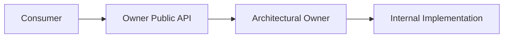

The consumer depends upon the Public API.

The owning subsystem remains free to change its internal implementation without affecting consumers, provided the public contract remains stable.

---

# Public API Definition

A Public API is the set of capabilities, concepts, and operations that an architectural owner intentionally exposes to the rest of the application.

A Public API may expose:

* Domain Objects,
* identifiers,
* services,
* operations,
* events,
* queries,
* or other stable application concepts.

The implementation mechanism is secondary.

For example, the Bible Domain may expose:

```text
Bible Domain

    Public API
        BibleLocationReference
        BibleVerse
        BibleChapter
        Chapter Service

    Internal
        Store implementations
        parsers
        factories
        Module internals
        persistence details
```

The Public API describes what other parts of the application are allowed to depend upon.

Everything else remains an implementation detail of the owner.

---

# Ownership Before Exposure

A capability does not become application-owned simply because multiple parts of the application use it.

Ownership is determined by meaning.

For example, a Bible Location Reference remains owned by the Bible Domain even when it is used by:

* Notes,
* Reading Plans,
* Search,
* or other application capabilities.

Likewise, Pane behavior remains owned by the Workspace Runtime even when every Module may request Pane operations.

Conceptually:

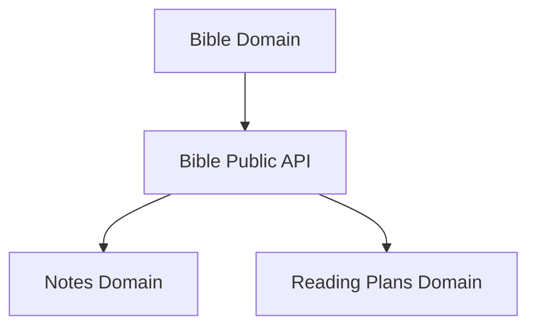

Usage creates a dependency.

It does not transfer ownership.

The owning subsystem exposes the capability through its Public API while retaining responsibility for its meaning and behavior.

# Cross-Owner Collaboration

Architectural owners collaborate through their Public APIs.

An owner may depend upon another owner's Public API when that dependency reflects a genuine application concept.

Conceptually:

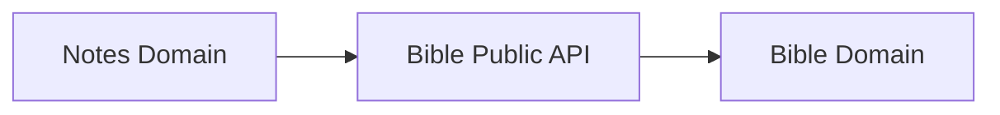

For example, the Notes Domain may request Bible chapter information when creating a new Note.

The Bible Domain remains responsible for Bible behavior.

The Notes Domain remains responsible for Note behavior.

The Public API provides the collaboration point while preserving ownership.

---

# Public and Internal Responsibilities

Every architectural owner consists of two conceptual areas:

* its Public API,
* and its internal implementation.

Conceptually:

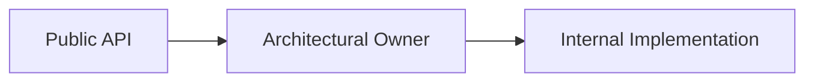

The Public API represents the stable contract available to the rest of the application.

Internal implementation exists solely to fulfill the owner's responsibilities.

Internal implementation may change without affecting consumers provided the Public API remains compatible.

This separation allows architectural boundaries to remain stable while implementation continues to evolve.

---

# Public API Design

Public APIs should expose application concepts rather than implementation details.

Prefer exposing:

* Domain Objects,
* identifiers,
* queries,
* operations,
* events,
* and other meaningful concepts.

Avoid exposing:

* persistence implementations,
* serialization details,
* parsing logic,
* presentation components,
* networking mechanisms,
* or other implementation-specific structures.

Consumers should understand what an owner provides without needing to understand how that capability is implemented.

---

# Stable Boundaries

The purpose of a Public API is to create a stable architectural boundary.

Conceptually:

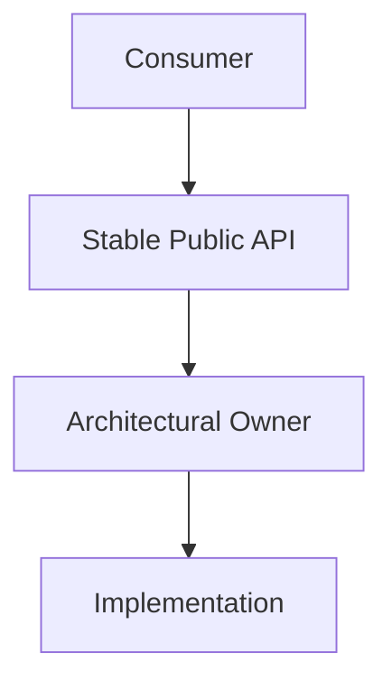

As implementation evolves, the Public API should remain stable whenever practical.

A stable Public API reduces unnecessary coupling between architectural owners and allows implementation to evolve independently.

Consumers depend upon the capability being provided rather than the mechanism used to provide it.

---

# Public APIs Are Not Ownership Transfer

Using another owner's Public API does not transfer ownership.

For example, the Reading Plans Domain may use Bible Location References.

The Notes Domain may request Bible verses.

Background Processing may invoke Resource Installation.

These usages create dependencies between architectural owners.

They do not redefine who owns the underlying concepts.

Ownership always remains with the subsystem responsible for the meaning of that concept.

Public APIs provide controlled collaboration while preserving that ownership.

# Public API Design Principles

A Public API should expose the smallest set of capabilities necessary for meaningful collaboration.

Every publicly exposed concept becomes part of the owner's architectural contract.

Conceptually:

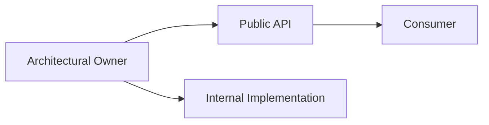

Capabilities should become public because they represent stable application concepts rather than because they happen to be useful today.

A small, intentional Public API is easier to understand, easier to evolve, and better preserves architectural ownership.

---

# Public APIs Should Be Intentional

Public APIs should be designed.

They should not emerge accidentally through unrestricted imports.

When exposing a capability, ask:

* Does another architectural owner genuinely require this concept?
* Does this capability represent stable application meaning?
* Does exposing it preserve ownership boundaries?

If the answer is no, the capability should remain internal.

The goal is not to expose implementation.

The goal is to expose collaboration.

---

# Public APIs Evolve More Slowly

Internal implementation changes frequently.

Public APIs should change deliberately.

Conceptually:

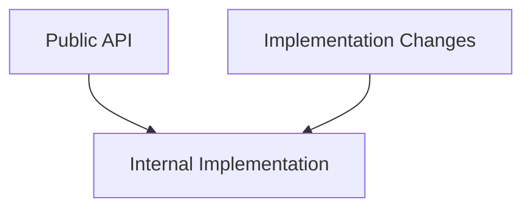

Architectural owners should be free to improve internal implementation without requiring changes throughout the rest of the application.

Stable Public APIs reduce coupling by allowing consumers to depend upon enduring concepts rather than implementation details.

Whenever practical, changes should occur behind the Public API instead of changing the Public API itself.

---

# Collaboration Through Concepts

Architectural owners should collaborate through meaningful application concepts.

For example:

* Bible exposes Bible Location References.
* Bible exposes Bible Chapters.
* Notes exposes Notes.
* Reading Plans expose Reading Plans.

Consumers should collaborate using these concepts rather than reaching into another owner's implementation.

Conceptually:

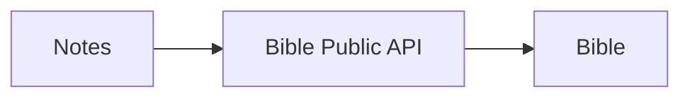

This keeps dependencies understandable while preserving the natural ownership of application concepts.

---

# Internal Freedom

A well-defined Public API allows an architectural owner to change internally without affecting consumers.

Implementation details such as:

* storage,
* algorithms,
* parsing,
* caching,
* rendering,
* networking,
* or helper abstractions

may evolve independently.

Consumers should continue interacting with the same application concepts regardless of those internal changes.

The architectural boundary remains stable.

The implementation remains free to evolve.

# Public API Composition

A Public API is composed of the concepts an architectural owner intentionally makes available to the rest of the application.

A Public API may expose different kinds of capabilities depending upon the responsibilities of the owner.

Conceptually:

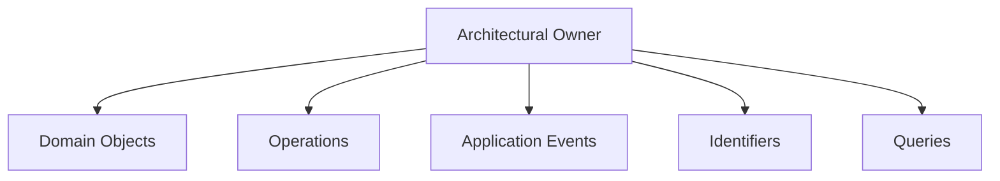

Not every architectural owner exposes every kind of capability.

A Public API should expose only those concepts that naturally belong to its responsibilities.

---

# Public APIs Reflect Architectural Meaning

The structure of a Public API should reflect the meaning of the architectural owner rather than the technology used to implement it.

For example, the Bible Domain may expose:

* Bible Chapters,
* Bible Verses,
* Bible Location References,
* Chapter operations,
* and Bible-related events.

The Workspace Runtime may expose:

* Workspace operations,
* Pane operations,
* Buffer operations,
* and runtime events.

Background Processing may expose:

* maintenance operations,
* execution status,
* and maintenance events.

Each Public API reflects the concepts naturally owned by that subsystem.

---

# Public APIs Should Be Cohesive

The capabilities exposed by a Public API should belong together conceptually.

Conceptually:

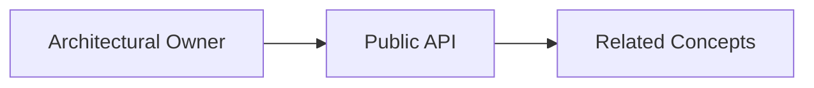

Consumers should be able to understand the purpose of an architectural owner by examining its Public API.

Unrelated capabilities should not accumulate within a single Public API simply because they are convenient to expose.

Cohesion should follow meaning rather than implementation convenience.

---

# Architectural Dependencies

Public APIs establish the permitted dependencies between architectural owners.

Conceptually:

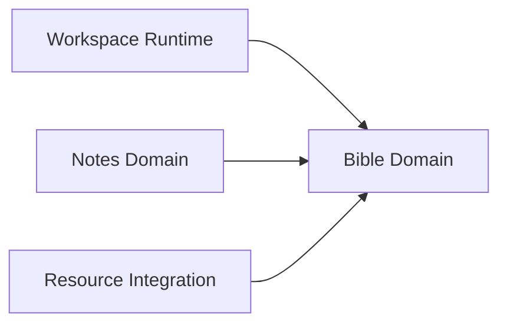

These dependencies communicate collaboration.

They do not redefine ownership.

An architectural owner remains responsible for its own concepts regardless of how many other parts of the application depend upon them.

Dependencies should always point toward the owner of the concept.

Ownership should never move toward the consumer.

---

# Public APIs Encourage Replaceable Implementations

Consumers depend upon architectural concepts rather than implementation details.

As long as the Public API remains consistent, an architectural owner may improve or replace its internal implementation without affecting consumers.

For example:

* persistence technologies may change,
* networking implementations may change,
* presentation frameworks may change,
* algorithms may improve,
* storage strategies may evolve.

Consumers continue interacting with the same Public API.

This separation allows implementation to evolve while preserving stable architectural boundaries.

# Future Evolution

Public APIs define stable architectural boundaries rather than implementation mechanisms.

As the application evolves, the implementation used to expose a Public API may change without affecting the architectural model.

Conceptually:

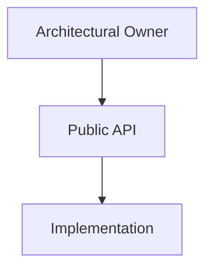

Future implementations may introduce new technologies, packaging strategies, language features, or deployment models.

Regardless of implementation, every architectural owner should continue exposing a deliberate Public API that represents its stable application concepts.

The mechanism used to publish that API may evolve.

The architectural boundary should remain consistent.

---

# Public API Versioning

Public APIs should evolve without unnecessarily disrupting existing consumers.

Once an architectural owner exposes a Public API, other parts of the application may depend upon that contract.

Changes to the Public API should therefore be treated deliberately.

A new requirement should not automatically require every existing consumer to change at the same time.

Conceptually:

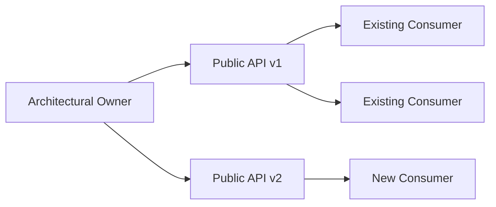

When a change cannot be introduced compatibly, the owner may expose a new version of the affected Public API.

Existing consumers may continue using the previous version while new or migrated consumers use the newer contract.

This allows migration to occur incrementally rather than requiring coordinated changes throughout the application.

---

# Compatibility

Public API changes should preserve compatibility whenever practical.

Prefer:

* adding new capabilities,
* adding new operations,
* adding optional information,
* or introducing a new API version,

rather than changing the meaning of an existing contract.

A Public API should not silently change behavior in a way that invalidates existing consumers.

The meaning of an existing version should remain stable for as long as that version is supported.

---

# Incremental Migration

Public API versioning allows architectural consumers to migrate independently.

Conceptually:

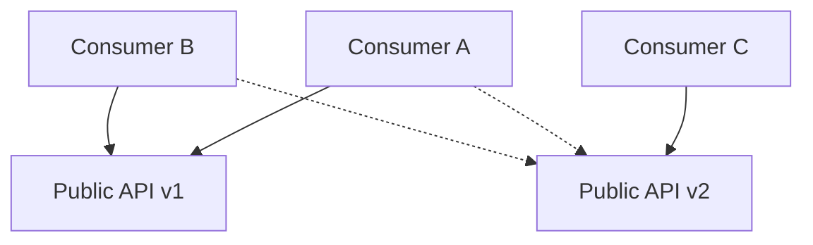

Consumers may move to the newer API as their implementation is updated.

The architectural owner may support multiple API versions during the migration period.

Once all consumers have migrated and the previous version is no longer required, the older API may be retired.

Versioning therefore separates:

* introducing a new contract,
* migrating consumers,
* and removing the previous contract.

These should not be treated as one simultaneous change.

---

# Version Ownership

The architectural owner owns the lifecycle of its Public API versions.

Consumers select the version appropriate to their current implementation.

The owner determines:

* which versions are available,
* the meaning of each version,
* compatibility guarantees,
* and when an obsolete version may be retired.

Consumers should not redefine or adapt another owner's Public API independently.

If a new capability is required, the owning subsystem should expose that capability through its own Public API.

---

# Versioning Philosophy

Versioning exists to protect architectural boundaries from cascading change.

A change inside one architectural owner should not require immediate modification throughout the entire application.

Public APIs provide stable contracts.

Versioned Public APIs provide stable evolution.

The goal is not to version every change.

The goal is to provide a controlled migration path when a public contract must change incompatibly.

---

# Big Takeaway

Every architectural owner defines a Public API.

The Public API establishes the boundary through which the rest of the application collaborates with that owner.

Conceptually:

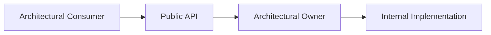

Public APIs preserve ownership while allowing collaboration.

Consumers depend upon stable application concepts rather than implementation details.

Ownership remains with the subsystem that gives those concepts meaning.

Implementation remains free to evolve behind the Public API.

Architecture defines the boundary.

The Public API makes that boundary visible.
