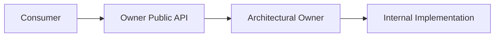
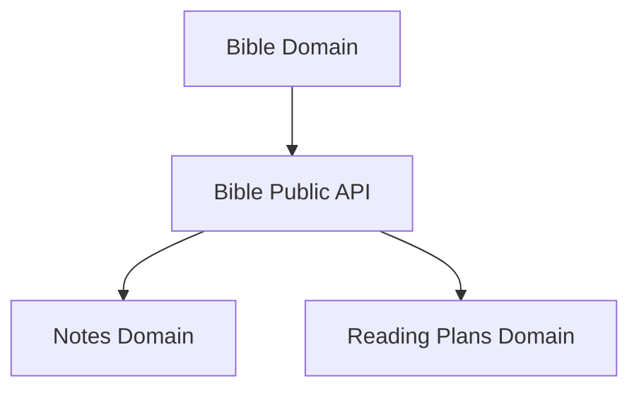

# Public APIs

## Status

Current

---

# Purpose

This document defines how independently owned parts of the application expose capabilities to one another.

Every architectural owner may provide a Public API through which other parts of the application interact with its behavior and concepts.

The purpose of a Public API is to preserve ownership boundaries while allowing collaboration throughout the application.

---

# Scope

This document defines:

* Public APIs,
* architectural boundaries,
* public and internal responsibilities,
* cross-Domain dependencies,
* cross-subsystem collaboration,
* and the relationship between ownership and exposed capabilities.

It does not define:

* JavaScript module syntax,
* TypeScript exports,
* dependency injection,
* file-system organization,
* or enforcement mechanisms.

Those responsibilities belong to the Implementation documentation and Developer Guide.

---

# Background

The application consists of independently owned architectural subsystems.

Examples include:

* the Workspace Runtime,
* the Bible Domain,
* the Notes Domain,
* the Reading Plans Domain,
* Resource Integration,
* Background Processing,
* and the User Interface.

These owners frequently need capabilities provided by one another.

Direct access to another owner's internal implementation would create unnecessary coupling.

Instead, each architectural owner may expose a deliberate Public API.

Conceptually:



The consumer depends upon the Public API.

The owning subsystem remains free to change its internal implementation without affecting consumers, provided the public contract remains stable.

---

# Public API Definition

A Public API is the set of capabilities, concepts, and operations that an architectural owner intentionally exposes to the rest of the application.

A Public API may expose:

* Domain Objects,
* identifiers,
* services,
* operations,
* events,
* queries,
* or other stable application concepts.

The implementation mechanism is secondary.

For example, the Bible Domain may expose:

```text
Bible Domain

    Public API
        BibleLocationReference
        BibleVerse
        BibleChapter
        Chapter Service

    Internal
        Store implementations
        parsers
        factories
        Module internals
        persistence details
```

The Public API describes what other parts of the application are allowed to depend upon.

Everything else remains an implementation detail of the owner.

---

# Ownership Before Exposure

A capability does not become application-owned simply because multiple parts of the application use it.

Ownership is determined by meaning.

For example, a Bible Location Reference remains owned by the Bible Domain even when it is used by:

* Notes,
* Reading Plans,
* Search,
* or other application capabilities.

Likewise, Pane behavior remains owned by the Workspace Runtime even when every Module may request Pane operations.

Conceptually:



Usage creates a dependency.

It does not transfer ownership.

The owning subsystem exposes the capability through its Public API while retaining responsibility for its meaning and behavior.
