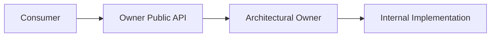
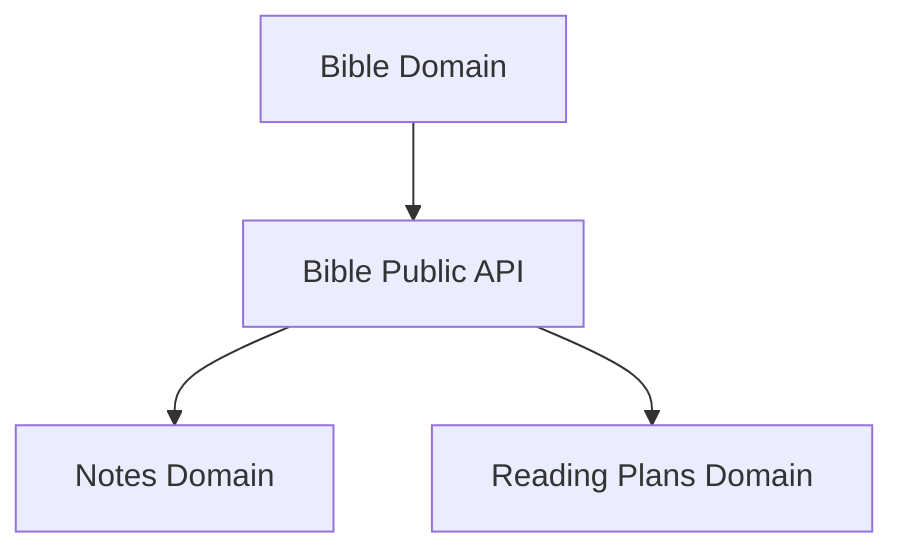
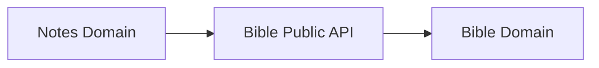
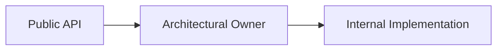
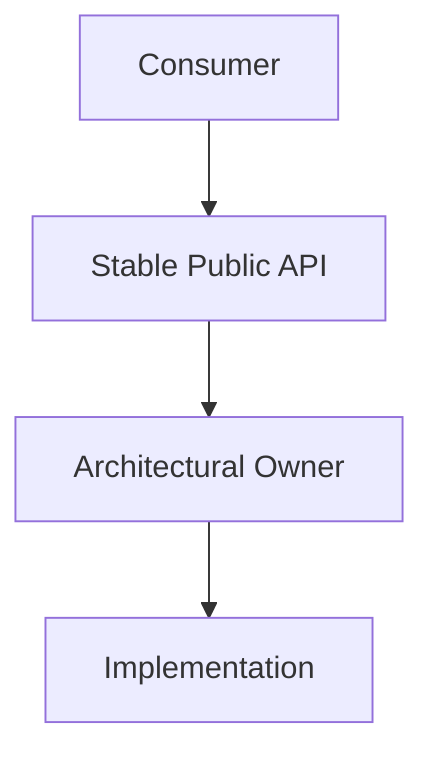

# Public APIs

## Status

Current

---

# Purpose

This document defines how independently owned parts of the application expose capabilities to one another.

Every architectural owner may provide a Public API through which other parts of the application interact with its behavior and concepts.

The purpose of a Public API is to preserve ownership boundaries while allowing collaboration throughout the application.

---

# Scope

This document defines:

* Public APIs,
* architectural boundaries,
* public and internal responsibilities,
* cross-Domain dependencies,
* cross-subsystem collaboration,
* and the relationship between ownership and exposed capabilities.

It does not define:

* JavaScript module syntax,
* TypeScript exports,
* dependency injection,
* file-system organization,
* or enforcement mechanisms.

Those responsibilities belong to the Implementation documentation and Developer Guide.

---

# Background

The application consists of independently owned architectural subsystems.

Examples include:

* the Workspace Runtime,
* the Bible Domain,
* the Notes Domain,
* the Reading Plans Domain,
* Resource Integration,
* Background Processing,
* and the User Interface.

These owners frequently need capabilities provided by one another.

Direct access to another owner's internal implementation would create unnecessary coupling.

Instead, each architectural owner may expose a deliberate Public API.

Conceptually:



The consumer depends upon the Public API.

The owning subsystem remains free to change its internal implementation without affecting consumers, provided the public contract remains stable.

---

# Public API Definition

A Public API is the set of capabilities, concepts, and operations that an architectural owner intentionally exposes to the rest of the application.

A Public API may expose:

* Domain Objects,
* identifiers,
* services,
* operations,
* events,
* queries,
* or other stable application concepts.

The implementation mechanism is secondary.

For example, the Bible Domain may expose:

```text
Bible Domain

    Public API
        BibleLocationReference
        BibleVerse
        BibleChapter
        Chapter Service

    Internal
        Store implementations
        parsers
        factories
        Module internals
        persistence details
```

The Public API describes what other parts of the application are allowed to depend upon.

Everything else remains an implementation detail of the owner.

---

# Ownership Before Exposure

A capability does not become application-owned simply because multiple parts of the application use it.

Ownership is determined by meaning.

For example, a Bible Location Reference remains owned by the Bible Domain even when it is used by:

* Notes,
* Reading Plans,
* Search,
* or other application capabilities.

Likewise, Pane behavior remains owned by the Workspace Runtime even when every Module may request Pane operations.

Conceptually:



Usage creates a dependency.

It does not transfer ownership.

The owning subsystem exposes the capability through its Public API while retaining responsibility for its meaning and behavior.

# Cross-Owner Collaboration

Architectural owners collaborate through their Public APIs.

An owner may depend upon another owner's Public API when that dependency reflects a genuine application concept.

Conceptually:



For example, the Notes Domain may request Bible chapter information when creating a new Note.

The Bible Domain remains responsible for Bible behavior.

The Notes Domain remains responsible for Note behavior.

The Public API provides the collaboration point while preserving ownership.

---

# Public and Internal Responsibilities

Every architectural owner consists of two conceptual areas:

* its Public API,
* and its internal implementation.

Conceptually:



The Public API represents the stable contract available to the rest of the application.

Internal implementation exists solely to fulfill the owner's responsibilities.

Internal implementation may change without affecting consumers provided the Public API remains compatible.

This separation allows architectural boundaries to remain stable while implementation continues to evolve.

---

# Public API Design

Public APIs should expose application concepts rather than implementation details.

Prefer exposing:

* Domain Objects,
* identifiers,
* queries,
* operations,
* events,
* and other meaningful concepts.

Avoid exposing:

* persistence implementations,
* serialization details,
* parsing logic,
* presentation components,
* networking mechanisms,
* or other implementation-specific structures.

Consumers should understand what an owner provides without needing to understand how that capability is implemented.

---

# Stable Boundaries

The purpose of a Public API is to create a stable architectural boundary.

Conceptually:



As implementation evolves, the Public API should remain stable whenever practical.

A stable Public API reduces unnecessary coupling between architectural owners and allows implementation to evolve independently.

Consumers depend upon the capability being provided rather than the mechanism used to provide it.

---

# Public APIs Are Not Ownership Transfer

Using another owner's Public API does not transfer ownership.

For example, the Reading Plans Domain may use Bible Location References.

The Notes Domain may request Bible verses.

Background Processing may invoke Resource Installation.

These usages create dependencies between architectural owners.

They do not redefine who owns the underlying concepts.

Ownership always remains with the subsystem responsible for the meaning of that concept.

Public APIs provide controlled collaboration while preserving that ownership.
