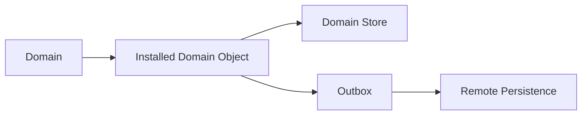
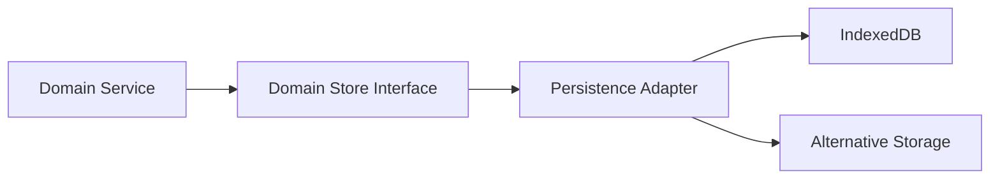
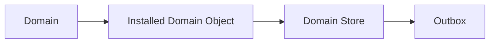
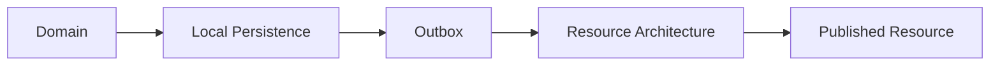
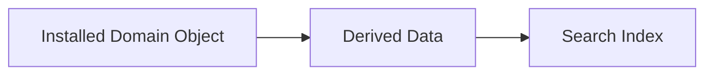
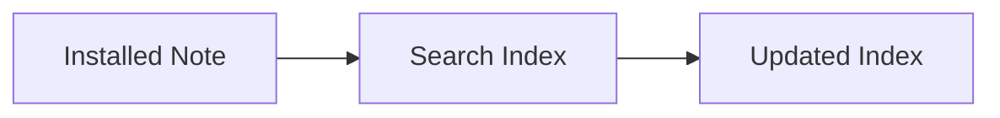
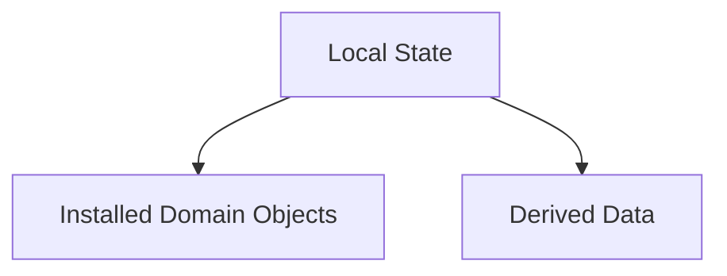
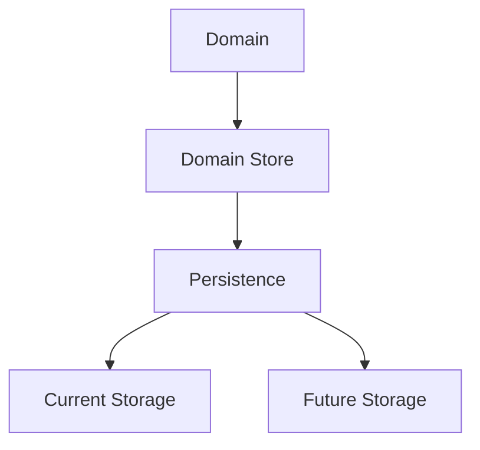
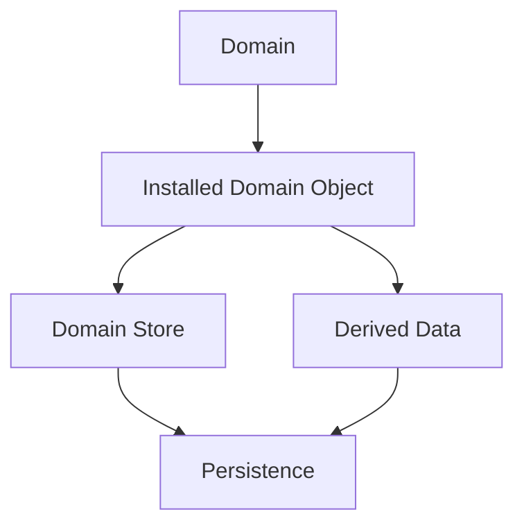

# Persistence

## Status

Current

---

# Purpose

This document defines how the KJVOnly application persists its local state.

Persistence ensures that installed Domain Objects, runtime state, settings, indexes, and application metadata survive application restarts and remain available while offline.

This document establishes the boundary between:

* Domain-owned Store interfaces,
* local persistence implementations,
* remote publication,
* and the application's authoritative local state.

---

# Scope

This document defines:

* local persistence,
* Domain Stores,
* Store ownership,
* immediate local writes,
* remote persistence through the outbox,
* deletion,
* persisted indexes,
* runtime persistence,
* settings and application metadata,
* and the relationship between persistence and Data Access.

It does not define:

* Data Access retrieval strategy,
* Resource Resolution,
* Resource publication,
* outbox processing,
* synchronization scheduling,
* background workers,
* or IndexedDB implementation details.

Those responsibilities are described by separate implementation documents and Architecture Decision Records.

---

# Background

The KJVOnly application is offline-first.

Application behavior should not depend upon immediate access to a relay, server, or other remote system.

When application state changes, the change is persisted locally first.

Remote publication occurs separately through the outbox and synchronization architecture.

Conceptually:



The local Store becomes authoritative immediately.

The outbox records the intent to publish the corresponding change remotely.

This separation allows application behavior to remain responsive and reliable even when remote systems are unavailable.

---

# Persistence Definition

Persistence is responsible for preserving application state across application lifecycles.

It ensures that locally installed data remains available after:

* a page refresh,
* the browser being closed,
* the application being suspended,
* a device restart,
* or a temporary loss of network access.

Persistence keeps data.

It does not determine how application data is requested or where remote representations are discovered.

Those responsibilities belong to Data Access and the Resource Architecture.

---

# Persisted State

The application persists several categories of state.

## Installed Domain Objects

Installed Domain Objects form the application's authoritative local domain model.

Examples include:

* Bible chapters,
* annotations,
* notes,
* reading plans,
* completed readings,
* Strong's data,
* and other Domain-owned objects.

Each installed Domain Object is persisted through the Store owned by its Domain.

## Runtime State

Runtime state may be persisted so the application can restore the user's working environment.

Examples include:

* Pane layout,
* Buffer state,
* active Module types,
* Module navigation context,
* and the last active Bible location.

## Application Settings

Application-wide preferences are persisted independently from Domain Objects.

Examples include:

* dark mode,
* color theme,
* selected Bible version,
* and other user preferences.

## Derived Indexes

Search and lookup indexes may also be persisted.

Indexes are derived data, but persisting them can substantially reduce startup and indexing work.

For example, a Notes index may be stored and incrementally updated so only newly created Notes require indexing.

## Application Metadata

The application may persist metadata required to coordinate local behavior.

Examples include:

* installed versions,
* index state,
* synchronization metadata,
* and other local bookkeeping information.

---

# Domain Store Ownership

Every Domain owns the Store interfaces required by its Domain Objects.

A Domain may own multiple Stores when its objects have different persistence requirements.

For example, the Bible Domain may maintain separate Stores for:

* Bible chapters,
* annotations,
* Bible versions,
* Strong's data,
* and other Bible-owned objects.

Multiple Bible versions may share the same chapter Store.

The persisted key includes the Bible version so that corresponding chapters remain independently addressable.

Conceptually:

```text
Bible Domain

    Chapter Store
        kjv/1_1
        kjvs/1_1

    Annotation Store

    Bible Version Store

    Strong's Store
```

Store organization follows Domain Object ownership rather than requiring every Domain to persist all of its objects within one physical collection.

The Domain owns:

* the Store interface,
* key semantics,
* object identity,
* persistence rules,
* and which objects belong in each Store.

Technical Infrastructure owns the implementation used to satisfy those Store interfaces.

---

# Store Implementation Boundary

Domain behavior should depend upon Domain Store interfaces rather than a particular database technology.

Conceptually:



The current browser implementation uses IndexedDB.

A different runtime could provide another implementation of the same Domain Store interface.

For example, a Node-based application could provide a filesystem, SQLite, or another persistence adapter without changing the Domain Service that requests the data.

This separation allows the Domain model and its services to be reused outside the browser.

---

# Persistence and Domain Services

Modules do not interact directly with persistence implementations.

They request Domain behavior through Domain Services.

The Domain Service then coordinates the appropriate Store.

For example:

```text
Bible Module

    requests Chapter

        ↓

Chapter Service

        ↓

Chapter Store

        ↓

Installed Chapter
```

The caller does not know whether the Store is implemented using IndexedDB or another persistence technology.

The Domain Service exposes Domain behavior.

The Domain Store exposes persistence behavior.

Technical Infrastructure implements the Store.

# Immediate Persistence

The application persists changes to installed Domain Objects immediately.

When application behavior modifies a Domain Object, the updated object is written to its owning Domain Store before any remote publication occurs.

Conceptually:



Local persistence is synchronous with application behavior.

Remote persistence is asynchronous.

This allows the application to immediately adopt the updated Domain Object as its authoritative local state while remote publication occurs independently.

---

# Local and Remote Persistence

Persistence within the application is divided into two complementary responsibilities.

## Local Persistence

Local persistence is responsible for:

* storing installed Domain Objects,
* preserving application state,
* maintaining offline capability,
* and providing durable local storage.

Once a change has been written to the Domain Store, the application immediately considers that change authoritative.

## Remote Persistence

Remote persistence is responsible for publishing those locally accepted changes through the Resource Architecture.

This responsibility is fulfilled through the outbox model.

Persistence itself does not communicate with relays or external systems.

Its responsibility ends when the updated Domain Object has been successfully stored locally.

Conceptually:



The application therefore separates accepting a change from publishing that change.

Local behavior never depends upon the success of remote persistence.

---

# Persistence Consistency

Persistence guarantees that every installed Domain Object represents the application's current local model.

When a Domain accepts a change, subsequent requests observe that updated object immediately.

No additional synchronization step is required before the application begins operating on the new state.

This behavior allows:

* immediate user feedback,
* reliable offline operation,
* consistent application behavior,
* and deterministic local state.

Remote publication becomes an implementation concern rather than part of the application's behavior.

---

# Deletion

Deletion follows the same persistence model as every other state change.

When a Domain deletes an installed Domain Object, the deletion is immediately persisted to the local Store.

The corresponding publication is then handled through the outbox and Resource Architecture.

The application intentionally favors simple persistence semantics.

Deleted Domain Objects are removed from the local Store rather than retained through application-level soft deletion.

User-facing confirmation is handled by the presentation layer before the deletion occurs.

Persistence simply records the resulting state.

# Derived Data

Not every persisted object represents authoritative application state.

Some persisted data exists solely to improve application performance.

This data is referred to as **derived data**.

Derived data is produced from installed Domain Objects rather than representing application behavior itself.

Examples include:

* search indexes,
* lookup tables,
* cached projections,
* and other generated structures.

Conceptually:



Derived data may be persisted because rebuilding it can be expensive.

Persisting derived data improves startup time, reduces unnecessary computation, and allows the application to resume work quickly after restarting.

Unlike installed Domain Objects, derived data can always be regenerated from the application's authoritative local state.

---

# Incremental Updates

Derived data does not always need to be rebuilt from scratch.

Whenever possible, the application updates derived data incrementally as installed Domain Objects change.

For example, when a new Note is created:

* the Note is immediately persisted,
* the Notes Domain becomes authoritative,
* and the search index incorporates only the newly added Note.

Conceptually:



This approach minimizes indexing work while keeping derived data synchronized with the application's authoritative local state.

---

# Authoritative and Derived State

Persistence intentionally distinguishes between authoritative state and derived state.

Conceptually:



Installed Domain Objects represent the application's authoritative local model.

Derived data exists only to support efficient application behavior.

If derived data is lost or becomes invalid, it may be regenerated from the installed Domain Objects.

If an installed Domain Object is lost, the application's local state has changed.

This distinction allows the application to optimize performance without confusing optimization data with application state.

---

# Persistence Philosophy

Persistence exists to preserve application state.

Not every persisted object carries the same architectural significance.

Installed Domain Objects preserve the application's behavior.

Derived data preserves the application's performance.

Understanding this distinction helps ensure that optimization strategies remain independent from the application's conceptual model.

The application should always be capable of rebuilding derived data from its installed Domain Objects.

# Future Evolution

Persistence has been intentionally designed around Domain ownership rather than persistence technologies.

As the application evolves, new storage engines, persistence strategies, and optimization techniques should continue to support the existing Domain Store interfaces without changing the application's conceptual architecture.

Conceptually:



Future improvements may introduce:

* alternative persistence implementations,
* improved indexing strategies,
* more efficient storage layouts,
* additional optimization techniques,
* or new platform-specific persistence technologies.

These improvements should strengthen the persistence abstraction rather than expose implementation details to the application.

As long as installed Domain Objects remain the application's authoritative local model, persistence technologies may evolve independently of application behavior.

---

# Big Takeaway

Persistence ensures that the application's authoritative local model survives beyond the current execution of the application.

Installed Domain Objects represent application behavior.

Derived data improves application performance.

Conceptually:



The application immediately persists accepted changes to its local Stores.

Remote publication occurs independently through the outbox and the Resource Architecture.

This separation allows the application to remain responsive, offline-first, and resilient while maintaining one consistent and authoritative local model.

Persistence therefore preserves more than data.

It preserves the continuity of the application's behavior across application restarts, offline operation, and evolving implementation technologies.
