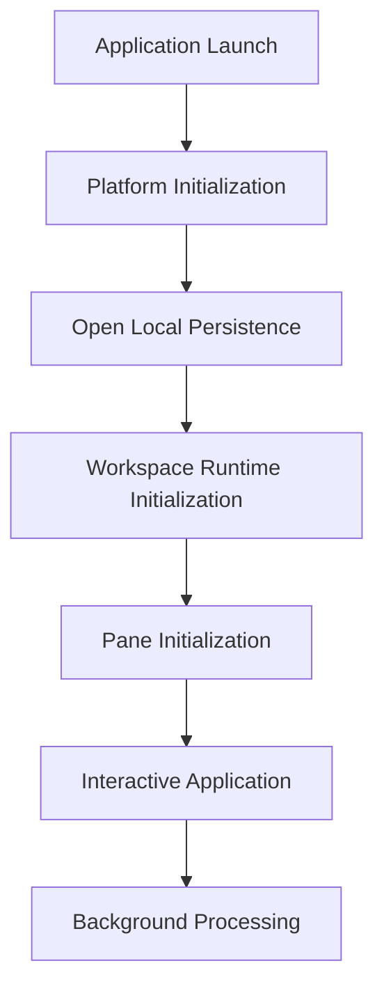
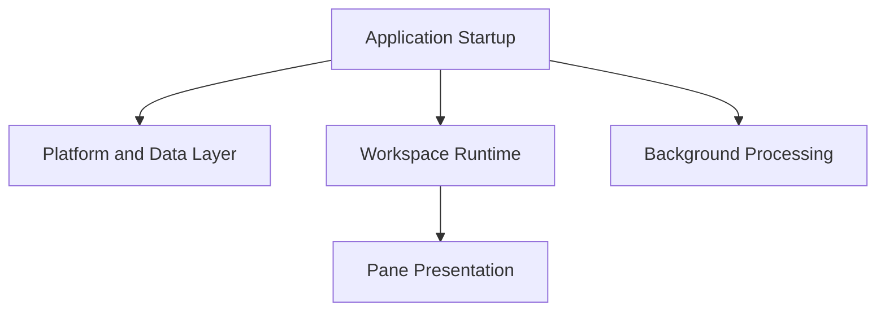
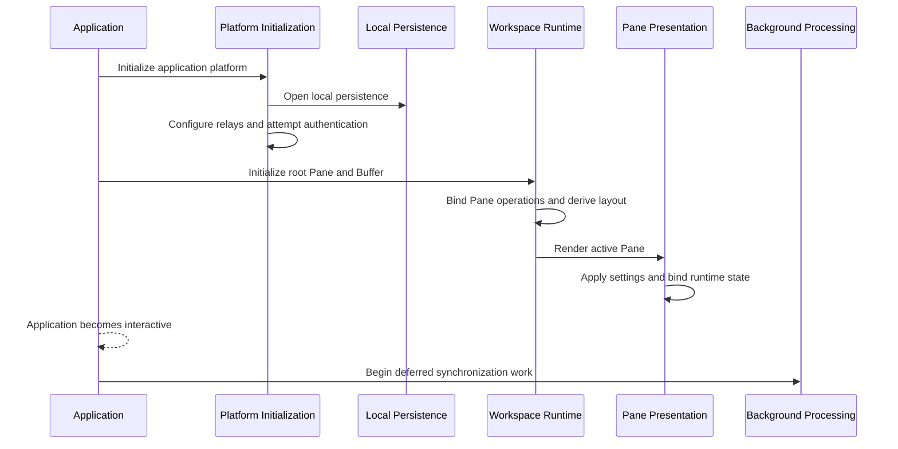
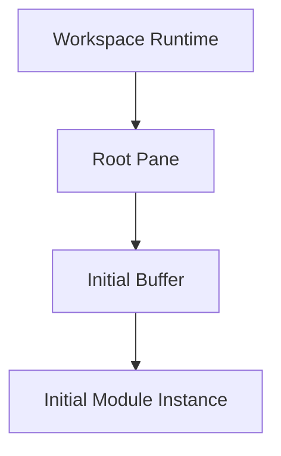

# Startup

## Status

Current

---

# Purpose

This document defines how the KJVOnly application becomes operational after launch.

Startup initializes the minimum application state required to present an interactive Workspace, restore local behavior, and begin background processing.

This document describes the startup lifecycle at the application architecture level.

It does not prescribe the current source-file organization or require the existing initialization logic to remain within Svelte lifecycle functions.

---

# Scope

This document defines:

* application initialization,
* platform initialization,
* Workspace Runtime initialization,
* Pane initialization,
* local data availability,
* authentication attempts,
* relay configuration,
* startup readiness,
* and the transition into Background Processing.

It does not define:

* detailed Svelte lifecycle behavior,
* relay implementation,
* authentication protocols,
* synchronization algorithms,
* worker implementation,
* resource installation,
* or background task execution.

Those responsibilities are described by implementation documents, the Resource Architecture, and the Background Processing document.

---

# Background

The application is designed to become interactive without waiting for all remote data, synchronization work, or background processing to complete.

Startup establishes the application environment and initializes the Workspace Runtime.

Once the application is usable, additional work continues independently in the background.

Conceptually:



Startup is responsible for making the application usable.

It is not responsible for completing every synchronization, download, indexing, or resource-refresh operation before the user can interact with the application.

---

# Startup Definition

Startup is the application lifecycle that transforms an unloaded application into an interactive Workspace.

It initializes the capabilities required by the active application session.

These include:

* browser and platform integration,
* local persistence,
* relay configuration,
* authentication state,
* Workspace Runtime state,
* the root Pane and Buffer,
* Pane runtime bindings,
* application settings,
* toast presentation,
* and background-processing entry points.

Startup coordinates these responsibilities without taking ownership of their internal behavior.

Each subsystem remains responsible for its own initialization and ongoing lifecycle.

---

# Startup Layers

Startup currently occurs across several application layers.

Conceptually:



## Platform and Data Layer

The platform and data layer prepares capabilities required by the rest of the application.

Current responsibilities include:

* opening the local Bible database,
* configuring default relays,
* attempting authentication,
* and preparing Nostr connectivity.

These operations establish technical capabilities.

They do not define Workspace or Domain behavior.

## Workspace Runtime

The Workspace Runtime initializes the root runtime composition.

Current responsibilities include:

* creating the root Buffer,
* selecting the initial Module,
* binding Pane operations,
* generating the initial layout,
* enabling runtime persistence,
* and connecting shared presentation services such as toast handling.

The current implementation performs this work primarily from the application root page.

The architectural responsibility belongs to the Workspace Runtime rather than to that source file.

## Pane Presentation

Each rendered Pane initializes the presentation behavior required for its Runtime Objects.

Current responsibilities include:

* applying application settings,
* locating the corresponding Pane runtime object,
* binding Buffer replacement behavior,
* subscribing to Pane dimensions,
* and applying the current container size.

Pane initialization does not construct the Workspace.

It connects one rendered Pane to the Runtime Object already owned by the Workspace Runtime.

---

# Startup Lifecycle

The current startup lifecycle can be summarized as:



The exact ordering may evolve as initialization responsibilities are moved into dedicated services.

The architectural lifecycle remains:

```text
Initialize platform

↓

Open local state

↓

Initialize Workspace Runtime

↓

Bind Pane presentation

↓

Become interactive

↓

Begin background work
```

---

# Application Readiness

The application is considered ready when the user can interact with the restored or initial Workspace.

Readiness does not require:

* every Resource to be downloaded,
* every Domain Object to be refreshed,
* every search index to be rebuilt,
* authentication to succeed,
* or every relay to be available.

Locally available state should be sufficient to present the application whenever possible.

Missing data may be requested through Data Access.

Synchronization and refresh work continue through Background Processing.

This keeps startup focused on usability rather than completeness.

---

# Initial Workspace

The current implementation creates a Buffer for the root Pane and assigns an initial Module.

The specific initial Module may vary during development or according to application state.

Conceptually:



The startup architecture should not depend on a permanently hard-coded Module.

Future implementations may select the initial Module using:

* restored Workspace state,
* the last active session,
* a configured default,
* or another application startup policy.

---

# Settings Initialization

Application settings must be applied early enough that the initial interface reflects the user's persisted preferences.

Current Pane initialization applies settings as Panes become active.

This ensures rendered Modules receive the current theme and display behavior.

As the startup implementation evolves, settings may be initialized at a higher application layer before the Workspace is presented.

The architectural requirement is:

> Persisted application settings should be available before or during the initial presentation without delaying unrelated background work.

The exact lifecycle hook or source file used to satisfy this requirement is an implementation detail.

---

# Nostr Initialization

The current startup implementation includes early Nostr integration used to validate relay connectivity, authentication, Resource discovery, and event delivery.

Current behavior includes:

* setting default relays,
* attempting login,
* establishing relay connectivity,
* and initializing event flows used by synchronization services.

This implementation is expected to evolve as the Resource Architecture is integrated more completely into the application.

Startup should therefore depend upon Resource and networking capabilities rather than upon the current Nostr-specific classes or timeline implementation.

The architectural requirement is that remote Resource capabilities may be initialized without preventing the locally available application from becoming interactive.
