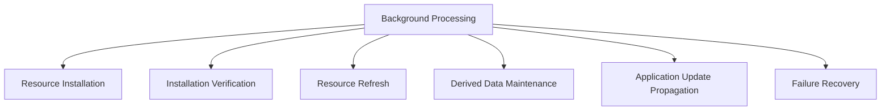

# Background Processing

## Status

Current

---

# Purpose

This document defines how the application performs work after becoming interactive.

Background Processing maintains the application's local state, installed Resources, derived data, and application consistency without interrupting the user's current activity.

The purpose of Background Processing is to continuously improve and maintain the application while preserving a responsive, offline-first user experience.

---

# Scope

This document defines:

* background maintenance responsibilities,
* Resource installation,
* installation verification,
* Resource refresh,
* derived data maintenance,
* application update propagation,
* and failure recovery.

It does not define:

* foreground Data Access,
* Workspace Runtime behavior,
* Domain behavior,
* Resource installation algorithms,
* synchronization protocols,
* or implementation-specific worker technologies.

These responsibilities are described elsewhere within the Application Architecture and Resource Architecture.

---

# Background

Once Startup has restored the application to an interactive state, responsibility shifts to Background Processing.

Background Processing performs work that is not required to satisfy the user's current interaction.

Instead, it continuously maintains the application's local state and improves the application's consistency over time.

Conceptually:

Background Processing should not delay startup.

It should not interrupt user interaction.

It should not require the application to become temporarily unavailable.

Instead, background responsibilities execute independently while the user continues working.

---

# Background Processing Definition

Background Processing is the collection of long-running application responsibilities that maintain the application's authoritative local state after startup has completed.

These responsibilities include:

* installing newly discovered Resources,
* verifying installed Resources,
* refreshing installed Resources,
* maintaining derived data,
* propagating application updates,
* retrying failed operations,
* and performing other deferred maintenance tasks.

Background Processing is responsible for maintaining the application.

It is not responsible for satisfying the user's current request.

Foreground requests are handled through Data Access.

Background Processing ensures the application continues improving independently of those requests.

---

# Background Work Categories

Background Processing consists of several independent maintenance responsibilities.

Conceptually:

Each category owns one aspect of maintaining the application's local state.

Together they allow the application to remain responsive while continuously improving the quality and completeness of its installed data.
