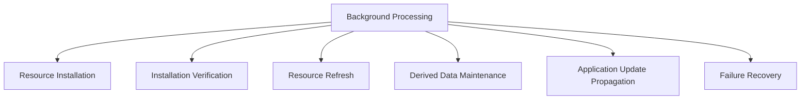
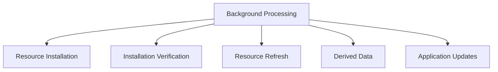
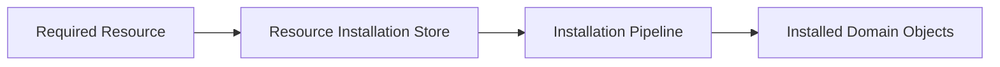
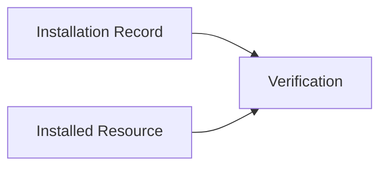
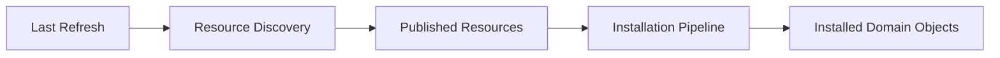

# Background Processing

## Status

Current

---

# Purpose

This document defines how the application performs work after becoming interactive.

Background Processing maintains the application's local state, installed Resources, derived data, and application consistency without interrupting the user's current activity.

The purpose of Background Processing is to continuously improve and maintain the application while preserving a responsive, offline-first user experience.

---

# Scope

This document defines:

* background maintenance responsibilities,
* Resource installation,
* installation verification,
* Resource refresh,
* derived data maintenance,
* application update propagation,
* and failure recovery.

It does not define:

* foreground Data Access,
* Workspace Runtime behavior,
* Domain behavior,
* Resource installation algorithms,
* synchronization protocols,
* or implementation-specific worker technologies.

These responsibilities are described elsewhere within the Application Architecture and Resource Architecture.

---

# Background

Once Startup has restored the application to an interactive state, responsibility shifts to Background Processing.

Background Processing performs work that is not required to satisfy the user's current interaction.

Instead, it continuously maintains the application's local state and improves the application's consistency over time.

Conceptually:

Background Processing should not delay startup.

Background Processing should minimize disruption to the current user interaction.
---

# Background Processing Definition

Background Processing is the collection of long-running application responsibilities that maintain the application's authoritative local state after startup has completed.

These responsibilities include:

* installing newly discovered Resources,
* verifying installed Resources,
* refreshing installed Resources,
* maintaining derived data,
* propagating application updates,
* retrying failed operations,
* and performing other deferred maintenance tasks.

Background Processing is responsible for maintaining the application.

It is not responsible for satisfying the user's current request.

Foreground requests are handled through Data Access.

Background Processing ensures the application continues improving independently of those requests.

---

# Background Work Categories

Background Processing consists of several independent maintenance responsibilities.

Conceptually:

Each category owns one aspect of maintaining the application's local state.

Together they allow the application to remain responsive while continuously improving the quality and completeness of its installed data.

# Background Maintenance Responsibilities

Background Processing maintains the application's long-term health by performing work that is not tied to a single user interaction.

Each maintenance responsibility owns one aspect of preserving or improving the application's local state.

Conceptually:

These responsibilities operate independently while sharing the common goal of maintaining a complete, current, and consistent application.

Each responsibility is described in the following sections.

---

# Resource Installation

Background Processing is responsible for installing Resources that have been accepted for installation but have not yet been fully installed.

Rather than immediately installing every discovered Resource, the application records installation state within a persistent Resource Installation Store.

Conceptually:

Each installation record represents the application's intention to install a Resource.

Background Processing continuously evaluates these records and invokes the installation pipeline for Resources requiring installation.

This allows installation to continue independently of the user while providing durable tracking of installation progress.

Installation records may represent:

* pending installation,
* installation in progress,
* successful installation,
* failed installation,
* or other implementation-specific installation states.

The installation pipeline determines how each Resource representation is resolved and installed.

Background Processing is responsible only for ensuring that required Resources eventually reach their intended installed state.

---

# Installation Verification

Installing a Resource does not permanently guarantee that the expected local state still exists.

Background Processing periodically verifies that installed Resources continue to satisfy the application's installation expectations.

Conceptually:

Verification may compare installed state against metadata recorded during installation.

Examples include:

* installation status,
* expected Resource identity,
* installed version,
* integrity information,
* expected record counts,
* or other implementation-defined expectations.

If verification determines that installed state is incomplete or invalid, Background Processing may return the Resource to an installation-required state.

This allows the application to recover from partial installations, interrupted operations, or future platform-specific storage behavior without requiring user intervention.
# Resource Refresh

Background Processing periodically discovers Published Resources that have become available since the previous refresh.

Conceptually:

Rather than evaluating every installed Resource individually, Background Processing performs incremental discovery using the Resource Architecture.

Only newly discovered Published Resources are evaluated.

When a Published Resource is accepted, it enters the normal installation pipeline.

The installation pipeline determines whether the newly discovered Resource represents:

* a new installation,
* an update to an existing installed Resource,
* or a Resource that should not replace the current local state.

This allows Resource refresh and Resource installation to share the same installation process while avoiding unnecessary evaluation of every installed Resource.

Background Processing therefore maintains installed Resources by discovering newly available Published Resources rather than periodically rechecking every installed Resource.

---

# Application Update Propagation

Background Processing also maintains consistency between installed Domain Objects and active Module instances.

When installed application state changes, active Modules may need to present updated information.

Conceptually:

Background Processing propagates application updates after meaningful Domain changes.

Examples include:

* newly created Notes,
* Reading Plan progress,
* refreshed installed Resources,
* or other changes that affect currently visible application state.

Modules do not communicate directly with one another.

Instead, they observe changes relevant to the Domains they present and request updated data through their Domain Services.

This preserves the ownership boundaries established throughout the application architecture.

Modules remain responsible for presentation.

Domains remain responsible for application behavior.

Background Processing coordinates the propagation of application updates between them.
