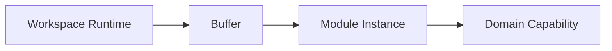
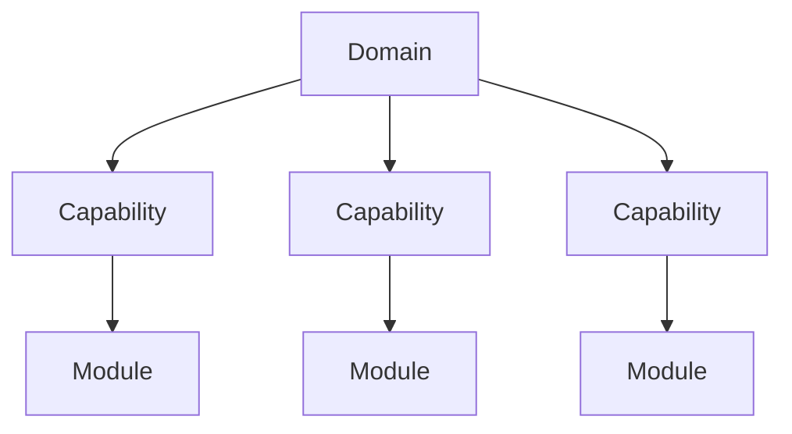
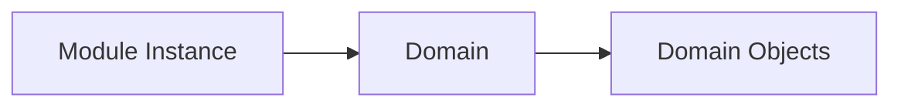
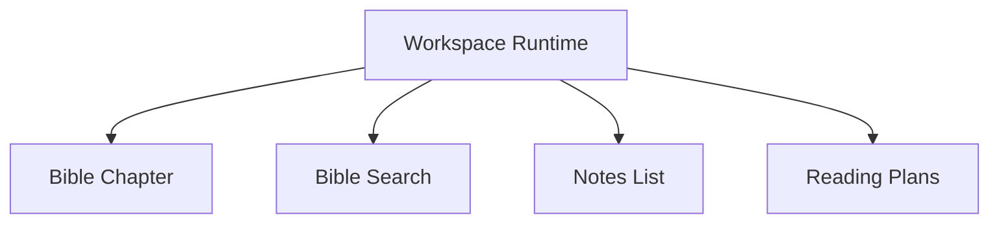
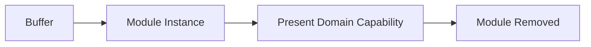

# Module Presentation

## Status

Current

---

# Purpose

This document defines how application behavior is presented to the user.

Module Presentation provides the architectural boundary between the Workspace Runtime and the application's Domains.

Its purpose is to allow new application capabilities to be introduced without requiring changes to the Workspace Runtime.

---

# Scope

This document defines:

* Module Presentation,
* Module Instances,
* presentation responsibilities,
* Domain capability presentation,
* Module collaboration,
* and the relationship between Modules and Domains.

It does not define:

* Workspace layout,
* Pane management,
* rendering implementation,
* Svelte components,
* presentation technologies,
* or user interface design.

Those responsibilities are described elsewhere within the Application Architecture and Implementation documentation.

---

# Background

The Workspace Runtime is intentionally independent from the application's Domains.

Rather than understanding Bible, Notes, Reading Plans, or future application capabilities, the Runtime presents Module Instances through a common presentation model.

Conceptually:

This abstraction allows new application capabilities to be introduced without modifying the Runtime itself.

The Runtime presents Modules.

Modules present Domain capabilities.

The Domains own the application's behavior.

This separation keeps presentation infrastructure independent from application functionality.

---

# Module Presentation Definition

A Module Instance presents one Domain capability within a Buffer.

A Module represents one focused area of application behavior rather than an entire Domain.

For example, the Bible Domain may expose multiple capabilities, each presented through its own Module Instance.

Examples include:

* Bible Chapter,
* Bible Search,
* Reading Plans,
* Notes List,
* Notes Search,
* Settings,
* and future Domain capabilities.

Each Module focuses on presenting one capability while delegating application behavior to its owning Domain.

Conceptually:

This separation allows Domains to evolve by introducing new capabilities without affecting the Workspace Runtime.

The Runtime remains responsible only for presenting Module Instances.

The Modules determine how individual Domain capabilities are presented.

# Module Responsibility

A Module Instance owns the presentation of one Domain capability.

Its responsibility is to present application behavior to the user rather than implement that behavior.

Conceptually:

Modules present Domain capabilities by requesting behavior from their owning Domain.

They do not own:

* application state,
* business rules,
* persistence,
* Resource management,
* or cross-Domain coordination.

Those responsibilities remain within the Domain and the shared application services.

This separation allows presentation to evolve independently from application behavior.

---

# Module Independence

The Workspace Runtime treats every Module Instance identically.

The Runtime does not understand the capability being presented.

Conceptually:

Each Module conforms to the same presentation model regardless of the Domain capability it presents.

This allows new Modules to be introduced without modifying the Runtime.

The Runtime presents Modules.

The Modules determine what is presented.

---

# Module Lifecycle

Module Instances are transient presentation objects.

They exist only while their Buffer is active within the Workspace.

Conceptually:

A Module may be created, replaced, or removed without affecting its owning Domain.

The Domain continues to own application behavior independently of any active presentation.

This allows multiple Module Instances to simultaneously present the same Domain capability while sharing the same underlying application behavior.

Presentation is temporary.

Domain behavior is persistent.
