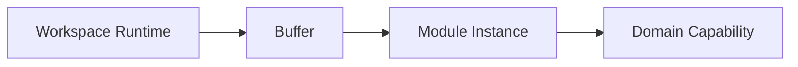
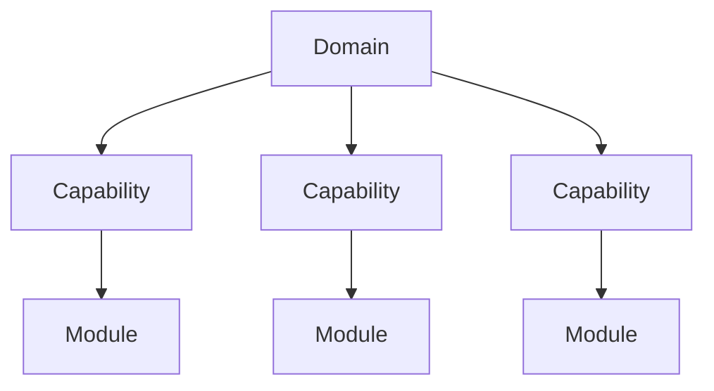

# Module Presentation

## Status

Current

---

# Purpose

This document defines how application behavior is presented to the user.

Module Presentation provides the architectural boundary between the Workspace Runtime and the application's Domains.

Its purpose is to allow new application capabilities to be introduced without requiring changes to the Workspace Runtime.

---

# Scope

This document defines:

* Module Presentation,
* Module Instances,
* presentation responsibilities,
* Domain capability presentation,
* Module collaboration,
* and the relationship between Modules and Domains.

It does not define:

* Workspace layout,
* Pane management,
* rendering implementation,
* Svelte components,
* presentation technologies,
* or user interface design.

Those responsibilities are described elsewhere within the Application Architecture and Implementation documentation.

---

# Background

The Workspace Runtime is intentionally independent from the application's Domains.

Rather than understanding Bible, Notes, Reading Plans, or future application capabilities, the Runtime presents Module Instances through a common presentation model.

Conceptually:

This abstraction allows new application capabilities to be introduced without modifying the Runtime itself.

The Runtime presents Modules.

Modules present Domain capabilities.

The Domains own the application's behavior.

This separation keeps presentation infrastructure independent from application functionality.

---

# Module Presentation Definition

A Module Instance presents one Domain capability within a Buffer.

A Module represents one focused area of application behavior rather than an entire Domain.

For example, the Bible Domain may expose multiple capabilities, each presented through its own Module Instance.

Examples include:

* Bible Chapter,
* Bible Search,
* Reading Plans,
* Notes List,
* Notes Search,
* Settings,
* and future Domain capabilities.

Each Module focuses on presenting one capability while delegating application behavior to its owning Domain.

Conceptually:

This separation allows Domains to evolve by introducing new capabilities without affecting the Workspace Runtime.

The Runtime remains responsible only for presenting Module Instances.

The Modules determine how individual Domain capabilities are presented.
