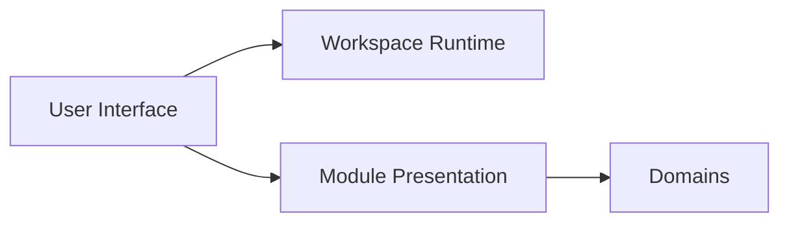
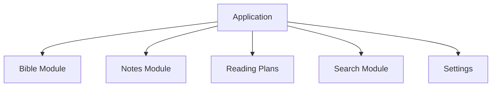
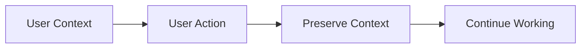
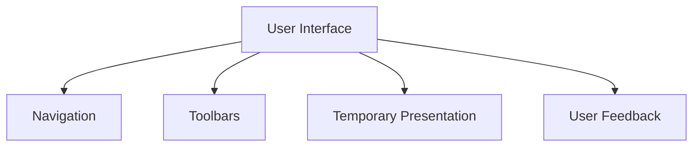
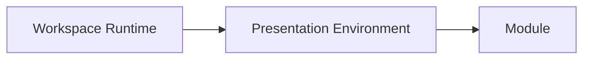

# User Interface

## Status

Current

---

# Purpose

This document defines the architectural principles that govern the application's user interface.

The User Interface provides a consistent presentation model that allows independently developed Modules to appear and behave as one cohesive application.

Its purpose is to establish a shared user experience while allowing Domains and Module Presentation to evolve independently.

---

# Scope

This document defines:

* user interface consistency,
* shared interaction patterns,
* responsive presentation,
* visual continuity,
* user context preservation,
* and the relationship between the User Interface and Module Presentation.

It does not define:

* visual styling,
* themes,
* CSS frameworks,
* rendering technologies,
* component implementations,
* or application behavior.

These responsibilities are described by the Implementation documentation, Module Presentation, and the Domains.

---

# Background

The application is composed of many independently developed Module Instances.

Although each Module presents a different Domain capability, the application should behave as a single, coherent user experience.

Conceptually:

The User Interface establishes presentation principles shared across the entire application.

The Workspace Runtime provides a consistent presentation environment.

Module Presentation introduces Domain capabilities into that environment.

The User Interface ensures those capabilities feel like parts of one application rather than isolated features.

---

# User Interface Definition

The User Interface is the architectural layer responsible for providing a consistent user experience across every Module.

It defines how application capabilities are presented rather than how individual capabilities behave.

The User Interface establishes common presentation principles including:

* consistent interaction patterns,
* predictable navigation,
* responsive layouts,
* preservation of user context,
* and shared presentation conventions.

Application behavior remains owned by the Domains.

Presentation remains owned by Module Instances.

The User Interface provides the shared presentation language that allows every Module to participate in a unified application experience.

---

# Consistent User Experience

Every Module should feel like a natural extension of the application.

Conceptually:

Although Modules present different Domain capabilities, users should not need to learn a new interaction model for each capability.

Shared presentation patterns allow users to transfer knowledge naturally between Modules.

Consistency improves discoverability, reduces cognitive load, and allows new capabilities to integrate naturally into the existing application without requiring users to learn an entirely new interface.

# User Context Preservation

The User Interface should preserve user context whenever practical.

Changing application capabilities should not unnecessarily discard the user's current work or require the user to reconstruct their working environment.

Conceptually:

Examples of user context include:

* the active Workspace,
* open Modules,
* navigation state,
* reading position,
* selections,
* filters,
* and other presentation state associated with the current task.

Preserving context reduces unnecessary interruption and allows users to remain focused on their current work.

Whenever practical, presentation changes should extend the existing context rather than replacing it.

---

# Shared Interaction Patterns

The User Interface establishes common interaction patterns that are shared across every Module.

Conceptually:

Shared interaction patterns create a predictable user experience regardless of the Domain capability currently being presented.

Users should not need to learn a different interaction model for each Module.

Individual Modules may present different capabilities while participating in the same interaction language.

This consistency allows independently developed Modules to integrate naturally into the application.

---

# Responsive Presentation

The User Interface should adapt to changes in the presentation environment without requiring individual Modules to manage application layout.

Conceptually:

The Workspace Runtime establishes the presentation environment.

Modules present their capabilities within that environment.

Changes to available presentation space should be handled by the shared presentation model rather than by introducing independent layout behavior within individual Modules.

This allows Modules to focus on presenting Domain capabilities while the surrounding presentation environment remains consistent throughout the application.
