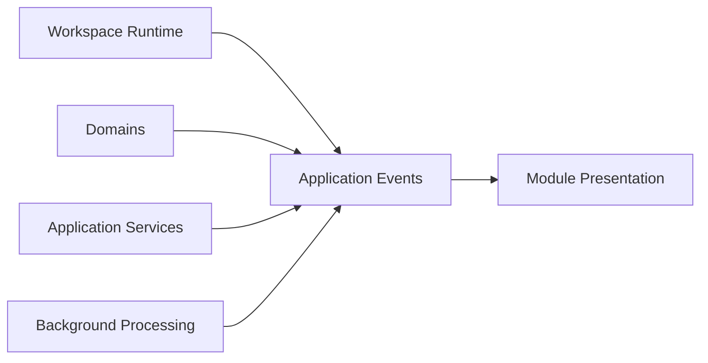
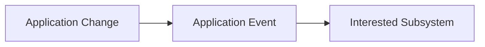

# Application Events

## Status

Current

---

# Purpose

This document defines how independently owned application subsystems communicate while preserving architectural ownership boundaries.

Application Events allow changes occurring within one part of the application to be observed by other interested subsystems without introducing direct dependencies between them.

Their purpose is to coordinate application behavior while maintaining loose coupling throughout the application architecture.

---

# Scope

This document defines:

* Application Events,
* event ownership,
* event publication,
* event observation,
* cross-Domain communication,
* and event-driven application coordination.

It does not define:

* Resource events,
* Nostr events,
* browser events,
* transport protocols,
* messaging technologies,
* or event implementation.

Those responsibilities belong to the Resource Architecture and the Implementation documentation.

---

# Background

The application consists of independently owned architectural subsystems.

These include:

* the Workspace Runtime,
* Domains,
* Application Services,
* Background Processing,
* Module Presentation,
* and Persistence.

These subsystems frequently need to react to changes occurring elsewhere within the application.

Direct communication between every subsystem would create unnecessary coupling.

Instead, meaningful application changes are communicated through Application Events.

Conceptually:

Application Events allow independently owned subsystems to coordinate behavior while remaining unaware of each other's internal implementation.

---

# Application Event Definition

An Application Event represents the occurrence of a meaningful application change.

Events communicate that something has happened.

They do not own application behavior.

They do not replace application services.

They do not contain application logic.

Instead, they provide a coordination mechanism that allows interested subsystems to react appropriately.

Conceptually:

Application behavior remains owned by the subsystem responsible for that behavior.

Application Events simply communicate that the behavior has already occurred.

This preserves ownership while allowing independent parts of the application to remain synchronized.
