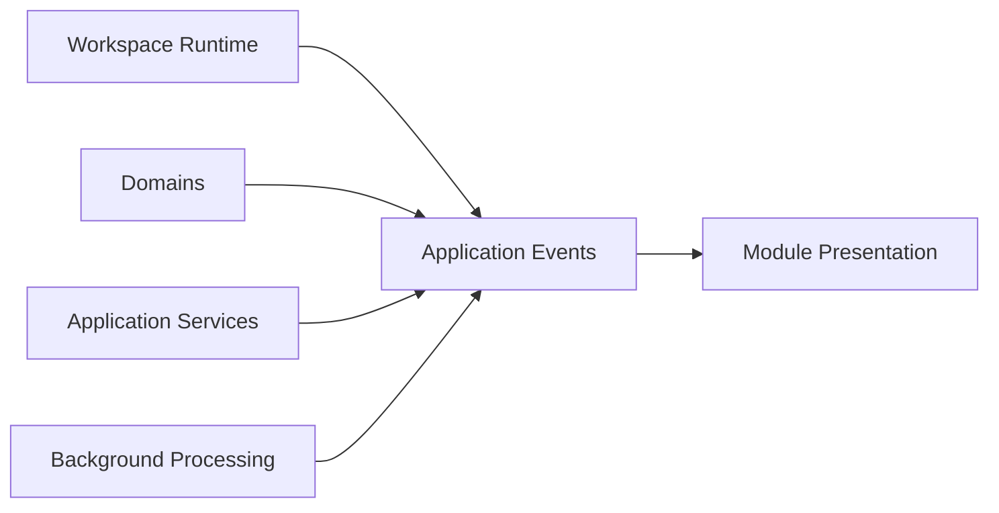
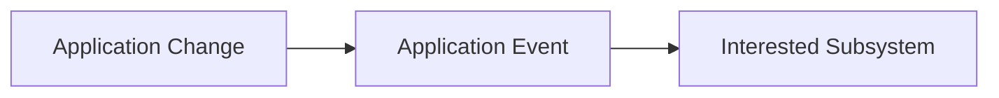
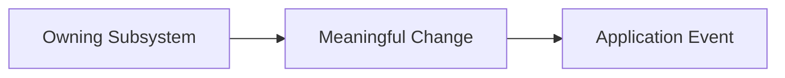
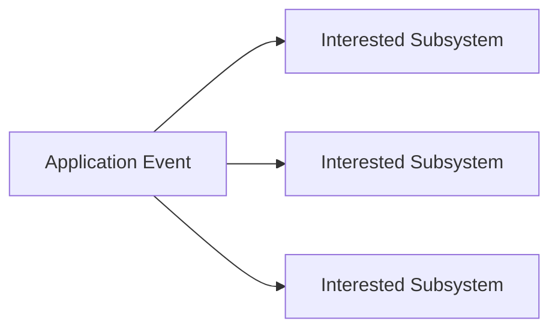
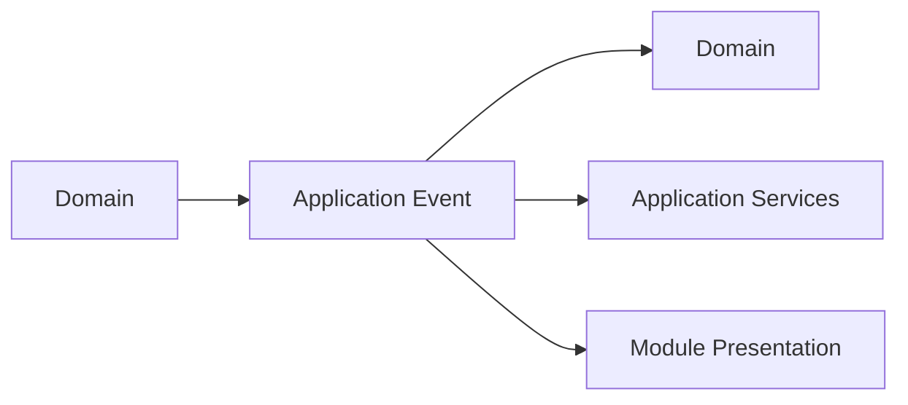
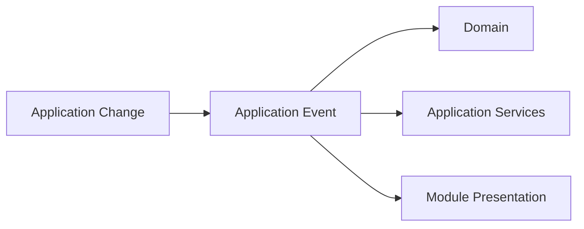
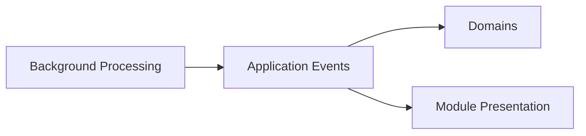
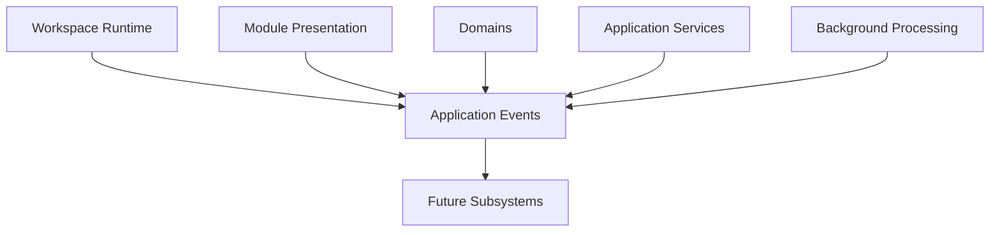

# Application Events

## Status

Current

---

# Purpose

This document defines how independently owned application subsystems communicate while preserving architectural ownership boundaries.

Application Events allow changes occurring within one part of the application to be observed by other interested subsystems without introducing direct dependencies between them.

Their purpose is to coordinate application behavior while maintaining loose coupling throughout the application architecture.

---

# Scope

This document defines:

* Application Events,
* event ownership,
* event publication,
* event observation,
* cross-Domain communication,
* and event-driven application coordination.

It does not define:

* Resource events,
* Nostr events,
* browser events,
* transport protocols,
* messaging technologies,
* or event implementation.

Those responsibilities belong to the Resource Architecture and the Implementation documentation.

---

# Background

The application consists of independently owned architectural subsystems.

These include:

* the Workspace Runtime,
* Domains,
* Application Services,
* Background Processing,
* Module Presentation,
* and Persistence.

These subsystems frequently need to react to changes occurring elsewhere within the application.

Direct communication between every subsystem would create unnecessary coupling.

Instead, meaningful application changes are communicated through Application Events.

Conceptually:

Application Events allow independently owned subsystems to coordinate behavior while remaining unaware of each other's internal implementation.

---

# Application Event Definition

An Application Event represents the occurrence of a meaningful application change.

Events communicate that something has happened.

They do not own application behavior.

They do not replace application services.

They do not contain application logic.

Instead, they provide a coordination mechanism that allows interested subsystems to react appropriately.

Conceptually:

Application behavior remains owned by the subsystem responsible for that behavior.

Application Events simply communicate that the behavior has already occurred.

This preserves ownership while allowing independent parts of the application to remain synchronized.

# Event Ownership

Application Events do not own application behavior.

Every Application Event originates from a meaningful change that has already occurred within an owning subsystem.

Conceptually:

The subsystem that owns the behavior remains responsible for performing that behavior.

The Application Event simply communicates that the change has occurred.

This separation allows communication to remain independent from ownership.

Application Events never become the owner of application behavior.

---

# Event Observation

Application Events allow other parts of the application to become aware of meaningful changes without requiring direct knowledge of the subsystem that produced them.

Conceptually:

Each subsystem independently determines whether an Application Event is relevant to its own responsibilities.

Observing an event does not imply ownership of the originating behavior.

Likewise, the subsystem that produced the event does not know which other parts of the application may respond.

This independence allows application capabilities to evolve without introducing unnecessary dependencies between subsystems.

---

# Cross-Domain Coordination

Application Events provide a coordination mechanism between independently owned Domains and application subsystems.

Conceptually:

Application Events communicate that application state has changed.

The receiving subsystem determines whether that change is relevant to its own responsibilities.

If additional work is required, the receiving subsystem performs that work through its own Domain, Domain Services, or Application Services.

Application Events therefore coordinate application behavior without transferring ownership between architectural boundaries.

They communicate change.

They do not perform it.

# Event Independence

Application Events are independent from the work that may follow them.

An Application Event communicates that a meaningful application change has occurred.

It does not determine how other parts of the application respond.

Conceptually:

Each receiving subsystem independently determines whether the event is relevant to its own responsibilities.

If no action is required, the event may simply be ignored.

If additional work is required, the receiving subsystem performs that work through its own architectural responsibilities.

Application Events therefore communicate opportunity rather than obligation.

This preserves loose coupling while allowing independently owned parts of the application to evolve without introducing unnecessary dependencies.

---

# Relationship to Background Processing

Background Processing may publish or observe Application Events as part of maintaining the application's local state.

Conceptually:

For example, Background Processing may discover newly installed Resources, refresh installed Domain Objects, complete deferred maintenance, or finish rebuilding derived data.

These changes may be communicated through Application Events so that interested application subsystems become aware of the updated application state.

Background Processing remains responsible for performing maintenance.

Application Events remain responsible only for communicating that meaningful application changes have occurred.

The responsibilities remain independent.

---

# Event Philosophy

Application Events exist to communicate meaningful application changes while preserving architectural ownership.

They allow independently owned subsystems to remain coordinated without requiring knowledge of each other's implementation or internal behavior.

Application Events communicate that something has changed.

The receiving subsystem determines whether that change is relevant.

If additional work is required, it is performed through the receiving subsystem's own responsibilities.

This allows communication to remain independent from ownership while enabling the application to evolve through loosely coupled architectural boundaries.

# Future Evolution

Application Events have been intentionally designed around communication rather than ownership.

As the application evolves, new Domains, Application Services, and presentation capabilities may introduce additional Application Events without changing the architectural responsibilities defined by this document.

Conceptually:

Future application capabilities should participate in the existing communication model rather than introducing subsystem-specific communication mechanisms.

The implementation used to communicate Application Events may evolve over time.

The architectural responsibility remains unchanged.

Application Events communicate meaningful application changes while preserving independent ownership throughout the application architecture.

---

# Big Takeaway

Application Events provide the communication layer between independently owned architectural subsystems.

They allow meaningful application changes to be communicated without transferring ownership or introducing unnecessary dependencies.

Conceptually:

Application Events communicate that meaningful application changes have occurred.

The originating subsystem continues to own the behavior that produced the change.

Receiving subsystems independently determine whether the change is relevant to their own responsibilities.

If additional work is required, it is performed through the receiving subsystem's own architectural responsibilities.

Application Events communicate change.

They do not own behavior.

This separation preserves loose coupling while allowing the application to grow through independently evolving architectural subsystems.
