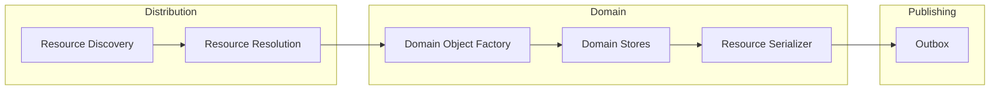
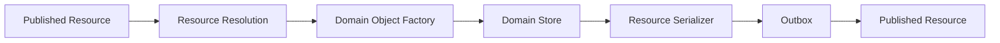

# ADR 0000 — Resource Architecture Overview

**Status**

Accepted

---

# Purpose

KJVOnly is an offline-first application built around Resources and Domain Objects.

This document provides a high-level overview of the architecture and introduces the core concepts used throughout the Architecture Decision Records (ADRs).

Each subsequent ADR defines one architectural responsibility.

Together they form the architecture specification for the application.

---

# Core Principles

The architecture is guided by the following principles.

- Offline-first.
- Domain Objects are the application's working model.
- Resources are the unit of distribution.
- Every architectural component has a single responsibility.
- Existing pipelines are reused whenever possible.
- Distribution, storage, synchronization, and application behavior remain independent concerns.
- Simplicity is preferred over architectural complexity.

---

# High-Level Architecture

The architecture intentionally separates distribution from the application's working model.

Incoming Resources are transformed into Domain Objects.

Outgoing Domain Objects are transformed back into Resources.

Each component has one responsibility and communicates through well-defined architectural boundaries.

---

# Architecture Organization

The architecture is organized into three logical areas.

Each area builds on the concepts introduced by the previous one.

## Foundations

Defines the architectural vocabulary and core concepts.

- Data Distribution Strategy
- Domain & Resource Model
- Nostr Event Model
- Nostr Resource Identity

These ADRs establish the terminology and architectural boundaries used throughout the remainder of the specification.

---

## Resource Lifecycle

Defines how Resources move through the application.

- Resource Discovery
- Resource Resolution
- Domain Storage Model
- Resource Installation Lifecycle
- Discovery Roots

These ADRs describe how Resources are discovered, resolved, transformed into Domain Objects, installed, and persisted.

---

## Synchronization & Application

Defines how application state evolves over time.

- Outbox and Publishing
- Multi-Device Synchronization
- Resource Archives
- Search Indexes
- Application Lifecycle

These ADRs describe publishing, synchronization, backup, search, and application startup.

---

# Architectural Pipelines

The architecture is intentionally symmetrical.

## Incoming Pipeline

Published Resources become Domain Objects through the installation pipeline.

---

## Outgoing Pipeline

Domain Objects become Published Resources through the publishing pipeline.

The architecture reuses these pipelines throughout the application.

Import, export, synchronization, and installation all build upon these same flows.

---

# Core Concepts

## Domain

A Domain organizes related application behavior and owns:

- Domain Objects,
- Domain Object Factories,
- Resource Serializers,
- and Domain Stores.

---

## Resource

A Resource is the unit of distribution.

Resources are discovered, installed, synchronized, archived, and published independently.

---

## Resource Representation

A Resource Representation defines how Resource content is represented.

Representations may contain the content directly or describe how to retrieve it.

---

## Domain Object

A Domain Object is the application's working representation of Resource content.

The application operates exclusively on Domain Objects.

---

## Domain Store

A Domain Store persists Domain Objects.

The application does not persist Nostr events or serialized Resources.

---

## Published Resource

A Published Resource is a Resource that has been serialized and made available for distribution.

---

# Relationship Between ADRs

Each ADR owns one architectural responsibility.

Concepts are defined once and referenced by later ADRs rather than repeated.

The architecture intentionally favors small, focused ADRs that compose into a complete system.

---

# Reading Order

The ADRs are intended to be read sequentially.

Each document introduces concepts required by the next.

Readers unfamiliar with the architecture should begin with the Foundations before moving into the Resource Lifecycle and Synchronization sections.

---

# Big Takeaway

KJVOnly is an offline-first, Resource-oriented architecture.

Domain Objects are the application's source of truth.

Resources exist to distribute those Domain Objects between publishers, devices, and users through a small number of reusable architectural pipelines.

