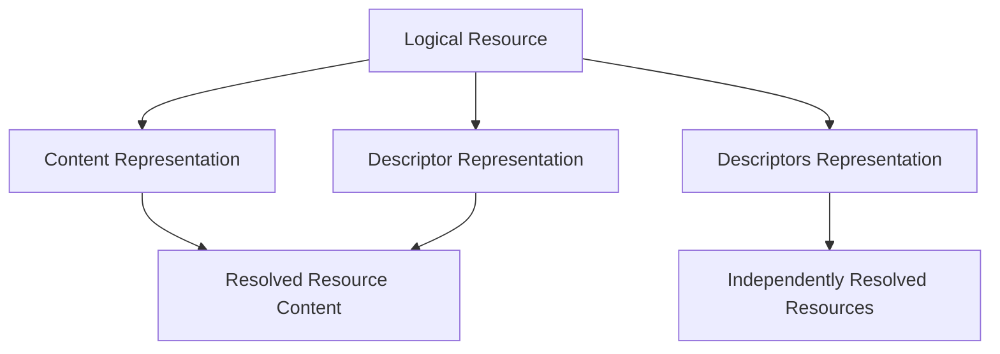

# ADR 0001 — Data Distribution Strategy

**Status**

Accepted

---

# Problem

KJVOnly distributes application data through Nostr.

Some resources are small enough to be stored directly in Nostr events. Others are too large or are better suited to external storage such as Blossom, HTTP, local archives, or future storage providers.

The distribution architecture must therefore:

* use Nostr for publishing and discovering resources,
* remain independent of any specific content storage provider,
* support both small and large resources,
* support bundled and fine-grained distribution,
* preserve stable resource identity across storage strategies,
* and remain compatible with offline-first installation.

The application should not require different resource models or installation pipelines for each storage backend.

---

# Decision

KJVOnly distributes application data as resources published through Nostr.

Nostr provides:

* publisher identity,
* event signing,
* resource addressing,
* discovery metadata,
* and revision publication.

A resource's representation determines how its content is obtained.

Resource content may be:

* embedded directly in a Nostr event,
* resolved through a descriptor,
* or described as a collection of independently resolvable descriptors.

External storage providers are accessed through Resource Resolution Strategies.

The storage provider does not affect:

* resource identity,
* resource type,
* ownership,
* parsing,
* installation,
* or application behavior.

This allows KJVOnly to use Nostr as the distribution protocol without coupling application resources to Blossom or any other storage backend.

---

# Distribution Boundary

Nostr events distribute resource representations.

They are not the application's working data model.


The event establishes the publisher and resource identity.

The representation determines how the resource content is obtained.

The resolved content is then processed by the resource installation pipeline.

The details of resource identity and representation are defined in ADR 0002.

---

# Representation-Independent Distribution

A publisher may choose the most appropriate representation for each resource.

```text
content

descriptor

descriptors
```

A small resource may be embedded directly in an event.

A large resource may be stored externally and referenced by a descriptor.

A collection may be represented as multiple descriptors.

These choices affect transport only.

They do not create different resource types or application models.



---

# Storage Strategy Independence

External resource content is retrieved through a Resource Resolution Strategy.

Possible strategies include:

```text
Blossom

HTTP

IPFS

Local Archive

Future Providers
```

Storage strategies answer:

> Where and how can the content be retrieved?

They do not answer:

* what the resource represents,
* who owns the resource,
* how the resource is identified,
* or how the application interprets it.

Adding a new storage provider therefore requires a new resolution strategy rather than a new domain, resource type, protocol kind, or installation pipeline.

---

# Resource Granularity

The distribution model supports resources at different levels of granularity.

Examples include:

```text
Complete Bible

Individual Bible Chapter

Complete Search Index

Individual Note

Collection of Notes
```

Publishers may choose coarse-grained resources for efficient bootstrap or fine-grained resources for selective installation and smaller updates.

The distribution architecture does not require one granularity.

Every published unit remains an independently identifiable resource.

The resource naming and granularity model are defined in ADR 0002.

---

# Protocol Kinds

Nostr kinds identify protocol-level event structures.

They do not identify storage providers.

A resource stored through Blossom does not require a Blossom-specific kind.

A resource stored directly in event content does not require a content-specific kind.

Representation and resource metadata provide the information needed to resolve and interpret the resource.

This keeps the protocol model stable as storage providers and resource types evolve.

---

# Integrity

Externally resolved content must be verifiable before installation.

Descriptors may include content identity such as a cryptographic hash.

The resolution process verifies retrieved content before it is passed to resource parsing and installation.

Integrity verification belongs to resource resolution and installation rather than to any specific storage provider.

---

# Offline-First Distribution

Network distribution and local application use are separate concerns.

Nostr and external storage providers are used to discover and retrieve resources.

Once installed, the application reads from local Domain Stores.


The application does not depend on an active network connection after the required resources have been installed.

---

# Scope

This ADR establishes the overall distribution strategy.

It does not define:

* canonical resource identity,
* representation payload schemas,
* resource discovery rules,
* resolution strategy implementation,
* installation behavior,
* local persistence schema,
* update policy,
* or synchronization behavior.

Those concerns are defined by later ADRs.

---

# Big Takeaway

KJVOnly uses Nostr to publish, identify, sign, and discover resources while allowing resource content to live in any supported storage backend.

Representation determines how content is obtained.

Storage strategy determines where external content is retrieved.

Neither changes the identity or meaning of the resource.
