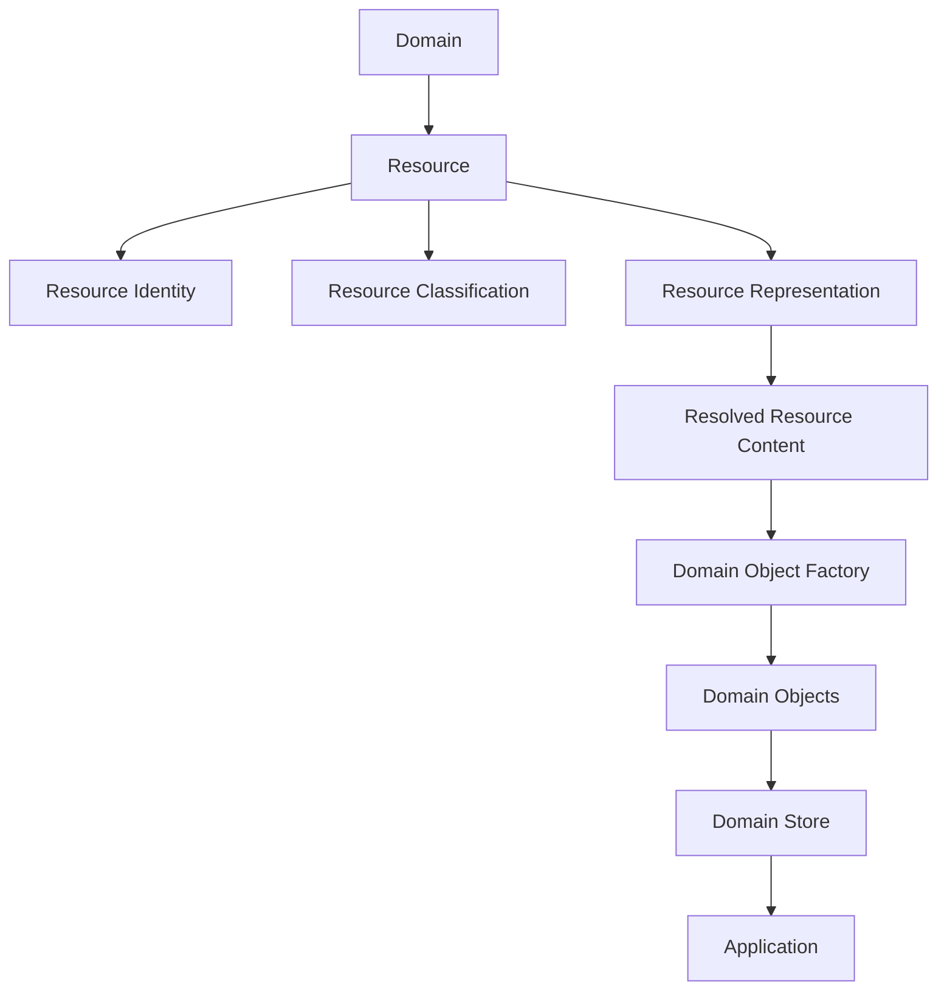
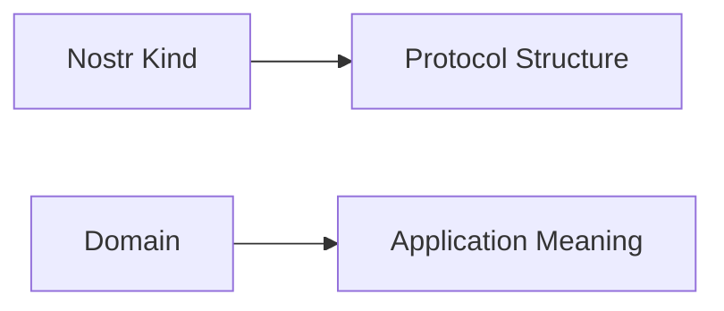
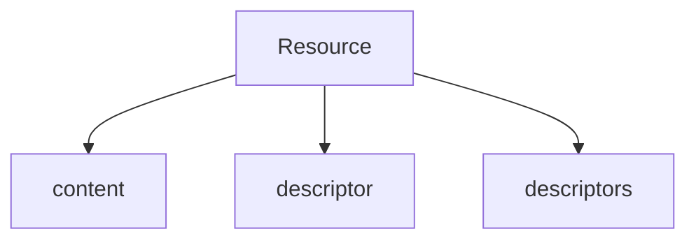
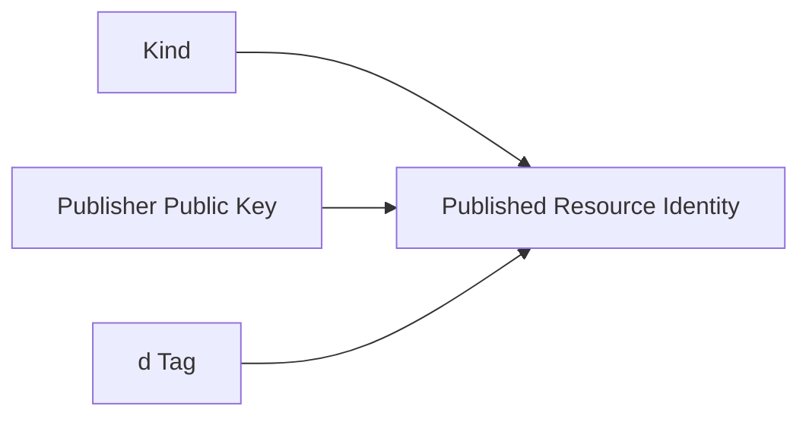
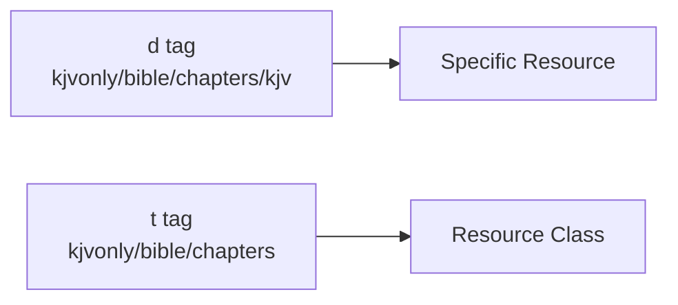
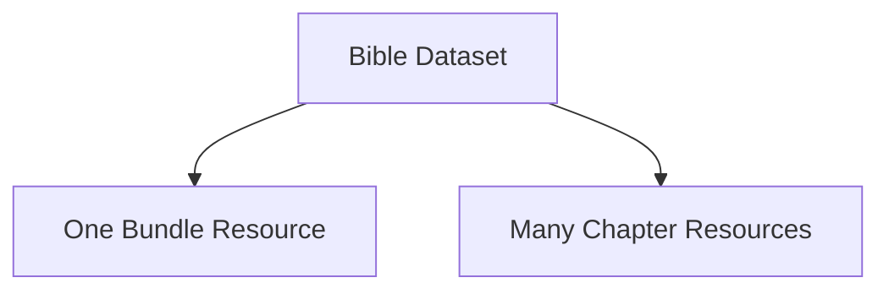
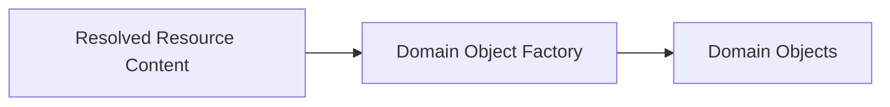
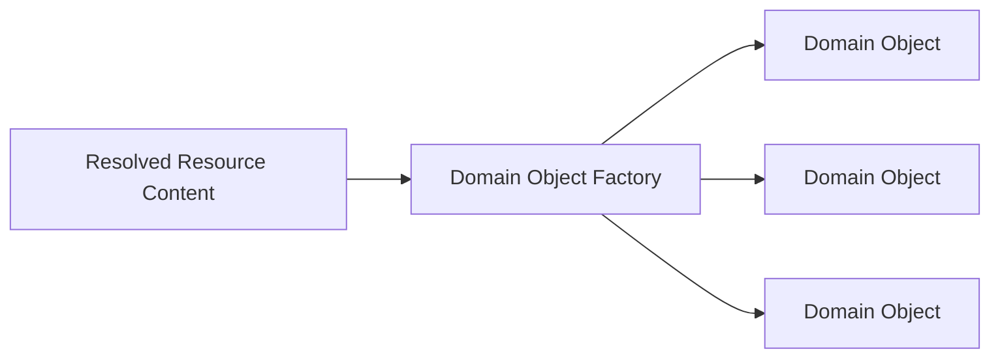
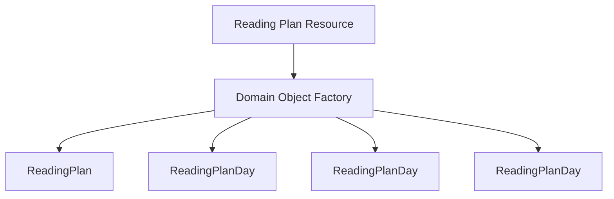
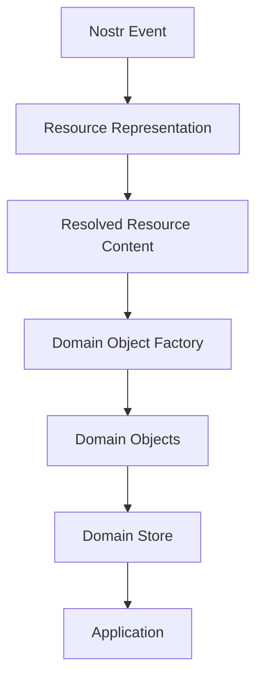

# ADR 0002 — Domain and Resource Model

**Status**

Accepted

---

# Problem

KJVOnly works with many categories of application data.

Examples include:

- Bible text
- Overlays
- Reading plans
- Notes
- Annotations
- Search indexes
- Completed readings
- Publisher metadata

These Resources may be published by different publishers, represented in different formats, stored through different providers, and distributed at different levels of granularity.

Without a shared conceptual model, concerns such as application behavior, Resource identity, protocol representation, storage, and persistence can become tightly coupled.

The architecture therefore needs clear definitions for the concepts used throughout the system.

---

# Decision

KJVOnly separates the following concepts:

1. Domain
2. Resource
3. Resource Representation
4. Resource Identity
5. Resource Classification
6. Resource Type
7. Resource Granularity
8. Domain Object
9. Domain Object Factory
10. Domain Store

Each concept has one responsibility.

No concept should implicitly determine another.

For example:

- A Domain does not determine storage.
- A storage provider does not determine Resource Identity.
- A Resource Identifier does not determine its network representation.
- A Nostr event is not a Domain Object.
- Resource Granularity does not determine Domain Object granularity.

---

# Conceptual Model



The application works primarily with Domain Objects stored in Domain Stores.

Resources are the units through which those objects are distributed.

Representations describe how Resource content is made available.

Domain Object Factories transform resolved Resource content into the application's working model.

---

# Domain

A Domain represents a broad category of application data.

Examples include:

```text
Bible
Overlays
Plans
Notes
Annotations
Search
Completed Readings
Publishers
```

A Domain answers:

> What category of application data does this belong to?

A Domain may own:

- Domain Objects
- Domain Object Factories
- Resource Serializers
- Domain Stores
- repositories
- application services
- domain-specific validation

A Domain does not define:

- where Resource content is stored,
- how Resource content is retrieved,
- who publishes a Resource,
- how a Resource is represented on the network,
- or how synchronization occurs.

---

# Domains and Protocol Kinds

A Domain is an application concept.

A Nostr kind is a protocol concept.

They serve different purposes.

KJVOnly minimizes the number of protocol kinds used by the application.

Most application Resources use a generic Resource kind:

```ts
export const RESOURCE_KIND = 37770
```

The Resource Identifier and classification metadata determine the application meaning of a Resource.

The kind determines how the protocol event should be validated and interpreted at the event boundary.



Protocol kinds answer:

> What event structure is this?

Domains answer:

> What application category does this belong to?

---

# Resource

A Resource is an independently identifiable unit of application data.

Resources are the primary units of distribution in KJVOnly.

Anything that may be independently discovered, installed, synchronized, archived, or shared is represented as a Resource.

Examples include:

- a complete Bible,
- a Bible chapter,
- a reading plan,
- a search index,
- a paragraph overlay,
- publisher metadata,
- a collection of notes,
- or an individual note.

A Resource is a logical concept.

It defines what is being distributed, but it does not define:

- how the content is transported,
- where the content is stored,
- how the content is serialized,
- or how the application persists the resulting Domain Objects.

---

# Resource Representation

A Resource Representation describes how a Resource is represented by a Nostr event.

KJVOnly supports three representations:

1. `content`
2. `descriptor`
3. `descriptors`



Representation determines how Resource content becomes available for resolution.

It does not determine:

- the Domain,
- the Resource Type,
- the publisher,
- the Resource Identity,
- or the Domain Objects produced from the content.

---

## Content Representation

A `content` representation stores serialized Resource content directly in the event `content`.

```json
{
  "kind": 37770,
  "tags": [
    ["d", "kjvonly/plans/readings/365-bible"],
    ["t", "kjvonly/plans/readings"],
    ["representation", "content"],
    ["m", "application/json"]
  ],
  "content": "{ ... resource content ... }"
}
```

No external storage provider is required to obtain the serialized Resource content.

---

## Descriptor Representation

A `descriptor` representation stores metadata describing how Resource content may be retrieved.

```json
{
  "kind": 37770,
  "tags": [
    ["d", "kjvonly/bible/chapters/kjv"],
    ["t", "kjvonly/bible/chapters"],
    ["representation", "descriptor"],
    ["m", "application/json"]
  ],
  "content": "{
    \"strategy\":\"blossom\",
    \"url\":\"https://...\",
    \"sha256\":\"...\",
    \"mediaType\":\"application/json+gzip\"
  }"
}
```

The descriptor is not the Resource content.

It describes where the serialized Resource content is located and how it may be verified.

Possible strategies include:

```text
Blossom
HTTP
IPFS
Local Archive
Future Providers
```

---

## Descriptors Representation

A `descriptors` representation contains a collection of descriptors.

Each descriptor identifies an independently resolvable Resource.

```json
{
  "kind": 37770,
  "tags": [
    ["d", "kjvonly/notes/shared-sermon-series-notes"],
    ["t", "kjvonly/notes"],
    ["representation", "descriptors"],
    ["m", "application/json"]
  ],
  "content": "[
    {
      \"resource\":\"kjvonly/notes/shared-sermon-series-notes/sermon-1\",
      \"strategy\":\"blossom\",
      \"url\":\"https://...\",
      \"sha256\":\"...\",
      \"mediaType\":\"application/json+gzip\"
    },
    {
      \"resource\":\"kjvonly/notes/shared-sermon-series-notes/sermon-2\",
      \"strategy\":\"blossom\",
      \"url\":\"https://...\",
      \"sha256\":\"...\",
      \"mediaType\":\"application/json+gzip\"
    }
  ]"
}
```

The collection contains descriptors only.

It does not mix descriptors with inline Resource content.

Descriptor collections may reference Resources that are themselves represented as `descriptors`, allowing collections to be composed recursively.

The behavior for resolving singular and collection representations is defined in ADR 0006.

---

# Resource Identity

Every Resource has a stable logical identity.

KJVOnly stores this identity in the Nostr `d` tag.

Resource Identifiers follow this convention:

```text
namespace/domain/resource-type/...resource-id
```

The first three segments classify the Resource.

Everything after `resource-type` identifies the specific Resource.

For example:

```text
kjvonly/bible/chapters/kjv
```

represents:

```text
namespace      = kjvonly
domain         = bible
resource-type  = chapters
resource-id    = kjv
```

A more granular Resource may contain additional identity segments:

```text
kjvonly/bible/chapters/kjv/1_1
```

which represents:

```text
namespace      = kjvonly
domain         = bible
resource-type  = chapters
resource-id    = kjv/1_1
```

Additional segments are part of the logical identity.

They are not interpreted as filesystem paths.

---

## Published Resource Identity

A `d` tag is unique only within a publisher's address space.

In Nostr addressable-event terms, a Published Resource is identified by:

```text
kind + publisher public key + d tag
```



The same Resource Identifier published by two publishers identifies two independent Published Resources.

Nostr Resource Identity and replacement semantics are defined in ADR 0004.

---

# Resource Classification

The `d` tag identifies one specific Resource.

Clients also need to discover classes of related Resources.

Every Resource therefore includes a classification tag containing:

```text
namespace/domain/resource-type
```

Examples include:

```text
kjvonly/bible/chapters
kjvonly/search/bible
kjvonly/plans/readings
```

For example:

```json
["t", "kjvonly/bible/chapters"]
```

The `d` tag answers:

> Which Resource is this?

The classification tag answers:

> What class of Resources does this belong to?



The `d` tag remains the authoritative Resource Identifier.

The classification tag supports relay filtering and discovery.

It does not replace or redefine Resource Identity.

---

# Resource Type

The first three segments of a Resource Identifier define the Resource Type:

```text
namespace/domain/resource-type
```

For example:

```text
kjvonly/plans/readings
kjvonly/bible/chapters
kjvonly/overlays/pericopes
```

The Resource Type identifies the Domain Object Factory responsible for interpreting resolved Resource content.

The remaining identifier segments select the specific Resource instance.

For example:

```text
kjvonly/plans/readings/365-bible
```

contains:

```text
resource type = kjvonly/plans/readings
resource id   = 365-bible
```

Resource Type is an application-level classification.

It is independent of representation and storage strategy.

---

# Resource Granularity

Resource Granularity describes how much application data is distributed as one Resource.

A Resource may be coarse-grained or fine-grained.

---

## Coarse-Grained Resources

Examples include:

- a complete Bible,
- a complete search index,
- publisher metadata,
- or a large note collection.

Advantages may include:

- fewer Resources,
- simpler distribution,
- and lower protocol overhead.

---

## Fine-Grained Resources

Examples include:

- an individual Bible chapter,
- a single note,
- one annotation,
- or one overlay segment.

Advantages may include:

- selective installation,
- smaller updates,
- and independent synchronization.

---

## Granularity Independence

The architecture does not require one granularity.

For example, Bible chapters may be represented as one Resource:

```text
kjvonly/bible/chapters/kjv
```

or as many Resources:

```text
kjvonly/bible/chapters/kjv/1_1
kjvonly/bible/chapters/kjv/1_2
kjvonly/bible/chapters/kjv/1_3
```

Both models use the same identity and representation concepts.



Granularity should reflect distribution, installation, and update needs rather than presentation structure.

---

# Domain Object

A Domain Object is the application-facing representation created from resolved Resource content.

Domain Objects are the primary data structures used by application features.

Examples include:

```text
BibleChapter
ReadingPlan
ReadingPlanDay
Note
Annotation
Publisher
CompletedReading
```

A Domain Object is independent of:

- Nostr events,
- Resource Representations,
- storage providers,
- network serialization,
- and transport protocols.



The Resource Type identifies the Domain Object Factory responsible for creating the Domain Objects.

---

# Domain Object Factory

A Domain Object Factory transforms resolved Resource content into one or more Domain Objects.

It is responsible for:

- interpreting the Resource schema,
- validating Domain-specific content,
- constructing Domain Objects,
- and preserving Resource origin metadata.

A Domain Object Factory does not:

- discover Resources,
- retrieve external content,
- persist Domain Objects,
- or publish Resources.



A Resource may produce one or many Domain Objects.

---

## Domain Object Identity

A Domain Object retains the origin of the Resource from which it was created.

Its Resource origin includes:

```text
publisher public key
resource identifier
```

The source event ID may be retained as publication metadata, but it does not define Domain Object identity.



Resource Granularity and Domain Object granularity are independent.

Resources define distribution boundaries.

Domain Objects define application behavior.

---

# Domain Store

A Domain Store persists Domain Objects for application use.

Each Domain owns the storage interface for its Domain Objects.

Examples include:

```text
Bible Store
Reading Plan Store
Notes Store
Annotation Store
Publisher Store
```

The application reads Domain Objects from Domain Stores rather than reading Nostr events or descriptor payloads directly.


A Domain Store is a conceptual boundary.

Its physical persistence model is defined separately in ADR 0007.

---

# Concept Boundaries



Each concept answers a different question:

- **Domain:** What category of application data is this?
- **Resource:** What independently identifiable data is distributed?
- **Representation:** How is the Resource represented for resolution?
- **Resource Identity:** Which logical Resource is this?
- **Classification:** What class of Resources does it belong to?
- **Resource Type:** Which Domain Object Factory interprets its content?
- **Resource Granularity:** How much application data is distributed together?
- **Domain Object Factory:** How does resolved content become Domain Objects?
- **Domain Object:** What application-facing object does the content produce?
- **Domain Store:** Where does the application access those objects?

Behavior such as discovery, resolution, installation, persistence, updates, and synchronization is defined by later ADRs.

---

# Relationship to Other ADRs

This ADR defines the conceptual vocabulary used throughout the architecture.

Related behavior is defined by:

- **ADR 0003** — Nostr Event Model
- **ADR 0004** — Nostr Resource Identity
- **ADR 0005** — Resource Discovery
- **ADR 0006** — Resource Resolution
- **ADR 0007** — Domain Storage Model
- **ADR 0008** — Resource Installation Lifecycle

---

# Scope

This ADR defines:

- Domains,
- Resources,
- Resource Representations,
- Resource Identity,
- Resource Classification,
- Resource Types,
- Resource Granularity,
- Domain Objects,
- Domain Object Factories,
- and Domain Stores.

This ADR does not define:

- how Resources are discovered,
- how representations are resolved,
- how integrity is verified,
- how Domain Objects are installed,
- how Domain Stores are implemented,
- how replacement publications are processed,
- or how changes are synchronized.

Those behaviors are defined by later ADRs.

---

# Big Takeaway

KJVOnly separates the unit of distribution from the application's working model.


Resources define what is distributed.

Representations define how serialized content is made available.

Domain Object Factories transform that content into the application's working model.

Domain Stores make those Domain Objects available to the application.