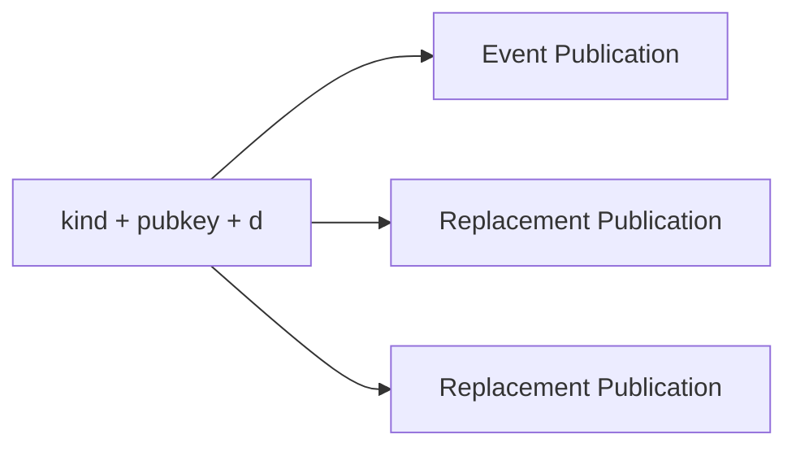
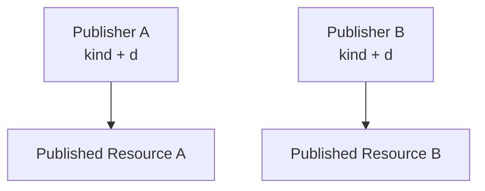

# ADR 0004 — Nostr Resource Identity

**Status**

Accepted

---

# Problem

KJVOnly resources are published as Nostr addressable events.

The application needs a consistent way to determine:

* whether two events represent the same published Resource,
* whether an event is a newer publication of an existing Resource,
* and whether a publication represents a different Resource.

Defining a separate application-specific identity or versioning model would duplicate semantics already provided by Nostr and could introduce conflicting rules.

---

# Decision

KJVOnly adopts Nostr addressable-event identity and replacement semantics directly.

The application does not define a separate Resource version, revision, or identity system.

For an addressable event, the published Resource is identified by:

```text
kind + publisher public key + d tag
```

Nostr defines addressable events using this tuple and permits relays to retain only the latest event for each unique combination.

The individual event `id` identifies a specific signed publication of that Resource.

---

# Core Terms

## Published Resource Identity

The identity of a published Resource is:

```text
kind + publisher public key + d tag
```

Two events with the same values represent publications of the same Resource.

Changing any value creates a different Published Resource Identity.

---

## Event Publication

An Event Publication is one signed Nostr event for a Published Resource.

Publishing another event with the same:

* `kind`,
* publisher public key,
* and `d` tag

publishes a replacement for the same Resource.

The new event has a different event `id`, but the Published Resource Identity remains unchanged.



Relays may discard older publications and retain only the latest event for an addressable identity.

---

## Different Published Resource

A different Published Resource is created when any identity component changes.

```text
different kind
or
different publisher public key
or
different d tag
```

The architecture does not assign additional meaning to why the identity changed.

For example, a publisher may use different `d` tag values for:

* incompatible formats,
* editions,
* translations,
* alternative datasets,
* or compatibility versions.

A value such as:

```text
kjvonly/bible/chapters/kjv/v2
```

is simply a different Resource Identifier.

The `/v2` segment is a publisher naming convention, not a special architectural version type.

---

# Publisher Identity

The publisher public key is part of the Published Resource Identity.

The same `kind` and `d` tag published by two different publishers identifies two different Resources.



Changing publishers therefore cannot update or replace the original publisher's Resource.

It creates an independently addressable Resource.

---

# Forks and Provenance

KJVOnly does not define a Fork as a separate identity type.

A Resource published under another publisher is already a different Published Resource because its public key differs.

A publisher may include provenance metadata indicating that its Resource was derived from another Published Resource.

Conceptually, provenance may reference:

```text
source kind
source publisher public key
source d tag
optional source event id
```

Provenance is descriptive metadata.

It does not participate in identity and does not change Nostr replacement semantics.

A Resource with provenance may be described by the application or user as a fork, but no special fork identity mechanism is required.


---

# Identity Rules

The complete identity model is:

```text
Same kind + same publisher + same d tag
    = same Published Resource

Same identity + different event id
    = different publication of the same Resource

Different kind, publisher, or d tag
    = different Published Resource

Provenance
    = metadata only
```

No additional Resource version or revision abstraction is introduced.

---

# Implications

Resource identifiers should be designed as stable logical identifiers.

Compatible corrections and updates should normally reuse the same `d` tag and publish a replacement event.

A publisher may create a new `d` tag when it intends to create an independently addressable Resource.

The application must not assume that segments such as `v1`, `v2`, `edition`, or dates have protocol-level meaning.

Older Event Publications may not remain available from relays and must not be treated as a durable revision history.

---

# Scope

This ADR defines:

* adoption of Nostr addressable-event identity,
* the relationship between Published Resource Identity and event `id`,
* the effect of changing identity components,
* and optional provenance between independently published Resources.

This ADR does not define:

* Resource discovery,
* Resource Resolution,
* installation,
* Multi-Device Synchronization,
* update-selection behavior,
* historical event archival,
* synchronization,
* conflict resolution,
* or local persistence.

Those concerns are defined by other ADRs.

---

# Big Takeaway

KJVOnly does not invent its own Resource versioning system.

It relies directly on Nostr:

```text
kind + publisher public key + d tag
```

identifies the Published Resource.

The event `id` identifies one signed publication of it.

Changing any identity component creates a different Resource.

Version names and fork relationships are publisher-level conventions expressed through Resource Identifiers and optional provenance metadata.
