# ADR 0010 — Outbox and Publishing

**Status**

Accepted

---

# Problem

KJVOnly is an offline-first application.

Users must be able to create and update local application data without waiting for network availability or relay acknowledgements.

Once a local change has been committed, the application requires a reliable mechanism for publishing the corresponding Resource Representation to Nostr.

Publishing should remain independent of:

- user interaction,
- Domain Object creation,
- serialization,
- synchronization,
- and conflict resolution.

Without a clear architectural boundary, transport concerns become coupled to application behavior and synchronization policy.

---

# Decision

KJVOnly uses a persistent **Outbox** for asynchronous publishing.

The Outbox accepts serialized Resource Representations and reliably publishes them to one or more Nostr relays.

The Outbox is transport-focused.

It does not understand Domain Objects, determine whether a queued publication is still authoritative, or participate in synchronization decisions.

---

# Publishing Pipeline

The outbound pipeline is the inverse of Resource Installation.

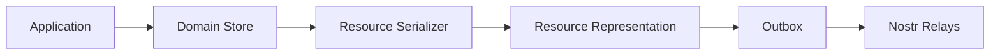

The Resource Serializer converts Domain Objects into a publishable Resource Representation.

The Outbox receives the completed representation and manages transport to relays.

---

# Resource Serializer

A Resource Serializer converts one or more Domain Objects into a serialized Resource Representation suitable for publication.

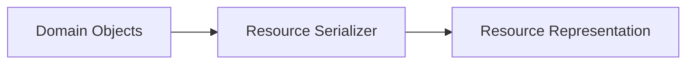

The serializer is responsible for:

- selecting the appropriate resource schema,
- serializing Domain Object state,
- preserving the Published Resource Identity,
- and producing the final Resource Representation.

The serializer does not publish to relays.

The Outbox does not serialize Domain Objects.

---

# Local-First Writes

User actions are committed locally before publication.

A local write is complete only when both the Domain Store update and corresponding Outbox entry have been persisted.

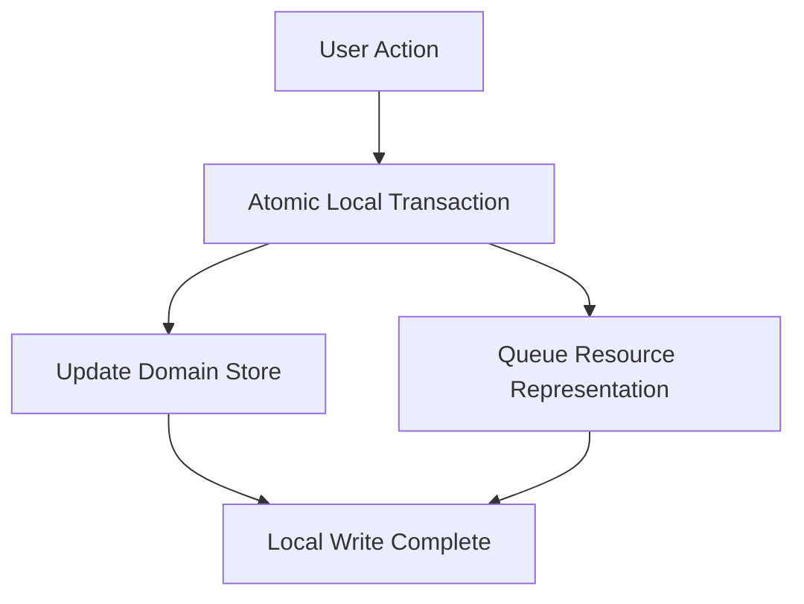

This guarantees that local application state and pending publication cannot become inconsistent.

The user interface never waits for relay acknowledgement before reporting success.

---

# Outbox Entry

Each Outbox entry contains everything required to perform one publication.

Conceptually, an entry contains:

- Published Resource Identity
- Resource Representation
- target relays
- publication status
- retry metadata
- last failure

The persistence format is implementation-defined.

An Outbox entry must be self-contained and require no additional serialization before publication.

---

# Outbox Lifecycle

Each publication progresses through a simple lifecycle.

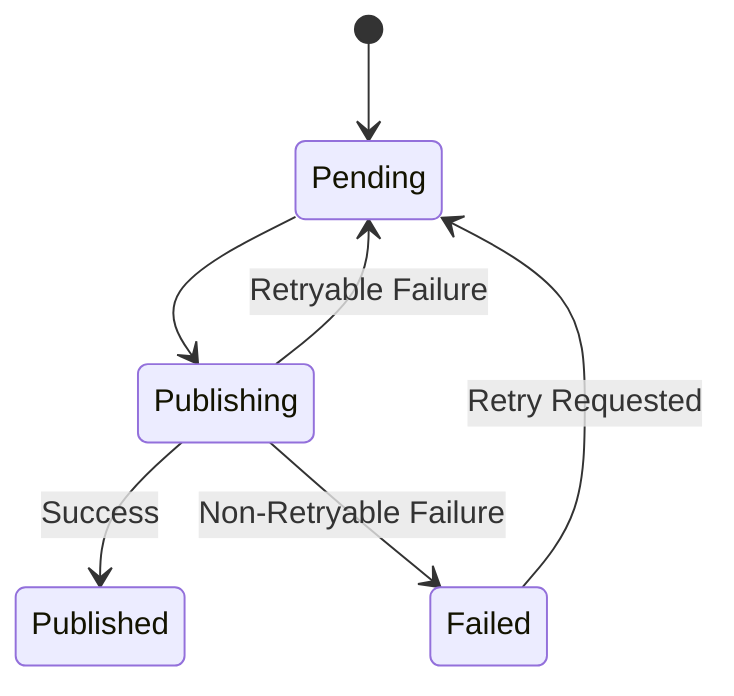

Published entries may be removed once publication requirements have been satisfied.

Pending and failed entries remain durable across application restarts.

---

# Background Publishing

Publishing occurs independently of the user interface.

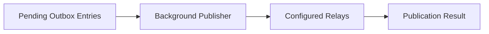

Publishing may occur:

- immediately after a local write,
- when network connectivity returns,
- during application startup,
- or according to an implementation-defined schedule.

Application behavior never depends on immediate publication success.

---

# Relay Success

A Resource Representation may be published to multiple relays.

Publication is considered successful once at least one configured relay has accepted the event.

Additional relays provide replication but do not delay completion.

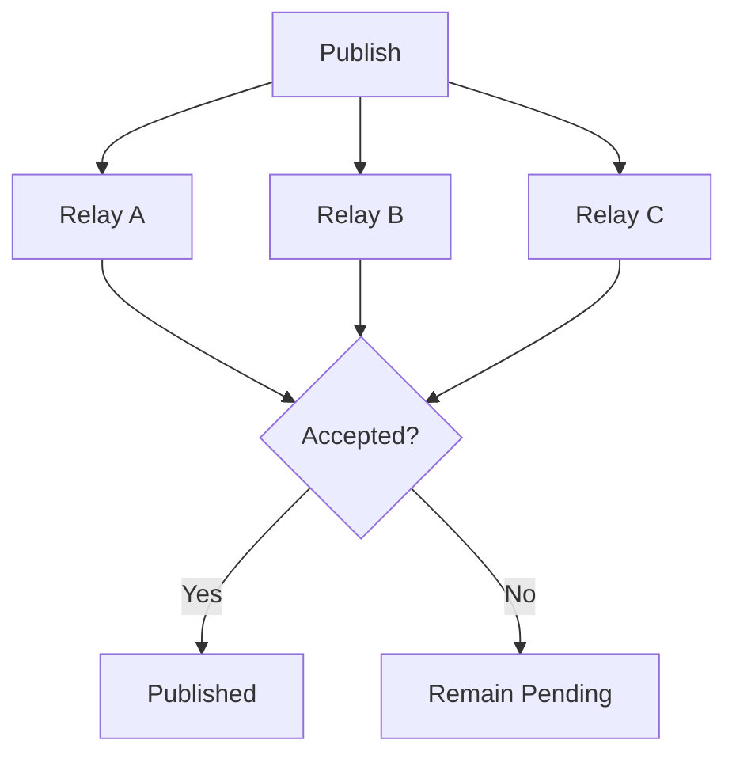

Per-relay publication state may be retained for diagnostics or future replication.

---

# Operation Coalescing

Most application Resources are represented by Nostr addressable events.

When multiple unpublished Resource Representations target the same Published Resource Identity, only the most recent representation needs to be published.

The Outbox may therefore coalesce pending entries using:

```text
kind + publisher public key + d tag
```

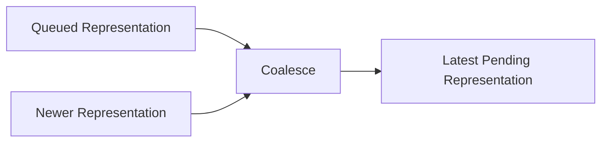

Coalescing is only valid when replacing the older entry preserves the protocol semantics.

Append-only event types may require independent publications.

---

# Retry Behavior

Retryable publication failures remain in the Outbox.

Retries should use exponential backoff to avoid excessive network traffic during prolonged outages.

A circuit breaker may temporarily suspend publication attempts against relays that repeatedly fail.

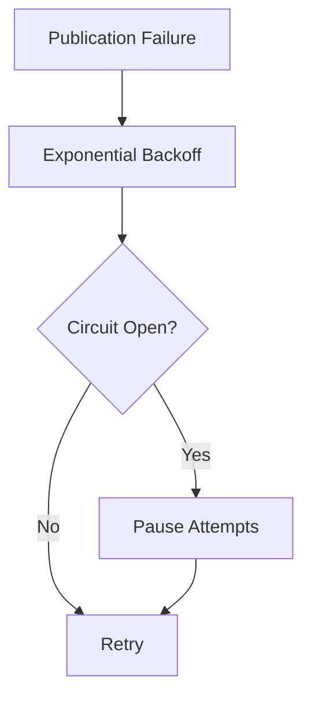

Retry limits may suspend automatic publication, but they must never silently discard pending Outbox entries.

---

# Application Restart

The Outbox is persistent.

Pending publications survive application shutdown and resume automatically after restart.

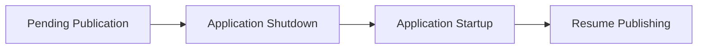

The user is never required to recreate unpublished local changes.

---

# Delete Operations

Deletion uses the same publication pipeline.

A delete first updates the local Domain Store according to domain policy and then queues the corresponding Resource Representation in the Outbox.

The Outbox treats delete operations like any other publication payload.

---

# Stale Publications

A queued Resource Representation may become stale relative to newer local or remote state.

The Outbox does not determine whether a queued representation is still authoritative.

It does not:

- fetch remote state before publishing,
- compare local and remote state,
- merge concurrent edits,
- overwrite Domain Objects,
- or resolve multi-device conflicts.

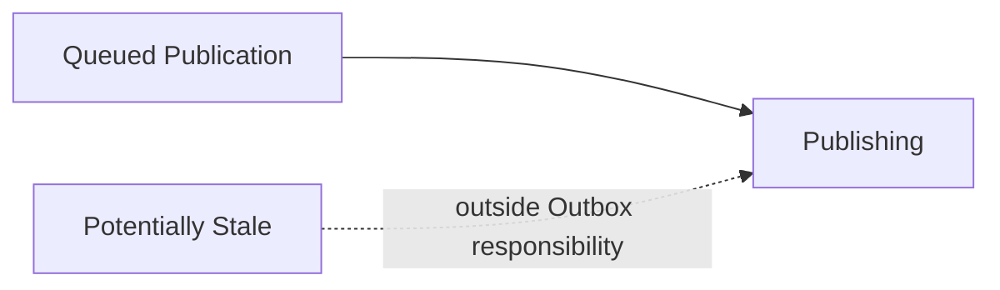

Detecting and resolving stale publications is the responsibility of Multi-Device Synchronization.

The Outbox remains a reliable transport queue regardless of synchronization policy.

---

# Publication Status

The application must distinguish between:

- locally saved,
- pending publication,
- publishing,
- published,
- and failed publication.

Publication status does not affect the availability of local Domain Objects.

The Domain Store always represents the application's current local state.

---

# Relationship to Other ADRs

This ADR builds on:

- **ADR 0002** — Domain & Resource Model
- **ADR 0003** — Event Model
- **ADR 0004** — Nostr Resource Identity
- **ADR 0007** — Domain Storage Model
- **ADR 0008** — Resource Installation Lifecycle

Synchronization and conflict resolution are defined separately.

---

# Scope

This ADR defines:

- Resource serialization,
- the persistent Outbox,
- local-first publishing,
- atomic Domain Store and Outbox persistence,
- background publishing,
- relay success policy,
- operation coalescing,
- retry behavior,
- restart recovery,
- delete publication,
- and publication status.

This ADR does not define:

- Resource Discovery,
- Resource Resolution,
- Resource Installation,
- incoming synchronization,
- remote state comparison,
- conflict resolution,
- multi-device reconciliation,
- or application-specific merge behavior.

---

# Big Takeaway

The Resource Serializer converts Domain Objects into publishable Resource Representations.

The Outbox reliably transports those serialized representations to Nostr relays.

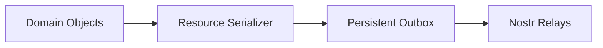

The Outbox is a durable transport queue.

It does not understand Domain Objects or resolve synchronization conflicts.