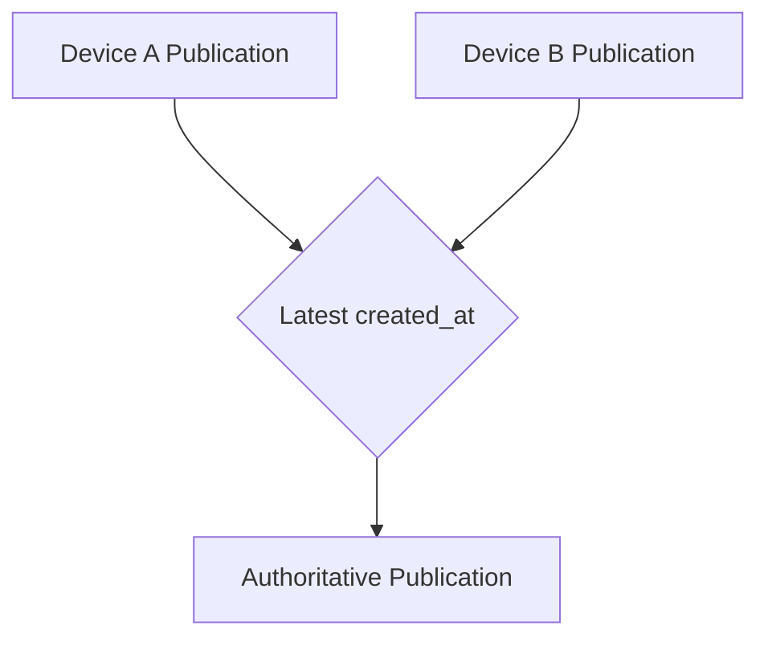
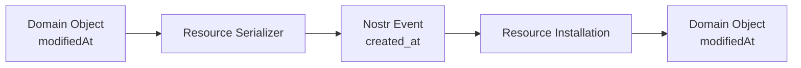
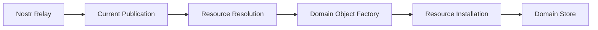
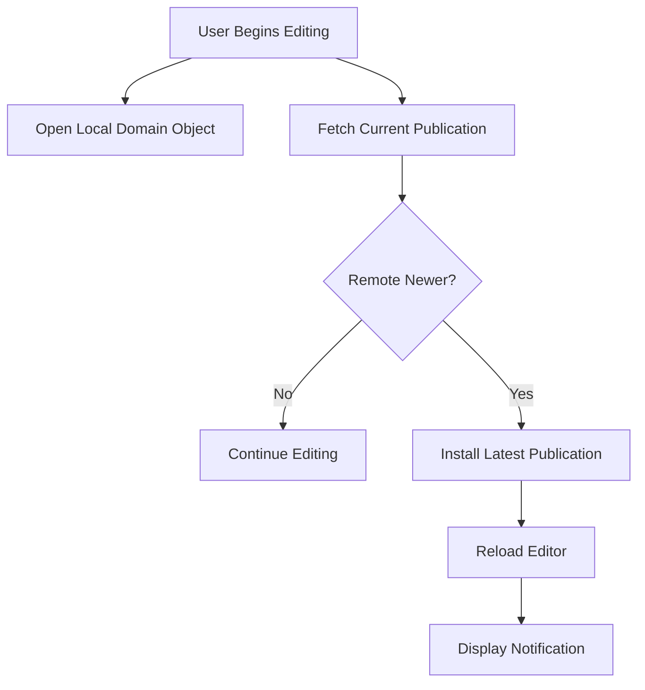
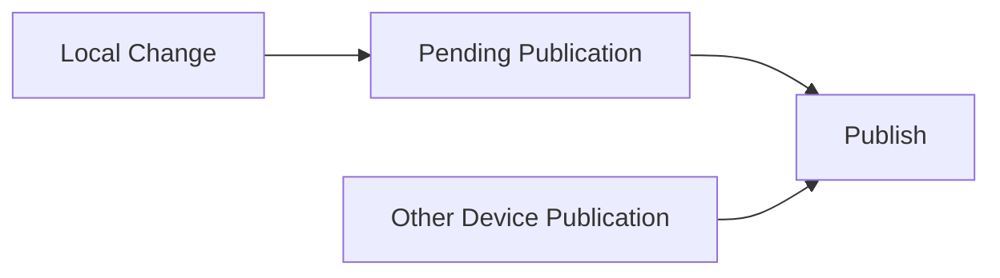
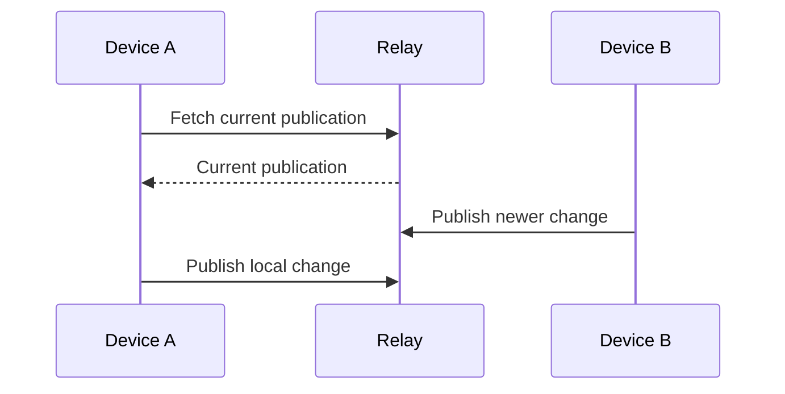
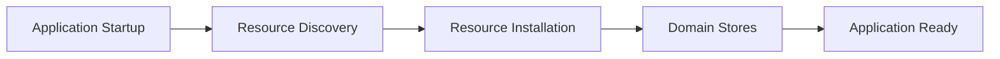

# ADR 0011 — Multi-Device Synchronization

**Status**

Accepted

---

# Problem

A user may access the same KJVOnly data from multiple devices.

Each device maintains its own Domain Stores and may create local changes while other devices are also active.

The architecture requires a simple synchronization model that:

- receives newer remote publications,
- publishes local changes,
- updates local Domain Objects,
- reduces stale edits,
- and remains compatible with Nostr addressable events.

Nostr does not provide locking, compare-and-swap operations, or automatic merging for concurrent edits.

The architecture therefore cannot guarantee that simultaneous edits to the same Published Resource will never overwrite one another.

---

# Decision

KJVOnly uses **Last Write Wins** for Multi-Device Synchronization.

A Domain Object contains a `modifiedAt` timestamp.

When the Domain Object is published, its `modifiedAt` value becomes the Nostr event `created_at` value.

For the same Published Resource Identity, the publication with the latest timestamp is authoritative.



KJVOnly does not introduce:

- resource locking,
- revision history,
- automatic merging,
- conflict copies,
- or a separate synchronization timestamp.

---

# Timestamp Model

The Domain Object timestamp and the Nostr publication timestamp represent the same logical write.

```text
Domain Object modifiedAt
    =
Nostr event created_at
```

When a remote publication is installed, its `created_at` value becomes the resulting Domain Object's `modifiedAt` value.

When a local Domain Object is published, its `modifiedAt` value is used as the event's `created_at` value.



This creates one consistent ordering value across local and remote state.

---

# Incoming Synchronization

Incoming publications use the existing Resource Installation Lifecycle.

Multi-Device Synchronization does not write directly to Domain Stores.



If the incoming publication is newer than the installed Domain Object, installation replaces the existing Domain Objects according to ADR 0008.

If the installed Domain Object is newer, the incoming publication does not replace it.

---

# Outgoing Synchronization

All outgoing publications use the Outbox.

Multi-Device Synchronization never publishes directly to relays.


The Outbox remains responsible only for transport, retries, and publication status.

Synchronization policy does not change the Outbox publishing pipeline.

---

# Edit-Time Synchronization

When editing begins, the application immediately opens the current local Domain Object.

At the same time, it asynchronously requests the latest publication for the same Published Resource Identity.



Editing never waits for the network.

If a newer publication is discovered:

1. The publication is processed through the normal Resource Installation pipeline.
2. The editor reloads the updated Domain Object.
3. The user is notified that a newer version was loaded.

This significantly reduces stale edits while keeping the editing experience responsive.

The architecture accepts the remaining race condition where another device publishes after the refresh check but before the current device publishes its own changes.

---

# Pending Outbox Entries

A pending Outbox entry represents a local write awaiting publication.

The Outbox does not compare that publication with newer remote state.

It publishes the serialized Resource Representation it was given.

Multi-Device Synchronization does not require a remote fetch before every Outbox publication.



If publications race, the publication with the latest timestamp becomes authoritative.

The architecture accepts this limitation rather than introducing locking or transactional coordination between devices.

---

# Remaining Race Condition

The edit-time refresh reduces stale edits but cannot eliminate all concurrent-write races.

Another device may publish after the refresh check but before the current device publishes its change.



Nostr does not provide an atomic mechanism for reserving or locking a Published Resource while it is being edited.

KJVOnly accepts this edge case.

Preventing it completely would require a more complex protocol involving locks, revision history, or conditional publication.

---

# Startup Synchronization

During normal application startup, the application discovers and installs current publications required by the active application state.



Startup synchronization reduces stale local state before normal application use.

The Application Lifecycle defines when this work occurs and which Resources are required before rendering.

---

# Offline Behavior

Devices may continue creating and editing local Domain Objects while offline.

Local changes are queued in the Outbox and published when connectivity returns.


The application does not block local editing because another device may also be editing the same Resource.

Concurrent offline edits remain subject to Last Write Wins when they are eventually published.

---

# Clock Assumption

Last Write Wins depends on publication timestamps.

The architecture assumes that device clocks are reasonably accurate.

KJVOnly does not introduce a separate logical clock, synchronization server, or timestamp authority.

Significant clock differences between devices may affect write ordering.

This is an accepted limitation of the simplified synchronization model.

---

# Relationship to Other ADRs

This ADR builds on:

- **ADR 0004** — Nostr Resource Identity
- **ADR 0005** — Resource Discovery
- **ADR 0006** — Resource Resolution
- **ADR 0008** — Resource Installation Lifecycle
- **ADR 0010** — Outbox and Publishing

Incoming publications use Resource Installation.

Outgoing publications use the Outbox.

This ADR coordinates those pipelines without redefining them.

---

# Scope

This ADR defines:

- Multi-Device Synchronization,
- Last Write Wins,
- the relationship between `modifiedAt` and `created_at`,
- incoming synchronization through Resource Installation,
- outgoing synchronization through the Outbox,
- edit-time refresh,
- startup synchronization,
- offline behavior,
- and accepted concurrent-edit limitations.

This ADR does not define:

- resource locking,
- revision history,
- automatic merging,
- conflict copies,
- conditional relay publication,
- Domain Object schemas,
- Resource Resolution,
- Resource Installation,
- Outbox transport behavior,
- or application startup sequencing.

Those concerns are either defined by other ADRs or intentionally excluded.

---

# Big Takeaway

Multi-Device Synchronization uses Last Write Wins.

The Domain Object's `modifiedAt` timestamp becomes the Nostr event's `created_at` timestamp, providing one ordering value for local and remote state.


Before editing an existing Published Resource, the application checks for a newer publication and reloads it when necessary.

Rare simultaneous edits may still overwrite one another.

KJVOnly accepts this limitation rather than introducing a complex locking or merge protocol.