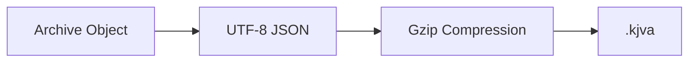
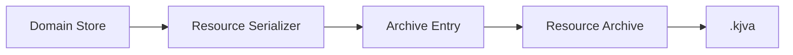
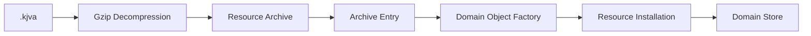

# ADR 0012 — Resource Archives

**Status**

Accepted

---

# Problem

Resources are normally distributed through Nostr.

However, users also need a portable format for:

- sharing Resources with other users,
- transferring data between devices,
- and creating complete application backups.

The archive format should reuse the existing architecture wherever possible rather than introducing a separate serialization model.

---

# Decision

KJVOnly defines a **Resource Archive**.

A Resource Archive is a portable collection of serialized Resource content and application state.

Resource Archives are used for:

- sharing selected Resources,
- transferring application data,
- and creating complete backups.

The archive format is independent of Nostr and does not contain Nostr events.

Instead, it stores the same serialized Resource content produced by the Resource Serializer.

---

# Archive Format

Resource Archives use the file extension:

```text
.kjva
```

A `.kjva` file is a gzip-compressed UTF-8 JSON document.



The archive format is versioned to support future evolution.

---

# Archive Structure

A Resource Archive contains:

- archive metadata,
- serialized Resource entries,
- application state,
- and optional integrity metadata.

Conceptually:

```text
Resource Archive
├── metadata
├── resources
└── applicationState
```

The archive describes logical application data rather than local storage structures.

---

# Resource Entries

Each Resource entry contains:

- Published Resource Identity,
- media type,
- serialized Resource content,
- optional provenance,
- and optional integrity metadata.

Conceptually:

```json
{
  "resourceId": "kjvonly/bible/chapters/kjv",
  "mediaType": "application/json",
  "content": { ... }
}
```

The serialized content is identical to the content that would normally appear in a Resource Representation.

The archive does not contain Nostr events.

---

# Collection Resources

A Resource may contain one or many Domain Objects.

Archive entries preserve the Resource's existing serialization format.

For example:

```text
kjvonly/bible/chapters/kjv
```

may serialize as:

```json
{
  "1_1": { ... },
  "1_2": { ... },
  "43_3": { ... }
}
```

The archive does not create one entry per Domain Object.

It preserves the Resource boundaries already defined by the architecture.

---

# Export Pipeline

Export reuses the existing serialization pipeline.



Each Domain Store contributes one or more serialized Resource entries.

The archive format does not depend on the underlying IndexedDB schema.

---

# Import Pipeline

Import reuses the existing Domain Object Factory and Resource Installation pipeline.



Each Resource entry is processed independently.

Import does not bypass the existing installation pipeline.

---

# Archive Types

The same archive format supports multiple use cases.

### Sharing Archive

Contains selected Resources, such as:

- notes,
- reading plans,
- annotations,
- Bible memory,
- or other user-selected content.

### Backup Archive

Contains all exportable application data, including:

- installed Resources,
- user-created Resources,
- application settings,
- Discovery Roots,
- installation metadata,
- and other application state.

Pending Outbox entries are not included.

---

# Application State

Application state contains information required to restore the application environment.

Examples include:

- settings,
- Discovery Roots,
- installation metadata,
- and other application configuration.

Application state is stored separately from Resource entries.

---

# Import Behavior

Each Resource entry is imported independently.

Importing one Resource does not prevent other Resources from being restored.

If an individual entry fails validation or installation, the failure is reported while the remaining entries continue processing.

A partially imported archive remains usable.

---

# Conflict Resolution

Import uses the same synchronization policy as the rest of the application.

When imported content conflicts with existing local content, Last Write Wins is applied using the Domain Object's `modifiedAt` timestamp.

Import does not introduce a separate merge strategy.

---

# Archive Versioning

The archive format includes its own version identifier.

Resource schemas remain owned by their respective domains.

The archive version governs only the archive envelope.

Individual Resource formats evolve independently through their own serializers and Domain Object Factories.

---

# Relationship to Other ADRs

This ADR builds on:

- **ADR 0002** — Domain & Resource Model
- **ADR 0007** — Domain Storage Model
- **ADR 0008** — Resource Installation Lifecycle
- **ADR 0010** — Outbox and Publishing
- **ADR 0011** — Multi-Device Synchronization

It reuses the existing serialization and installation pipelines without introducing new architectural concepts.

---

# Scope

This ADR defines:

- Resource Archives,
- archive structure,
- archive format,
- export,
- import,
- application state,
- archive versioning,
- and conflict resolution.

This ADR does not define:

- Resource serialization,
- Resource Installation,
- Resource Discovery,
- synchronization,
- publishing,
- or local persistence.

Those responsibilities remain defined by other ADRs.

---

# Big Takeaway

A Resource Archive is a portable, gzip-compressed collection of serialized Resource content and application state.

It reuses the existing serialization and installation pipelines without introducing a separate data model.

