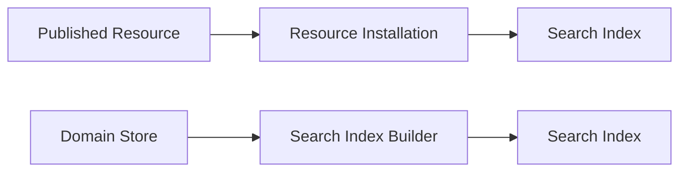
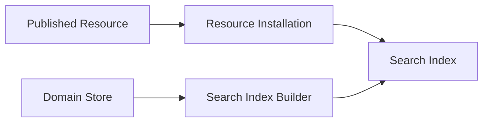

# ADR 0013 — Search Indexes

**Status**

Accepted

---

# Problem

Searching large collections of Domain Objects by scanning application data is inefficient.

The application requires search indexes that provide fast query performance while remaining consistent with the Resource architecture.

Search indexes should integrate with the existing installation and storage pipelines without introducing a separate distribution model.

---

# Decision

KJVOnly treats search indexes as part of the Search domain.

Search indexes may originate from one of two sources:

- published Resources, or
- locally generated indexes.

Regardless of their origin, search indexes provide the same application behavior.

---

# Search Index Sources

Search indexes are either installed or generated.

Published indexes are installed through the normal Resource Installation pipeline.

Local indexes are generated from Domain Stores.

---

# Published Search Indexes

Published search indexes are Resources.

They are discovered, resolved, installed, and versioned like any other Resource.

Typical examples include:

- Bible text indexes
- Dictionary indexes
- Concordance indexes
- Commentary indexes

These indexes are maintained by the publisher and distributed to clients.

---

# Local Search Indexes

Some Domain Objects are created or modified locally.

Examples include:

- notes,
- annotations,
- highlights,
- bookmarks,
- reading progress,
- and other user-created content.

Search indexes for these Domains are generated locally.

The application does not publish generated search indexes.

They are disposable and may be rebuilt at any time.

---

# Search Index Builder

The Search Index Builder creates indexes from Domain Objects.

The builder is responsible only for creating indexes.

It does not own:

- Domain Objects,
- Resources,
- or persistence.

---

# Search Index Lifecycle

Published indexes follow the normal Resource lifecycle.

Generated indexes follow a local lifecycle.

The application interacts with both in the same way.

---

# Rebuilding

Generated indexes may be discarded and rebuilt at any time.

Published indexes may be reinstalled by installing a newer publication of the corresponding Resource.

The application does not depend on indexes as the authoritative source of data.

Domain Stores remain the source of truth.

---

# Versioning

Published indexes are versioned through their Published Resource Identity.

Generated indexes inherit the version of the Domain Objects from which they were built.

The Search domain does not maintain an independent versioning model.

---

# Offline Behavior

Published search indexes are available once installed.

Generated search indexes remain available while stored locally.

If a generated index is removed or becomes invalid, it may be rebuilt from the Domain Store without requiring network access.

---

# Relationship to Other ADRs

This ADR builds on:

- **ADR 0002** — Domain & Resource Model
- **ADR 0007** — Domain Storage Model
- **ADR 0008** — Resource Installation Lifecycle

Published indexes follow the normal Resource lifecycle.

Generated indexes are derived from Domain Stores.

---

# Scope

This ADR defines:

- Search indexes,
- published indexes,
- generated indexes,
- the Search Index Builder,
- rebuilding,
- and index lifecycle.

This ADR does not define:

- search algorithms,
- ranking,
- query syntax,
- indexing implementations,
- storage engines,
- or user interface behavior.

Those concerns are implementation details.

---

# Big Takeaway

Search indexes are either installed Resources or locally generated derivatives of Domain Objects.

Regardless of their origin, they provide the same search capability while remaining separate from the authoritative application data.

