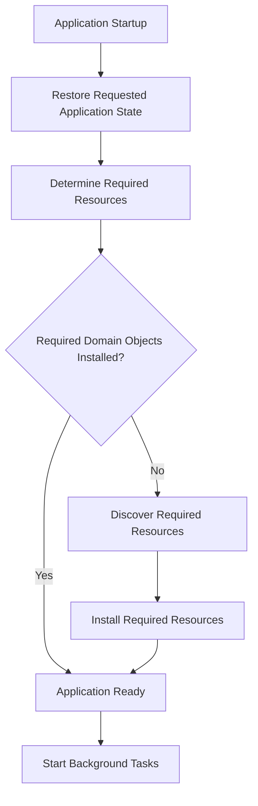
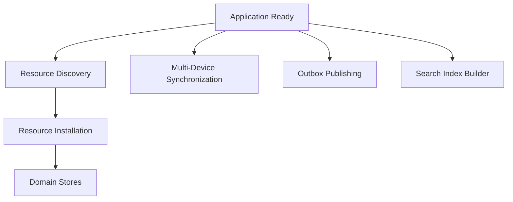
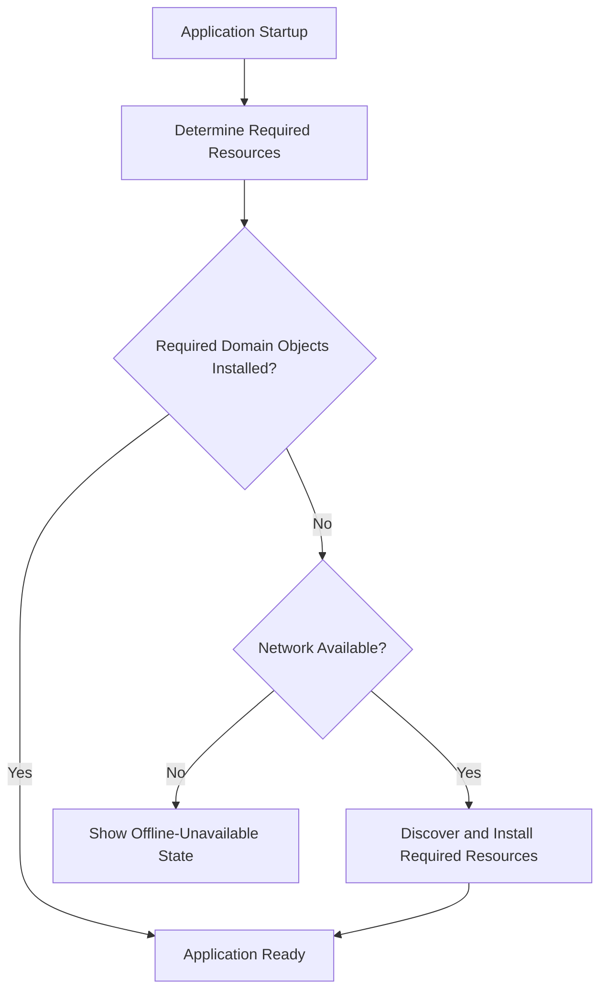
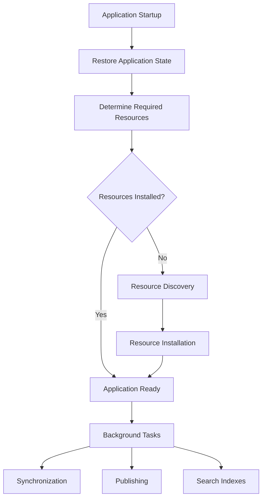

# ADR 0014 — Application Lifecycle

**Status**

Accepted

---

# Problem

KJVOnly is an offline-first application.

The application must become usable quickly while continuing to discover, synchronize, install, publish, and index Resources in the background.

Application startup should coordinate the architectural pipelines defined by earlier ADRs without redefining their responsibilities.

---

# Decision

The Application Lifecycle coordinates the initialization of the application.

It is responsible for orchestrating the existing architecture so that users can begin interacting with the application as quickly as possible.

The Application Lifecycle does not perform Resource Discovery, Resource Resolution, Resource Installation, publishing, synchronization, or indexing itself.

It coordinates those processes.

---

# Startup Sequence

The application restores the requested application state and determines the minimum Resources required for the current view.

If those Domain Objects are already installed, the application renders them immediately.

If they are not installed, the application discovers and installs only the required Resources before rendering.

Application readiness is based on the current view, not on completion of global bootstrap or synchronization.

For example, if the current reading context is John 3, the application may discover and install only the John 3 chapter Resource before rendering.

Larger Bible bundles, search indexes, overlays, and other optional Resources continue installing in the background.

---

# Background Tasks

Once the application is ready, background work begins.

Each background task is independent.

Failure of one task does not prevent the others from continuing.

---

# Resource Discovery

Resource Discovery begins using the configured Discovery Roots.

New or updated Resources are processed through the normal installation pipeline.

The Application Lifecycle coordinates when discovery occurs.

Resource Discovery remains responsible for determining what Resources are available.

---

# Resource Installation

Discovered Resources are installed using the existing Resource Installation Lifecycle.

The Application Lifecycle does not install Resources directly.

It schedules installation work and monitors progress.

---

# Multi-Device Synchronization

The Application Lifecycle periodically synchronizes installed Resources with remote publications.

Incoming publications are processed through the normal installation pipeline.

Outgoing publications continue through the Outbox.

Synchronization remains independent of startup.

---

# Outbox Publishing

Pending Outbox entries resume automatically during startup.

Publishing continues in the background until the Outbox is empty or connectivity is unavailable.

The application never blocks startup while waiting for publication.

---

# Search Indexes

Generated search indexes may be rebuilt during startup if required.

Published search indexes become available after installation.

Search indexing is performed in the background and does not block application readiness.

---

# Startup Recovery

Interrupted work resumes automatically after application restart.

Examples include:

- pending Resource installations,
- pending Outbox publications,
- search index generation,
- and synchronization.

The Application Lifecycle resumes existing work rather than restarting from the beginning.

---

# Offline Startup

If the required Domain Objects are already installed, the application starts normally while offline.

If required content is not installed and the network is unavailable, the application displays an offline-unavailable state for that content while preserving access to all other installed data.

---

# Optional Resources

The application may start before every optional Resource has been installed.

Examples include:

- search indexes,
- commentaries,
- overlays,
- dictionaries,
- and other optional content.

Optional Resources become available as installation completes.

The application should continue functioning without them whenever possible.

---

# Application State

The Application Lifecycle restores application state before user interaction.

Examples include:

- current reading position,
- open notes,
- user settings,
- window state,
- and other application preferences.

Application state restoration is independent of Resource Discovery and synchronization.

---

# Browser Environment

The application is designed for a browser environment.

The architecture assumes:

- offline operation,
- local persistence,
- background workers,
- and asynchronous network communication.

The application does not require server-side rendering.

---

# Relationship to Other ADRs

This ADR coordinates the architecture defined by:

- **ADR 0005** — Resource Discovery
- **ADR 0007** — Domain Storage Model
- **ADR 0008** — Resource Installation Lifecycle
- **ADR 0009** — Discovery Roots
- **ADR 0010** — Outbox and Publishing
- **ADR 0011** — Multi-Device Synchronization
- **ADR 0012** — Resource Archives
- **ADR 0013** — Search Indexes

It intentionally does not redefine those responsibilities.

---

# Scope

This ADR defines:

- application startup,
- background orchestration,
- startup recovery,
- offline startup,
- optional Resources,
- and application readiness.

This ADR does not define:

- Resource Discovery,
- Resource Installation,
- publishing,
- synchronization,
- search indexing,
- or local persistence.

Those responsibilities remain defined by their respective ADRs.

---

# Big Takeaway

The Application Lifecycle coordinates the existing architectural pipelines to make the application usable as quickly as possible.

The application restores the requested state and ensures the minimum Resources required for the current view are installed before rendering.

If those Resources are already installed, rendering occurs immediately.

If they are not installed, the application discovers and installs only the required Resources before rendering.

All other work—including Resource Discovery, Resource Installation, Multi-Device Synchronization, Outbox Publishing, and Search Index generation—continues independently in the background.

---