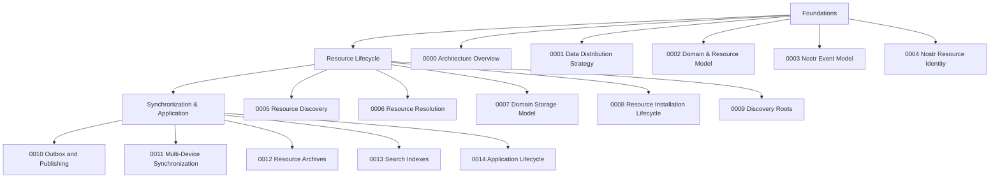

# Architecture Decision Record (ADR) Index

This directory contains the Architecture Decision Records (ADRs) that define the KJVOnly architecture.

The ADRs are intended to be read in order. Each ADR introduces concepts used by subsequent ADRs, forming a complete architecture specification.

---
# Architecture Organization

---
# Reading Order

The architecture is organized into three logical areas.

## Foundations

These ADRs establish the core architectural concepts and terminology used throughout the application.

| ADR | Title | Purpose |
|-----|-------|---------|
| 0000 | Architecture Overview | Introduces the architecture and explains how the ADRs fit together. |
| 0001 | Data Distribution Strategy | Defines Resources as the unit of distribution and the overall distribution strategy. |
| 0002 | Domain & Resource Model | Defines Domains, Resources, Representations, Domain Objects, and Domain Stores. |
| 0003 | Nostr Event Model | Defines the boundary between the application and the Nostr protocol. |
| 0004 | Nostr Resource Identity | Adopts Nostr addressable-event identity and replacement semantics. |

---

## Resource Lifecycle

These ADRs define how Resources move through the application.

| ADR | Title | Purpose |
|-----|-------|---------|
| 0005 | Resource Discovery | Defines how published Resources are discovered. |
| 0006 | Resource Resolution | Defines how Resource Representations become serialized Resource content. |
| 0007 | Domain Storage Model | Defines persistence through Domain Stores. |
| 0008 | Resource Installation Lifecycle | Defines how Resources become installed Domain Objects. |
| 0009 | Discovery Roots | Defines where Resource Discovery begins. |

---

## Synchronization & Application

These ADRs define how local and remote state evolve over time.

| ADR | Title | Purpose |
|-----|-------|---------|
| 0010 | Outbox and Publishing | Defines asynchronous publication of local changes. |
| 0011 | Multi-Device Synchronization | Defines synchronization between devices. |
| 0012 | Resource Archives | Defines import, export, sharing, and backup. |
| 0013 | Search Indexes | Defines published and generated search indexes. |
| 0014 | Application Lifecycle | Defines application startup and background processing. |

---

# Architecture at a Glance

The architecture follows two primary pipelines.

## Incoming

## Outgoing

Together these pipelines support installation, publishing, synchronization, import/export, and application startup.

---

# Glossary

Architectural terminology is defined in **glossary.md**.

---

# Contributing

When adding or modifying ADRs:

- Keep each ADR focused on a single architectural responsibility.
- Avoid implementation details.
- Reference existing ADRs rather than repeating concepts.
- Update this index when adding, removing, or renaming ADRs.