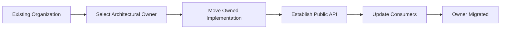
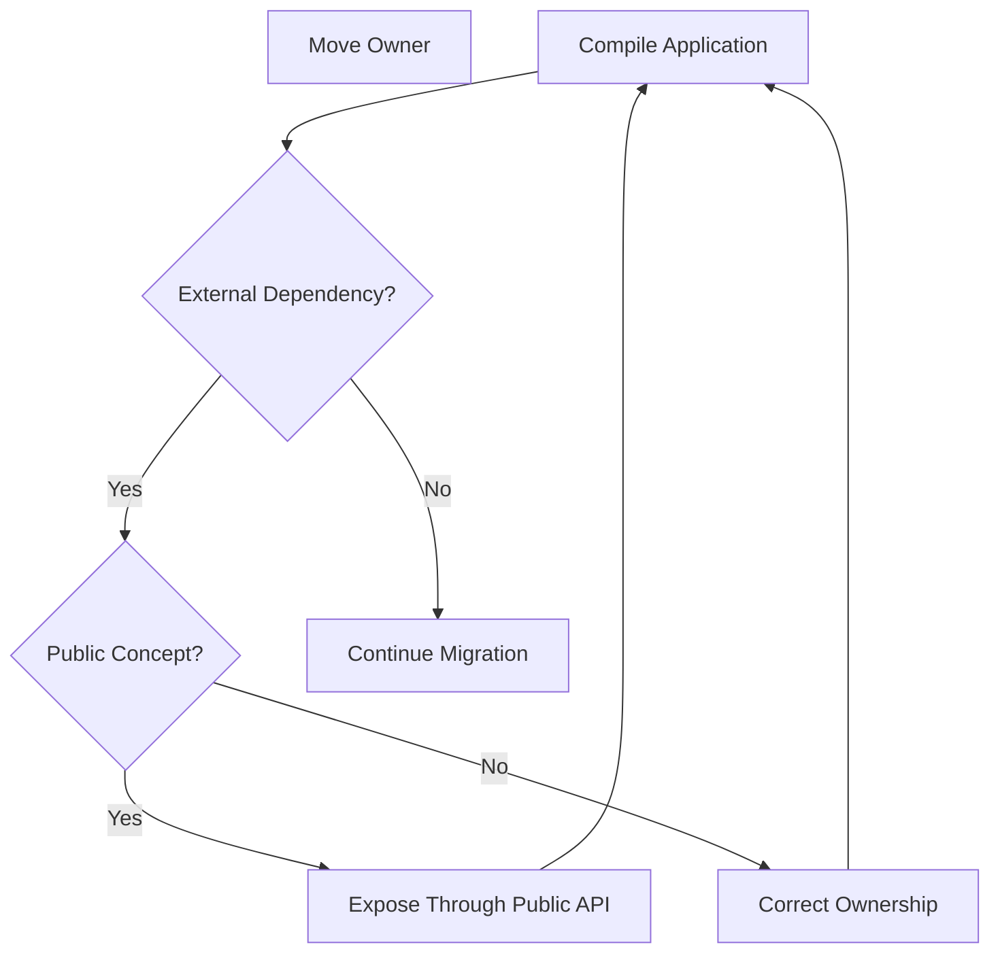
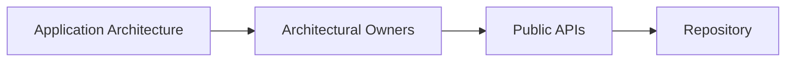

# Architecture Migration

## Status

Planned

---

# Purpose

This document defines the strategy for migrating the existing application source code toward the ownership model defined by the Application Architecture.

The migration is primarily organizational.

The existing application already contains many of the responsibilities described by the target architecture, but those responsibilities are distributed across several organizational patterns.

The goal is to make architectural ownership explicit without unnecessarily redesigning working application behavior.

---

# Goals

The migration should:

* organize code by architectural owner,
* establish explicit Public APIs,
* preserve existing application behavior,
* reduce cross-owner implementation dependencies,
* move implementation details behind their owning boundaries,
* and make the repository reflect the documented architecture.

The migration is not intended to rewrite the application.

---

# Migration Philosophy

Migration should occur one architectural owner at a time.

Conceptually:



Each migration should leave the application in a working state.

The unit of migration is an architectural responsibility rather than a technical file type.

Move responsibilities.

Do not simply move files.

---

# Preserve Behavior

Structural migration should avoid changing application behavior whenever practical.

The migration should not become an opportunity to simultaneously:

* redesign Domain behavior,
* replace working technologies,
* introduce unrelated abstractions,
* rewrite algorithms,
* or change user-facing behavior.

Those changes may be valuable, but they should generally occur separately from architectural migration.

Separating structural migration from behavioral change keeps failures easier to diagnose and changes easier to review.

---

# Owner-First Migration

Each migration begins by selecting one architectural owner.

Examples include:

* Bible Domain,
* Notes Domain,
* Reading Plans Domain,
* Workspace Runtime,
* User Interface,
* Resource Integration,
* Background Processing,
* and Technical Infrastructure.

All code clearly owned by that subsystem should be migrated together when practical.

For example, migrating the Bible Domain may include:

* Bible Domain Objects,
* Bible Services,
* Bible Stores,
* Bible Modules,
* annotations,
* Bible search,
* Bible identifiers,
* Domain Object Factories,
* Resource Serializers,
* and other Bible-owned behavior.

The internal organization may be refined during migration, but ownership should remain the primary concern.

---

# Dependency Discovery

The existing codebase provides useful information about the Public API required by each architectural owner.

Rather than attempting to design every Public API completely before migration, dependencies should be discovered while moving the implementation.

Conceptually:



Compiler failures provide an inventory of consumers that depended upon the previous location.

Each dependency should then be evaluated architecturally.

Ask:

> **Is this concept legitimately part of the owner's Public API?**

If yes, expose it deliberately.

If no, resolve the dependency according to the correct ownership boundary.

The compiler identifies dependencies.

Architecture determines which dependencies are valid.

---

# Public API Migration

During migration, every architectural owner should establish a deliberate Public API.

The Public API represents everything other architectural owners are permitted to depend upon.

Conceptually:

```text
Architectural Owner

    Public API

    ----------------

    Internal Implementation
```

Internal code may depend directly upon other implementation within the same owner.

Cross-owner dependencies should use the Public API.

For example:

```text
Notes Domain
    ↓
Bible Public API
    ↓
Bible Domain
```

Notes should not depend directly upon Bible Stores, parsers, Module internals, or other private implementation.

Public APIs should emerge from legitimate application dependencies rather than from exporting everything for convenience.

---

# Migration Loop

Every architectural owner should follow approximately the same migration process.

```text
Select owner

↓

Identify owned responsibilities

↓

Move implementation

↓

Compile

↓

Evaluate broken external dependencies

↓

Expose legitimate Public API concepts

or

correct invalid ownership dependencies

↓

Update consumers

↓

Compile and validate

↓

Remove obsolete paths

↓

Commit
```

The process repeats until the owner has a clear boundary and external consumers depend only upon its Public API.

---

# Migration Order

The migration should begin with Domains because the existing application already organizes much of its behavior around Modules and Domain-like responsibilities.

The planned order is:

```text
1. Bible Domain

2. Notes Domain

3. Reading Plans Domain

4. Workspace Runtime

5. User Interface

6. Resource Integration

7. Background Processing

8. Technical Infrastructure

9. Repository Cleanup

10. Boundary Enforcement
```

This order is a guide rather than a strict dependency graph.

If migration exposes a clearer sequence, the roadmap may be adjusted while preserving the owner-first strategy.

---

# Phase 1 — Bible Domain

The Bible Domain should be migrated first.

It provides a useful validation of the target architecture because it contains several different types of responsibilities and is consumed by other Domains.

The migration should identify and relocate Bible-owned concepts such as:

* Bible chapters,
* Bible verses,
* Bible Location References,
* annotations,
* Strong's data,
* Bible search,
* Bible Services,
* Bible Stores,
* Bible Modules,
* Resource Factories,
* Resource Serializers,
* and Bible-related events.

A Bible Public API should emerge from the dependencies required by the rest of the application.

Likely consumers include Notes, Reading Plans, search capabilities, and presentation components.

The exact Public API should be determined during migration rather than assumed beforehand.

---

# Phase 2 — Notes Domain

After the Bible boundary is established, the Notes Domain should be migrated.

This phase provides the first direct validation of cross-Domain Public API usage.

Notes may depend upon public Bible concepts while keeping Notes behavior independently owned.

Notes-owned responsibilities may include:

* Note Domain Objects,
* Notes Services,
* Notes Stores,
* Notes search,
* Notes Modules,
* Notes events,
* Resource Factories,
* and Resource Serializers.

Cross-Domain dependencies should enter through the Bible Public API rather than through Bible implementation paths.

---

# Phase 3 — Reading Plans Domain

The Reading Plans Domain should follow the same migration model.

Reading Plans may consume public Bible concepts while retaining ownership of:

* Reading Plans,
* plan progression,
* completed readings,
* Reading Plan Modules,
* Reading Plan Services,
* Reading Plan Stores,
* and related Resource integration.

This phase further validates that Domain collaboration can occur through explicit Public APIs without requiring a shared implementation layer.

---

# Phase 4 — Workspace Runtime

Once the major Domains have explicit boundaries, Workspace Runtime responsibilities should be consolidated.

Runtime-owned behavior includes concepts such as:

* Workspace composition,
* Pane trees,
* Buffers,
* layout operations,
* Runtime Objects,
* and Runtime operations exposed to Module Presentation.

Runtime capabilities currently exposed through services such as Pane Service should remain owned by the Workspace Runtime.

Consumers should interact with those capabilities through the Runtime Public API.

---

# Phase 5 — User Interface

Shared User Interface responsibilities should then be organized under their architectural owner.

These may include:

* theme behavior,
* shared presentation conventions,
* Module presentation infrastructure,
* context-preserving presentation behavior,
* and other UI-wide capabilities.

Domain-specific presentation should remain with its owning Domain.

The User Interface owner should contain only responsibilities that genuinely span presentation throughout the application.

---

# Phase 6 — Resource Integration

Resource Integration should consolidate the application-facing implementation of the Resource Architecture.

Responsibilities may include:

* Resource Resolution coordination,
* Resource installation,
* publication,
* discovery integration,
* installation state,
* and outbox coordination.

Domain-specific Resource Factories and Serializers remain with their Domains.

Resource Integration coordinates the Resource lifecycle without taking ownership of Domain meaning.

---

# Phase 7 — Background Processing

Background Processing should consolidate deferred application maintenance.

Responsibilities may include:

* Resource installation processing,
* installation verification,
* Resource refresh,
* derived data maintenance,
* retry handling,
* and application maintenance coordination.

Background Processing may consume other owners' Public APIs.

It should not absorb the behavior owned by those subsystems.

---

# Phase 8 — Technical Infrastructure

Technical Infrastructure should contain technology-specific implementations that support the application's architectural capabilities.

Examples include:

* IndexedDB,
* Nostr networking,
* HTTP,
* Web Workers,
* serialization,
* compression,
* browser integration,
* and other platform-specific implementations.

Infrastructure migration should occur after higher-level ownership boundaries are clear.

This makes it easier to distinguish technical capability from application behavior.

---

# Repository Cleanup

After architectural owners have been migrated, obsolete organizational structures should be removed.

Examples may include global directories organized primarily by technical role when their contents have acquired clearer owners.

Cleanup should include:

* removing obsolete import paths,
* removing empty directories,
* consolidating duplicate abstractions,
* and updating documentation to reflect the final structure.

Cleanup should occur after ownership migration rather than driving the migration itself.

---

# Boundary Enforcement

Architectural boundaries may initially be maintained through convention.

Once migration is sufficiently complete, implementation tooling may be introduced to make violations easier to detect.

Possible enforcement mechanisms include:

* lint rules,
* restricted import paths,
* module boundaries,
* package exports,
* or other language and tooling capabilities.

The specific mechanism is an implementation decision.

The architectural rule is:

> **Cross-owner dependencies use Public APIs.**

Enforcement should support that rule rather than define it.

---

# Validation

Each migration phase should validate that:

* the application still builds,
* existing behavior remains intact,
* the architectural owner is clear,
* external consumers use the Public API,
* internal implementation remains internal,
* and obsolete paths have been removed.

Where automated tests exist, they should continue passing.

Manual validation may also be required for presentation behavior and other interaction-heavy capabilities.

A migration phase is complete when the architectural boundary is clearer without changing the intended application behavior.

---

# Non-Goals

The migration should not attempt to:

* redesign the application,
* replace working technologies,
* create identical structures for every Domain,
* introduce dependency injection solely for architectural consistency,
* create unused abstraction layers,
* enforce empty architectural directories,
* or solve unrelated technical debt.

The architecture should guide implementation.

It should not force unnecessary implementation complexity.

---

# Completion

Migration is complete when the repository reflects the ownership model described by the Application Architecture.

Conceptually:



At completion:

* architectural owners are visible in the repository,
* Domains own their behavior,
* cross-owner dependencies use Public APIs,
* technical implementation remains behind those boundaries,
* and repository organization reflects application meaning rather than historical implementation patterns.

---

# Big Takeaway

The migration is not a rewrite.

It is the process of making existing architectural ownership explicit.

Move one owner at a time.

Let real dependencies reveal the required Public API.

Use the compiler to find dependencies.

Use the architecture to decide whether those dependencies are valid.

Preserve behavior.

Finish one boundary before moving to the next.
