# Settings Module Implementation

**Status:** Current  
**Area:** `client/kjvonly-pwa`  
**Primary implementation:** `client/kjvonly-pwa/src/lib/application/modules/settings/`  
**Application settings service:** `client/kjvonly-pwa/src/lib/application/services/settings.service.ts`  
**Settings model:** `client/kjvonly-pwa/src/lib/application/models/settings.model.ts`

---

## Purpose

The Settings module is the application UI for viewing and editing application settings.

It is intentionally split into two layers:

1. **application-global settings state and persistence**, owned by `SettingsService`;
2. **module-local UI state and navigation**, owned by each mounted `SettingsContainer`.

This distinction is the central architectural rule of the Settings implementation.

A user can open more than one Settings module at the same time. Each instance has an independent navigation stack, independent search UI state, independent scroll state, and its own Svelte contexts. At the same time, all instances edit the same application Settings through the application-owned `SettingsService`.

Conceptually:

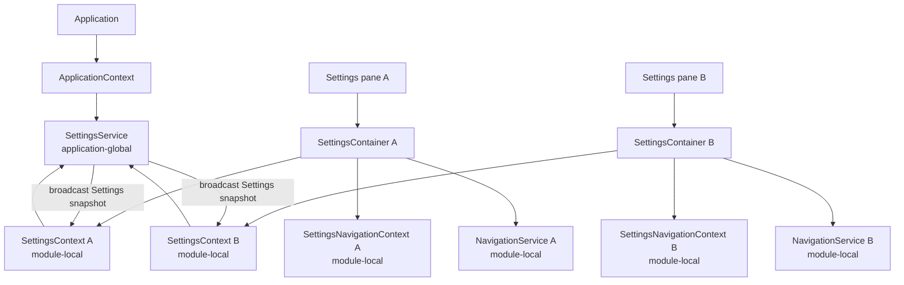

The module is definition-driven. Most of the Settings UI is not implemented as one Svelte component per setting. Instead, a declarative `SettingsDefinition` describes pages, sections, rows, setting keys, select options, icons, search metadata, and specialized custom views.

The generic renderer then turns that definition into UI.

---

# 1. Architectural Goals

The current implementation is built around the following goals.

## 1.1 One Settings information model

The Settings hierarchy should be declared once.

The same definition is used by:

- page rendering;
- row rendering;
- search indexing;
- navigation;
- destination resolution;
- tests and validation.

The application should not maintain one list of Settings for rendering and another unrelated list for search or navigation.

The intended direction is:

```text
Settings Definition
        ↓
Pages
        ↓
Sections
        ↓
Rows
        ↓
generic rendering / navigation / search
```

---

## 1.2 Application-global values, module-local UI

The Settings values themselves are application-global.

Examples:

```text
fontSize
fontWeight
fontFamily
colorTheme
isDarkTheme
showParagraphs
showPericopes
showBibleVersion
enableMaxWidth
```

However, the UI state of a Settings module is local to that module instance.

Examples of module-local state include:

```text
navigation stack
current Settings sub-page
root search query
search-result list
scroll position
focused row pulse
temporary custom-view state
```

This means two Settings panes may be on different pages while still showing synchronized setting values.

---

## 1.3 Stable semantic IDs

The definition uses stable IDs for pages, sections, rows, icons, custom views, and formatters.

Stable IDs are used instead of Svelte component constructors in the definition.

For example:

```text
page id       appearance
row id        font-size
icon id       font-size
custom view   font-size
formatter     font-size
```

Concrete Svelte components are selected by resolvers.

This keeps definition data serializable, inspectable, searchable, and testable.

---

## 1.4 Persistent navigation

Settings uses the shared `NavigationContainer`.

Previous views remain mounted when another Settings page is pushed.

They are hidden rather than destroyed.

This is intentional.

It preserves:

- search input contents;
- browser input state;
- component-local state;
- scroll position;
- DOM identity;
- temporary UI state.

Back navigation therefore reveals an existing prior view instead of creating a new copy of it.

---

## 1.5 Persistence belongs to `SettingsService`

Svelte components do not directly write Settings to `localStorage`.

The application-owned `SettingsService` is responsible for:

- reading persisted Settings;
- normalization;
- writing Settings;
- applying global visual settings;
- notifying subscribers;
- merging single-setting changes against the latest persisted snapshot.

This prevents Settings UI components from becoming independent persistence owners.

---

# 2. Important Identities

There are several IDs in this area that serve different purposes.

They must not be conflated.

## 2.1 Workspace `paneID`

`paneID` identifies the Workspace pane containing the Settings module.

It belongs to the application Workspace/runtime.

A Settings module receives it from the generic module renderer.

Conceptually:

```svelte
<Component bind:pane {paneID}></Component>
```

`SettingsContainer` accepts the `pane` binding because the generic module renderer still supplies it, but Settings behavior should prefer the stable `paneID`.

The Settings close behavior uses `paneID` when the Settings module is operating as a normal Workspace module.

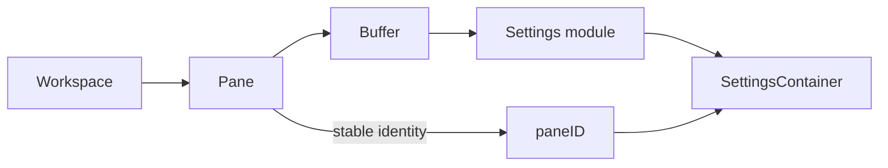

---

## 2.2 Settings `rootPageID`

`rootPageID` is not a Workspace pane ID.

It belongs to the Settings definition.

Current value:

```text
settings
```

The Settings definition currently exposes:

```ts
export const SETTINGS_PAGE_IDS = {
    ROOT: 'settings',
    APPEARANCE: 'appearance',
    BIBLE: 'bible'
};
```

and:

```ts
settingsDefinition.rootPageID === 'settings'
```

This tells the Settings renderer and search/navigation layer which declarative page is the root Settings screen.

---

## 2.3 Root navigation view

The Settings root screen is also the first view pushed into the per-instance `NavigationService`.

That view is represented by the `Settings` Svelte component and carries an object containing the close callback.

Conceptually:

```ts
navService.push({
    component: Settings,
    obj: {
        onClose: closeSettings
    }
});
```

Therefore three different concepts exist:

```text
Workspace pane identity
    paneID

Settings information architecture root
    rootPageID = "settings"

Settings navigation stack root
    Settings component NavigationView
```

They are related, but they are not interchangeable.

---

# 3. High-Level Runtime Architecture

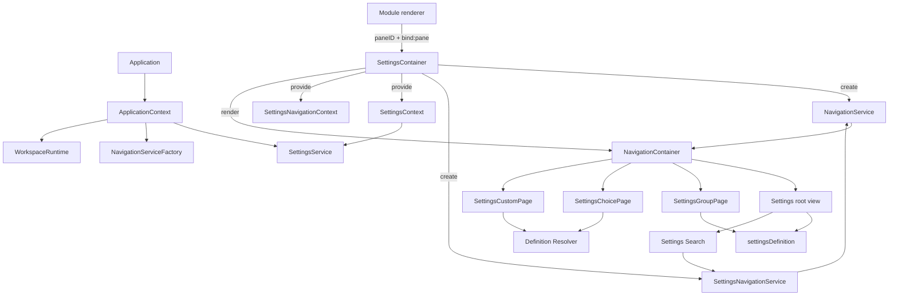

---

# 4. File Organization

The Settings module is organized approximately as follows:

```text
client/kjvonly-pwa/src/lib/application/modules/settings/
├── components/
│   ├── settingsIcon.svelte
│   ├── settingsPage.svelte
│   ├── settingsRow.svelte
│   ├── settingsScreen.svelte
│   ├── settingsSearch.svelte
│   └── settingsSection.svelte
│
├── definitions/
│   └── settings.definition.ts
│
├── models/
│   ├── settings-definition.model.ts
│   └── settings-navigation.model.ts
│
├── resolvers/
│   ├── settings-custom-view-component-resolver.ts
│   ├── settings-definition-resolver.ts
│   ├── settings-icon-component-resolver.ts
│   └── settings-value-formatter.ts
│
├── runtime/
│   ├── settings-context.ts
│   └── settings-navigation-context.ts
│
├── search/
│   ├── settings-search.model.ts
│   ├── settings-search.spec.ts
│   └── settings-search.ts
│
├── services/
│   ├── settings-navigation.service.spec.ts
│   └── settings-navigation.service.ts
│
├── fontSize.svelte
├── settings.svelte
├── settingsChoicePage.svelte
├── settingsContainer.svelte
├── settingsCustomPage.svelte
└── settingsGroupPage.svelte
```

Related application-wide files include:

```text
client/kjvonly-pwa/src/lib/application/models/settings.model.ts
client/kjvonly-pwa/src/lib/application/services/settings.service.ts
client/kjvonly-pwa/src/lib/application/services/navigation.service.ts
client/kjvonly-pwa/src/lib/application/runtime/navigation/components/navigationContainer.svelte
client/kjvonly-pwa/src/lib/application/runtime/application-context.ts
```

---

# 5. The Application `Settings` Model

The application Settings data model is the actual persisted user preference state.

Current conceptual shape:

```ts
interface Settings {
    fontSize: number;
    fontWeight: number;
    fontFamily: string;
    colorTheme: string;
    isDarkTheme: boolean;
    showParagraphs: boolean;
    showPericopes: boolean;
    showBibleVersion: boolean;
    enableMaxWidth: boolean;
}
```

Current defaults include:

```text
fontSize         16
fontWeight       400
fontFamily       sans
colorTheme       red
isDarkTheme      false
showParagraphs   false
showPericopes    false
showBibleVersion false
enableMaxWidth   true
```

`Settings` is intentionally separate from `SettingsDefinition`.

The difference is:

```text
Settings
    actual user values

SettingsDefinition
    metadata describing how those values are presented and edited
```

---

# 6. Settings Normalization

Persisted browser state is treated as untrusted or legacy input.

`normalizeSettings()` converts persisted data into a complete current `Settings` value.

Examples of normalization behavior include:

```text
numeric fontSize
    accepted

numeric-string fontSize
    converted to a number

legacy nonnumeric font-size class
    falls back to default

missing boolean
    falls back to default

wrong-typed boolean
    falls back to default

missing property
    falls back independently
```

The important design rule is that one invalid property does not invalidate all Settings.

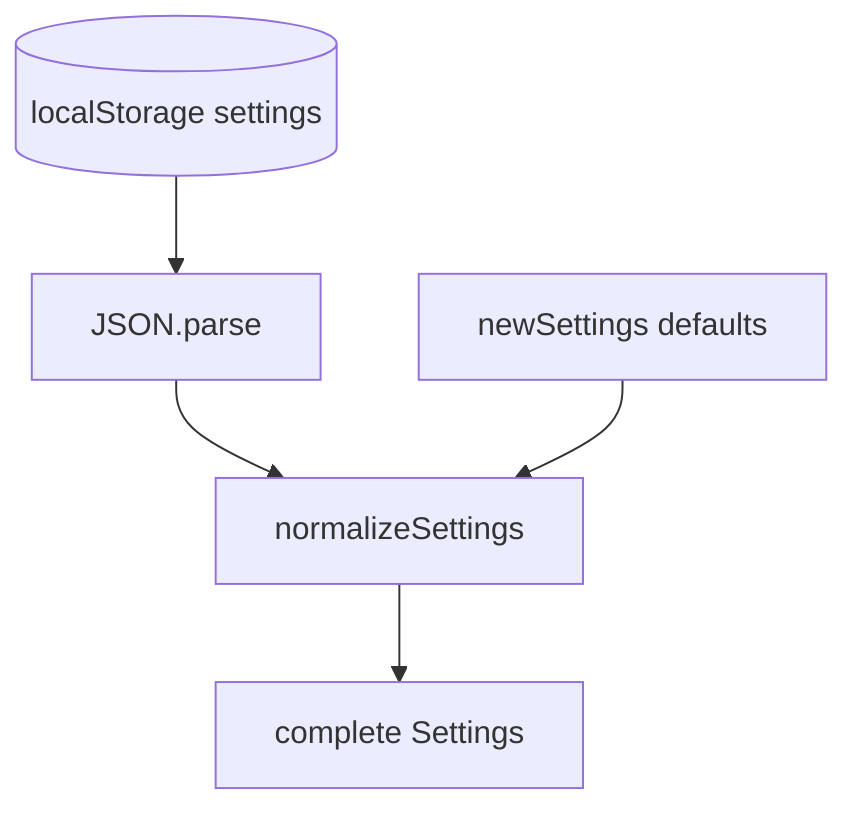

---

# 7. `SettingsService`

`SettingsService` is application-owned and exposed through `ApplicationContext`.

Its responsibilities are broader than the Settings UI itself.

It owns:

```text
getSettings()
updateSetting()
updateSettings()
applySettings()
subscribe()
unsubscribe()
```

## 7.1 Persistence

Settings are currently persisted under:

```text
localStorage["settings"]
```

The UI does not own this key.

`SettingsService` does.

---

## 7.2 `updateSetting()`

The Settings module uses the single-setting API for user edits.

Conceptually:

```ts
updateSetting<K extends keyof Settings>(
    setting: K,
    value: Settings[K]
): void
```

The method merges against the latest persisted Settings:

```ts
this.updateSettings({
    ...this.getSettings(),
    [setting]: value
});
```

This is important for multi-instance Settings.

A module-local reactive copy can be slightly older than the latest persisted value.

If the module reconstructed the complete object from its own copy, it could accidentally overwrite an unrelated newer setting.

Using the current service state as the merge base avoids that problem.

---

## 7.3 `updateSettings()`

The complete update path is:

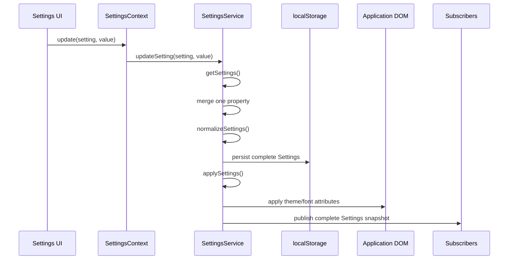

---

## 7.4 Global DOM application

Visual Settings are applied to the application document.

Examples include:

### Color theme

Light:

```text
data-theme="color-theme-<colorTheme>"
```

Dark:

```text
data-theme="color-theme-dark-<colorTheme>"
```

### Font family

```text
font-family="<fontFamily>"
```

### Font size / weight

Conceptually:

```text
font-size: <fontSize>px
font-weight: <fontWeight>
```

The actual palette implementation remains in `app.css`.

Settings stores semantic identity, not concrete palette values.

---

## 7.5 Subscribers

Consumers subscribe using an explicit subscriber ID.

Conceptually:

```ts
settingsService.subscribe(
    subscriberID,
    onSettingsChange
);
```

and:

```ts
settingsService.unsubscribe(
    subscriberID
);
```

Subscribers receive the complete Settings snapshot.

The Settings module itself is one such subscriber.

---

# 8. `SettingsContainer`: Module Composition Root

`settingsContainer.svelte` is the composition root for one mounted Settings module instance.

It performs several responsibilities that should not be pushed into generic row components.

It:

1. receives the Workspace `paneID`;
2. gets application services from `ApplicationContext`;
3. creates a module-local generic `NavigationService`;
4. creates a module-local `SettingsNavigationService`;
5. creates a module-local reactive Settings snapshot;
6. provides `SettingsContext`;
7. provides `SettingsNavigationContext`;
8. subscribes to application Settings changes;
9. pushes the root Settings view;
10. unsubscribes when destroyed;
11. selects the correct close behavior.

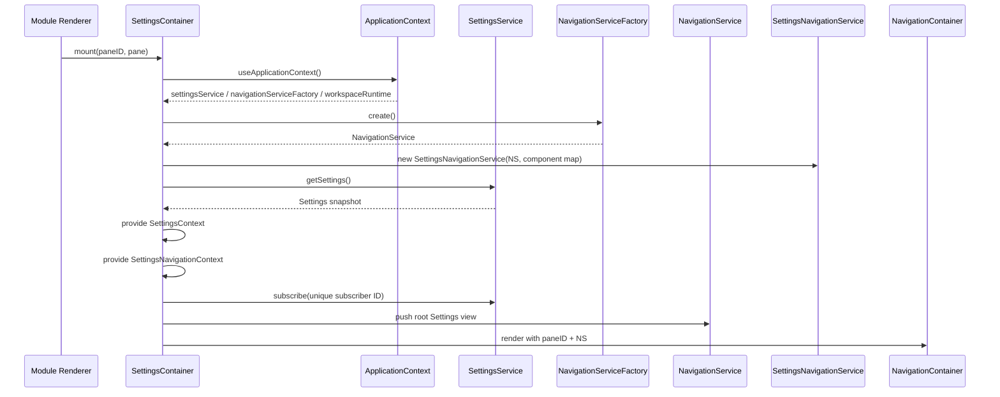

---

# 9. Why `SettingsContainer` Still Accepts `pane`

The Workspace renderer currently renders module components using a generic contract that includes:

```svelte
<Component bind:pane {paneID}></Component>
```

Therefore `SettingsContainer` still needs to tolerate the bindable `pane` prop.

However, Settings does not rely on the Pane object as its identity.

The stable runtime identity is:

```text
paneID
```

This follows the broader application direction of preferring stable Pane identity over cached mutable Pane references.

---

# 10. Closing Settings

Settings can be opened in two contexts.

## 10.1 Normal Workspace module

When Settings is the actual module occupying a Pane:

```text
Close Settings
    ↓
WorkspaceRuntime.closePane(paneID)
```

## 10.2 Bible popup

The Bible reader can open `SettingsContainer` inside a popup.

In that case the caller passes:

```ts
onClose={() => {
    showSettingsPopup = false;
}}
```

The Settings module should close the popup, not the Workspace Pane.

The decision is centralized in `SettingsContainer`.

```mermaid
flowchart TD
    X[Close Settings] --> Q{caller supplied onClose?}

    Q -->|yes| CB[Invoke caller onClose<br/>e.g. close Bible popup]
    Q -->|no| WP[workspaceRuntime.closePane(paneID)]
```

The root `Settings` view does not need to know which hosting mode it is in.

It only receives the resolved close callback through its root navigation object.

---

# 11. Module-Local `SettingsContext`

`SettingsContext` carries one Settings module's reactive projection of the application Settings.

Conceptually:

```ts
interface SettingsContext {
    settings: Settings;

    update<K extends keyof Settings>(
        setting: K,
        value: Settings[K]
    ): void;
}
```

The context is provided by `SettingsContainer`.

Any descendant can retrieve it with:

```ts
useSettingsContext()
```

---

## 11.1 Why context is used

Without context, every page and row would need Settings state passed through multiple layers:

```text
SettingsContainer
    ↓ props
Settings root/group/choice/custom
    ↓ props
SettingsPage
    ↓ props
SettingsSection
    ↓ props
SettingsRow
```

Instead:

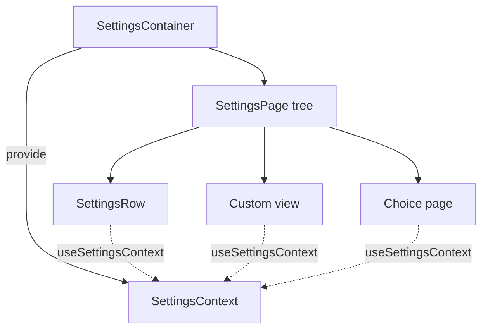

This keeps the generic rendering API focused on declarative definitions rather than state plumbing.

---

## 11.2 User-originated update versus subscriber synchronization

This distinction is critical.

### User-originated change

```text
row / choice / custom view
    ↓
settingsContext.update(...)
    ↓
SettingsService.updateSetting(...)
    ↓
persist + apply + broadcast
```

### Service-originated synchronization

When a SettingsService subscriber fires:

```ts
Object.assign(
    settingsContext.settings,
    updatedSettings
);
```

It must **not** call `settingsContext.update()` again.

Otherwise:

```text
service publish
    ↓
module receives update
    ↓
module republishes
    ↓
service publishes
    ↓
loop
```

The implementation intentionally updates the local reactive object directly when handling a subscriber callback.

---

# 12. Multi-Instance Settings Synchronization

Every mounted `SettingsContainer`:

- has its own `SettingsContext`;
- subscribes to the same application `SettingsService`;
- gets a unique subscriber ID.

A change in one Settings module therefore propagates to all other mounted Settings modules.

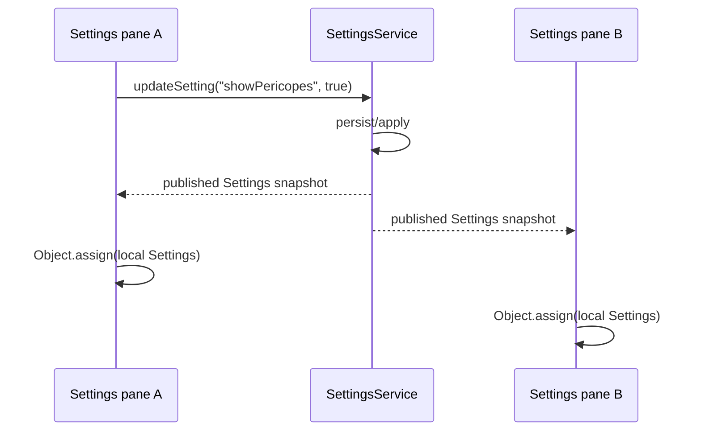

The module navigation stacks remain independent.

For example:

```text
Settings pane A
    Bible page

Settings pane B
    Appearance → Color theme page
```

Changing a global Settings value in A updates B's Settings values without changing B's current navigation view.

---

# 13. Settings Definition Model

The Settings definition is the information architecture for the module.

The central shape is:

```ts
interface SettingsDefinition {
    rootPageID: SettingsPageID;
    pages: readonly SettingsPageDefinition[];
}
```

A page contains sections:

```ts
interface SettingsPageDefinition {
    id: SettingsPageID;
    title: string;
    description?: string;
    sections: readonly SettingsSectionDefinition[];
}
```

A section contains rows:

```ts
interface SettingsSectionDefinition {
    id: SettingsSectionID;
    label?: string;
    description?: string;
    rows: readonly SettingsRowDefinition[];
}
```

---

# 14. Definition Structure

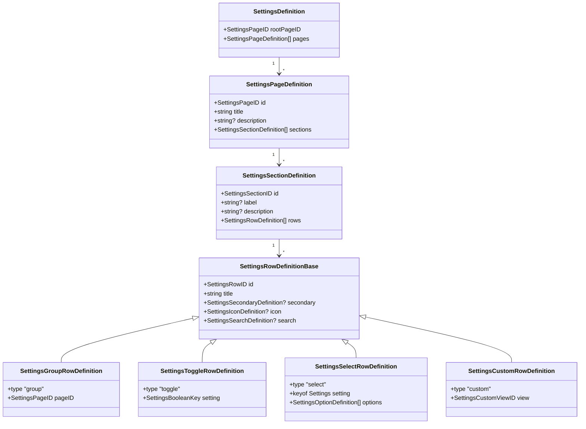

---

# 15. Stable IDs

The model defines semantic identifiers for:

```text
SettingsPageID
SettingsSectionID
SettingsRowID
SettingsIconID
SettingsAccentID
SettingsCustomViewID
SettingsValueFormatterID
```

Page and row IDs participate in navigation and search.

Row IDs are intended to be globally unique across the Settings definition because search destinations identify a row with:

```text
pageID + rowID
```

and the definition resolver can find rows globally by row ID.

---

# 16. Row Types

There are four row types.

## 16.1 `group`

A group row navigates to another Settings page.

Example:

```ts
{
    type: 'group',
    id: 'appearance',
    title: 'Appearance',
    pageID: 'appearance'
}
```

Behavior:

```text
tap row
    ↓
SettingsNavigationService.navigate(row)
    ↓
navigateToPage(row.pageID)
```

---

## 16.2 `toggle`

A toggle directly edits a boolean Settings field.

Example:

```ts
{
    type: 'toggle',
    id: 'show-pericopes',
    title: 'Pericopes',
    setting: 'showPericopes'
}
```

`SettingsBooleanKey` is derived from the Settings model.

Conceptually:

```ts
type SettingsBooleanKey = {
    [K in keyof Settings]:
        Settings[K] extends boolean
            ? K
            : never;
}[keyof Settings];
```

This prevents a toggle definition from targeting a non-boolean setting.

---

## 16.3 `select`

A select row navigates to the reusable `SettingsChoicePage`.

The definition associates:

```text
setting key
+
typed list of options
```

The type model preserves the relationship between the Settings key and the option value type.

For example:

```ts
{
    type: 'select',
    setting: 'fontWeight',
    options: [
        { id: '400', label: '400', value: 400 },
        { id: '500', label: '500', value: 500 }
    ]
}
```

A `fontWeight` option therefore contains a number, while an `isDarkTheme` option contains a boolean.

---

## 16.4 `custom`

A custom row is used when a setting needs specialized UI that does not fit the generic select/toggle behavior.

Current custom view:

```text
font-size
```

The definition stores:

```ts
view: 'font-size'
```

The resolver maps that semantic value to the actual `fontSize.svelte` component.

---

# 17. Current Settings Definition

The current information architecture has three pages:

```text
Settings
Appearance
Bible
```

---

## 17.1 Root Settings page

Current root page ID:

```text
settings
```

Current root rows:

```text
Appearance
Bible
```

### Appearance

Conceptually:

```ts
{
    type: 'group',
    id: 'appearance',
    title: 'Appearance',
    secondary: 'Theme, fonts, colors and text size',
    pageID: 'appearance'
}
```

### Bible

Conceptually:

```ts
{
    type: 'group',
    id: 'bible',
    title: 'Bible',
    secondary: 'Bible reader display options',
    pageID: 'bible'
}
```

---

## 17.2 Appearance page

The Appearance page contains three sections.

### Theme

Rows:

```text
Theme
Color theme
```

#### Theme

Backs:

```text
Settings.isDarkTheme
```

Options:

```text
Light → false
Dark  → true
```

#### Color theme

Backs:

```text
Settings.colorTheme
```

Current options:

```text
Night
Night Colorblind
Red
Light Blue
Purple
Cyan
Pink
```

Stable values:

```text
night
night-colorblind
red
light-blue
purple
cyan
pink
```

### Text

Rows:

```text
Font size
Font family
Font weight
```

#### Font size

Type:

```text
custom
```

View:

```text
font-size
```

Its secondary text is derived from:

```text
Settings.fontSize
```

using the semantic formatter:

```text
font-size
```

which presents the value as pixels.

#### Font family

Current options:

```text
Sans
Serif
Monospace
KJV 1611
Roboto Mono
JetBrains Mono
```

Stable values:

```text
sans
serif
mono
kjv
roboto-mono
jetbrains-mono
```

#### Font weight

Current options:

```text
100
200
300
400
500
600
700
800
900
```

### Layout

Rows:

```text
Maximum width
```

#### Maximum width

Type:

```text
toggle
```

Backs:

```text
Settings.enableMaxWidth
```

`enableMaxWidth` is an application presentation setting consumed by shared Buffer presentation. It is not Bible-specific.

---

## 17.3 Bible page

The Bible page currently has a Display section with three toggles:

```text
Paragraphs
Pericopes
Bible version
```

They map directly to:

```text
showParagraphs
showPericopes
showBibleVersion
```

---

# 18. Definition-Driven Rendering

The renderer follows the definition hierarchy.

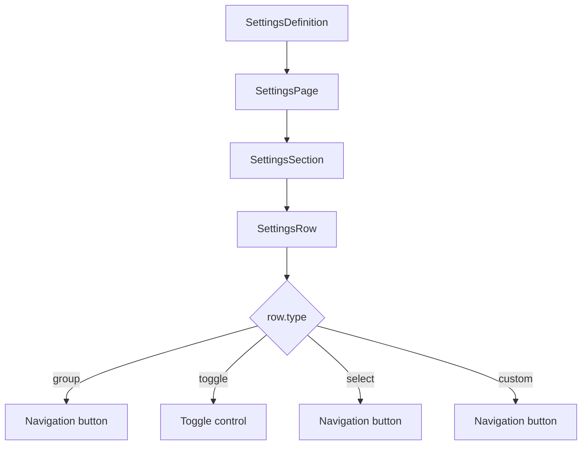

`SettingsPage`, `SettingsSection`, and `SettingsRow` are generic.

They should not accumulate knowledge of individual settings such as:

```text
if row is font family ...
if row is pericopes ...
if row is dark theme ...
```

That knowledge belongs in definition data or a semantic resolver.

---

# 19. `SettingsPage`

`SettingsPage` renders the ordered sections of one `SettingsPageDefinition`.

It also owns focused-row scrolling and the temporary pulse effect used by search navigation.

Inputs include:

```text
page
focusRowID?
```

When `focusRowID` changes to a valid row:

1. find the row inside the page's own DOM container;
2. scroll it into view;
3. center it where possible;
4. apply the temporary pulse/ring state;
5. avoid repeating the focus for the same ID.

The query is intentionally scoped to the current `SettingsPage` container.

It must not use a global `document.querySelector()` for row focus because hidden prior Settings pages remain mounted.

---

# 20. Search Focus Behavior

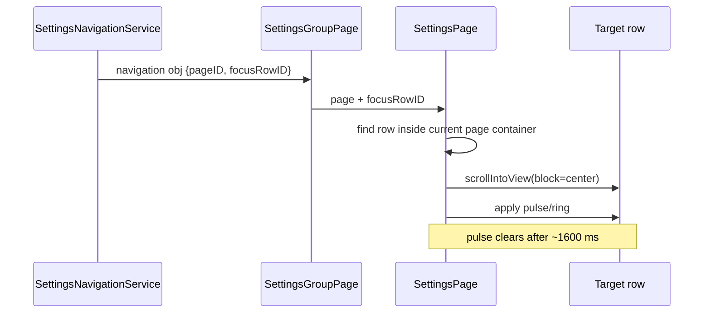

Reduced-motion preference is respected when selecting the scroll behavior.

---

# 21. `SettingsSection`

`SettingsSection` is structural.

It renders:

- optional section label;
- optional section description;
- all rows in order.

A section boundary is represented by the section itself.

The definition should not introduce fake "separator rows" merely to create grouping.

---

# 22. `SettingsRow`

`SettingsRow` renders the four generic row types.

It reads two contexts directly:

```text
SettingsContext
SettingsNavigationContext
```

This removes navigation callback prop drilling through:

```text
SettingsPage
→ SettingsSection
→ SettingsRow
```

---

## 22.1 Navigable rows

For:

```text
group
select
custom
```

the row calls:

```ts
settingsNavigation.navigate(row)
```

The row does not choose concrete destination components.

That responsibility belongs to `SettingsNavigationService`.

---

## 22.2 Toggle rows

Toggle changes call:

```ts
settingsContext.update(
    row.setting,
    input.checked
);
```

They do not directly mutate the Settings object as a persistence mechanism.

---

## 22.3 Secondary text

A row can have:

```text
static secondary text
dynamic secondary text
select-derived current option label
```

A dynamic secondary definition can name:

```text
setting
formatter?
```

For example, Font Size uses:

```text
setting = fontSize
formatter = font-size
```

The formatter resolver converts the current numeric value into presentation text.

---

# 23. Shared `SettingsScreen`

The Settings root, group page, choice page, and custom page use a shared shell component:

```text
SettingsScreen
```

It owns the common:

```text
BufferHeader
BufferBody
centered title
optional Back control
optional Close control
body classes/padding
```

This avoids duplicating the header/body frame on every Settings view.

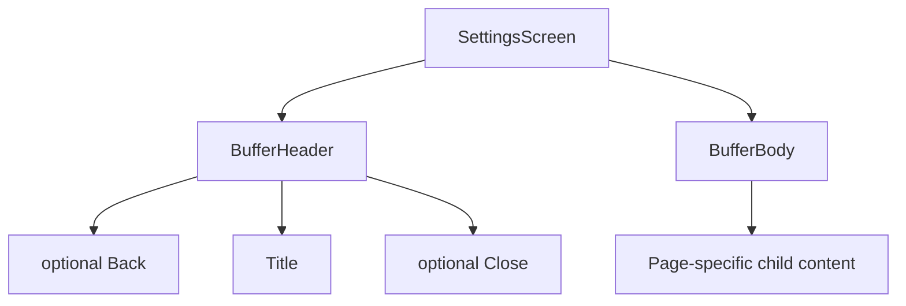

---

# 24. Generic Navigation Infrastructure

Settings does not implement its own DOM stack renderer.

It uses the shared:

```text
NavigationService
NavigationContainer
```

A navigation view conceptually contains:

```ts
{
    component,
    obj
}
```

`NavigationService` owns the ordered stack.

It exposes:

```text
push(view)
pop()
views
```

`NavigationContainer` renders the views.

---

# 25. Persistent `NavigationContainer`

The shared `NavigationContainer` iterates the entire navigation stack.

Only the top view is visible.

Earlier views receive:

```text
hidden
```

but remain mounted.

Conceptually:

```svelte
{#each $nav as view, index}
    <div class={index === $nav.length - 1 ? '' : 'hidden'}>
        <View ... />
    </div>
{/each}
```

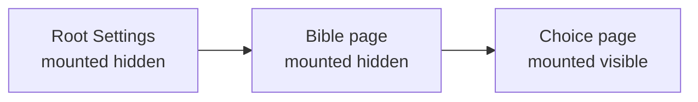

After a pop:

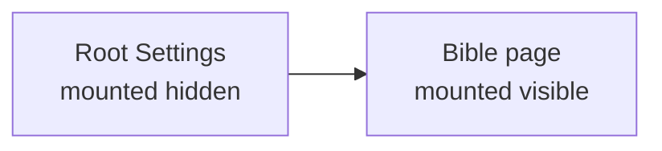

The V2 component was not recreated.

---

# 26. Why Persistent Views Matter

Consider this user flow:

```text
Settings root
    search = "pericopes"

tap Pericopes result
    ↓

Bible page
    Pericopes row focused

Back
    ↓

Settings root
    search still = "pericopes"
```

Because the root component remained mounted:

- the exact same search input DOM node still exists;
- its local state was never reconstructed;
- the result list remains derived from the same query state.

This behavior is covered by browser-level tests.

---

# 27. Module-Local `SettingsNavigationContext`

`SettingsNavigationContext` provides the `SettingsNavigationService` to descendants of one `SettingsContainer`.

Conceptually:

```ts
provideSettingsNavigationContext(
    settingsNavigationService
);
```

and:

```ts
useSettingsNavigationContext();
```

Although every Settings instance uses the same context Symbol, Svelte context lookup is component-tree-local.

Therefore this does **not** create one global Settings navigation service.

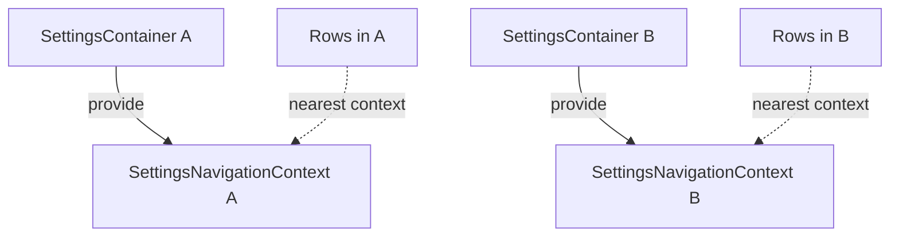

Rows in A cannot accidentally navigate B.

---

# 28. `SettingsNavigationService`

`SettingsNavigationService` is a Settings-specific facade over the generic `NavigationService`.

The generic service knows:

```text
push view
pop view
```

It does not know:

```text
what a Settings group row means
what a Settings select row means
what a Settings custom row means
what a Settings search result means
```

`SettingsNavigationService` owns that translation.

---

## 28.1 Component map

The service is constructed with a component map:

```ts
interface SettingsNavigationComponents {
    group: NavigationComponent;
    select: NavigationComponent;
    custom: NavigationComponent;
}
```

Current conceptual mapping:

```text
group  → SettingsGroupPage
select → SettingsChoicePage
custom → SettingsCustomPage
```

This keeps component constructors outside the declarative definition.

---

## 28.2 Navigation dispatch

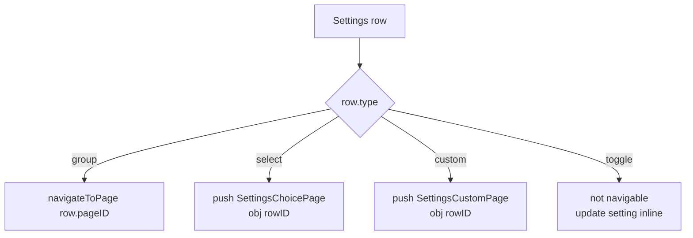

---

## 28.3 `navigateToPage()`

A page navigation pushes:

```text
SettingsGroupPage
```

with:

```ts
{
    pageID,
    focusRowID?
}
```

`focusRowID` is primarily used by search.

---

## 28.4 `back()`

Back is simply:

```ts
navigationService.pop()
```

Because earlier views remain mounted, the revealed view retains its state.

---

# 29. Settings Navigation Payloads

Settings views pass small semantic navigation payloads.

Conceptually:

```ts
interface SettingsRootNavigationObject {
    onClose: () => void;
}

interface SettingsPageNavigationObject {
    pageID: SettingsPageID;
    focusRowID?: SettingsRowID;
}

interface SettingsChoiceNavigationObject {
    rowID: SettingsRowID;
}
```

Custom-row views also use the row ID destination concept.

The payload should contain semantic IDs, not duplicate entire page definitions or row objects.

The destination view resolves the current definition from the ID.

Benefits include:

- one source of definition truth;
- smaller navigation payloads;
- validation at the destination boundary;
- no stale copied definition object.

---

# 30. Definition Resolver

`settings-definition-resolver.ts` centralizes definition lookup.

Important operations include:

```text
findSettingsPage(pageID)
requireSettingsPage(pageID)

findSettingsRow(rowID)

requireSettingsSelectRow(rowID)
requireSettingsCustomRow(rowID)
```

The `find` functions can return `undefined`.

The `require` functions fail explicitly when navigation/configuration is invalid.

Examples:

```text
Settings page not found: <id>
Settings select row not found: <id>
Settings custom row not found: <id>
```

---

# 31. Why Resolver Functions Matter

Without a resolver, each destination view could implement slightly different lookup logic:

```text
choice page manually scans pages
custom page manually scans pages
search manually scans pages
navigation manually scans pages
```

That duplicates assumptions.

Instead:

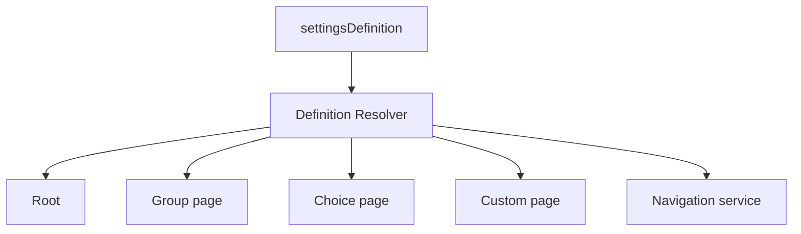

Lookup and validation rules therefore live in one place.

---

# 32. Definition Validation

Tests validate structural invariants of the Settings definition.

Important invariants include:

```text
rootPageID resolves to an existing page

page IDs are unique

section IDs are unique within a page

row IDs are globally unique

group destination page IDs exist

icon IDs resolve

custom view IDs resolve
```

These tests allow the renderer to assume that normal definition data is internally coherent.

---

# 33. Icon Resolver

Definitions contain semantic icon IDs such as:

```text
appearance
bible
theme-mode
color-theme
font-family
font-size
font-weight
paragraphs
pericopes
bible-version
max-width
```

They do not import Svelte icon components.

`settings-icon-component-resolver.ts` maps semantic IDs to concrete icon components.

Conceptually:

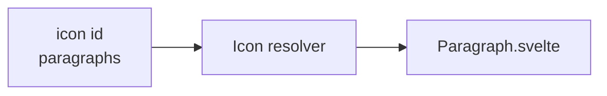

This keeps Svelte implementation objects out of the definition data.

---

# 34. Root Icon Accent Metadata

Root group icons can carry semantic accent metadata.

Current semantic accent IDs include:

```text
vivid-b-500
support-a-500
```

The icon resolver maps those to statically visible Tailwind class strings.

For example:

```text
vivid-b-500
    →
text-vivid-b-500

support-a-500
    →
text-support-a-500
```

The purpose of this mapper is partly to ensure Tailwind can statically discover the concrete utility classes instead of receiving arbitrary runtime class names from definition data.

Nested Settings rows omit accents and use the normal neutral icon color.

### Known visual issue

At the time of this implementation document, root accent coloring and the selected-choice checkmark have shown an unresolved SVG color/class behavior in the rendered application. The semantic mapping and class plumbing exist, but the expected icon color is not currently reliable in the UI.

This is intentionally treated as a presentation issue separate from the Settings information/navigation architecture.

Do not redesign Settings definitions or navigation solely to work around that SVG issue.

---

# 35. Custom View Resolver

Custom rows store a semantic view ID.

Current example:

```text
font-size
```

The custom view component resolver maps it to:

```text
fontSize.svelte
```

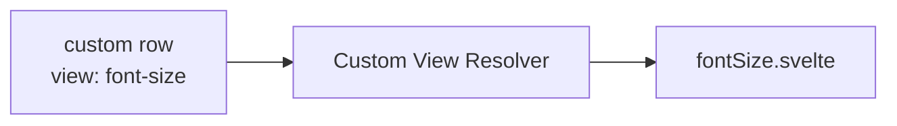

Adding a specialized Settings editor should generally involve:

1. add a semantic `SettingsCustomViewID`;
2. add the component mapping;
3. add the row definition;
4. add resolver/definition validation coverage.

---

# 36. Value Formatter Resolver

Dynamic secondary text can name a formatter.

Current semantic formatter:

```text
font-size
```

Conceptually:

```text
16
    ↓ font-size formatter
16 px
```

This prevents generic `SettingsRow` from accumulating setting-specific display conditions.

---

# 37. `SettingsChoicePage`

`SettingsChoicePage` is the generic editor for select rows.

It receives a navigation payload containing:

```text
rowID
```

It uses:

```text
requireSettingsSelectRow(rowID)
```

to resolve the current definition.

It then renders all options.

Selecting an option calls:

```ts
settingsContext.update(
    row.setting,
    option.value
);
```

The page is reusable for:

```text
light/dark mode
color theme
font family
font weight
future finite-choice Settings
```

No dedicated Svelte page is required for each one.

---

# 38. Selected Choice State

A selected choice changes its visual foreground/background and shows a checkmark.

The current implementation also explicitly handles selected-row hover contrast so that selected text does not become unreadable when the hover surface changes.

The same intended foreground behavior applies to the selected check icon, although the SVG color issue noted above remains unresolved.

---

# 39. `SettingsCustomPage`

`SettingsCustomPage` is the generic host for custom row editors.

It:

1. receives `rowID`;
2. resolves the row with `requireSettingsCustomRow`;
3. resolves the custom Svelte component from `row.view`;
4. renders it inside `SettingsScreen`;
5. uses `SettingsNavigationContext` for Back.

The custom component obtains Settings state through `SettingsContext`.

---

# 40. `fontSize.svelte`

Font size is the current example of a specialized editor.

It is custom because the UI is not simply:

```text
select one value from a fixed declarative list
```

It maintains local editing state and explicitly saves the value.

The persisted change still flows through:

```text
settingsContext.update("fontSize", value)
```

The component does not own persistence.

---

# 41. Search Architecture

Global Settings search is derived from the same `SettingsDefinition` used to render the UI.

There is no separate hard-coded search catalog.

The flow is:

```mermaid
flowchart TD
    DEF[SettingsDefinition] --> IDX[createSettingsSearchEntries]
    IDX --> E[SettingsSearchEntry array]
    Q[search query] --> S[searchSettings]
    E --> S
    S --> R[matching entries]
    R --> UI[SettingsSearch]
```

---

# 42. `SettingsSearchEntry`

A search entry conceptually contains:

```ts
interface SettingsSearchEntry {
    pageID: SettingsPageID;
    rowID: SettingsRowID;
    title: string;
    secondary?: string;
    pageTitle: string;
    sectionLabel?: string;
    searchableText: string;
}
```

The important navigation identity is:

```text
pageID + rowID
```

The search result does not store a Svelte component.

---

# 43. Search Index Construction

`createSettingsSearchEntries()` walks:

```text
pages
    sections
        rows
```

Rows can opt out using:

```ts
search: {
    hidden: true
}
```

Searchable content includes applicable data such as:

```text
row title
static secondary text
row search keywords
select option labels
select option secondary text
section label
page title
```

This means searches can discover a setting through terms that are not necessarily the row title.

Example:

```text
"night colorblind"
```

can match the Color theme row because its option labels are included in search content.

---

# 44. Search Normalization and Matching

Search normalizes case and whitespace.

The normalized query is tokenized.

All query tokens must exist in an entry's normalized searchable text.

Conceptually:

```text
"  BIBLE   VERSION  "
    ↓
"bible version"
    ↓
["bible", "version"]
```

An entry matches when every token is contained in its indexed text.

---

# 45. Search UI

The root Settings page contains `SettingsSearch`.

When the query is empty:

```text
root Settings rows are shown
```

When the query is non-empty:

```text
search results replace the normal root row list
```

If no entries match:

```text
No settings found
```

The query itself is root-view local state.

Because the root view stays mounted while navigating to a result, the query naturally survives navigation.

---

# 46. Search Navigation

Search result navigation is centralized in:

```text
SettingsNavigationService.navigateToSearchResult()
```

This keeps result-click behavior out of the root UI.

There are two main cases.

## 46.1 Root result

If:

```text
result.pageID === settingsDefinition.rootPageID
```

the service resolves the row.

For navigable root rows, it delegates to the normal row navigation mapping.

Example:

```text
Appearance result
    ↓
Appearance page
```

---

## 46.2 Nested result

For a nested row, the service calls:

```text
navigateToPage(
    result.pageID,
    result.rowID
)
```

The row ID becomes:

```text
focusRowID
```

Example:

```mermaid
sequenceDiagram
    participant U as User
    participant ROOT as Settings root
    participant SNS as SettingsNavigationService
    participant NS as NavigationService
    participant GP as SettingsGroupPage
    participant P as SettingsPage

    U->>ROOT: search "pericopes"
    ROOT-->>U: Pericopes result
    U->>ROOT: select result
    ROOT->>SNS: navigateToSearchResult(result)
    SNS->>NS: push SettingsGroupPage<br/>{pageID:"bible", focusRowID:"show-pericopes"}
    NS-->>GP: render
    GP->>P: Bible definition + focusRowID
    P->>P: scroll and pulse Pericopes row
```

---

# 47. Search State Preservation

The expected user flow is:

```mermaid
stateDiagram-v2
    [*] --> Root
    Root: query = ""
    Root --> RootSearch: type "pericopes"
    RootSearch: query = "pericopes"
    RootSearch --> Bible: select result
    Bible: focus show-pericopes
    Bible --> RootSearch: Back
    RootSearch: same mounted input
    RootSearch: query still = "pericopes"
```

This is not implemented by serializing and restoring the search query.

It falls naturally out of persistent navigation.

---

# 48. Root Settings View

`settings.svelte` represents the root Settings navigation view.

It:

- resolves `settingsDefinition.rootPageID`;
- builds search entries from the definition;
- owns `searchQuery`;
- derives search results;
- renders `SettingsSearch`;
- renders the root `SettingsPage` when not actively searching;
- delegates search navigation to `SettingsNavigationService`;
- delegates close to the root navigation object's callback.

It does **not** own the persisted Settings object.

That belongs to `SettingsContainer` + `SettingsService`.

---

# 49. Group Page

`settingsGroupPage.svelte` receives:

```text
pageID
focusRowID?
```

It resolves the page using the definition resolver.

It renders:

```text
SettingsScreen
    SettingsPage
```

Back calls:

```text
settingsNavigation.back()
```

The component does not hard-code Appearance or Bible.

The same group-page component handles both.

---

# 50. Data Versus Components

The architectural boundary can be summarized as:

```mermaid
flowchart LR
    DATA[Declarative data<br/>IDs, labels, options, setting keys] --> R[Resolvers / generic renderers]
    R --> COMP[Svelte components]

    DATA -. does not contain .-> CTOR[Svelte constructors]
```

Definition data should contain semantic information.

Resolvers contain implementation mappings.

Renderers contain generic presentation behavior.

---

# 51. Why Not Put Svelte Components in the Definition?

A definition like:

```ts
{
    icon: SomeSvelteIcon,
    component: FontSizeEditor
}
```

would couple the information model directly to browser/Svelte implementation details.

The current design instead uses:

```text
icon: { name: "font-size" }
view: "font-size"
```

Benefits:

- easier validation;
- easier testing;
- semantic configuration;
- cleaner search indexing;
- fewer browser-specific objects in data;
- easier future serialization or inspection;
- explicit component mapping.

---

# 52. Navigation and Definition Independence

The definition knows:

```text
group destination page ID
select setting/options
custom view semantic ID
```

It does not know the generic navigation stack implementation.

`SettingsNavigationService` bridges those worlds.

```mermaid
flowchart LR
    DEF[SettingsDefinition] --> ROW[Semantic row]
    ROW --> SNS[SettingsNavigationService]
    SNS --> NS[NavigationService]
    NS --> NC[NavigationContainer]
    NC --> VIEW[Svelte view]
```

---

# 53. Same-Domain Import Boundary

Settings lives inside the Application domain.

Within the same domain, implementation imports should use relative paths where appropriate.

For example, Settings internals should not deep-import themselves through:

```text
$lib/application/...
```

when a same-domain relative import is appropriate.

Cross-domain UI imports should continue to use the owning domain's browser/UI public boundary.

This keeps the Settings implementation aligned with the application's domain import rules.

---

# 54. Theme and Settings Separation

The Settings module selects semantic theme values.

It does not define theme palettes.

The relationship is:

```mermaid
flowchart TD
    UI[Settings UI] --> V[Settings.colorTheme / isDarkTheme]
    V --> SS[SettingsService]
    SS --> ATTR[data-theme attribute]
    ATTR --> CSS[app.css selectors]
    CSS --> TOK[semantic CSS tokens]
    TOK --> COMP[application components]
```

Color definitions stay in `app.css`.

The Settings definition contains only selectable theme identities.

---

# 55. Browser Tests Added Around the Architecture

The implementation includes browser-level coverage for behavior that cannot be fully represented by pure service tests.

## 55.1 Persistent NavigationContainer behavior

The test verifies that:

1. a first view is mounted;
2. local input state is changed;
3. a second view is pushed;
4. the first view remains in the DOM but hidden;
5. the second view is popped;
6. the exact same original input DOM node becomes visible again;
7. its state is preserved.

This proves the persistent view behavior rather than only testing the navigation array.

---

## 55.2 Settings focus/pulse behavior

The SettingsPage browser test verifies that `focusRowID`:

- finds the intended row;
- invokes `scrollIntoView`;
- applies the focus/pulse presentation state.

---

## 55.3 Multi-instance synchronization

The integration test mounts two real `SettingsContainer` instances sharing one `SettingsService`.

It navigates both to Bible Settings, changes Pericopes in one module, and verifies that:

```text
first module updates
second module updates
persisted Settings updates
```

This covers the complete path:

```text
UI
→ SettingsContext
→ SettingsService
→ subscriber
→ second SettingsContext
→ second UI
```

---

## 55.4 Root search state preservation

The search navigation browser test verifies:

```text
type "pericopes"
→ select result
→ navigate to Bible page
→ Back
→ exact same search input remains
→ value still equals "pericopes"
→ search result still exists
```

This validates the reason Settings uses persistent navigation.

---

# 56. Unit Test Coverage

Unit tests cover deterministic architecture boundaries.

Important areas include:

## Definition validation

```text
root page exists
page IDs unique
section IDs unique within page
row IDs globally unique
group destinations valid
icons resolve
custom views resolve
```

## Definition resolver

```text
find page
require page
find row
require select row
require custom row
failure cases
```

## Search

```text
entry creation
stable page/row destination
keyword search
page/section metadata
select option labels
normalization
hidden rows
```

## Settings navigation service

```text
group mapping
select mapping
custom mapping
navigateToPage
focused destination
root search destination
nested search destination
back
```

## Settings service

```text
defaults
normalization
persistence
DOM application
single-setting update
subscriber notification
multiple subscribers
unsubscribe
```

---

# 57. Navigation View Identity Tests

The shared navigation service also has identity-oriented tests.

The important contract is not merely that the restored view is deeply equal to the original.

It should be the same view object when appropriate.

That supports the persistent navigation model where state is preserved rather than reconstructed.

---

# 58. Error Boundaries

Malformed navigation/configuration should fail close to the boundary where it is consumed.

Examples include:

```text
missing page ID
row ID that is not a select row
row ID that is not a custom row
missing Settings context
missing Settings navigation context
```

The preferred behavior is an explicit error rather than silently falling back to an unrelated Settings page or component.

---

# 59. Adding a New Toggle Setting

Suppose a new boolean Settings field is added:

```ts
showVerseNumbers: boolean;
```

The typical implementation steps are:

1. add the property to `Settings`;
2. add its default to `newSettings()`;
3. normalize it in `normalizeSettings()`;
4. add a toggle row to `settings.definition.ts`;
5. add semantic icon mapping if a new icon ID is needed;
6. add search keywords if useful;
7. validate/test the definition;
8. update the consuming feature to read the Settings value.

No new Settings page component is required.

Example definition:

```ts
{
    type: 'toggle',
    id: 'show-verse-numbers',
    title: 'Verse numbers',
    secondary: 'Display verse numbers in Bible text',
    setting: 'showVerseNumbers',
    search: {
        keywords: ['verse', 'number', 'numbers']
    }
}
```

---

# 60. Adding a New Select Setting

For a finite choice:

1. add/update the Settings model;
2. add normalization/default behavior;
3. add a `select` row;
4. define typed options;
5. optionally add an icon;
6. optionally add search keywords.

The generic `SettingsChoicePage` will render the options.

Example:

```ts
{
    type: 'select',
    id: 'reading-density',
    title: 'Reading density',
    setting: 'readingDensity',
    options: [
        {
            id: 'compact',
            label: 'Compact',
            value: 'compact'
        },
        {
            id: 'comfortable',
            label: 'Comfortable',
            value: 'comfortable'
        }
    ]
}
```

Do not build a dedicated Svelte screen when the generic choice page is sufficient.

---

# 61. Adding a New Custom Setting

Use a custom row only when generic toggle/select behavior is not sufficient.

Steps:

1. add/update the Settings model if necessary;
2. add `SettingsCustomViewID`;
3. implement the Svelte editor;
4. add it to the custom view resolver;
5. add the custom row to the definition;
6. use `SettingsContext` from the custom component;
7. persist through `settingsContext.update()`;
8. add resolver/definition tests.

---

# 62. Adding a New Settings Group

For a new group such as:

```text
Privacy
```

the expected structure is:

1. add a stable page ID;
2. add the page definition;
3. add a root `group` row pointing to that page;
4. populate sections and rows;
5. verify root group destination validation;
6. update search metadata as needed.

No new group-page Svelte component is necessary.

`SettingsGroupPage` renders the page generically.

---

# 63. Adding a New Icon

The definition should use a new semantic icon ID.

Example:

```text
privacy
```

Then:

1. extend `SettingsIconID`;
2. add the concrete icon component to the icon resolver;
3. add the semantic mapping;
4. rely on definition validation to prove the ID resolves.

Avoid importing the SVG component directly into `settings.definition.ts`.

---

# 64. Adding Search Metadata

Search should normally work from ordinary row content first.

Useful searchable data already includes:

```text
title
static secondary text
section label
page title
select option labels
```

Use explicit keywords when users are likely to search with synonyms not present in those fields.

Example:

```ts
search: {
    keywords: [
        'typeface',
        'font'
    ]
}
```

Use:

```ts
hidden: true
```

only when a row should not appear in global Settings search.

---

# 65. UI Ownership Rules

The following ownership rules should be preserved.

## Generic rendering owns

```text
page layout
section layout
row layout
choice-page layout
shared header/body shell
search-result presentation
focus/pulse presentation
```

## Definition owns

```text
information architecture
labels
setting keys
options
search metadata
semantic icon IDs
semantic custom-view IDs
semantic formatter IDs
```

## SettingsNavigationService owns

```text
row type → navigation destination
search result → navigation destination
Back abstraction
```

## SettingsContext owns

```text
one module's reactive Settings projection
user update entry point
```

## SettingsService owns

```text
persistence
normalization
application-wide effects
subscriber broadcasts
latest Settings merge base
```

## Workspace/runtime owns

```text
paneID
closing a module Pane
generic module rendering
generic NavigationContainer
```

---

# 66. Dependency Direction

The desired dependency direction is:

```mermaid
flowchart TD
    UI[Settings Svelte UI]
    DEF[Settings Definition]
    RES[Settings Resolvers]
    SNS[SettingsNavigationService]
    CTX[Settings Contexts]
    NS[Generic NavigationService]
    SS[SettingsService]
    APP[Application Runtime]

    UI --> DEF
    UI --> RES
    UI --> CTX

    CTX --> SNS
    SNS --> DEF
    SNS --> RES
    SNS --> NS

    CTX --> SS

    SS --> APP
    NS --> APP
```

The definition should not depend on Svelte UI components.

`SettingsService` should not depend on Settings module UI.

---

# 67. Design Invariants

The current Settings architecture relies on the following invariants.

1. `settingsDefinition.rootPageID` resolves.
2. Page IDs are stable.
3. Row IDs are globally unique.
4. Group rows reference valid pages.
5. Toggle rows reference boolean Settings fields.
6. Select option values match the type of their Settings field.
7. Custom view IDs resolve.
8. Icon IDs resolve.
9. Settings changes persist through `SettingsService`.
10. Subscriber synchronization does not republish.
11. Every mounted Settings module owns its own navigation service.
12. Every mounted Settings module owns its own Settings contexts.
13. Previous navigation views remain mounted.
14. Search destinations use semantic page/row IDs.
15. Focus queries are scoped to the active page container.
16. Workspace identity uses `paneID`.
17. Popup close behavior does not close the Workspace Pane.
18. UI components do not directly own browser Settings persistence.

---

# 68. Anti-Patterns

Avoid the following.

## Hard-coded page branching

Do not grow code like:

```ts
if (pageID === 'appearance') {
    ...
} else if (pageID === 'bible') {
    ...
}
```

for ordinary definition-driven pages.

Use the definition and resolvers.

---

## Per-setting Svelte components for simple values

Do not recreate:

```text
fontFamilies.svelte
fontWeights.svelte
colorTheme.svelte
lightDarkMode.svelte
paragraphs.svelte
pericopes.svelte
...
```

for settings that fit the generic row/choice language.

The old bespoke components were removed intentionally.

---

## Direct `localStorage` writes from Settings UI

Do not:

```ts
localStorage.setItem(
    'settings',
    ...
);
```

inside Settings components.

Use `SettingsService`.

---

## Whole-object updates based on a stale module copy

Avoid:

```ts
settingsService.updateSettings({
    ...settingsContext.settings,
    [setting]: value
});
```

for ordinary single-value edits.

Use:

```ts
settingsService.updateSetting(
    setting,
    value
);
```

so the merge starts from the latest application Settings snapshot.

---

## Republish on subscriber update

Do not call:

```text
settingsContext.update(...)
```

while handling a `SettingsService` broadcast.

Update the local reactive object only.

---

## Global DOM query for focused Settings rows

Do not use:

```ts
document.querySelector(
    '[data-settings-row-id="..."]'
);
```

for search focus.

Hidden previous Settings views remain mounted and may contain matching elements.

Scope the query to the current SettingsPage element.

---

## Svelte components in definition data

Prefer:

```text
view: "font-size"
icon.name: "font-size"
```

instead of component constructors.

---

## Global Settings navigation singleton

Do not expose one global SettingsNavigationService from ApplicationContext.

Navigation is per mounted Settings module instance.

---

# 69. Known Presentation Issue: SVG Colors

The Settings refactor uncovered a presentation-level issue affecting SVG colors.

Attempts were made to:

- apply root icon accent classes on the wrapper;
- resolve semantic accent IDs to static Tailwind text classes;
- apply the accent class directly to the icon component;
- explicitly color the selected checkmark for selected/hover states.

The rendered icon/checkmark colors still did not consistently reflect the expected classes.

The current decision is to leave this issue separate from the Settings architecture.

The Settings definition and resolver model should remain semantic.

A future SVG/component audit should determine whether:

```text
classes props
fill="currentColor"
fill-* utilities
text-* utilities
hard-coded SVG fill attributes
```

are interacting incorrectly.

---

# 70. Current Information Architecture Diagram

```mermaid
flowchart TD
    ROOT[Settings]

    ROOT --> AP[Appearance]
    ROOT --> BI[Bible]

    AP --> TH[Theme section]
    AP --> TX[Text section]
    AP --> LY[Layout section]

    TH --> TM[Theme<br/>Light / Dark]
    TH --> CT[Color theme<br/>Night / Night Colorblind / Red / Light Blue / Purple / Cyan / Pink]

    TX --> FS[Font size<br/>custom]
    TX --> FF[Font family<br/>select]
    TX --> FW[Font weight<br/>select]

    LY --> MW[Maximum width<br/>toggle]

    BI --> DP[Display section]

    DP --> PA[Paragraphs<br/>toggle]
    DP --> PE[Pericopes<br/>toggle]
    DP --> BV[Bible version<br/>toggle]
```

---

# 71. Complete Settings Edit Flow

The following sequence summarizes a normal change to a Settings value.

Example:

```text
Bible → Pericopes → On
```

```mermaid
sequenceDiagram
    participant U as User
    participant R as SettingsRow
    participant C as SettingsContext
    participant CT as SettingsContainer
    participant S as SettingsService
    participant LS as localStorage
    participant DOM as Application DOM
    participant O as Other Settings instance

    U->>R: toggle Pericopes
    R->>C: update("showPericopes", true)
    C->>CT: module-local update function
    CT->>S: updateSetting("showPericopes", true)
    S->>S: merge with latest Settings
    S->>S: normalize
    S->>LS: persist
    S->>DOM: apply Settings
    S-->>CT: subscriber snapshot
    S-->>O: subscriber snapshot
    CT->>CT: Object.assign local reactive Settings
    O->>O: Object.assign local reactive Settings
```

---

# 72. Complete Settings Navigation Flow

Example:

```text
Settings
→ Appearance
→ Color theme
→ Back
→ Back
```

```mermaid
sequenceDiagram
    participant U as User
    participant ROW as SettingsRow
    participant SNS as SettingsNavigationService
    participant NS as NavigationService
    participant NC as NavigationContainer

    U->>ROW: tap Appearance
    ROW->>SNS: navigate(group row)
    SNS->>NS: push SettingsGroupPage(appearance)
    NS-->>NC: root hidden, Appearance visible

    U->>ROW: tap Color theme
    ROW->>SNS: navigate(select row)
    SNS->>NS: push SettingsChoicePage(color-theme)
    NS-->>NC: root + Appearance hidden, Choice visible

    U->>SNS: back()
    SNS->>NS: pop()
    NS-->>NC: existing Appearance view visible

    U->>SNS: back()
    SNS->>NS: pop()
    NS-->>NC: existing root Settings view visible
```

---

# 73. Search-to-Setting Flow

Example:

```text
search "night colorblind"
```

The search index can match Color theme because select option labels are indexed.

```mermaid
flowchart TD
    Q["night colorblind"] --> N[normalize]
    N --> TOK["night", "colorblind"]

    DEF[Color theme definition] --> OPT[option labels]
    OPT --> IDX[searchableText]

    TOK --> MATCH{all tokens present?}
    IDX --> MATCH

    MATCH -->|yes| RES[Color theme search result]
    RES --> NAV[SettingsNavigationService]
    NAV --> CP[SettingsChoicePage<br/>rowID=color-theme]
```

---

# 74. Lifecycle and Cleanup

`SettingsContainer` subscribes to `SettingsService` when mounted.

It unsubscribes in the `onMount` cleanup callback.

This is important because:

```text
closed Settings module
```

must not remain an active Settings subscriber.

```mermaid
stateDiagram-v2
    [*] --> Constructed
    Constructed --> Mounted
    Mounted: subscribe SettingsService
    Mounted: push root navigation view
    Mounted --> Destroyed
    Destroyed: unsubscribe SettingsService
    Destroyed --> [*]
```

---

# 75. Why the Root Search Belongs in the Root View

Search state is specifically owned by `settings.svelte`, not by `SettingsContainer`.

This is intentional.

`SettingsContainer` owns infrastructure shared by the whole Settings module instance.

The root view owns state specific to the root screen:

```text
search query
search results
searching/not-searching presentation
```

Because the root view remains mounted, this local ownership also gives the desired Back behavior naturally.

---

# 76. Why Navigation Is Not Stored in Settings State

The navigation stack is not a user preference.

It is ephemeral module UI state.

Therefore it should not be stored in:

```text
Settings
localStorage["settings"]
SettingsService
```

The separation is:

```text
persistent preference
    SettingsService

ephemeral view position
    NavigationService
```

---

# 77. Why Search Is Not Stored in Settings State

The search query is also not a user preference.

It is temporary UI state for one Settings module instance.

If two Settings modules are open:

```text
pane A search query
pane B search query
```

should be independent.

Keeping search state inside the root Settings component produces that behavior automatically.

---

# 78. Why `SettingsContext` Is Not `ApplicationContext`

`ApplicationContext` exposes application-owned capabilities.

`SettingsContext` exists only inside one Settings module UI tree.

Other domains should not use `SettingsContext` to read application settings.

They should use the application-owned Settings APIs appropriate to their layer, normally through `ApplicationContext` / `SettingsService`.

This prevents the Settings module UI from becoming an application-global dependency.

---

# 79. Relationship to Other Settings Consumers

Not every Settings consumer is part of the Settings module.

For example, runtime presentation such as maximum width can subscribe to `SettingsService` directly.

The conceptual relationship is:

```mermaid
flowchart TD
    SS[SettingsService]

    SS --> UI1[Settings module A]
    SS --> UI2[Settings module B]
    SS --> BC[BufferContainer]
    SS --> OTHER[Other application consumers]
```

The Settings module is an editor for Settings.

It is not the sole owner or sole consumer of Settings.

---

# 80. Implementation Summary

The Settings module can be understood as five cooperating systems.

## 80.1 Settings data

```text
Settings
newSettings
normalizeSettings
SettingsService
```

This is the application preference state.

## 80.2 Settings information architecture

```text
SettingsDefinition
pages
sections
rows
options
semantic IDs
```

This describes what Settings exist and how they are organized.

## 80.3 Settings presentation

```text
SettingsScreen
SettingsPage
SettingsSection
SettingsRow
SettingsChoicePage
SettingsCustomPage
SettingsSearch
```

These render the information architecture.

## 80.4 Settings navigation

```text
NavigationService
NavigationContainer
SettingsNavigationService
SettingsNavigationContext
```

These manage one Settings module's view stack.

## 80.5 Settings module state bridge

```text
SettingsContainer
SettingsContext
SettingsService subscription
```

This connects application-global values to one module-local reactive UI instance.

---

# 81. Final Architecture

```mermaid
flowchart TB
    subgraph Application["Application-global"]
        AC[ApplicationContext]
        SS[SettingsService]
        STORE[(localStorage)]
        DOM[Application DOM]
        AC --> SS
        SS --> STORE
        SS --> DOM
    end

    subgraph Instance["One Settings module instance"]
        SC[SettingsContainer]

        subgraph Contexts["Module-local contexts"]
            SCTX[SettingsContext]
            NCTX[SettingsNavigationContext]
        end

        subgraph Navigation["Persistent navigation"]
            NS[NavigationService]
            NC[NavigationContainer]
        end

        subgraph Views["Settings views"]
            ROOT[Settings root]
            GROUP[SettingsGroupPage]
            CHOICE[SettingsChoicePage]
            CUSTOM[SettingsCustomPage]
        end

        subgraph GenericUI["Generic rendering"]
            SCREEN[SettingsScreen]
            PAGE[SettingsPage]
            SECTION[SettingsSection]
            ROW[SettingsRow]
            SEARCH[SettingsSearch]
        end

        SC --> SCTX
        SC --> NCTX
        SC --> NS
        SC --> NC

        NS --> NC
        NC --> ROOT
        NC --> GROUP
        NC --> CHOICE
        NC --> CUSTOM

        ROOT --> SCREEN
        GROUP --> SCREEN
        CHOICE --> SCREEN
        CUSTOM --> SCREEN

        ROOT --> SEARCH
        ROOT --> PAGE
        GROUP --> PAGE
        PAGE --> SECTION
        SECTION --> ROW
    end

    DEF[settingsDefinition] --> ROOT
    DEF --> GROUP
    DEF --> ROW
    DEF --> SEARCH

    RES[Resolvers] --> GROUP
    RES --> CHOICE
    RES --> CUSTOM
    RES --> ROW

    SCTX --> SS
    SS -->|Settings snapshot| SCTX

    NCTX --> SNS[SettingsNavigationService]
    SNS --> NS
```

The core rule is:

> **Settings values are application-global; Settings UI state and navigation are module-local; the Settings definition is declarative; generic renderers and resolvers turn that definition into UI.**

That separation is what allows the module to remain extensible without returning to a collection of one-off Settings components and special-case navigation branches.
