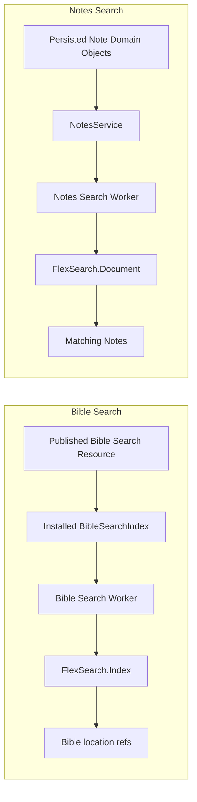
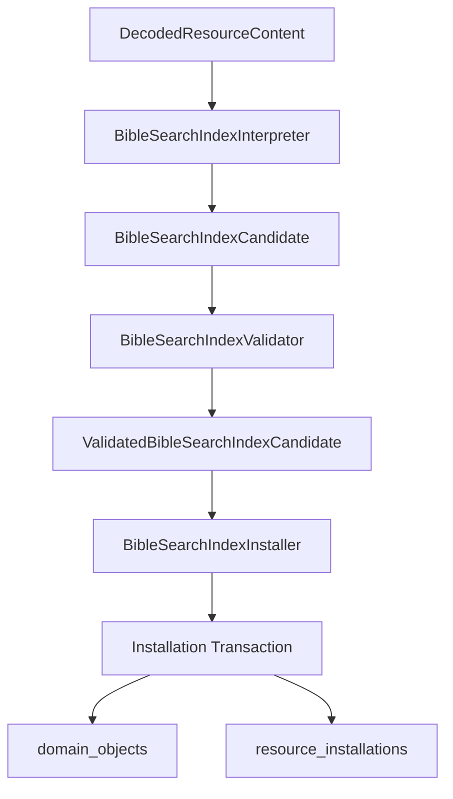

# Search Indexes

## Status

Current

---

# Purpose

This document describes the current local search implementations used by
KJVOnly.bible.

Search is Domain-owned. The application does not define one generic persisted
search-index subsystem shared by every Domain.

The two current search implementations deliberately use different lifecycle
models:

```text
Bible search
    = published/prebuilt search index
      installed as a Bible Domain Object
      imported into an in-memory FlexSearch Index worker

Notes search
    = accepted Note Domain Objects
      loaded from local persistence
      indexed into an in-memory FlexSearch Document worker
      updated incrementally as Notes change
```

The common idea is local, browser-side search. The persistence and lifecycle
rules remain owned by the Domain that understands the searchable data.

---

# Scope

This document covers:

- Bible Search Index Resource installation,
- Bible Search Index persistence,
- Bible search worker initialization,
- Bible search execution and result routing,
- Notes search initialization,
- Notes in-memory indexing,
- incremental Notes index maintenance,
- search-worker ownership,
- search persistence boundaries,
- Resource-selection interaction,
- testing and extension rules.

This document does not define:

- remote full-text search,
- relay-side search,
- synchronization policy,
- generic application-wide search abstractions,
- Resource discovery itself,
- search-result presentation details beyond the boundary needed to explain the
  search pipeline.

---

# High-Level Architecture

Search currently has two independent Domain implementations.



There is intentionally no shared persisted `search_indexes` IndexedDB object
store.

Bible search indexes are stored as normal Domain Objects in `domain_objects`.
Notes search structures exist only in worker memory and are rebuilt from Note
Domain Objects.

---

# Search Ownership Rules

The important ownership rules are:

```text
Domain
    owns searchable object semantics
    owns index format / searchable fields
    owns query interpretation
    owns result meaning

Application
    owns long-lived services used by Svelte
    wires Domain services and runtimes

Worker
    owns CPU-heavy/in-memory FlexSearch state
    does not use ApplicationContext
    may reload accepted Domain state during an explicit refresh operation

Persistence
    stores authoritative Domain state
    does not become a generic search service
```

A worker is a separate composition root.

Search workers receive explicit messages/data. They do not reach through
`ApplicationContext` to obtain services. Normal search commands operate on
already-initialized worker state; explicit refresh/reconciliation commands may
read the worker's Domain persistence adapter directly when rebuilding a derived
projection after cross-worker changes.

---

# Bible Search

## Overview

Bible search uses a prebuilt FlexSearch index that is published through the
Resource architecture.

The index is not rebuilt from all Bible text at application startup.

Instead:

```text
Published Resource
    ↓
Bible Search Resource handler
    ↓
interpret + validate
    ↓
BibleSearchIndex Domain Object
    ↓
IndexedDB domain_objects
    ↓
BibleSearchIndexService
    ↓
SearchRuntime
    ↓
Bible Search Worker
    ↓
FlexSearch.Index in worker memory
```

This keeps expensive index construction outside the normal browser startup
path.

---

# Bible Search Resource Type

The current Bible Search Resource Type is:

```text
kjvonly/bible/search
```

The Resource path contains the Bible version:

```text
kjvonly/bible/search/<version>
```

The Resource publisher remains part of the `PublishedResourceReference` and
therefore part of the installed search-index identity.

Conceptually:

```text
publisher
+ version
    ↓
BibleSearchIndex.id
```

The current Domain Object ID helper produces:

```text
<publisher>/<version>
```

The Domain Object Type is:

```text
bible/search-index
```

The shared `domain_objects` persistence key is therefore derived from:

```text
bible/search-index:<publisher>/<version>
```

---

# Bible Search Index Model

The installed Domain Object is conceptually:

```typescript
interface BibleSearchIndex {
    id: string;
    version: string;
    chunks: BibleSearchIndexChunks;
}
```

The chunks are exported FlexSearch Index chunks.

Required current chunks include:

```text
reg
cfg
map
ctx
```

Additional string chunks are allowed.

The index is therefore persisted in its exported representation rather than as
an active `FlexSearch.Index` instance.

That distinction is important:

```text
IndexedDB
    = serializable BibleSearchIndex Domain Object

Bible Search Worker
    = live FlexSearch.Index runtime object
```

---

# Bible Search Installation

Bible Search installation follows the normal Resource installation boundary.



## Interpreter

The interpreter verifies:

- the Resource Type is `kjvonly/bible/search`,
- the Resource identifier uses the same Resource Type,
- the Resource path contains exactly one segment,
- that segment is the Bible version.

It produces the candidate value plus the interpreted version.

## Validator

The validator verifies the persisted FlexSearch export rather than accepting
arbitrary JSON.

Current validation includes:

- content must be an object,
- every chunk value must be a string,
- every chunk string must contain valid JSON,
- required FlexSearch chunks must exist,
- the exported FlexSearch configuration must use a supported Index
  configuration.

This prevents malformed or incompatible index exports from becoming accepted
Bible Search Domain Objects.

## Installer

The installer derives the Domain Object ID from:

```text
resource.publisher
candidate.version
```

It checks existing `ResourceInstallation` provenance before replacing an
installed index.

If the incoming Resource is not newer than the installed publication, the
installer keeps the current object.

For an accepted replacement, the installer writes:

```text
BibleSearchIndex
ResourceInstallation
```

inside one installation transaction.

The transaction uses:

```text
domain_objects
resource_installations
```

so the Search Index Domain Object and its Resource provenance remain atomic.

---

# Bible Search Index Persistence

`IndexedDBBibleSearchIndexStore` stores `BibleSearchIndex` values in the shared:

```text
domain_objects
```

store.

There is no dedicated IndexedDB `bible_search_indexes` object store.

The Domain-facing store contract remains narrow:

```typescript
interface BibleSearchIndexStore {
    get(id: string): Promise<BibleSearchIndex | undefined>;
    put(searchIndex: BibleSearchIndex): Promise<void>;
}
```

This keeps IndexedDB details behind the Bible persistence adapter.

---

# BibleSearchIndexService

`BibleSearchIndexService` is the application-facing retrieval boundary for an
installed search index.

Given a selected `PublishedResourceReference`, it:

```text
parse selected Resource reference
    ↓
derive <publisher>/<version> Search Index ID
    ↓
check local BibleSearchIndexStore
    ↓
found?
    ├── yes → return installed index
    └── no
         ↓
       install selected Resource
         ↓
       verify install result
         ↓
       reload installed index
```

The service therefore preserves the normal Domain-service behavior used
elsewhere in the application:

> Read local accepted Domain state first; use the Resource installation boundary
> when the selected Resource has not yet been installed.

The service does not query relays directly.

---

# Bible Search Resource Selection

The Search module declares its own Resource requirements.

The current Search module requires selections for:

```text
Bible Search Index
Bible Chapters
Bible Booknames
```

The selected Bible Search Resource is captured on the module Buffer through the
normal Module Resource-selection architecture.

The Search UI resolves that captured selection through
`ModuleResourceSelectionResolver` and passes the resulting
`PublishedResourceReference` to `SearchService`.

This preserves the rule:

```text
Pane / Buffer mechanics
    stay outside Domain services

Domain service
    receives PublishedResourceReference
```

The Chapter and Booknames selections are used later to render human-readable
search results from the location references returned by the search index.

---

# Bible Search Runtime

`SearchRuntime` coordinates the main thread and the Bible Search Worker.

Its main responsibilities are:

```text
load selected BibleSearchIndex
initialize worker index once
coalesce duplicate initialization work
route search requests to worker
receive typed worker messages
forward SearchResultResponse to SearchService
invalidate cached readiness/index state when persisted search data changes
```

The runtime tracks readiness at two levels.

## Selected Resource readiness

A selected Resource reference is keyed by:

```text
<publisher>/<resourceId>
```

Repeated searches using the same selected source reuse the same pending/ready
initialization promise.

If initialization fails, the failed readiness entry is removed so a later
request can retry.

## Worker index readiness

The runtime separately tracks:

```text
initialized Search Index IDs
pending Search Index initializations
```

This prevents multiple callers from repeatedly importing the same FlexSearch
chunks into the worker.

---

# Bible Search Worker Contract

The current worker request contract has three operations:

```text
init
search
reset
```

Conceptually:

```typescript
{ action: 'init', searchIndex }

{ action: 'search', id, searchIndexId, text }

{ action: 'reset' }
```

Initialization produces either:

```text
initialized
initialization-failed
```

and a search produces a `SearchResultResponse`.

The request/response types are explicit and should remain typed when the worker
protocol evolves.

---

# Bible Search Worker Runtime

The worker owns an in-memory map:

```text
BibleSearchIndex.id
    → FlexSearch.Index
```

On initialization it creates a new `FlexSearch.Index` and imports each persisted
FlexSearch chunk.

The active FlexSearch object is not persisted back into IndexedDB.

`reset` drops the worker's in-memory indexes. `SearchRuntime.refresh()` first waits for pending initialization work, clears its selected-source/index readiness caches, and then sends `reset`. The next search reloads whichever Bible Search Resource is currently selected on the Buffer through the normal `BibleSearchIndexService` path.

Archive import uses this invalidation when a Bible Search Resource was actually handled. Archive does not choose a search index or enumerate available indexes.

The current search behavior:

1. gets the requested in-memory index,
2. splits the search text on the literal `OR` delimiter,
3. searches each term,
4. combines matches,
5. removes duplicate IDs,
6. sorts Bible locations into canonical Bible order,
7. returns Bible-location references.

The worker does not return complete verse text.

A result looks conceptually like:

```typescript
{
    id: searchRequestId,
    bibleLocationRefs: string[],
    stats: {
        count: number,
        time: string
    }
}
```

Keeping results as Bible-location references avoids duplicating Chapter and
Booknames data inside the search index result path.

The UI can resolve the references using the module's selected Chapter and
Booknames Resources.

---

# SearchService Result Routing

`SearchService` sits between Svelte/runtime callers and `SearchRuntime`.

Callers provide a search ID when subscribing and searching.

Conceptually:

```text
Search UI instance A
    searchID = A

Search UI instance B
    searchID = B

worker result id=A
    ↓
SearchService
    ↓
only subscribers registered for A
```

This is important because multiple Search module instances may exist at the
same time.

`unsubscribe(searchID)` removes all callbacks registered for that search ID.

The service does not own the search index itself; the worker/runtime owns the
live search runtime and `BibleSearchIndexService` owns retrieval of the
installed Domain Object.

---

# Notes Search

## Overview

Notes search intentionally uses a different lifecycle from Bible search.

Notes are user-created local Domain Objects whose content changes incrementally.
A separately published/prebuilt Notes search index would therefore be the wrong
source of truth.

The normal startup lifecycle is:

```text
IndexedDB Note Domain Objects
    ↓
NotesService initial getAll()
    ↓
NotesSearchRuntime.initialize(notes)
    ↓
Notes Search Worker
    ↓
in-memory FlexSearch.Document
```

After initialization, successful local Note writes update the in-memory worker
index incrementally.

A separate explicit refresh path handles persistence changes performed outside
`NotesService`, such as Archive import:

```text
NotesService.refresh()
    ↓
NotesSearchRuntime.refresh()
    ↓
Notes worker
    ↓
IndexedDBNotesStore.getAll()
    ↓
rebuild FlexSearch.Document + Note map
```

---

# Notes Search Source of Truth

The authoritative persisted state is the Note Domain Object collection.

Notes are stored through the Domain-facing `NotesStore` abstraction in the
shared:

```text
domain_objects
```

IndexedDB store.

There is no persisted FlexSearch Notes index.

At runtime:

```text
persisted Notes
    = authoritative accepted state

worker FlexSearch.Document
    = disposable derived search state
```

The derived index can therefore be rebuilt from accepted Notes when the
application starts.

---

# Notes Search Initialization

`NotesService` loads accepted Notes once through `NotesStore.getAll()`.

It then sends those Notes to `NotesSearchRuntime`, which sends an explicit
`initialize` message to the Notes Search Worker.

The worker:

1. creates a fresh `FlexSearch.Document`,
2. resets its in-memory Note map,
3. derives searchable fields for each accepted Note,
4. adds each Note to FlexSearch,
5. publishes the current Note collection after initialization.

Normal Note reads/searches wait for the initial load promise before querying the
worker.

This prevents a search request from racing the initial accepted-Note load.

---

# Notes Indexed Fields

The Notes worker currently indexes:

```text
title
text
tags[]:tag
bookChapter
bibleLocationRef
```

`bookChapter` is derived for Bible-linked Notes from the Note's
`bibleLocationRef`.

Standalone Notes do not receive a synthetic Bible-location value.

The derived `bookChapter` field allows local filtering at a chapter scope
without changing the persisted Note Domain Object solely for search indexing.

---

# Notes Incremental Index Maintenance

The Notes search index is updated only after accepted local Domain writes.

## Put

The current write path is conceptually:

```text
NotesService.put(note)
    ↓
Domain state + Outbox transaction
    ↓
transaction succeeds
    ↓
NotesSearchRuntime.put(note)
    ↓
worker updates FlexSearch + in-memory Note map
    ↓
Outbox wake
```

## Delete

Deletion follows the same ordering:

```text
NotesService.delete(noteId)
    ↓
Domain delete + Outbox deletion intent
    ↓
transaction succeeds
    ↓
NotesSearchRuntime.remove(noteId)
    ↓
worker removes Note from search state
    ↓
Outbox wake
```

This ordering matters.

The search worker is derived state. It should not be updated before the
accepted Domain transaction succeeds.

---

# Notes Worker Contract

The current Notes search worker supports:

```text
initialize
put
remove
search
get-all
refresh
```

The protocol is typed.

Conceptually:

```typescript
{ action: 'initialize', notes }
{ action: 'put', note }
{ action: 'remove', noteId }
{ action: 'search', id, text, indexes }
{ action: 'get-all', id }
{ action: 'refresh' }
```

Search results contain:

```typescript
{
    id: string;
    notes: Record<string, Note>;
}
```

As with Bible search, the request/result ID lets `NotesService` route a response
to the correct subscriber.

---

# Notes Search Queries

The caller supplies the FlexSearch field indexes to search.

The Notes UI currently uses fields such as:

```text
title
text
tags[]:tag
```

Other runtime callers can use the indexed Bible-location fields when needed.

The worker combines the matches returned from the selected indexes into one
`NotesById` result map.

The current worker only posts a search response when at least one Note matches.
That is current implementation behavior and should be considered if the search
protocol is changed in the future.

`get-all` always posts the complete current in-memory Note map.

---

# Notes Collection Notifications

The Notes worker also publishes the current collection using the established
Notes collection-change identifier when:

```text
initialization completes
Note is added/updated
Note is removed
explicit refresh rebuilds accepted state
```

This supports Notes UI views that need the current collection as well as views
that issue explicit text searches.

The collection notification is local runtime behavior. It is not Resource
synchronization.

---

# Search Persistence Summary

The persistence model can be summarized as:

| Search | Authoritative persisted state | Persisted search artifact | Runtime search state |
|---|---|---|---|
| Bible | `BibleSearchIndex` Domain Object | yes — exported FlexSearch chunks | `FlexSearch.Index` in worker memory |
| Notes | `Note` Domain Objects | no separate persisted index | `FlexSearch.Document` in worker memory |

This distinction is intentional.

Bible text is distributed as largely static published content, making a
prebuilt search index appropriate.

Notes are mutable user Domain Objects, making a locally rebuilt/incrementally
maintained index appropriate.

---

# Search and IndexedDB

Search code does not use IndexedDB as a generic query engine.

IndexedDB responsibilities are:

```text
persist BibleSearchIndex Domain Objects
persist Note Domain Objects
persist Resource installation provenance
```

FlexSearch responsibilities are:

```text
maintain live in-memory search structures
execute full-text search
```

Search workers should not become general persistence adapters.

For Bible search, the main-thread Domain service loads the selected persisted
`BibleSearchIndex` and passes it into the worker. Imported Bible Search data
invalidates the runtime/worker cache; the next search reloads the currently
selected index through that same path.

For Notes search, `NotesService` performs the normal initial accepted-Note load
and sends Notes into the worker. On explicit refresh, however, the Notes worker
uses its own `IndexedDBNotesStore` adapter to reload accepted Notes and rebuild
the derived FlexSearch projection off the main thread.

This keeps normal persistence ownership explicit while allowing bounded
cross-worker reconciliation without shuttling full Domain collections through
the main thread.

---

# Search and Resource Installation

Only Bible search currently has a separately published Search Index Resource.

That Resource uses the normal Resource lifecycle:

```text
Resource selection
    ↓
Resource installation
    ↓
BibleSearchIndex Domain Object
    ↓
Domain persistence
```

Notes search does not introduce a Notes Search Resource.

Synchronization of Note Domain Objects remains separate from deriving a local
search index from those accepted objects.

Do not move Notes synchronization into the search runtime.

---

# Failure Behavior

## Bible index retrieval failure

If the selected Bible Search Resource cannot be found or installed,
`BibleSearchIndexService.get()` fails rather than silently searching a different
index.

## Bible worker initialization failure

The worker reports an explicit initialization failure containing the Search
Index ID and error message.

`SearchRuntime` rejects the pending initialization and removes the failed
source-readiness entry so a later request can retry.

## Search before initialization

Bible `SearchRuntime` waits for Search Index initialization before posting the
search request.

Notes search operations wait for `NotesService`'s initial accepted-Note load.

These boundaries prevent normal caller code from coordinating worker readiness
itself.

---

# Testing Strategy

Search behavior is tested at multiple levels.

## Bible Search Resource tests

Tests cover:

```text
interpreter
validator
installer
installation transaction
Resource handler
module Resource-selection contributor
```

These tests verify that a published search index becomes a valid installed
Domain Object with correct provenance.

## Bible Search service/runtime tests

Tests cover:

```text
BibleSearchIndexService
SearchRuntime
SearchIndexRuntime
SearchService
```

Important behaviors include:

```text
local-first index retrieval
Resource installation fallback
one-time worker initialization
concurrent initialization coalescing
worker reset/cache invalidation
search result routing by search ID
subscriber removal
canonical Bible-location result ordering
```

## Notes search tests

Tests cover the Notes search runtime and Notes service behavior around accepted
local state and worker messages, including explicit refresh.

Browser coverage also verifies that the Notes worker can reload accepted Notes
from IndexedDB and rebuild its search projection after persistence was changed
outside the normal `NotesService.put/delete` path.

When search behavior changes, prefer testing the narrow owner of that behavior
instead of requiring every case to become a browser test.

Browser tests are appropriate for end-to-end Resource installation or UI/worker
integration boundaries that cannot be represented faithfully in Node tests.

---

# Important Files

## Bible Search

```text
src/lib/domains/bible/models/bible-search-index.model.ts
src/lib/domains/bible/models/search.model.ts

src/lib/domains/bible/services/bible-search-index.service.ts
src/lib/domains/bible/services/search.service.ts

src/lib/domains/bible/runtime/search/search-runtime.ts

src/lib/domains/bible/workers/kjvsearch.worker.ts
src/lib/domains/bible/workers/search/search-index-runtime.ts
src/lib/domains/bible/workers/search/search-worker-message.ts

src/lib/domains/bible/persistence/bible-search-index-store.ts
src/lib/domains/bible/persistence/indexeddb-bible-search-index-store.ts
src/lib/domains/bible/persistence/bible-search-index-installation-transaction.ts

src/lib/domains/bible/resources/search/
```

## Notes Search

```text
src/lib/domains/notes/services/notes.service.ts
src/lib/domains/notes/runtime/search/notes-search-runtime.ts
src/lib/domains/notes/runtime/search/notes-search-worker-message.ts
src/lib/domains/notes/workers/kjvnotes.worker.ts
src/lib/domains/notes/persistence/indexeddb-notes-store.ts
```

---

# Extension Rules

When adding search to another Domain, first decide which lifecycle actually fits
that Domain.

Do not automatically copy Bible search or Notes search.

Ask:

```text
Is the searchable data mostly static published content?
    → a published/prebuilt search artifact may be appropriate

Is the searchable data mutable accepted local Domain state?
    → rebuild/maintain derived local search state may be appropriate
```

Then preserve these rules:

1. the Domain owns search semantics,
2. authoritative Domain state remains distinct from derived search runtime
   state,
3. worker protocols are explicit and typed,
4. workers are separate composition roots,
5. Svelte consumes application/domain services rather than workers directly,
6. Resource selection remains captured on the Buffer where applicable,
7. Domain services receive `PublishedResourceReference`, not Pane/Buffer state,
8. search indexes do not become a hidden synchronization mechanism,
9. do not add a generic search abstraction until multiple Domains actually
   require the same behavior.

---

# Summary

The current application uses two intentionally different local-search models.

Bible search uses a versioned, publisher-scoped, prebuilt FlexSearch index that
is distributed as a Resource, validated, installed as a Domain Object, persisted
in IndexedDB, and imported into a worker-owned `FlexSearch.Index` when needed.

Notes search derives an in-memory `FlexSearch.Document` from accepted local Note
Domain Objects and updates that index incrementally after successful local Note
writes.

The important architecture is therefore not a single Search subsystem.

It is:

```text
Domain-owned search semantics
    + explicit persistence source of truth
    + disposable worker-owned search runtime
    + typed worker protocols
    + application/domain-facing service boundaries
```
