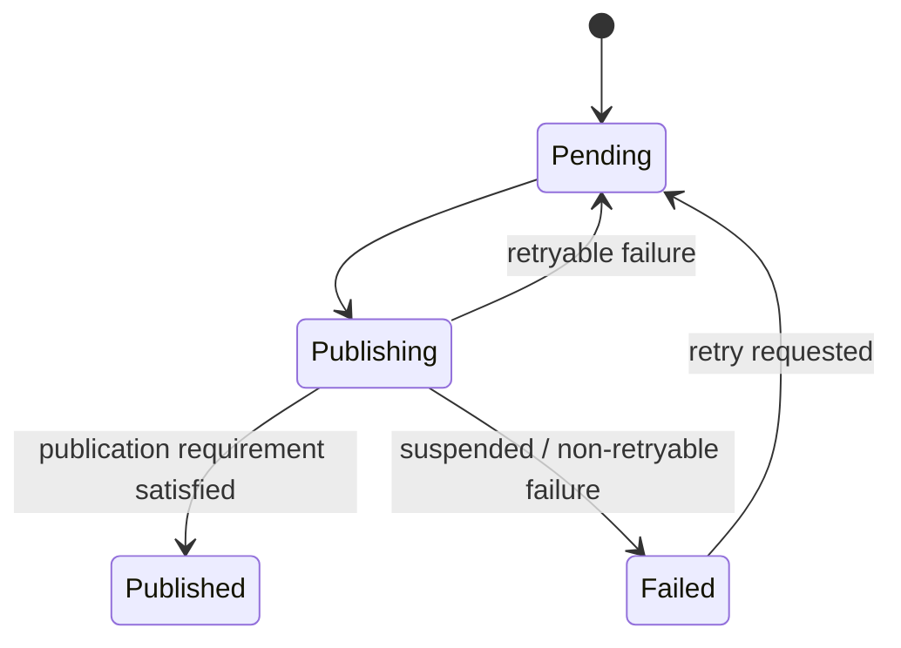

# Outbox and Publishing Implementation

**Status**

Pending Review

---

# Purpose

This document describes the implementation model for reliably publishing locally accepted application changes through the Resource Boundary.

The architectural requirements are defined by **ADR 09 — Outbox and Publishing**.

The key architectural relationship is:

```text
Accepted Local State
        ↓
Durable Publication Intent
        ↓
Resource Representation
        ↓
Signed Nostr Event
        ↓
Nostr Relays
```

This implementation uses a persistent Outbox, Resource serialization, background publication, retry handling, and publication-state tracking to satisfy that contract.

---

# Responsibilities

The implementation separates three concerns:

```text
Application / Domain
    owns accepted local state

Publication Preparation
    converts publication intent into
    a Resource Representation and Nostr event

Outbox
    owns durable asynchronous publication
```

The Outbox does not own Domain meaning or synchronization policy.

It is responsible for reliably completing publication work that has already been requested.

---

# Local-First Write Flow

A local application change becomes usable before Nostr publication succeeds.

For publishable Domain information, the implementation must durably preserve:

```text
Accepted Local Change
        +
Pending Publication Intent
```

A typical local write therefore behaves conceptually as:

```text
User Action
    ↓
Domain Operation
    ↓
Accepted Local State
    ↓
Persist Local State
    +
Persist Outbox Entry
    ↓
Local Operation Complete
```

Relay publication occurs independently afterward.

Where local persistence and Outbox persistence share a transactional storage mechanism, they should be committed atomically.

The implementation must prevent this state:

```text
Local change persisted
        +
required publication forgotten
```

The exact persistence mechanism is implementation-specific.

---

# Publication Preparation

The old implementation describes a Resource Serializer between Domain Objects and the Outbox.

That remains a useful implementation mechanism even though it is not an architectural layer.

Conceptually:

```text
Accepted Domain Information
        ↓
Resource Serializer
        ↓
Resource Representation
        ↓
Nostr Event Construction
        ↓
Signing
        ↓
Publication
```

The serializer is responsible for implementation concerns such as:

* selecting the Resource schema,
* reading the required Domain state,
* serializing that state,
* preserving the intended Resource Identifier,
* selecting the Resource Representation,
* and producing the representation payload.

It does not publish to relays.

The implementation may serialize when the Outbox entry is created or defer serialization until publication processing.

The architectural requirement is only that the durable Outbox entry contains enough information to recreate the intended publication.

---

# Outbox Entry

An Outbox entry represents one durable publication intent.

A practical entry may contain:

```text
Published Resource Identity

publication payload or information
required to construct it

target relay information

publication status

retry metadata

last failure

timestamps
```

A concrete implementation might resemble:

```ts
type OutboxEntry = {
  id: string

  kind: number
  publisher: string
  resourceId: string

  payload: unknown

  relays: string[]

  status:
    | 'pending'
    | 'publishing'
    | 'published'
    | 'failed'

  attempts: number
  nextAttemptAt?: number
  lastAttemptAt?: number
  lastError?: unknown

  createdAt: number
  updatedAt: number
}
```

This shape is illustrative rather than architectural.

The Outbox persistence format may change without changing the Resource Boundary contract.

---

# Published Resource Identity

Addressable Resource publications are grouped using:

```text
kind + publisher public key + d tag
```

The Outbox should retain this identity explicitly because it is useful for:

* operation coalescing,
* diagnostics,
* publication-state lookup,
* and identifying superseded pending work.

The Nostr event `id` is not known until a concrete event has been constructed and signed.

It identifies one publication rather than the durable Resource identity.

---

# Outbox Lifecycle

Each publication intent follows a simple local lifecycle:



The important states are:

**Pending**

The publication intent is durable and waiting to be attempted.

**Publishing**

A publisher is currently attempting to materialize and send the publication.

**Published**

The configured publication success requirement has been satisfied.

**Failed**

Automatic publication has stopped and intervention or another retry trigger is required.

Pending and failed entries remain durable across application restart.

Published entries may eventually be removed according to retention policy.

---

# Background Publisher

Outbox processing runs independently of the user interface.

Conceptually:

```text
Persistent Outbox
        ↓
Pending Entries
        ↓
Background Publisher
        ↓
Prepare Resource Publication
        ↓
Construct + Sign Nostr Event
        ↓
Configured Relays
        ↓
Update Outbox Status
```

Publication processing may be triggered:

* immediately after a local write,
* when network connectivity returns,
* during application startup,
* from periodic background work,
* or through an explicit retry action.

These triggers do not change ownership.

The Outbox remains responsible for durable publication regardless of when its processor runs.

---

# Event Construction and Signing

Before relay publication, the pending intent must become a concrete Nostr event.

Conceptually:

```text
Outbox Entry
    ↓
Resource Representation
    ↓
Nostr Event
    ↓
Publisher Signing
    ↓
Signed Nostr Event
    ↓
Relay Publish
```

The constructed event must preserve:

```text
kind
publisher pubkey
d tag
```

for the intended Published Resource Identity.

Signing produces the final immutable Nostr publication, including its event `id`.

Signing should occur as part of publication preparation rather than Domain behavior.

---

# Relay Publication

A Resource event may be published to multiple configured relays.

The current publication policy considers the operation successful when:

> **At least one configured relay accepts the event.**

Additional relay publication provides replication but does not need to block the publication from becoming successful locally.

Conceptually:

```text
Signed Event
    ├── Relay A
    ├── Relay B
    └── Relay C

at least one accepted
        ↓
Published
```

Per-relay state may still be retained for:

* diagnostics,
* retrying replication,
* relay health information,
* or future replication policies.

Relay location is not part of Resource Identity.

---

# Retry Behavior

Retryable publication failures remain pending.

Examples include:

* relay unavailable,
* connection failure,
* timeout,
* temporary relay rejection,
* or loss of network connectivity.

Automatic retries should use increasing delays rather than repeatedly attempting publication at high frequency.

A typical implementation may use exponential backoff.

For example:

```text
Failure
    ↓
Schedule Retry
    ↓
Increasing Delay
    ↓
Retry
```

A circuit breaker or relay-health mechanism may additionally suspend attempts against persistently failing relays.

Those are implementation optimizations rather than architectural requirements.

Pending publication intent must never be silently discarded because retry limits were reached.

---

# Application Restart

The Outbox is persistent.

Therefore:

```text
Pending Publication
        ↓
Application Shutdown
        ↓
Application Restart
        ↓
Load Outbox
        ↓
Resume Publication
```

The user does not need to recreate the Domain change.

Startup may schedule Outbox processing, but application readiness does not need to wait for pending publications to succeed.

---

# Operation Coalescing

Addressable Resource semantics allow some pending operations to be safely coalesced.

Suppose the Outbox contains:

```text
Resource X — State A
Resource X — State B
Resource X — State C
```

where each entry targets the same:

```text
kind + publisher + d
```

and none has yet been published.

If Resource semantics only require the newest state to be published, the implementation may reduce these to:

```text
Resource X — State C
```

This avoids publishing obsolete intermediate states.

Coalescing is valid only when replacing the earlier operation preserves protocol meaning.

It must not be applied blindly.

Append-only or independently meaningful events require separate Outbox entries.

---

# Coalescing Boundary

The Outbox may identify mechanically replaceable pending publications using Published Resource Identity.

It should not determine semantic authority between competing Domain states.

For example:

```text
same Published Resource
+
multiple local pending writes
```

may permit straightforward coalescing.

By contrast:

```text
local pending publication
+
new remote synchronized state
```

requires Synchronization policy to determine what should happen.

The Outbox does not make that decision itself.

---

# Stale Publications

An Outbox entry may become stale before it is published.

Possible causes include:

* a newer local edit,
* synchronization from another device,
* conflict reconciliation,
* or another operation superseding the publication.

The Outbox does not determine whether its queued Domain state remains authoritative.

It must not independently:

* query remote state to make that decision,
* compare local and remote Domain versions,
* merge Domain Objects,
* overwrite accepted local state,
* or resolve multi-device conflicts.

Synchronization may mark an Outbox operation as:

* superseded,
* replaced,
* cancelled,
* or regenerated.

Once a publication remains eligible for execution, the Outbox handles its transport reliably.

---

# Publication Status

Publication status is separate from local Domain availability.

Useful states include:

```text
saved locally

pending publication

publishing

published

failed publication
```

For example:

```text
Accepted Local Note
        +
Pending Publication
```

is still a valid, usable Note.

A relay failure changes publication status.

It does not make the local Domain Object unavailable.

The UI may expose publication status where useful without coupling ordinary Domain interaction to publication success.

---

# Delete Publications

The implementation should not assume that every local deletion maps directly to a generic Nostr deletion event.

Where a Resource Type defines explicit outbound deletion semantics, the resulting publication uses the normal Outbox pipeline:

```text
Local Domain Change
        ↓
Durable Publication Intent
        ↓
Deletion Resource / Nostr Representation
        ↓
Outbox
        ↓
Relay Publication
```

The Outbox treats such a publication as transport work.

The Resource Type or Domain determines what deletion means.

---

# Error Handling

Publication failures should retain enough information for diagnostics and retry decisions.

Useful information includes:

```text
Outbox entry identity
Published Resource Identity
relay
attempt count
last attempt time
failure category
underlying error
```

Errors should distinguish at least between:

* retryable transport failure,
* event construction failure,
* signing failure,
* relay rejection,
* and publication intentionally suspended.

The exact error hierarchy is implementation-defined.

---

# Persistence

Outbox entries must survive:

* normal application shutdown,
* unexpected termination,
* browser reload,
* temporary network loss,
* and failed publication attempts.

The implementation may use the application's local persistence mechanism.

The Outbox should be treated as durable application work, not an in-memory task queue.

---

# Concurrency

Only one logical publication operation for an Outbox entry should be active at a time.

If multiple background execution paths can process the Outbox, the implementation must prevent duplicate concurrent processing from corrupting publication state.

Duplicate relay publication of the same signed Nostr event is generally harmless, but local Outbox state should remain deterministic.

Implementation techniques may include:

* claiming an entry before publication,
* transactional status transitions,
* worker-level locking,
* or another single-consumer mechanism.

---

# Separation from Synchronization

The Outbox answers:

> **How do we reliably publish something the application has decided should be published?**

Synchronization answers:

> **What state should the application accept or publish when multiple devices have changed the same information?**

The Outbox therefore does not own:

* Last-Write-Wins decisions,
* remote comparison,
* conflict resolution,
* Domain merging,
* or local acceptance.

This separation should remain visible in the implementation.

---

# Separation from Domain Behavior

Domains should not contain relay transport logic.

Domain behavior may produce accepted local changes that require publication.

The publication implementation then handles:

```text
publication intent
    ↓
Resource serialization
    ↓
Nostr event construction
    ↓
signing
    ↓
relay transport
```

This keeps relay availability and transport concerns outside Domain behavior.

---

# Implementation Invariants

The implementation must preserve these behaviors:

```text
Local Domain state becomes usable before relay success.

Required publication intent is durable.

A crash cannot silently lose required publication work.

Pending publications survive restart.

Relay failure does not invalidate local Domain state.

Nostr events are signed before publication.

At least one relay acceptance satisfies
the current publication success policy.

Addressable pending operations may be coalesced
when replacement semantics make that safe.

Retryable failures remain durable.

The Outbox does not perform synchronization
or conflict resolution.
```

---

# Current Implementation Direction

A practical implementation can be organized around:

```text
Domain Operation
    ↓
Local Persistence
    +
Outbox Persistence
    ↓
Outbox Repository
    ↓
Background Publisher
    ↓
Resource Serializer
    ↓
Nostr Event Builder
    ↓
Signer
    ↓
Relay Publisher
```

These names describe implementation responsibilities rather than architectural layers.

They may be reorganized without changing the Resource Boundary contract as long as the required behavior remains intact.

---

# Relationship to Architecture

This implementation realizes:

* **ADR 01 — Domain Resource Model**
* **ADR 03 — Nostr Event Model**
* **ADR 04 — Nostr Resource Identity**
* **ADR 09 — Outbox and Publishing**

Multi-device reconciliation is intentionally outside this document and belongs to the synchronization implementation.

---

# Big Takeaway

The Outbox is durable application work representing Resource publications that still need to reach Nostr.

It allows this:

```text
User changes application state
        ↓
Change succeeds locally
        ↓
Publication can fail
        ↓
Application continues working
        ↓
Outbox retries later
        ↓
Resource eventually reaches Nostr
```

The implementation may use repositories, serializers, workers, retry schedulers, and relay adapters to accomplish that behavior.

Those mechanisms exist to preserve one fundamental property:

> **A local change does not require the network, but required publication is never forgotten.**
