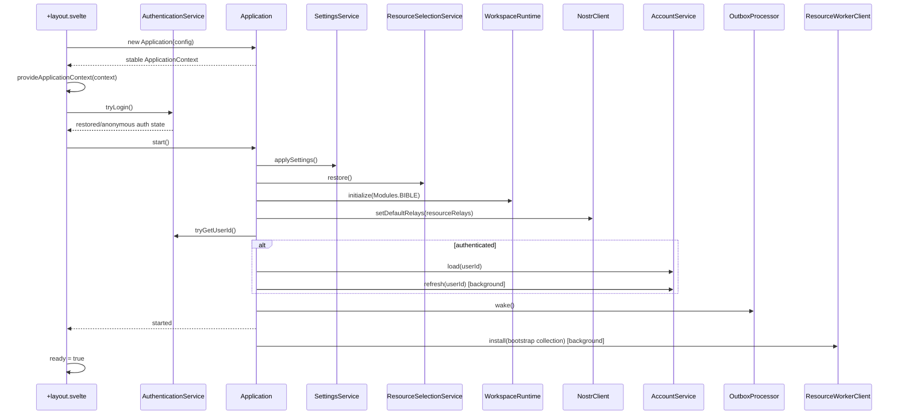
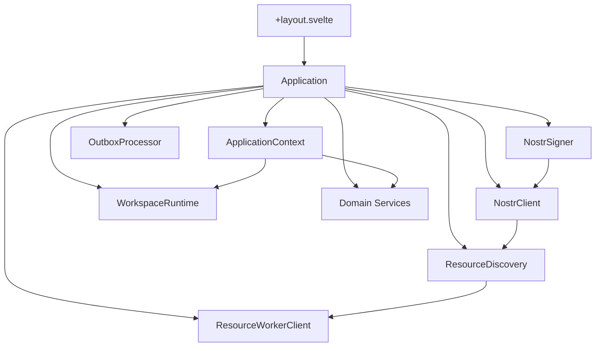

# Application Startup

## Status

Current

---

# Purpose

This document describes the current KJVOnly.bible browser application startup implementation.

It documents how the application:

* constructs the long-lived runtime object graph,
* exposes selected capabilities to Svelte,
* restores authentication before application startup,
* restores local runtime state,
* initializes the Workspace,
* configures Nostr transport,
* resumes durable publication work,
* starts bootstrap Resource installation without blocking interactivity,
* and disposes application-owned browser infrastructure.

The central implementation boundary is the concrete `Application` composition root:

```text
src/lib/application/runtime/application.ts
```

The most important ownership rule is:

> `Application` constructs and owns the running application object graph. Svelte starts and presents that graph; it does not compose it.

The concrete `Application` class is deliberately not part of the public `$lib/application` barrel.

The one runtime location that directly imports and constructs `Application` is:

```text
src/routes/+layout.svelte
```

---

# Scope

This document covers:

* `Application` as the composition root,
* `ApplicationConfig`,
* `ApplicationContext`,
* the `$lib/application` and `$lib/application/ui` public boundaries,
* root Svelte bootstrap,
* authentication restoration ordering,
* synchronous dependency composition,
* `Application.start()`,
* Settings application,
* Resource-selection restoration,
* Workspace initialization,
* Nostr relay configuration,
* Account loading and refresh,
* Outbox wakeup,
* bootstrap Resource installation,
* Resource Worker ownership,
* main-thread Resource Discovery,
* application readiness,
* startup failure behavior,
* `Application.stop()`,
* Worker composition-root rules,
* and important startup invariants.

This document does not redefine:

* Workspace algorithms,
* Pane-tree behavior,
* Buffer behavior,
* Resource Resolution algorithms,
* Resource descriptor semantics,
* Domain interpretation or validation,
* Nostr protocol mechanics,
* Outbox publication algorithms,
* domain persistence schemas,
* or synchronization behavior.

Those subsystems own their own behavior. `Application` composes and coordinates them.

---

# Related Documents

The most closely related implementation documents are:

```text
docs/03_implementation/runtime/001-root-runtime.md
docs/03_implementation/runtime/002-pane-tree.md
docs/03_implementation/runtime/003-grid-layout.md
docs/03_implementation/runtime/004-rendering-engine.md
docs/03_implementation/runtime/005-buffer-contract.md
docs/03_implementation/runtime/006-runtime-services.md
```

The runtime documents describe presentation and Workspace behavior in more detail.

This document focuses specifically on composition and startup.

---

# High-Level Ownership Model

The current runtime ownership model is:

```text
Browser / Svelte
    ↓
+layout.svelte
    ↓
Application
    = composition root + lifecycle owner
    ↓
ApplicationContext
    = selected Svelte-facing runtime capabilities
    ↓
WorkspaceRuntime + application/domain services
    ↓
Svelte containers/components
```

Infrastructure remains below the Application boundary:

```text
Application
    ↓
Nostr infrastructure
Resource Worker bridge
Outbox
IndexedDB persistence
Domain stores
Domain services
```

The Application is where concrete implementations are connected.

It is not where their internal behavior is implemented.

---

# Source Organization

The main startup files are:

```text
src/routes/+layout.svelte

src/lib/application/
    index.ts
    ui/index.ts
    config/application.config.ts
    runtime/application.ts
    runtime/application-context.ts
```

The composition root imports concrete implementations from their owning areas, including:

```text
src/lib/domains/
src/lib/resource/
src/lib/infrastructure/
src/lib/application/outbox/
src/lib/application/resources/
src/lib/application/services/
```

This does not mean those implementations belong to the Application layer.

It means `Application` is the place where the running implementation graph is assembled.

---

# Public Application Boundaries

The Application layer has two normal public entry points:

```text
$lib/application
$lib/application/ui
```

## `$lib/application`

This is the browser-safe / Node-safe application API.

It exposes stable application contracts and capabilities such as:

```text
ApplicationConfig
ApplicationContext
Modules
Settings contracts/services
Workspace runtime contracts
Resource-selection application contracts
Outbox contracts
account/authentication contracts
```

It intentionally does **not** export the concrete `Application` composition root.

## `$lib/application/ui`

This is the browser/Svelte presentation API.

It contains Svelte components and DOM/browser-facing helpers.

Keeping UI exports separate prevents Node-side consumers from loading browser-only dependencies such as Svelte components or Quill through a general application barrel.

---

# The Concrete Application Import Rule

The concrete `Application` class lives at:

```text
$lib/application/runtime/application
```

The only runtime bootstrap location that should import it directly is:

```text
src/routes/+layout.svelte
```

Conceptually:

```typescript
import {
    createApplicationConfig,
    provideApplicationContext
} from '$lib/application';

// Bootstrap boundary only.
import {
    Application
} from '$lib/application/runtime/application';
```

This rule matters for dependency direction.

Lower-level domain and infrastructure code may consume application contracts through `$lib/application`.

If the root barrel also exported `Application`, a lower-level runtime value import could create a path such as:

```text
Application
    → lower-level implementation
        → $lib/application
            → Application
```

Keeping the concrete composition root out of the barrel avoids that cycle.

---

# Application Configuration

Application configuration is created through:

```typescript
createApplicationConfig()
```

The current configuration contains:

```typescript
interface ApplicationConfig {
    readonly resourceRelays:
        readonly NostrRelay[];

    readonly accountBootstrapRelays:
        readonly NostrRelay[];
}
```

Both are currently derived from:

```text
VITE_NOSTR_COMMA_DELIMITED_RELAY_URLS
```

The configuration boundary owns startup policy values.

It does not construct services.

The direction is:

```text
environment
    ↓
ApplicationConfig
    ↓
Application
    ↓
concrete infrastructure configuration
```

not:

```text
environment
    ↓
random Svelte components
    ↓
infrastructure configuration
```

---

# `+layout.svelte` Is the Browser Bootstrap Boundary

The root layout performs the browser/Svelte lifecycle work around the Application.

Its responsibilities are intentionally small:

```text
construct Application
provide ApplicationContext
request persistent browser storage best-effort
restore authentication
start Application
expose ready/error UI state
stop Application on teardown
```

It does not construct Domain services, Resource processors, Nostr clients, Outbox strategies, or Workspace persistence.

---

# Root Layout Construction

During component initialization, the root layout performs:

```typescript
const application =
    new Application(
        createApplicationConfig()
    );

provideApplicationContext(
    application.context
);
```

The `ApplicationContext` object therefore exists synchronously before `onMount()` startup work completes.

The context object is stable for the lifetime of the root layout.

---

# Why Context Exists Before Startup

`ApplicationContext` answers:

> Which Application-owned capabilities are available to the Svelte subtree?

It is not a readiness signal.

Readiness is controlled separately by the root layout:

```text
Application constructed
    ↓
ApplicationContext provided
    ↓
startup runs
    ↓
ready = true
    ↓
child application UI rendered
```

Descendants are therefore not rendered as the interactive application until startup succeeds.

---

# ApplicationContext

`ApplicationContext` is the intentional Svelte-facing runtime capability surface.

It is **not** a dump of everything `Application` constructs.

The current context includes application-level services such as:

```text
authenticationService
accountService
toastService
settingsService
navigationServiceFactory
archiveService
```

Workspace/runtime capabilities:

```text
workspaceRuntime
moduleResourceSelectionResolver
```

Bible capabilities:

```text
chapterService
paragraphsService
pericopesService
bibleTextMarkupService
bibleBooknamesService
searchService
verseService
bibleVersionsService
bookGroupingsService
bibleLocationReferenceService
bibleNavigationService
```

Notes:

```text
notesService
```

Reading Plans:

```text
planDefinitionsService
planSubscriptionsService
planProgressService
plansPubSubService
subsEnricherService
encodedReadingsDecoderService
```

Strong's:

```text
strongsService
```

Infrastructure-only objects are deliberately not exposed merely because they are constructed by `Application`.

Examples of private Application-owned dependencies include:

```text
NostrSigner
NostrClient
ResourceWorkerClient
ResourceSelectionService
OutboxProcessor
PaneService
ResourceDiscovery
concrete stores
publication strategies
```

---

# ApplicationContext Is Not a Service Locator

Svelte may consume Application-owned runtime capabilities through:

```typescript
useApplicationContext()
```

Core services should not reach into Svelte context to discover their own collaborators.

Avoid:

```typescript
class ExampleService {
    run(): void {
        const context =
            useApplicationContext();

        context.someService.doSomething();
    }
}
```

Prefer constructor injection:

```typescript
class ExampleService {
    constructor(
        private readonly dependency:
            Dependency
    ) {}
}
```

`Application` creates and wires the concrete graph.

Dependencies flow downward.

---

# Synchronous Composition

`new Application(config)` synchronously constructs the long-lived runtime graph.

This includes substantial browser/runtime infrastructure.

The important conceptual groups are:

```text
Nostr + authentication
Outbox + Nostr event publication
Account
Resource Worker bridge
Resource-selection runtime
Workspace runtime
Application services
Bible services
Notes services
Reading Plans services
Strong's services
ApplicationContext
```

Construction does not mean the application is ready.

`Application.start()` performs the ordered startup transition.

---

# Nostr and Authentication Composition

Application construction creates one long-lived:

```text
NostrSigner
```

That signer is injected into:

```text
NostrAuthenticationStrategy
NostrClient
```

The current main-thread composition is conceptually:

```text
NostrSigner
    ├── NostrAuthenticationStrategy
    │       ↓
    │   AuthenticationService
    │
    └── NostrClient
```

`NostrClient` owns relay transport behavior.

`AuthenticationService` owns application-facing authentication behavior.

The raw signer and Nostr client remain private to the Application composition.

---

# Authentication Restoration Happens Before `Application.start()`

The current root startup ordering deliberately places saved-login restoration in `+layout.svelte`:

```typescript
await application.context
    .authenticationService
    .tryLogin();

await application.start();
```

This means `Application.start()` may inspect the restored user ID when deciding whether to load Account state.

The ordering is:

```text
restore authentication
    ↓
Application.start()
    ↓
load authenticated Account state when available
```

Authentication failure behavior belongs to `AuthenticationService` / its strategy.

`Application.start()` does not duplicate login interpretation.

---

# Nostr Resource Discovery Remains on the Main Thread

The Application constructs:

```text
ResourceDiscovery
```

using the main-thread `NostrClient`.

Its responsibility is to translate transport-specific Nostr discovery results into Resource representations.

The current boundary is:

```text
Nostr transport
    ↓
ResourceDiscovery
    ↓
ResourceRepresentation
    ↓
Resource Worker
```

Everything after discovery runs through the Resource Worker boundary.

---

# Resource Worker Composition

The Application creates a browser `ResourceWorkerClient` through:

```typescript
createBrowserResourceWorkerClient(
    resourceDiscovery,
    [
        new NostrResourceResolutionStrategy(
            nostrClient
        )
    ]
)
```

The main Application therefore owns the worker bridge and the discovery transport used by that bridge.

The Resource Worker owns Resource processing such as:

```text
ResourceService
    ↓
Resource Resolution
    ↓
descriptor processing
    ↓
external retrieval / integrity verification
    ↓
Resource content decoding
    ↓
ResourceHandler dispatch
    ↓
Domain interpretation / validation
    ↓
Domain installation
    ↓
Resource receipt persistence
```

This is a major difference from the older main-thread ResourceClient architecture.

There is no current Svelte-facing `ResourceClient` capability.

---

# Workers Are Separate Composition Roots

A Worker does not consume `ApplicationContext`.

Workers are separate runtime/composition boundaries and may construct their own local stateless/domain dependencies.

This rule is used by current implementations such as Reading Plans and Notes worker paths.

Conceptually:

```text
Browser Application
    → Application composition root

Worker
    → worker-local composition root
```

Do not make a domain helper global merely so both roots can share the same object instance.

Share types and behavior definitions; construct instances in the appropriate root.

---

# Outbox Composition

Application construction creates the durable Outbox publication path.

The high-level composition is:

```text
IndexedDBOutboxStore
    ↓
OutboxProcessor
    ├── NostrResourcePublicationStrategy
    └── NostrEventPublicationStrategy
```

Resource publication uses:

```text
ResourceContentDecoratorBuilder
    ├── application/json
    ├── gzip
    └── hex
        ↓
ResourceContentEncoder
        ↓
NostrResourcePublicationStrategy
```

The Outbox processor is application-owned but not exposed directly through `ApplicationContext`.

Domain write services receive the publication/wakeup capabilities they need through constructor injection.

---

# Nostr Event Composition

Application also composes local persistence and publication for selected Nostr events:

```text
IndexedDBNostrEventsStore
IndexedDBNostrEventWriteTransaction
NostrEventPublication
OutboxProcessor
    ↓
NostrEventsService
```

`NostrAccountStrategy` consumes `NostrEventsService` rather than making the Profile UI talk directly to raw Nostr infrastructure.

---

# Account Composition

The account path is:

```text
NostrClient
NostrEventsService
ApplicationConfig.accountBootstrapRelays
KJVOnly publisher key
    ↓
NostrAccountStrategy
    ↓
AccountService
    ↓
ApplicationContext
    ↓
Profile UI
```

Relay/account state is application state.

The removed `NostrAccountRelayProvider` should not be recreated as a parallel UI state channel.

---

# Resource Selection Composition

The Application constructs:

```text
LocalStorageResourceSelectionStore
    ↓
ResourceSelectionService
    ↓
ModuleResourceSelectionBuilder
    ↓
ModuleBufferFactory
    ↓
WorkspaceRuntime
```

Module-specific Resource requirements are contributed through domain-owned contributors.

Current contributors include:

```text
Bible
Bible Search
Strong's
Notes
Reading Plans
No-Resource application modules
```

The generic selection builder must not regain module-specific branching such as:

```typescript
if (module === Modules.BIBLE) {
    // ...
}
```

Module Resource semantics belong to contributors.

---

# Workspace Composition

The Workspace path is:

```text
PaneService
    ↓
WorkspaceRuntime
```

`PaneService` remains an internal implementation dependency.

`WorkspaceRuntime` is the Svelte-facing Workspace coordinator and is exposed through `ApplicationContext`.

The Application also creates:

```text
ModuleResourceSelectionResolver
```

against the `WorkspaceRuntime` so module UI can resolve the Resource-selection snapshot captured on each Buffer.

---

# Per-Container Runtime State Uses Factories

Not every runtime service should be a singleton.

`NavigationService` is intentionally per-container state.

Application therefore constructs:

```text
NavigationServiceFactory
```

and exposes the factory through `ApplicationContext`.

Login/Profile containers request their own independent navigation service.

This avoids accidentally sharing one navigation stack between independent module instances.

The general rule is:

```text
shared application state
    → long-lived Application-owned service

independent per-container state
    → Application-owned factory
```

---

# Domain Service Composition

Application composes domain-facing services with their stores, Resource loaders, publication paths, and helper services.

Examples include:

```text
Bible
    ChapterService
    ParagraphsService
    PericopesService
    BibleTextMarkupService
    BibleBooknamesService
    BibleVersionsService
    SearchService
    VerseService
    BibleNavigationService

Notes
    NotesService

Reading Plans
    PlanDefinitionsService
    PlanSubscriptionsService
    PlanProgressService
    PlansPubSubService
    SubsEnricherService
    EncodedReadingsDecoderService

Application archive
    KJVOnlyArchiveService

Strong's
    StrongsService
```

The Composition Root imports concrete persistence adapters when wiring these services.

That is intentional composition-root behavior and is not a domain-boundary violation.

Application composition also registers independent owners that observe completed Archive imports when they maintain derived or cached runtime state.

Conceptually:

```text
KJVOnlyArchiveService
    → Import Completed observation
        ├── PlansPubSubService
        ├── NotesService
        ├── SearchRuntime
        ├── BibleBooknamesService
        └── BibleTextMarkupService
```

The Archive service only reports the completed import and handled Resource Types. Each subscriber owns any refresh/invalidation behavior it chooses to perform.

---

# ResourceLoader Boundary

Domain Resource-backed services use `ResourceLoader` over the generic install capability supplied by `ResourceWorkerClient`.

Conceptually:

```text
Domain Service
    ↓
ResourceLoader
    ↓
ResourceWorkerClient.install(reference)
```

Domain services therefore do not know about Resource Worker message mechanics or Nostr transport.

---

# Current ApplicationContext Construction

After the object graph is composed, `Application` creates one context object containing only Svelte-facing capabilities.

Conceptually:

```typescript
this.context = {
    authenticationService,
    accountService,
    toastService,
    settingsService,
    navigationServiceFactory,

    workspaceRuntime,
    moduleResourceSelectionResolver,

    // Bible services
    // Notes services
    // Reading Plans services
    // Strong's services
};
```

The context object is not replaced during startup.

---

# Root Startup Flow

The actual root startup flow is:

```text
+layout.svelte initializes
    ↓
createApplicationConfig()
    ↓
new Application(config)
    ↓
provideApplicationContext(application.context)
    ↓
onMount()
    ↓
request persistent browser storage (best effort, non-blocking)
    ↓
authenticationService.tryLogin()
    ↓
application.start()
    ↓
ready = true
    ↓
render child application UI
```

If startup throws:

```text
startupError = error
    ↓
render "Application startup failed."
```

When the root layout is destroyed:

```text
application.stop()
```

is invoked.

---

# Persistent Browser Storage Is Best Effort

The root layout requests persistent browser storage through the Storage API when available.

This request is deliberately non-blocking:

```typescript
void requestPersistentStorage();
```

Failure to obtain persistent storage does not prevent the application from starting.

This is browser durability policy, not an application-readiness requirement.

---

# `Application.start()` State Model

`Application` tracks a small lifecycle state:

```text
created
starting
started
stopped
```

It also retains the in-flight startup Promise.

Important behavior:

```text
start() while started
    → resolves immediately

start() while startup already in progress
    → returns the same Promise

start() after stopped
    → rejects

startup failure
    → state returns to created
    → startPromise cleared
    → a later start may retry
```

This makes startup idempotent for normal repeated callers without allowing a stopped Application to restart.

---

# `Application.startInternal()` Ordering

The current ordered startup sequence is:

```text
1. apply Settings to the document
2. restore Resource selections
3. initialize WorkspaceRuntime with the Bible module
4. configure Nostr Resource relays
5. inspect restored authenticated user ID
6. load Account state when authenticated
7. begin Account refresh in the background
8. wake the durable Outbox
9. mark Application started
10. begin bootstrap Resource installation asynchronously
```

Each step has a distinct ownership reason.

---

# Step 1 — Apply Settings

Startup begins with:

```typescript
settingsService.applySettings();
```

This applies persisted/default visual Settings to the document before the interactive application is exposed.

The Settings UI owns editing/persistence behavior.

Startup owns applying the current settings at application initialization.

---

# Step 2 — Restore Resource Selections

Application restores persisted Resource-selection state through:

```typescript
resourceSelectionService.restore();
```

This occurs before Workspace initialization so newly created Buffers can capture the restored Resource-selection snapshot.

The ordering is important:

```text
restore Resource selections
    ↓
initialize Workspace
    ↓
create initial Buffer
    ↓
capture selections
```

---

# Step 3 — Initialize Workspace

The Workspace starts with:

```typescript
workspaceRuntime.initialize(
    Modules.BIBLE
);
```

`WorkspaceRuntime` owns Workspace restoration/initialization behavior.

`Application` only decides when that initialization occurs and which initial module is requested.

The current initial module is Bible.

---

# Step 4 — Configure Resource Relays

Application then configures the long-lived `NostrClient`:

```typescript
nostrClient.setDefaultRelays(
    config.resourceRelays
);
```

Configuration values belong to `ApplicationConfig`.

Relay mechanics belong to `NostrClient`.

Application coordinates the two.

---

# Step 5 — Resolve Restored User Identity

After authentication restoration has already run in `+layout.svelte`, startup checks:

```typescript
authenticationService.tryGetUserId()
```

If no user is authenticated, Account loading is skipped.

Anonymous Resource reading and local application startup are therefore not blocked on Account state.

---

# Step 6 — Load Account State

When a user ID exists, Application awaits:

```typescript
accountService.load(userId)
```

This makes the currently known Account state available before startup completes.

The Account service owns Account semantics.

Application owns startup ordering.

---

# Step 7 — Refresh Account State in the Background

After the synchronous startup Account load, Application starts:

```typescript
void accountService.refresh(userId)
```

Refresh failure is logged but does not fail Application startup.

This preserves the distinction between:

```text
local/current Account state
    = startup-relevant

remote Account refresh
    = background work
```

---

# Step 8 — Wake the Durable Outbox

Application then calls:

```typescript
outboxProcessor.wake();
```

The Outbox is durable.

Startup does not rebuild publication intent from Domain stores.

It only wakes pending publication work after signing and relay configuration are ready.

---

# Step 9 — Mark the Application Started

At this point Application sets:

```text
state = started
```

The application is considered interactive before bootstrap Resource processing completes.

This preserves the local-first startup rule.

---

# Step 10 — Start Bootstrap Resource Installation Asynchronously

After becoming started, Application launches:

```typescript
void installBootstrapResources();
```

This work does not block `Application.start()`.

The configured bootstrap Resource is currently:

```text
publisher:
    KJVONLY_PUBKEY

resourceId:
    kjvonly/resources/collections/default
```

The Resource Worker performs installation.

The bootstrap collection may recursively install multiple Resources.

---

# Bootstrap Resource Failure Is Non-Fatal

Bootstrap installation is intentionally best-effort after readiness.

Application logs conditions such as:

```text
bootstrap Resource not found
selection initialization failure
incomplete terminal Resources
bootstrap installation failure
```

but does not transition the already-started application back into failure.

This is deliberate.

A user should be able to enter the application from available local state even if remote bootstrap acquisition fails.

---

# Bootstrap Resource Selections

After successful bootstrap installation, Application examines the terminal installed Resources and initializes missing global Resource selections where the result is unambiguous.

The logic deliberately ignores:

```text
the collection Resource itself
results without trustworthy identity
Resource Types that resolve to multiple distinct terminal Resources
```

For a Resource Type with exactly one terminal Resource, Application may initialize the missing selection.

If multiple Resources of the same Resource Type are installed, Application leaves selection to domain/module policy instead of guessing.

This preserves the distinction between:

```text
bootstrap installation
    ≠
forced global selection
```

---

# Readiness Contract

The application becomes ready when:

```text
authentication restoration attempt completed
Application.start() completed
```

Readiness does **not** require:

```text
bootstrap Resource installation completion
Account remote refresh completion
all Resources downloaded
all relays reachable
all synchronization completed
all background workers idle
```

This keeps startup responsive and local-first.

---

# Root Layout Ready/Error Rendering

The root layout tracks:

```text
ready
startupError
```

Presentation is:

```text
ready
    → render child application UI

startupError
    → render startup failure message

otherwise
    → render loading state
```

The child Workspace route therefore does not render as interactive application UI until startup has completed successfully.

---

# Startup Failure Behavior

If a readiness-critical operation inside `Application.startInternal()` throws:

```text
state
    → created

startPromise
    → undefined

error
    → rethrown to +layout.svelte
```

The root layout captures the error and presents the startup failure state.

Background work that is intentionally non-critical handles its own failure locally instead.

Examples include:

```text
persistent-storage request
Account refresh
bootstrap Resource installation
```

---

# Shutdown

The root layout teardown calls:

```typescript
void application.stop();
```

`Application.stop()` is idempotent.

The current shutdown order is:

```text
1. dispose ResourceWorkerClient
2. dispose NostrClient
3. clear NostrSigner
4. mark Application stopped
```

The Resource Worker bridge is disposed before the main-thread Nostr discovery transport so the worker cannot begin another discovery request during transport teardown.

---

# Stopped Applications Do Not Restart

After `Application.stop()`:

```text
state = stopped
```

A later `start()` rejects with:

```text
Application has already been stopped.
```

A disposed Application instance is not reused.

A new root lifetime creates a new Application object graph.

---

# Main-Thread vs Worker Ownership

The current Resource split is important enough to state explicitly.

Main thread:

```text
Application
NostrClient
ResourceDiscovery
ResourceWorkerClient bridge
Svelte runtime
WorkspaceRuntime
Domain-facing services
Outbox publication
```

Resource Worker:

```text
ResourceService
Resource Resolution
Descriptor processing
Resource decoding
ResourceHandler dispatch
Domain interpretation / validation
Domain installation
Resource receipt persistence
```

Do not move Resource processing back to a Svelte-facing main-thread Resource service merely for convenience.

---

# Application Owns Object Lifetime, Not Domain Behavior

Application construction may be large because it is the one explicit composition root.

That does not make Application responsible for implementing subsystem behavior.

Examples:

```text
Application
    chooses which Resource publication strategies exist

OutboxProcessor
    performs publication processing
```

```text
Application
    wires ChapterService to its store/loader/helpers

ChapterService
    owns chapter behavior
```

```text
Application
    initializes WorkspaceRuntime

WorkspaceRuntime
    owns Workspace behavior
```

This distinction prevents the composition root from becoming a god service.

---

# Concrete Imports Are Expected in the Composition Root

The Application file intentionally imports concrete implementations from domains and infrastructure.

Examples include:

```text
IndexedDB stores
Nostr strategies
Resource-selection contributors
publication implementations
worker factories
```

That is not a violation of public domain boundaries.

A composition root must know which implementations it is composing.

The public-root import rule primarily applies to ordinary external consumers, not to the composition root selecting concrete implementations.

---

# No Dependency-Injection Framework

KJVOnly.bible uses explicit TypeScript construction rather than a DI framework.

The pattern is:

```typescript
const dependency =
    new ConcreteDependency(...);

const service =
    new Service(
        dependency
    );
```

Benefits include:

```text
visible ownership
explicit dependencies
compile-time checking
straightforward tests
no runtime service registry
```

There is currently no need for reflection or a dependency-injection container.

---

# Avoid File-Level Runtime Singletons

A major cleanup direction has been removing patterns such as:

```typescript
export const service =
    new Service();
```

for long-lived application/domain capabilities.

Such patterns create runtime state as a side effect of importing a module and obscure ownership.

The preferred pattern is:

```text
Application
    constructs shared runtime service

Worker composition root
    constructs worker-local service

Application-owned factory
    constructs independent per-container state
```

Not every class needs Application ownership, but active runtime ownership should be explicit.

---

# Browser-Only Construction

`Application` is a browser runtime object.

Its construction depends on browser capabilities such as:

```text
localStorage
window callbacks for NIP-46 authorization
Web Workers
browser Nostr transport
IndexedDB-backed stores
```

The concrete Application class should therefore not become a general Node-safe API export.

Tests that explicitly exercise Application bootstrap may import the concrete file intentionally, but normal library consumers should use stable contracts rather than constructing the root.

The runtime convention remains that the actual application bootstrap import belongs in `+layout.svelte`.

---

# Important Types and Objects

## `Application`

Concrete composition root and lifecycle owner.

Public lifecycle:

```text
constructor(config)
context
start()
stop()
```

## `ApplicationConfig`

Environment-derived startup policy.

Current relay groups:

```text
resourceRelays
accountBootstrapRelays
```

## `ApplicationContext`

Selected stable Svelte-facing capabilities composed for the running Application.

## `ResourceWorkerClient`

Main-thread bridge to Resource processing in the Resource Worker.

## `ResourceDiscovery`

Main-thread Nostr discovery boundary used by the worker bridge.

## `WorkspaceRuntime`

Application-facing Workspace coordinator.

## `ResourceSelectionService`

Application-owned current/default Resource-selection state and persistence boundary.

## `OutboxProcessor`

Application-owned durable publication processor.

## `NavigationServiceFactory`

Factory for independent per-container navigation state.

---

# Current Startup Sequence Diagram



---

# Composition Diagram



---

# Startup Invariants

The following invariants should remain true unless startup architecture is intentionally revised.

## One Runtime Composition Root

The browser application object graph is composed by one `Application` instance.

## One Bootstrap Import Site

The concrete `Application` class is imported directly by `+layout.svelte` as the runtime bootstrap boundary.

## Context Is Stable

`ApplicationContext` is constructed once and provided before asynchronous startup.

## Context Is Selective

Infrastructure is not exposed merely because Application owns it.

## Authentication Restoration Precedes Application Startup

`tryLogin()` runs before `Application.start()` so authenticated Account loading can participate in startup.

## Resource Selection Precedes Workspace Initialization

Buffers should capture restored Resource selections, not transient defaults that are restored afterward.

## Local Runtime Readiness Precedes Bootstrap Resource Completion

Bootstrap Resource installation must not become an unnecessary interaction gate.

## Outbox Work Resumes After Signing/Relay Setup

Durable publication work is awakened after startup has restored the relevant runtime state.

## Workers Do Not Consume Svelte Context

Workers compose their own runtime dependencies.

## Shutdown Mirrors Ownership

Application stops infrastructure it owns in an order that prevents new work from racing with teardown.

---

# Anti-Patterns

Avoid the following.

## Exporting `Application` Through `$lib/application`

This weakens the composition-root boundary and can introduce circular value imports.

## Constructing Application Services in Svelte Components

Svelte should consume Application-owned capabilities through `ApplicationContext`, or use an Application-owned factory for per-container state.

## Exposing Raw Infrastructure Through ApplicationContext

Do not expose `NostrClient`, `ResourceWorkerClient`, `PaneService`, or similar implementation dependencies for UI convenience.

## Making Workers Depend on ApplicationContext

Workers are separate composition roots.

## Blocking Readiness on Remote Bootstrap Work

Remote installation/refresh work should remain background work unless the application truly cannot operate without it.

## Reintroducing Global Runtime Singletons

Prefer explicit ownership and constructor injection.

## Moving Subsystem Behavior Into Application

Application coordinates lifecycle; it should not absorb Domain, Resource, Workspace, or Outbox algorithms.

---

# Testing Guidance

Startup-related tests should focus on observable lifecycle and boundary behavior.

Useful concerns include:

```text
Application start idempotence
start-after-stop rejection
startup ordering where behavior depends on order
Workspace initialization
Resource-selection restoration
relay configuration
Account load behavior for authenticated users
Outbox wakeup
non-blocking bootstrap installation
stop/disposal behavior
```

Unit tests for lower-level services should construct those services directly with explicit collaborators rather than retrieving them from Svelte context.

Browser tests that intentionally exercise the whole application may construct the concrete Application root when needed, but production runtime code should preserve the single `+layout.svelte` bootstrap import rule.

---

# Current vs Historical Startup Architecture

Older implementation documents and historical code may refer to concepts such as:

```text
ResourceClient exposed through ApplicationContext
main-thread ResourceService composition
verification-worker startup owned directly by Application
future Workspace migration into Application
file-level service singleton migration as unfinished future work
```

Those descriptions are no longer current.

The current implementation instead uses:

```text
NostrClient
    + main-thread ResourceDiscovery
    + ResourceWorkerClient
    + worker-owned Resource processing

WorkspaceRuntime
    already owned by Application

selected Svelte-facing services
    exposed through ApplicationContext

runtime service construction
    substantially moved into explicit composition roots/factories
```

When historical documents disagree with this implementation, current source and the current runtime implementation documents take precedence.

---

# Key Takeaways

The current startup implementation can be summarized as:

```text
+layout.svelte
    = single browser bootstrap boundary

Application
    = concrete composition root + lifecycle owner

ApplicationContext
    = selected Svelte-facing capabilities

$lib/application
    = browser-safe public application API

$lib/application/ui
    = browser/Svelte presentation API

ResourceDiscovery
    = main-thread transport discovery boundary

ResourceWorkerClient
    = bridge to worker-owned Resource processing

WorkspaceRuntime
    = application-facing Workspace coordinator
```

Startup itself is intentionally ordered:

```text
restore authentication
    ↓
apply Settings
    ↓
restore Resource selections
    ↓
initialize Workspace
    ↓
configure relays
    ↓
load Account state when authenticated
    ↓
wake Outbox
    ↓
mark application interactive
    ↓
perform bootstrap Resource installation in the background
```

The design keeps ownership explicit, preserves local-first readiness, keeps browser-only presentation code out of Node-safe public barrels, and avoids hidden runtime construction through file-level singletons or service-locator behavior.
