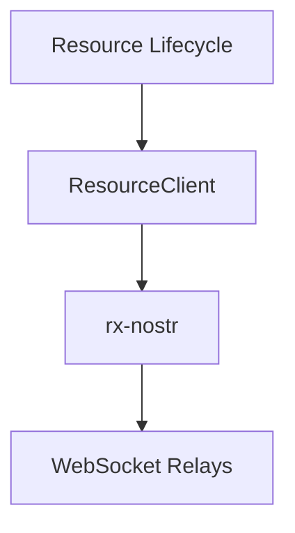
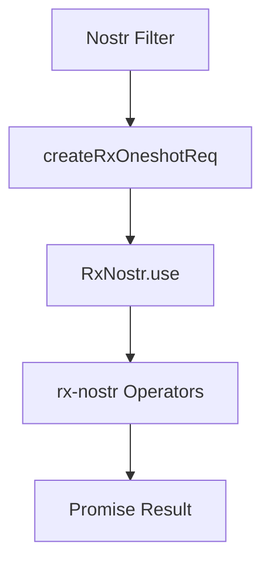
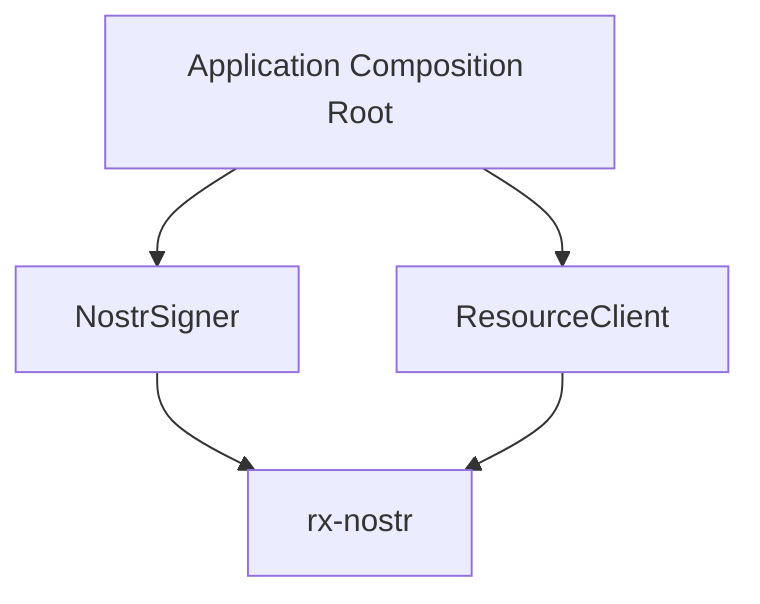
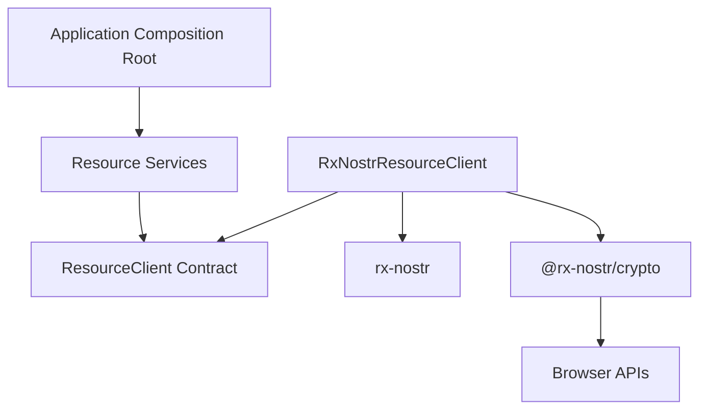
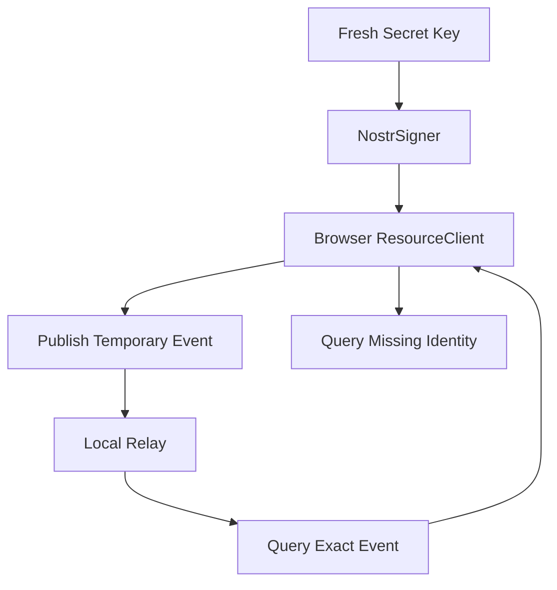
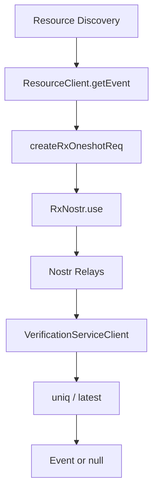
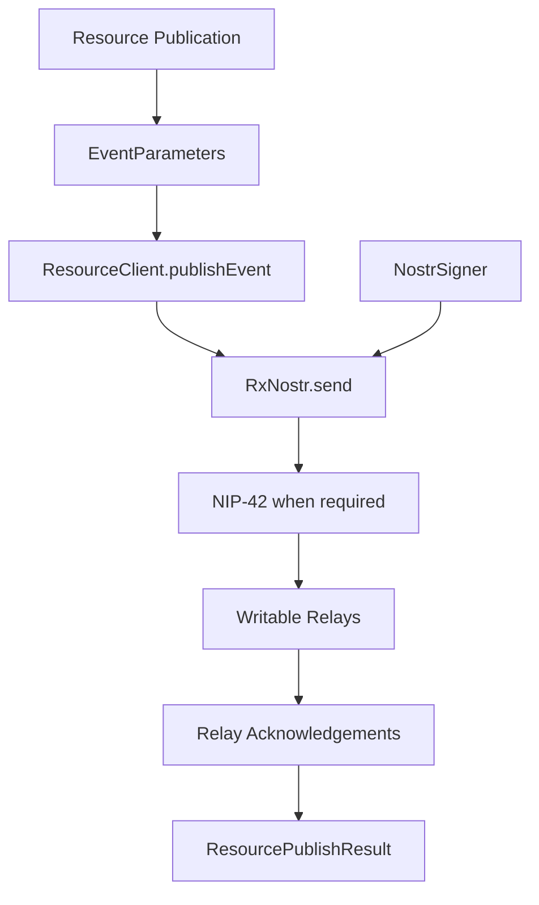
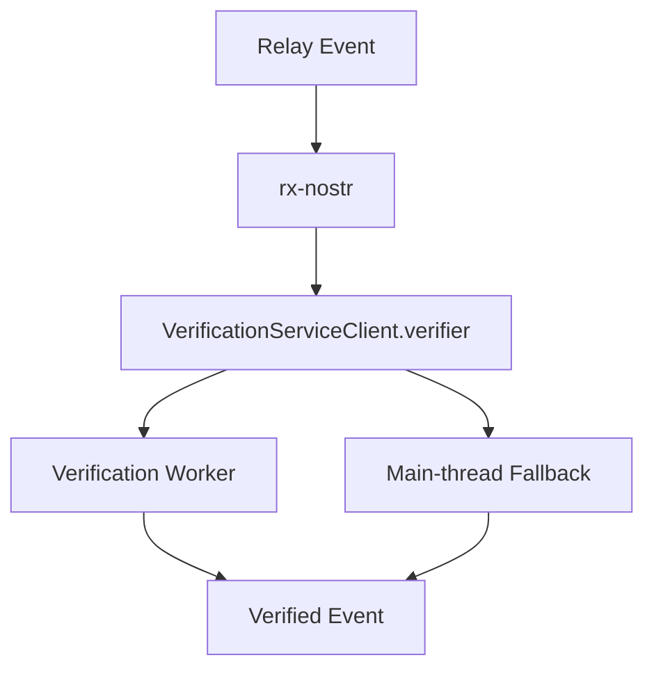

# Resource Client

## Status

Current

---

# Purpose

The Resource Client is the application-facing Nostr transport boundary used by the Resource implementation.

It provides a small, stable API for:

* bounded event reads,
* multi-event reads,
* live event subscriptions,
* event publication,
* relay selection,
* relay configuration,
* signing integration,
* event verification,
* NIP-42 authentication,
* and transport-level error reporting.

The Resource Client exists so the remainder of the Resource implementation does not depend directly on:

* rx-nostr request objects,
* RxJS observables,
* WebSocket connection state,
* rx-nostr relay-selection syntax,
* rx-nostr publication packets,
* verification-worker lifecycle,
* or signer wiring.

The Resource Client does **not** attempt to replace rx-nostr.

It is intentionally a thin implementation boundary around the rx-nostr behavior the application needs.

The implementation should prefer rx-nostr's existing semantics, operators, request types, relay management, connection lifecycle, signing support, authentication support, and retry behavior rather than recreating those mechanisms inside KJVOnly.

---

# Scope

This document describes the current Resource Client implementation, including:

* the Resource Client contract,
* the rx-nostr infrastructure implementation,
* bounded historical reads,
* live subscriptions,
* publication,
* relay configuration,
* error semantics,
* signing,
* NIP-42 authentication,
* browser event verification,
* verification-worker lifecycle,
* Composition Root integration,
* browser integration testing,
* and the boundary between Resource Client and higher Resource lifecycle stages.

This document does not define:

* Published Resource Identity,
* Resource Discovery rules,
* Resource Representation parsing,
* Resource Resolution,
* content decoding,
* Domain Object construction,
* Domain validation,
* installation decisions,
* persistence,
* synchronization,
* the Outbox,
* or Domain-specific behavior.

Those responsibilities exist above the Resource Client.

---

# Background

KJVOnly uses Nostr as the primary publication and discovery protocol for application Resources.

The application previously contained Nostr behavior spread across multiple services and feature-specific files.

Those implementations mixed concerns such as:

* creating relay queries,
* signing events,
* selecting relays,
* parsing event content,
* caching,
* local persistence,
* retry behavior,
* Domain-specific assumptions,
* and feature behavior.

The Resource architecture requires a cleaner boundary.

The application should be able to request Nostr events without every Resource feature understanding rx-nostr or WebSocket behavior.

At the same time, the application should not hide Nostr behind a generic transport abstraction.

Nostr concepts such as:

* `Event`,
* `EventParameters`,
* `Filter`,
* relays,
* authors,
* kinds,
* tags,
* replaceable events,
* and relay acknowledgements

remain valid concepts at this boundary.

The Resource Client therefore hides **library mechanics**, not the Nostr protocol.

Conceptually:



The Resource Client is the narrow seam between application Resource behavior and rx-nostr infrastructure.

---

# Architectural Ownership

The Resource Client contract belongs to the Resource boundary.

The concrete rx-nostr implementation belongs to infrastructure.

Conceptually:

```text
src/lib/resource/
    nostr/
        resource-client.ts

src/lib/infrastructure/
    nostr/
        resource-client.ts
        nostr-signer.ts
        verification-client.ts
        verification.worker.ts
```

The distinction is intentional.

The Resource layer defines what Nostr capabilities it requires.

Infrastructure defines how those capabilities are implemented using:

* rx-nostr,
* RxJS,
* Web Workers,
* browser WebSockets,
* and signing libraries.

Higher Resource services depend on the Resource Client contract.

They do not import rx-nostr directly.

---

# Core Implementation Principle

The Resource Client should remain thin.

The implementation follows this rule:

> Use rx-nostr for Nostr behavior. Use ResourceClient to isolate rx-nostr mechanics from the Resource lifecycle.

The Resource Client should not recreate functionality already provided reliably by rx-nostr.

Examples include:

* request lifecycle,
* EOSE handling,
* relay connection management,
* retry scheduling,
* event verification integration,
* event signing integration,
* NIP-42 authentication,
* event deduplication operators,
* latest-event selection,
* observable completion,
* and relay publication acknowledgement streams.

The implementation adapts those capabilities into application-friendly Promise and callback APIs.

It does not implement parallel versions of them.

---

# What the Resource Client Abstracts

The Resource Client hides:

```text
createRxOneshotReq()
createRxForwardReq()
RxNostr.use()
RxNostr.send()
Observable subscriptions
lastValueFrom()
relay packet shapes
verification-client wiring
worker lifecycle
connection strategy configuration
retry configuration
```

The caller instead sees:

```text
getEvent()
getEvents()
subscribe()
publishEvent()
setDefaultRelays()
dispose()
```

---

# What the Resource Client Does Not Abstract

The Resource Client intentionally exposes Nostr types.

For example:

```ts
import type {
    Event,
    EventParameters,
    Filter
} from 'nostr-typedef';
```

This is deliberate.

The boundary is not:

```text
GenericTransportClient
    REST
    RPC
    Nostr
```

The boundary is:

```text
Resource implementation
        ↓
ResourceClient
        ↓
Nostr
```

The current implementation does not generalize prematurely for hypothetical transports.

---

# Resource Client Contract

The Resource Client contract is defined in:

```text
src/lib/resource/nostr/resource-client.ts
```

The important types are:

```ts
import type {
    Event,
    EventParameters,
    Filter
} from 'nostr-typedef';

export interface ResourceRelay {
    url: string;
    read: boolean;
    write: boolean;
}

export interface ResourceClientRequestOptions {
    relays?: readonly string[];
}

export interface ResourcePublishAcknowledgement {
    relay: string;
    accepted: boolean;
    message?: string;
}

export interface ResourcePublishResult {
    eventId: string;
    acknowledgements: readonly ResourcePublishAcknowledgement[];
    acceptedByAnyRelay: boolean;
}

export interface ResourceSubscription {
    close(): void;
}

export type ResourceClientOperation =
    | 'getEvent'
    | 'getEvents'
    | 'publishEvent'
    | 'subscribe';

export class ResourceClientError extends Error {
    constructor(
        public readonly operation: ResourceClientOperation,
        public readonly relays: readonly string[],
        public readonly cause?: unknown
    ) {
        super(`Resource client unavailable during ${operation}.`);
        this.name = 'ResourceClientError';
    }
}

export interface ResourceClient {
    setDefaultRelays(relays: readonly ResourceRelay[]): void;

    getEvent(
        filter: Filter,
        options?: ResourceClientRequestOptions
    ): Promise<Event | null>;

    getEvents(
        filters: Filter | readonly Filter[],
        options?: ResourceClientRequestOptions
    ): Promise<readonly Event[]>;

    publishEvent(
        event: EventParameters,
        options?: ResourceClientRequestOptions
    ): Promise<ResourcePublishResult>;

    subscribe(
        filters: Filter | readonly Filter[],
        onEvent: (event: Event) => void,
        options?: ResourceClientRequestOptions
    ): ResourceSubscription;

    dispose(): void;
}
```

---

# Contract Design

The contract deliberately contains only the Nostr operations needed by the Resource implementation.

It does not expose:

* RxJS observables,
* rx-nostr request objects,
* connection-state streams,
* relay WebSocket objects,
* verification-worker objects,
* signer internals,
* or raw rx-nostr send packets.

This means the Resource implementation can use Nostr without being coupled to the rx-nostr programming model.

---

# Relay Selection

Each operation may use either:

* configured default relays,
* or an explicit relay list supplied for that request.

The request option is:

```ts
export interface ResourceClientRequestOptions {
    relays?: readonly string[];
}
```

This allows higher Resource behavior to choose a specific relay set when necessary without reconstructing the client.

If no explicit relay list is supplied, the Resource Client uses the configured defaults appropriate to the operation.

---

# Relay Model

Configured relays distinguish read and write capabilities.

```ts
export interface ResourceRelay {
    url: string;
    read: boolean;
    write: boolean;
}
```

A relay may participate in:

* reads only,
* writes only,
* or both.

The Resource Client translates this application configuration into rx-nostr relay configuration.

Higher Resource services do not manage rx-nostr relay objects themselves.

---

# Default Relays

`setDefaultRelays()` updates the relay configuration used by normal Resource operations.

The Resource Client remains long-lived.

Changing relay configuration does not require reconstructing:

* the Resource Client,
* the signer,
* the verification worker,
* or higher Resource services.

---

# rx-nostr Infrastructure Implementation

The concrete Resource Client is implemented using rx-nostr.

The implementation lives under:

```text
src/lib/infrastructure/nostr/resource-client.ts
```

Its responsibilities are narrowly technical:

* create rx-nostr request objects,
* select read/write relays,
* translate observable results into Promise results,
* normalize publication acknowledgements,
* translate infrastructure failures into `ResourceClientError`,
* and dispose infrastructure resources.

It must not:

* parse Resource payloads,
* understand Resource Identifier structure,
* decide whether a Resource should be installed,
* interpret Domain data,
* write IndexedDB,
* or make Domain-specific decisions.

---

# Why rx-nostr

rx-nostr already provides the difficult mechanics required by the Nostr transport layer.

These include:

* relay connection management,
* request orchestration,
* observable event streams,
* EOSE handling,
* retry strategies,
* signing integration,
* verification integration,
* authentication integration,
* relay-specific send results,
* and operators designed around Nostr event semantics.

The application therefore uses rx-nostr as the primary Nostr engine.

The Resource Client is an adapter around that engine.

It is not an alternative Nostr client.

---

# Avoiding Duplicate Nostr Logic

A central implementation decision is to avoid rebuilding Nostr semantics outside rx-nostr.

For bounded event selection, the implementation should prefer rx-nostr operators such as:

```text
uniq()
latest()
timeline()
```

where those operators already express the desired Nostr behavior.

The Resource Client should not introduce its own parallel implementation of:

* event deduplication,
* replaceable-event ordering,
* current-event selection,
* relay retry,
* connection pooling,
* or authentication handshakes

unless a concrete application requirement cannot be expressed using the library.

---

# Bounded Historical Reads

Historical reads are bounded operations.

They should:

1. construct a finite Nostr request,
2. query the selected read relays,
3. consume the resulting rx-nostr stream,
4. allow rx-nostr to complete the request,
5. normalize the result into a Promise,
6. and return absence separately from infrastructure failure.

The implementation uses:

```text
createRxOneshotReq()
```

rather than creating a long-lived request and manually deciding when to stop it.

Conceptually:



---

# getEvent

`getEvent()` retrieves at most one event.

```ts
getEvent(
    filter: Filter,
    options?: ResourceClientRequestOptions
): Promise<Event | null>;
```

Its semantics are:

```text
matching event
    → Event

normal absence
    → null

transport unavailable
    → ResourceClientError
```

No matching event is normal Nostr query behavior.

It must not be represented as a network failure.

---

# Event Selection

When a bounded query may return duplicate relay results or multiple candidate publications, the implementation relies on rx-nostr operators rather than performing ad hoc array sorting after the fact.

The implementation uses behavior such as:

```text
uniq()
latest()
```

to normalize the bounded result.

The Resource Client should not invent a competing rule for "latest event."

Higher Resource stages may apply Resource-specific identity or discovery semantics above the client.

---

# getEvents

`getEvents()` returns all events selected by the bounded request semantics.

```ts
getEvents(
    filters: Filter | readonly Filter[],
    options?: ResourceClientRequestOptions
): Promise<readonly Event[]>;
```

Its absence semantics are:

```text
no matching events
    → []

transport unavailable
    → ResourceClientError
```

An empty result is not an infrastructure failure.

---

# Why Reads Return Nostr Events

The Resource Client returns `Event`, not Resource Representations or Domain Objects.

This is intentional.

The Resource Client's responsibility ends with the Nostr transport result.

Conceptually:

```text
relay
  ↓
rx-nostr
  ↓
ResourceClient
  ↓
Event
  ↓
ResourceDiscovery
  ↓
ResourceRepresentation
```

This keeps transport independent from Resource Representation parsing.

---

# Live Subscriptions

Historical reads and live subscriptions use different rx-nostr request types.

Live subscriptions use:

```text
createRxForwardReq()
```

because they remain active until explicitly closed.

The Resource Client exposes this as:

```ts
subscribe(
    filters: Filter | readonly Filter[],
    onEvent: (event: Event) => void,
    options?: ResourceClientRequestOptions
): ResourceSubscription;
```

The caller does not receive an RxJS `Subscription`.

Instead it receives the narrow application contract:

```ts
export interface ResourceSubscription {
    close(): void;
}
```

---

# Subscription Lifecycle

A Resource subscription remains active until:

```ts
subscription.close();
```

`close()` is idempotent.

Calling it more than once should not create additional behavior or errors.

This simplifies ownership for callers that may dispose during:

* component teardown,
* application shutdown,
* Resource workflow cancellation,
* or replacement of one subscription with another.

---

# No Unbounded uniq() on Live Streams

The live subscription path intentionally does not place an unbounded `uniq()` operator over the infinite event stream.

A long-lived uniqueness operator may retain event identifiers indefinitely.

That would make memory use grow with subscription lifetime.

Bounded historical requests can safely use bounded deduplication behavior.

Infinite subscriptions should avoid operators that require unbounded historical memory unless a concrete use case requires them.

---

# Publication

Publication accepts unsigned Nostr event parameters:

```ts
publishEvent(
    event: EventParameters,
    options?: ResourceClientRequestOptions
): Promise<ResourcePublishResult>;
```

The caller does **not** sign the event before passing it to Resource Client.

Signing belongs to the signer configured into rx-nostr.

---

# Unsigned Publication Input

A normal call resembles:

```ts
await resourceClient.publishEvent({
    kind: 37770,
    created_at: now(),
    tags: [
        [
            'd',
            'kjvonly/bible/chapters/kjv/1_1'
        ]
    ],
    content: '...'
});
```

The configured signer signs the event as part of the rx-nostr publication path.

This avoids duplicated signing behavior across callers.

---

# Why ResourceClient Does Not Sign Manually

rx-nostr supports a configured signer.

The implementation uses that capability.

The Resource Client should therefore not:

1. call a signer manually,
2. create a signed `Event`,
3. then pass that signed event into a second publication mechanism.

Instead:

```text
EventParameters
    ↓
RxNostr.send()
    ↓
configured EventSigner
    ↓
signed Event
    ↓
relay publication
```

One signing path avoids ambiguity about:

* who owns the public key,
* which signer instance is active,
* and whether NIP-42 authentication can use the same signing capability.

---

# Publication Result

Publication returns a normalized application result:

```ts
export interface ResourcePublishResult {
    eventId: string;
    acknowledgements: readonly ResourcePublishAcknowledgement[];
    acceptedByAnyRelay: boolean;
}
```

Each relay result is represented as:

```ts
export interface ResourcePublishAcknowledgement {
    relay: string;
    accepted: boolean;
    message?: string;
}
```

This preserves relay-level information while still giving callers the common question:

```text
Was the publication accepted by at least one relay?
```

through:

```ts
acceptedByAnyRelay
```

---

# Publication Acknowledgement Normalization

rx-nostr may emit acknowledgement information as relay publication progresses.

The Resource Client normalizes these into one final acknowledgement per relay.

A `Map` keyed by relay is used to retain the final state for each relay before constructing the returned result.

The higher application does not need to understand rx-nostr send packet progression.

---

# Writable Relay Requirement

Publication requires at least one writable relay.

The Resource Client checks the applicable relay selection before publishing.

A caller should not receive a successful-looking publication result when no writable destination exists.

---

# Signing Architecture

Signing is implemented by:

```text
src/lib/infrastructure/nostr/nostr-signer.ts
```

`NostrSigner` implements the rx-nostr `EventSigner` contract directly.

The signer is long-lived.

It is created once by the Application Composition Root and supplied to the Resource Client infrastructure.

Conceptually:



---

# One Long-Lived Signer

The signer exists even when the user is not currently authenticated for publication.

This is important because public Resource reads do not require rebuilding the Resource Client when login state changes.

Instead:

```text
application starts
    ↓
create long-lived NostrSigner
    ↓
create long-lived ResourceClient
    ↓
public reads work
    ↓
user logs in
    ↓
configure same NostrSigner
    ↓
publication/authentication become available
```

The Resource Client does not need to be reconstructed because the user's signing mode changes.

---

# Supported Signing Modes

The current design supports signing mechanics required for:

* local secret key / nsec signing,
* NIP-07 browser-extension signing,
* and NIP-46 remote signing.

These modes share one `EventSigner` boundary presented to rx-nostr.

The Resource Client does not branch on login type.

---

# Signer Ownership Boundary

The signer owns:

* active signing mechanics,
* public-key access required by `EventSigner`,
* local signing-key use,
* NIP-07 signing delegation,
* NIP-46 signer connection mechanics,
* and signer cleanup.

The signer does not own:

* login UI,
* persistence of the user's selected login method,
* localStorage session restoration,
* obtaining `window.nostr`,
* persisted NIP-46 client-secret ownership,
* persisted bunker details,
* or presentation of NIP-46 authorization URLs.

Those are application/login responsibilities.

---

# NIP-07 Boundary

The application accesses the browser's NIP-07 provider, such as `window.nostr`, and passes that provider into the signer.

The signer does not discover login state by reaching into browser globals on its own.

---

# NIP-46 Boundary

For NIP-46, the application owns persisted session information such as:

* bunker connection details,
* client secret material required to restore the session,
* and authorization-flow presentation.

The signer owns the active remote-signing mechanics.

On disposal, the active NIP-46 signer/connection is closed.

---

# Secret-Key Cleanup

When a local secret key is owned by the signer, disposal clears the key material held by the signer.

This prevents the long-lived signer from intentionally retaining disposed key bytes.

---

# Encryption Is Not ResourceClient Signing

The Nostr signer used by Resource Client is deliberately limited to event-signing behavior required by rx-nostr.

NIP-04 or NIP-44 payload encryption is not a Resource Client responsibility.

Resource content encryption belongs to the Resource content/lifecycle implementation because it concerns Resource payload interpretation rather than Nostr event publication mechanics.

---

# NIP-42 Authentication

The Resource Client configures rx-nostr with:

```ts
authenticator: 'auto'
```

and provides the same configured signer used for publication.

This allows rx-nostr to handle NIP-42 relay authentication challenges.

Conceptually:

```text
relay AUTH challenge
    ↓
rx-nostr authenticator
    ↓
configured NostrSigner
    ↓
signed AUTH event
    ↓
relay
```

The application does not implement a parallel AUTH challenge state machine inside Resource Client.

---

# Event Verification

Incoming Nostr events are cryptographically verified.

Verification is integrated using:

```text
@rx-nostr/crypto
```

with a browser Web Worker.

The implementation uses:

```text
src/lib/infrastructure/nostr/
    verification.worker.ts
    verification-client.ts
```

---

# Verification Worker Host

The worker host is intentionally tiny.

```ts
import {
    startVerificationServiceHost
} from '@rx-nostr/crypto';

startVerificationServiceHost();
```

The worker hosts the verification service supplied by the library.

KJVOnly does not implement its own signature-verification protocol inside the worker.

---

# Browser Verification Client

The browser creates a real Worker and passes it to the library verification client.

```ts
import {
    createVerificationServiceClient,
    type VerificationServiceClient
} from '@rx-nostr/crypto';

const VERIFICATION_REQUEST_TIMEOUT_MS = 10_000;

export function createBrowserVerificationClient(): VerificationServiceClient {
    const worker = new Worker(
        new URL(
            './verification.worker.ts',
            import.meta.url
        ),
        {
            type: 'module'
        }
    );

    return createVerificationServiceClient({
        worker,
        timeout: VERIFICATION_REQUEST_TIMEOUT_MS
    });
}
```

The browser Worker is therefore part of the actual production verification path.

---

# Verification Fallback

The verification library provides a main-thread verifier fallback while the worker:

* boots,
* is unavailable,
* or encounters an error.

The application intentionally relies on this library behavior.

Startup does **not** wait for the verification worker to reach an `active` state before allowing the Resource Client to operate.

This prevents worker startup from becoming an unnecessary application-readiness gate.

---

# Verification Client Lifecycle

The verification client is started during Resource Client composition.

When the Resource Client is disposed, the verification client is also disposed.

Disposal terminates the worker.

This lifecycle is owned by the composed Resource Client infrastructure rather than arbitrary Resource callers.

---

# Resource Client Composition

The infrastructure composition creates:

1. the verification client,
2. the rx-nostr instance,
3. the Resource Client adapter,
4. and the disposal relationship between them.

Conceptually:

```ts
export function createResourceClient(
    verificationClient: VerificationServiceClient,
    signer: EventSigner,
    rxNostrFactory: RxNostrFactory = createRxNostr
): ResourceClient {
    verificationClient.start();

    const rxNostr = rxNostrFactory({
        verifier: verificationClient.verifier,
        signer,
        authenticator: 'auto',
        connectionStrategy: 'lazy-keep',
        eoseTimeout: NOSTR_TIMEOUT_MS,
        okTimeout: NOSTR_TIMEOUT_MS,
        authTimeout: NOSTR_TIMEOUT_MS,
        retry: {
            strategy: 'exponential',
            maxCount: 5,
            initialDelay: 1_000,
            polite: true
        }
    });

    return new RxNostrResourceClient(
        rxNostr,
        () => verificationClient.dispose()
    );
}
```

Browser composition then becomes:

```ts
export function createBrowserResourceClient(
    signer: EventSigner
): ResourceClient {
    const verificationClient =
        createBrowserVerificationClient();

    return createResourceClient(
        verificationClient,
        signer
    );
}
```

---

# Connection Strategy

The Resource Client configures rx-nostr using:

```text
lazy-keep
```

KJVOnly does not maintain an independent WebSocket pool alongside rx-nostr.

That would duplicate connection ownership.

---

# Retry Strategy

The configured retry behavior uses rx-nostr's exponential retry support.

Current configuration:

```text
strategy      = exponential
maxCount      = 5
initialDelay  = 1000 ms
polite        = true
```

The Resource Client does not contain an additional application retry loop around every rx-nostr operation.

Duplicated retry layers would make failure timing and connection behavior difficult to reason about.

---

# Timeouts

The rx-nostr instance is configured with operation timeouts for:

* EOSE,
* relay OK responses,
* and authentication.

These timeouts belong to Nostr infrastructure configuration.

Callers receive Resource Client operation results rather than managing rx-nostr timers themselves.

---

# Error Model

The Resource Client distinguishes normal Nostr absence from transport unavailability.

The central infrastructure error is:

```ts
ResourceClientError
```

It preserves:

* the Resource Client operation,
* the applicable relays,
* and the underlying cause.

---

# Error Semantics by Operation

## getEvent

```text
event exists
    → Event

event does not exist
    → null

operation unavailable
    → ResourceClientError
```

## getEvents

```text
events exist
    → Event[]

no events
    → []

operation unavailable
    → ResourceClientError
```

## publishEvent

```text
publication completes
    → ResourcePublishResult

publication cannot be performed
    → ResourceClientError
```

Normal subscription closure is not an error.

---

# Why Absence Is Not an Error

Resource Discovery frequently asks relays for Resources that may not exist.

Treating that as infrastructure failure would make callers unable to distinguish:

```text
The publisher has not published this Resource
```

from:

```text
The relay could not be reached
```

The Resource Client preserves this distinction explicitly.

---

# Composition Root Ownership

Long-lived Nostr infrastructure is created by the Application Composition Root.

Conceptually:

```text
Application
    │
    ├── NostrSigner
    │
    └── ResourceClient
```

Dependencies are created at the application boundary and pushed downward.

The new Resource implementation does not depend on file-level singleton construction.

---

# ResourceClient and Application Startup

The Resource Client can exist before the user is authenticated.

This allows startup to establish public Resource-read capability without requiring a user login.

Authentication may later configure the same long-lived signer.

The application does not need to rebuild the Resource graph when login state changes.

---

# Dependency Direction



Higher Resource code knows the contract.

Infrastructure knows the library.

The Domain does not know rx-nostr or browser WebSocket mechanics.

---

# Resource Discovery Boundary

Resource Client is deliberately below Resource Discovery.

Resource Client accepts Nostr filters.

Resource Discovery is responsible for constructing Resource-specific queries such as:

```text
kind
publisher
d tag
```

Conceptually:

```text
PublishedResourceReference
        ↓
ResourceDiscovery
        ↓
Nostr Filter
        ↓
ResourceClient
        ↓
rx-nostr
```

This prevents the Resource Client from becoming coupled to one Resource Identifier convention.

---

# Raw Events Stop Above ResourceClient

Although Resource Client returns raw Nostr `Event` values, those events should not continue leaking upward through the application.

Resource Discovery converts a discovered Nostr event into the application's Resource Representation model.

The intended flow is:

```text
relay
    ↓
ResourceClient
    ↓
Nostr Event
    ↓
ResourceDiscovery / Event Model
    ↓
ResourceRepresentation
```

Domain code should never receive raw relay events.

---

# ResourceClient Is Not Resource Resolution

Resource Client retrieves Nostr events.

It does not resolve Resource content.

```text
ResourceClient
    ↓
Nostr Event

ResourceDiscovery
    ↓
ResourceRepresentation

ResourceResolver
    ↓
VerifiedResourceContent
```

This distinction matters because a Resource Representation may point to content stored outside Nostr, such as Blossom.

---

# ResourceClient Is Not Content Decoding

The Resource Client does not inspect media types and does not:

* parse JSON,
* decompress gzip,
* decode hex,
* decrypt Resource payloads,
* or validate Domain schemas.

Those behaviors belong to later Resource lifecycle stages.

---

# ResourceClient Is Not Persistence

No Resource Client method writes:

* IndexedDB,
* Domain stores,
* installation records,
* or application state.

Network retrieval does not imply local installation.

Publication does not imply local persistence.

---

# Browser Integration

The Resource Client depends on browser capabilities that cannot be fully proven by Node-only unit tests.

Important production behavior includes:

* real Web Workers,
* real browser WebSockets,
* rx-nostr browser behavior,
* verification-worker startup,
* actual event signing,
* and real relay interaction.

The implementation therefore includes browser integration tests using Vitest Browser Mode with Playwright and Chromium.

---

# Browser Test Configuration

The browser tests use a dedicated configuration rather than the normal application Vite configuration.

The test setup includes:

```text
vitest
@vitest/browser-playwright
playwright
Chromium
```

The tests live under:

```text
client/tests/browser/
```

with:

```text
vitest.browser.config.ts
```

This prevents unrelated application HTTPS or HMR configuration from interfering with local relay integration tests.

---

# Browser Test Scripts

```json
{
    "test:browser":
        "vitest --config vitest.browser.config.ts --run",

    "test:browser:watch":
        "vitest --config vitest.browser.config.ts --browser.headless=false"
}
```

---

# Browser API Smoke Test

A browser smoke test proves that tests are actually executing with the required browser APIs.

A passing Node test would not prove:

* browser Worker behavior,
* browser WebSocket behavior,
* or browser module-worker loading.

---

# Verification Worker Integration Test

The verification-worker test uses the real worker implementation.

It verifies:

* worker startup,
* successful event verification,
* and rejection of tampered event data.

The production Worker is not replaced with a fake.

---

# Local Relay Integration Test

The Resource Client integration test connects to the real local relay over WebSocket.

Default development relay:

```text
ws://127.0.0.1:3334
```

The integration test uses:

* a real `NostrSigner`,
* a fresh secret key,
* the browser Resource Client,
* a real WebSocket connection,
* real publication,
* and a real bounded query.

---

# Temporary Integration-Test Kind

The Resource Client relay test uses a temporary Nostr kind:

```text
30001
```

This is intentionally separate from application Resource semantics.

The test proves transport behavior rather than Resource Identity behavior.

---

# Local Relay Test Flow



The test proves that:

1. publication is accepted,
2. the returned publication has an event ID,
3. the exact event can be read back,
4. the returned event has the expected author,
5. the returned event has the expected kind,
6. the returned event has the expected content,
7. the expected `d` tag is preserved,
8. and querying a missing identity returns `null`.

This is a full browser-to-relay proof of the Resource Client transport path.

---

# Unreachable Relay Integration Test

Error semantics are also tested using an unreachable local relay address such as:

```text
ws://127.0.0.1:65534
```

The purpose is to distinguish:

```text
no matching event
```

from:

```text
relay unavailable
```

The latter surfaces as `ResourceClientError`.

---

# Testing Strategy

The Resource Client uses multiple test levels because different responsibilities require different proof.

## Unit Tests

Unit tests are appropriate for:

* relay-selection logic,
* acknowledgement normalization,
* error translation,
* subscription-close idempotence,
* and signer state transitions where external browser behavior is not required.

## Browser Integration Tests

Browser integration tests are required for:

* real Worker loading,
* verification service behavior,
* real WebSockets,
* rx-nostr browser integration,
* real event signing,
* publication,
* and relay reads.

These tests intentionally exercise the actual browser stack.

---

# Test Philosophy

Tests should prove architectural behavior rather than duplicate rx-nostr's own unit tests.

KJVOnly does not need tests proving that rx-nostr itself:

* parses WebSocket frames,
* implements Observable correctly,
* computes Nostr signatures correctly,
* or implements its documented retry algorithm.

KJVOnly should test:

* that Resource Client uses the library correctly,
* that its contract semantics are preserved,
* that browser composition works,
* and that a real relay round trip succeeds.

---

# Thin Adapter Testing

A thin adapter should have thin tests.

For example, a Resource Client test should care that:

```text
getEvent()
```

returns:

```text
Event | null
```

with the correct error distinction.

It should not assert private implementation details such as:

* the number of internal RxJS subscriptions,
* private helper invocation order,
* or rx-nostr's internal connection state transitions.

---

# Source Organization

```text
src/lib/

    resource/
        nostr/
            resource-client.ts

    infrastructure/
        nostr/
            resource-client.ts
            nostr-signer.ts
            verification-client.ts
            verification.worker.ts

    application/
        runtime/
            application.ts
            application-context.ts

tests/
    browser/
        browser-smoke.test.ts
        verification-worker.test.ts
        resource-client-relay.test.ts
        smoke.worker.js

vitest.browser.config.ts
```

The exact surrounding repository organization may continue evolving, but these ownership boundaries should remain.

---

# Important Types

## ResourceRelay

Represents application relay configuration.

## ResourceClientRequestOptions

Allows one operation to override the default relay selection.

## ResourceSubscription

Provides lifecycle control without exposing RxJS.

## ResourcePublishAcknowledgement

Represents the final normalized result from one relay.

## ResourcePublishResult

Represents the final application publication result.

## ResourceClientError

Represents inability to perform a Resource Client transport operation while preserving operation and relay context.

---

# Full Read Flow



The exact operator pipeline is an infrastructure detail.

The stable behavior is:

```text
Filter → Event | null
```

with explicit infrastructure failure.

---

# Full Publication Flow



The caller never manually signs the event before entering Resource Client.

---

# Verification Flow



Worker optimization does not change verification ownership or semantics.

---

# Login and ResourceClient Independence

The Resource Client and login system are intentionally related but separate.

The Resource Client requires an `EventSigner`.

The application owns login state.

```text
login persistence
    ≠
signer mechanics

signer mechanics
    ≠
Resource Client

Resource Client
    ≠
Resource Discovery
```

Keeping these separate prevents authentication, networking, and Resource behavior from collapsing into one service.

---

# Why No DI Framework Is Required

The application uses a Composition Root rather than a dependency-injection framework.

Long-lived services are created explicitly.

```text
Application
    creates NostrSigner
    creates ResourceClient
    exposes ResourceClient through ApplicationContext
```

No service locator, reflection system, or DI container is required.

---

# Disposal

The Resource Client owns the lifecycle of resources created specifically for its infrastructure.

Disposal releases:

* Resource Client infrastructure,
* verification client resources,
* and the verification Worker.

Subscription-specific resources are closed through `ResourceSubscription.close()`.

The signer has its own application-owned lifecycle.

---

# Failure Isolation

A Resource Client failure is a transport failure.

It should not automatically:

* delete local Domain data,
* mark a Resource invalid,
* modify installed state,
* or block unrelated local application behavior.

Higher application layers decide how a failed remote operation affects user-visible behavior.

---

# Resource Client and Local-First Behavior

The Resource Client is network-facing.

It is not the local-first data-access abstraction.

A later application data-access layer may choose:

```text
local store first
    ↓
Resource workflow on miss or refresh
```

but that behavior must not be implemented inside Resource Client.

---

# Migration From Older Nostr Code

The older application Nostr implementation remains useful as evidence of required behavior, but it is not the architectural contract for the new Resource implementation.

Older files directly combined responsibilities such as:

```text
feature-specific filter construction
relay querying
JSON parsing
local caching
Domain storage
signing
```

The new implementation separates those concerns.

For example, a Bible chapter path should ultimately become:

```text
Bible Domain
    ↓
Resource Integration
    ↓
Resource Discovery
    ↓
ResourceClient
    ↓
Nostr
```

rather than:

```text
Bible API
    ↓
raw relay service
    ↓
JSON.parse
    ↓
cache
```

The migration is evolutionary.

---

# Design Constraints

## Nostr Remains First-Class

Do not replace Nostr types with generic transport types merely for abstraction purity.

## rx-nostr Remains the Nostr Engine

Do not duplicate library behavior without a concrete reason.

## Domains Never Import rx-nostr

Domain code should receive Domain values through higher Resource/Application boundaries.

## Raw Nostr Events Do Not Become Domain Objects

An event is network publication data.

It must pass through later Resource stages before accepted Domain state exists.

## Signing Is Centralized

Callers provide `EventParameters`.

The configured signer signs through rx-nostr.

## Verification Is Centralized

Incoming events use the configured verification service.

Feature code does not perform its own signature verification.

## Authentication Uses the Same Signer

NIP-42 authentication and publication share the configured signing capability.

## Browser Behavior Is Tested in a Browser

Workers and WebSockets must not be considered proven by Node-only mocks.

---

# Anti-Patterns

## Reimplementing Relay Pools

```text
ResourceClient
    owns rx-nostr
    AND
    owns a separate relay pool
```

This creates competing connection ownership.

## Manual Latest-Event Sorting Everywhere

If rx-nostr already provides an operator expressing the desired event semantics, use it rather than repeatedly implementing custom sorting.

## Signing in Every Caller

Do not make every caller manually sign before publication.

## Parsing Resource Content in ResourceClient

Do not do:

```ts
return JSON.parse(event.content);
```

Resource Client returns Nostr events.

Content decoding belongs later.

## Domain-Specific Methods

Avoid methods such as:

```text
getBibleChapter()
getReadingPlan()
getStrongs()
```

inside Resource Client.

Those belong above the transport boundary.

## Catch-and-Return-Null for Network Failure

Transport unavailability must remain distinguishable from normal event absence.

---

# Extension Points

The current Resource Client contract is intentionally small but supports future Resource behavior without becoming a framework.

Potential higher-level features include:

* Resource classification discovery,
* publisher catalog discovery,
* descriptor-driven Resource graphs,
* background Resource subscriptions,
* publication through the Outbox,
* and synchronization.

These features should compose **above** Resource Client.

They should not expand Resource Client into a complete Resource lifecycle manager.

---

# Relationship to Resource Content Work

The Resource content implementation developed after Resource Client begins several layers above it.

```text
ResourceClient
    ↓
ResourceDiscovery
    ↓
ResourceRepresentation
    ↓
ResourceResolver
    ↓
VerifiedResourceContent
    ↓
ResourceContentDecoder
```

The Resource Client document intentionally stops at the first arrow.

This keeps the Nostr infrastructure specification independent from:

* representation types,
* descriptor retrieval,
* media types,
* gzip,
* hex,
* JSON,
* and Domain interpretation.

Those belong in the Resource lifecycle/content implementation document.

---

# Current Implementation Summary

The current implementation establishes the following behavior:

* `ResourceClient` is the Nostr-facing Resource transport contract.
* rx-nostr is the underlying Nostr engine.
* bounded reads use rx-nostr one-shot requests.
* live reads use rx-nostr forward requests.
* bounded result semantics rely on rx-nostr operators instead of custom protocol logic.
* normal absence is distinct from network failure.
* publication accepts unsigned `EventParameters`.
* signing is performed by the configured rx-nostr signer.
* publication results preserve relay acknowledgements.
* NIP-42 authentication uses rx-nostr automatic authentication.
* `NostrSigner` supports the application's signing mechanisms through one long-lived signer.
* login/session persistence remains outside the signer.
* event verification is delegated to `@rx-nostr/crypto`.
* verification uses a real browser Worker with main-thread fallback.
* Resource Client startup does not wait for the worker to become active.
* Resource Client disposal disposes verification infrastructure.
* long-lived infrastructure is created by the Application Composition Root.
* real browser integration tests prove Workers, WebSockets, signing, publication, verification, and relay reads.
* Resource Client remains below Resource Discovery and all Domain behavior.

---

# Key Takeaways

The Resource Client is intentionally small.

It gives KJVOnly a stable Nostr boundary without turning the application into a second Nostr library.

Its most important implementation rule is:

> Adapt rx-nostr; do not recreate rx-nostr.

The Resource Client owns the application-facing shape of Nostr operations.

rx-nostr owns protocol and connection mechanics.

The signer owns signing mechanics.

The verification service owns cryptographic event verification.

The Application Composition Root owns construction and lifecycle.

Resource Discovery and the later Resource lifecycle own Resource meaning.

This separation provides a clean foundation for the rest of the Resource implementation while keeping Nostr first-class and infrastructure details out of Domain code.
