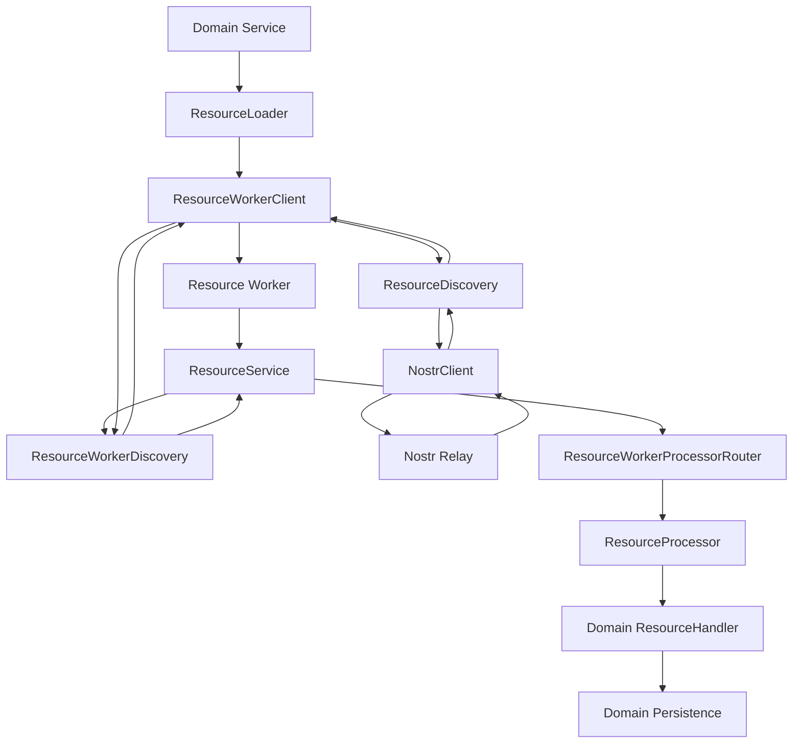
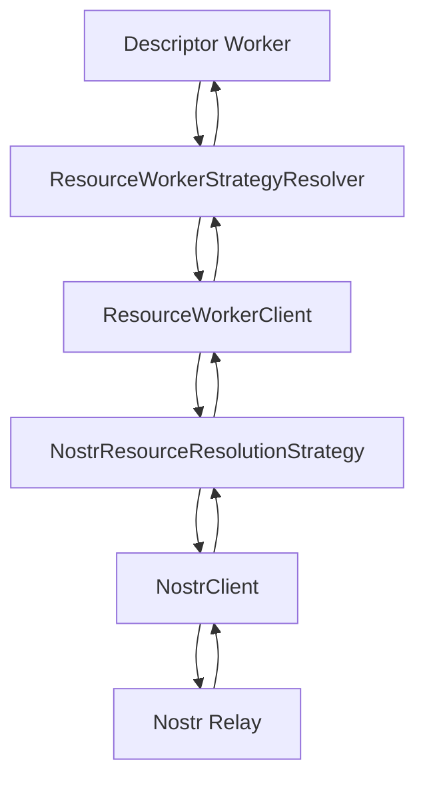
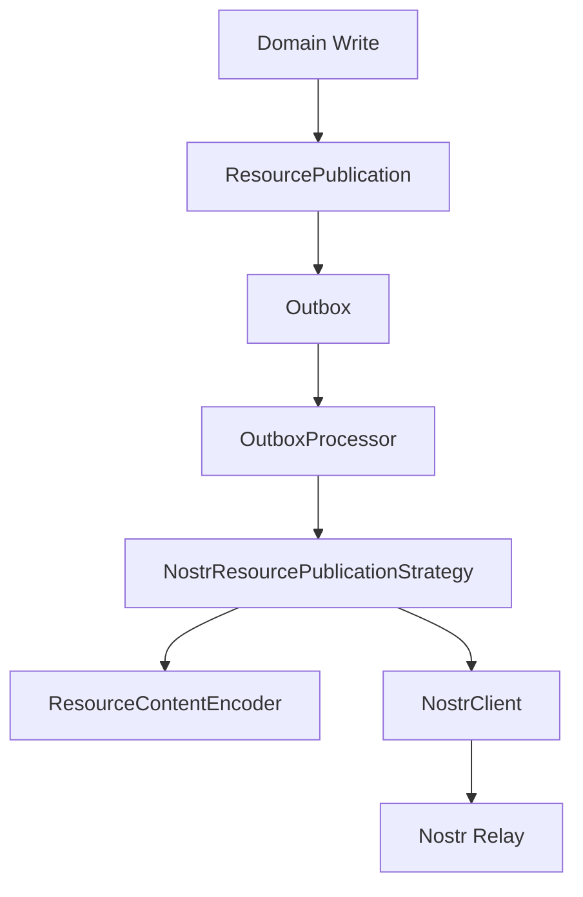

# Resource Transport and Worker Boundary

## Status

Current

---

# Purpose

This document describes the current implementation boundary between Nostr transport and the KJVOnly Resource lifecycle.

The current implementation no longer uses the historical `ResourceClient` abstraction.

Instead, transport and Resource processing are separated into distinct responsibilities:

```text
NostrClient
    = generic Nostr transport adapter

ResourceDiscovery
    = Nostr Resource-event discovery

ResourceWorkerClient
    = main-thread bridge into Resource processing

Resource Worker
    = Resource discovery coordination, resolution,
      decoding, validation, installation, and receipts

NostrResourcePublicationStrategy
    = outbound Resource publication through NostrClient
```

The important design principle is:

> Nostr transport remains generic infrastructure. Resource semantics begin above that transport boundary, and expensive Resource processing executes behind the Resource Worker boundary.

This document explains:

* the `NostrClient` contract,
* the rx-nostr adapter,
* browser verification infrastructure,
* Resource discovery,
* the main-thread/Worker split,
* `ResourceWorkerClient`,
* Resource installation flow,
* main-thread resolution strategies,
* Resource publication,
* ownership and lifecycle,
* testing boundaries,
* and responsibilities intentionally kept outside transport.

---

# Scope

This document covers the implementation path from generic Nostr communication through the boundary where Resource processing begins.

It includes:

```text
infrastructure/nostr/client/
resource/nostr/
resource/worker/
resource/loading/
resource/services/
resource/resolution/
resource/publication/
```

It does not fully document:

* Resource descriptor semantics,
* Domain Resource handlers,
* Domain installation transaction details,
* Resource-selection policy,
* Outbox persistence semantics,
* account/profile behavior,
* authentication strategy behavior,
* Domain Object schemas,
* or synchronization policy.

Those concerns are documented separately.

---

# Historical Note

Earlier implementations used a `ResourceClient` abstraction as the Resource-facing Nostr transport boundary.

That abstraction has been removed.

The current runtime instead uses:

```text
NostrClient
    → ResourceDiscovery
        → ResourceWorkerClient
            → Resource Worker
```

for inbound Resource installation, while outbound Resource publication uses:

```text
Outbox
    → NostrResourcePublicationStrategy
        → NostrClient
```

Do not recreate `ResourceClient` merely to restore an older document shape.

The current split is intentional because it separates:

```text
transport mechanics
from
Resource semantics
from
Resource processing execution
```

---

# High-Level Ownership

The main runtime ownership is:

```text
Application
    = composition root

Application owns
    ├── NostrSigner
    ├── NostrClient
    ├── ResourceDiscovery
    ├── ResourceWorkerClient
    ├── OutboxProcessor
    └── NostrResourcePublicationStrategy
```

The concrete `Application` class wires these dependencies.

They are not exposed indiscriminately through `ApplicationContext`.

In particular:

* `NostrClient` is infrastructure and remains private to composition,
* `ResourceDiscovery` is composition infrastructure,
* `ResourceWorkerClient` is used behind Resource loaders/services,
* Svelte consumers normally enter through Domain-facing services rather than transport objects.

---

# Main Runtime Flow

The inbound Resource path is:

```text
Domain Service
    ↓
ResourceLoader
    ↓
ResourceWorkerClient.install(reference)
    ↓
Resource Worker
    ↓
ResourceService.install(reference)
    ↓
ResourceWorkerDiscovery.get(reference)
    ↓
message to main thread
    ↓
ResourceDiscovery.get(reference)
    ↓
NostrClient.getEvent(filter)
    ↓
Nostr relay
    ↓
ResourceRepresentation
    ↓
back to Resource Worker
    ↓
ResourceWorkerProcessorRouter
    ↓
content or descriptor processing
    ↓
ResourceResolver
    ↓
ResourceContentDecoder
    ↓
Domain ResourceHandler
    ↓
Domain installation transaction
    ↓
Resource receipt
```

The outbound Resource path is separate:

```text
Domain write
    ↓
ResourcePublication
    ↓
Outbox
    ↓
OutboxProcessor
    ↓
NostrResourcePublicationStrategy
    ↓
ResourceContentEncoder
    ↓
NostrClient.publishEvent(...)
    ↓
Nostr relay
```

Inbound installation and outbound publication deliberately share transport infrastructure without sharing one monolithic Resource client object.

---

# NostrClient

The generic Nostr transport contract is defined in:

```text
src/lib/infrastructure/nostr/client/nostr-client.ts
```

The important interface is:

```ts
export interface NostrClient {
    setDefaultRelays(
        relays: readonly NostrRelay[]
    ): void;

    getPublicKey(): Promise<string>;

    getEvent(
        filter: Filter,
        options?: NostrClientRequestOptions
    ): Promise<Event | null>;

    getEvents(
        filters: Filter | readonly Filter[],
        options?: NostrClientRequestOptions
    ): Promise<readonly Event[]>;

    publishEvent(
        event: EventParameters,
        options?: NostrClientRequestOptions
    ): Promise<NostrPublishResult>;

    subscribe(
        filters: Filter | readonly Filter[],
        onEvent: (event: Event) => void,
        options?: NostrClientRequestOptions
    ): NostrSubscription;

    dispose(): void;
}
```

This contract is intentionally Nostr-specific.

It exposes Nostr concepts such as:

* `Filter`,
* `Event`,
* `EventParameters`,
* relay URLs,
* and relay acknowledgements.

It does not attempt to hide the Nostr protocol itself.

Its purpose is to hide the concrete rx-nostr implementation and normalize application-facing transport behavior.

---

# NostrClient Responsibilities

`NostrClient` owns generic Nostr communication behavior such as:

```text
relay configuration
bounded event reads
multi-event reads
long-lived subscriptions
publication
signing integration
relay acknowledgement normalization
transport lifecycle
transport-level errors
```

It does not know about:

```text
Resource IDs
Resource Types
Resource representations
Resource descriptor recursion
Domain schemas
Resource installation
Domain persistence
Resource receipts
Resource selection
Pane or Buffer state
```

That separation is important.

A Nostr client can support account metadata, follow lists, Resource events, and other Nostr behavior without becoming a Resource lifecycle service.

---

# NostrClient Construction

Browser construction is implemented by:

```text
src/lib/infrastructure/nostr/client/create-nostr-client.ts
```

The browser factory is:

```ts
createBrowserNostrClient(signer)
```

which creates browser verification infrastructure and then delegates to:

```ts
createNostrClient(
    verificationClient,
    signer
)
```

The factory configures rx-nostr with:

```text
verifier
signer
authenticator = auto
connectionStrategy = lazy-keep
EOSE timeout
OK timeout
AUTH timeout
exponential retry
```

The verification client is started as part of Nostr client creation.

When the Nostr client is disposed, its verification infrastructure is also disposed by the adapter.

---

# Thin Adapter Rule

The concrete rx-nostr adapter should remain thin.

It should use rx-nostr for capabilities the library already provides rather than implementing parallel protocol machinery.

Examples include:

```text
relay connection management
NIP-42 AUTH handling
subscription mechanics
signing integration
retry behavior
EOSE handling
OK acknowledgement handling
```

The adapter may normalize those behaviors into the stable `NostrClient` contract, but should not recreate them independently.

---

# Relay Configuration

`NostrClient.setDefaultRelays()` establishes default relay behavior for future operations.

A relay configuration contains:

```ts
interface NostrRelay {
    url: string;
    read: boolean;
    write: boolean;
}
```

This allows one relay to be:

* read-only,
* write-only,
* or read/write.

Individual operations may override the configured defaults through:

```ts
interface NostrClientRequestOptions {
    relays?: readonly string[];
}
```

This is important for descriptor strategies that carry their own relay list.

---

# Reads

## getEvent

`getEvent()` represents a bounded historical request where one matching event is expected.

The result contract is:

```text
matching event
    → Event

normal completion with no match
    → null

transport unavailable
    → NostrClientError
```

A missing event is not a transport error.

That distinction lets Resource discovery represent "not found" separately from relay failure.

---

## getEvents

`getEvents()` handles bounded requests that may return multiple events.

The implementation contract requires:

```text
deduplication by event ID
deterministic Nostr ordering
[] for normal no-match completion
NostrClientError for infrastructure failure
```

Higher-level callers decide what those events mean.

For example, `ResourceDiscovery.listByType()` converts Resource events and selects the newest event per Resource ID.

That Resource-specific behavior does not belong inside `NostrClient`.

---

# Long-Lived Subscriptions

`subscribe()` starts a long-lived Nostr subscription.

It returns:

```ts
interface NostrSubscription {
    close(): void;
}
```

The caller owns the subscription lifecycle.

The close operation must be idempotent.

Resource installation itself currently uses bounded discovery rather than a global long-lived Resource subscription.

Synchronization features may use subscriptions where appropriate, but that is a higher-level policy decision.

---

# Publication

`NostrClient.publishEvent()` accepts unsigned `EventParameters`.

The signer configured on the underlying client signs as part of publication.

Callers do not manually sign the event before entering this boundary.

The result includes:

```ts
interface NostrPublishResult {
    eventId: string;
    acknowledgements:
        readonly NostrPublishAcknowledgement[];
    acceptedByAnyRelay: boolean;
}
```

Relay rejection is represented in the result.

Transport inability is represented by `NostrClientError`.

This lets publication strategies apply policy above the transport boundary.

---

# NostrClientError

`NostrClientError` represents inability to meaningfully complete a transport operation.

It records:

```text
operation
relay set
cause
```

The operation is one of:

```text
setDefaultRelays
getEvent
getEvents
subscribe
publishEvent
dispose
```

Normal absence is not represented as `NostrClientError`.

For example:

```text
getEvent() with no match
    → null

getEvents() with no matches
    → []
```

---

# ResourceDiscovery

Resource semantics begin above `NostrClient`.

The Nostr-backed discovery implementation is:

```text
src/lib/resource/nostr/resource-discovery.ts
```

Its responsibility is to translate Resource identity into Nostr queries and convert matching Nostr events into `ResourceRepresentation` values.

The constructor receives only:

```ts
NostrClient
```

That means Resource discovery depends on generic Nostr transport rather than on rx-nostr directly.

---

# Direct Resource Discovery

`ResourceDiscovery.get(reference)` queries:

```text
kind
    = RESOURCE_KIND

author
    = reference.publisher

d tag
    = reference.resourceId
```

A matching event is converted using:

```text
toResourceRepresentation(event)
```

If no event is found:

```text
ResourceDiscovery.get(...)
    → null
```

No Resource decoding or installation occurs here.

---

# Resource Type Discovery

`ResourceDiscovery.listByType()` queries using the Resource Type `t` tag.

It then:

```text
validates publisher/type after conversion
keys by Resource ID
keeps the newest modifiedAt value per ID
returns current ResourceRepresentation values
```

This is Resource discovery behavior and therefore correctly lives above `NostrClient`.

---

# Why Resource Discovery Remains on the Main Thread

The Resource Worker cannot directly own the current browser Nostr client object.

The implementation therefore keeps Nostr Resource discovery on the main thread and bridges discovery requests across the Worker boundary.

The flow is:

```text
Resource Worker
    ↓ discovery request
ResourceWorkerDiscovery
    ↓ postMessage
ResourceWorkerClient
    ↓
ResourceDiscovery
    ↓
NostrClient
```

The result then travels back:

```text
ResourceRepresentation | null
    ↓
ResourceWorkerClient
    ↓ postMessage
ResourceWorkerDiscovery
    ↓
ResourceService
```

This preserves the Resource Worker processing boundary without duplicating Nostr transport inside the Worker.

---

# ResourceWorkerClient

The main-thread bridge is:

```text
src/lib/resource/worker/resource-worker-client.ts
```

The public installation method is:

```ts
install(
    reference: PublishedResourceReference
): Promise<ResourceInstallResult>
```

`ResourceWorkerClient` owns:

```text
Worker creation/lifecycle
install request IDs
pending install promises
main-thread discovery bridging
main-thread strategy resolution bridging
Worker failure handling
message deserialization failure handling
terminal disposal state
```

It does not implement Resource processing itself.

---

# Browser Resource Worker Construction

The browser factory is:

```ts
createBrowserResourceWorkerClient(
    discovery,
    strategies
)
```

It constructs:

```text
resource.worker.ts
```

as a module Worker and returns a `ResourceWorkerClient` around it.

The Application currently passes:

```text
ResourceDiscovery
NostrResourceResolutionStrategy
```

as main-thread capabilities that the Worker may call back into.

---

# Install Request Lifecycle

A Resource installation begins with:

```ts
resourceWorkerClient.install(reference)
```

The client:

1. allocates a request ID,
2. stores the pending promise,
3. posts an `install` message,
4. waits for either `install-result` or `install-error`,
5. resolves/rejects the original promise,
6. removes the pending request.

If the Worker fails, all pending install promises are rejected.

After disposal, future installs reject immediately.

---

# Resource Worker Composition

The top-level Resource Worker entrypoint is:

```text
src/lib/resource/worker/resource.worker.ts
```

It is a separate composition root for Resource processing.

It constructs:

```text
ResourceWorkerDiscovery
ResourceWorkerStrategyResolver
ResourceChildWorkerClient for content
ResourceDescriptorWorkerPool
ResourceWorkerProcessorRouter
ResourceService
```

The Worker itself does not construct the main-thread Nostr client.

That is an intentional boundary.

---

# ResourceService in the Worker

The Resource Worker creates a `ResourceService` using:

```text
ResourceWorkerDiscovery
ResourceWorkerProcessorRouter
```

`ResourceService` owns exact-reference in-flight deduplication.

Its key is derived from:

```text
publisher
resourceId
```

If two callers request the same Resource while an install is already in progress, they share the same pending installation promise.

This prevents duplicate processing for the same exact Resource reference.

---

# Worker Processor Routing

After discovery returns a `ResourceRepresentation`, the Worker routes based on representation type.

Current routing is:

```text
representation = content
    → content worker

otherwise
    → descriptor worker pool
```

The router itself does not perform decoding or installation.

It chooses the processing path.

---

# Content Worker

Content Resources are processed in a child Resource Worker configured with a content representation resolver.

The processing path is conceptually:

```text
ResourceRepresentation
    ↓
ContentRepresentationResolver
    ↓
VerifiedResourceContent
    ↓
ResourceContentDecoder
    ↓
ResourceHandler
    ↓
Domain installation transaction
```

The generic Resource layer does not hardcode Domain Object schemas.

Domain-specific handlers own interpretation, validation, and installation behavior for their Resource Types.

---

# Descriptor Worker Pool

Descriptor representations are processed through a descriptor Worker pool.

The current top-level Resource Worker creates three descriptor child Workers.

Descriptor processing may recursively resolve additional Resources.

Remote resolution strategies that require main-thread capabilities are bridged through the Worker client rather than implemented independently inside each Worker.

---

# Main-Thread Resolution Strategies

`ResourceWorkerClient` may be configured with main-thread `ResourceResolutionStrategy` implementations.

The current Application provides:

```text
NostrResourceResolutionStrategy
```

When a descriptor requires a Nostr strategy:

```text
Descriptor Worker
    ↓ strategy-resolve request
ResourceWorkerStrategyResolver
    ↓ postMessage
ResourceWorkerClient
    ↓
NostrResourceResolutionStrategy
    ↓
NostrClient.getEvent(...)
```

The resolved bytes are then returned to the Worker.

---

# Nostr Descriptor Resolution

`NostrResourceResolutionStrategy` validates strategy data containing:

```text
kind
relays
```

It queries `NostrClient.getEvent()` using:

```text
expected kind
expected publisher
expected d tag
strategy relay override
```

The returned event is validated against descriptor metadata including:

```text
kind
publisher
modifiedAt
resourceId
category
representation
mediaType
```

Only then is event content returned as bytes.

Transport performs the query.

The Resource strategy owns descriptor-specific validation.

---

# ResourceLoader

Domain-facing services normally do not call Worker messages directly.

They use `ResourceLoader`.

`ResourceLoader<TKey>` receives:

```text
an install(reference) capability
ResourceReferenceBuilder<TKey>
```

Its load algorithm is:

```text
try individual Resource reference
    ↓
if found and successful
    → true

otherwise try bundle Resource reference
    ↓
if not found
    → false

if found
    validate every install outcome
    → true or throw
```

This keeps bundle/individual fallback policy outside transport and outside Domain UI code.

---

# ResourceProcessor

`ResourceProcessor` is the generic post-discovery processing pipeline.

It receives:

```text
ResourceResolver
ResourceContentDecoder
ResourceReceiptService
ResourceHandler[]
```

Its flow is:

```text
resolve representation
    ↓
record resolution failures/current entries
    ↓
for each VerifiedResourceContent
    ↓
decode
    ↓
find ResourceHandler by Resource Type
    ↓
handle Domain Resource
    ↓
mark Resource receipt
```

Unsupported Resource Types are represented explicitly rather than silently ignored.

Handler errors become failed install outcomes.

Receipt write failures are logged but do not retroactively invalidate a successfully handled Resource.

---

# Resource Receipts

Resource receipts belong to Resource processing, not transport.

They record successful processing state used by resolution logic to avoid unnecessary reprocessing.

The concrete browser receipt store uses IndexedDB.

That concrete store is intentionally not part of the generic Nostr transport contract.

---

# Outbound Resource Publication

Inbound installation and outbound publication use different higher-level services.

Outbound Resource publication is handled by:

```text
NostrResourcePublicationStrategy
```

The strategy receives:

```text
NostrClient
ResourceContentEncoder
```

It is invoked by the Outbox publication pipeline.

---

# Resource Publication Flow

For a normal Resource publication:

```text
ResourcePublication
    ↓
ResourceContentEncoder
    ↓
encoded event content
    ↓
NostrClient.publishEvent(...)
```

The Nostr event uses:

```text
kind = RESOURCE_KIND

d = resourceId
m = mediaType
t = resourceType
representation = representation
```

The strategy also verifies that the configured signer public key matches the Resource publisher before publishing.

---

# Resource Deletion Publication

Resource deletion is represented separately as `ResourceDeletionPublication`.

The Nostr strategy publishes a deletion event using kind `5` with tags identifying the Resource replaceable event address.

Deletion semantics belong to the Resource publication strategy rather than to generic `NostrClient`.

---

# Publication Failure Policy

`NostrClient.publishEvent()` reports relay acknowledgements.

`NostrResourcePublicationStrategy` applies Resource publication policy above that transport result.

Currently, if no configured relay accepts the event:

```text
acceptedByAnyRelay = false
    → publication strategy throws
```

The Outbox processor then owns retry/pending behavior according to the Outbox implementation.

---

# Signing Boundary

Signing identity is owned through Nostr infrastructure.

The Resource layer does not manually sign events.

The publication strategy constructs event semantics and passes `EventParameters` to `NostrClient.publishEvent()`.

The configured Nostr signer performs signing through the underlying rx-nostr client.

This keeps:

```text
Resource semantics
separate from
cryptographic signing mechanics
```

---

# Authentication Relationship

Authentication and Nostr transport share signer/account infrastructure but remain separate application responsibilities.

Authentication is handled through:

```text
AuthenticationService
NostrAuthenticationStrategy
```

Transport is handled through:

```text
NostrClient
```

Account behavior is handled through:

```text
AccountService
NostrAccountStrategy
```

Do not merge authentication policy into Resource discovery or Resource processing.

---

# Application Composition

The browser Application constructs the Nostr and Resource transport path in this order conceptually:

```text
NostrSigner
    ↓
NostrAuthenticationStrategy
    ↓
AuthenticationService

NostrSigner
    ↓
createBrowserNostrClient()
    ↓
NostrClient
```

Then:

```text
NostrClient
    ├── ResourceDiscovery
    ├── NostrResourceResolutionStrategy
    ├── NostrResourcePublicationStrategy
    ├── NostrEventPublicationStrategy
    └── NostrAccountStrategy
```

And for inbound Resource processing:

```text
ResourceDiscovery
NostrResourceResolutionStrategy
    ↓
createBrowserResourceWorkerClient(...)
    ↓
ResourceWorkerClient
```

This is composition wiring.

It should remain centralized in `Application` rather than recreated independently by Domains or Svelte components.

---

# ApplicationContext Boundary

`NostrClient`, `ResourceDiscovery`, and `ResourceWorkerClient` are not general Svelte-facing capabilities.

They are intentionally hidden behind higher-level application/domain services.

Svelte code should not request transport objects merely for convenience.

For example, a Bible UI component should use the Bible chapter service rather than:

```text
NostrClient
ResourceDiscovery
ResourceWorkerClient
```

This preserves the boundary between UI behavior and Resource transport infrastructure.

---

# Worker Boundary

The Resource Worker is not just an optimization detail.

It is an implementation boundary with its own lifecycle and message contract.

Main-thread code owns:

```text
browser Worker instance
Nostr transport
Resource discovery bridge
main-thread remote strategies
pending install promises
```

Worker-side code owns:

```text
in-flight installation deduplication
representation routing
resolution orchestration
content decoding
Domain Resource handling
receipt coordination
```

Child Workers further isolate content and descriptor processing.

---

# Error Boundaries

Different layers intentionally produce different kinds of failure.

## Transport failure

```text
NostrClientError
```

Examples:

```text
relay communication unavailable
transport cannot complete request
```

## Resource not found

```text
ResourceDiscovery.get()
    → null

ResourceInstallResult.found
    → false
```

This is not inherently a transport error.

## Resolution failure

Represented in Resource resolution/install outcomes.

## Unsupported Resource Type

Represented as an `unsupported` Resource install outcome.

## Domain handling failure

Represented as a failed Resource install outcome with the thrown error.

## Worker failure

`ResourceWorkerClient` enters a terminal failed state, terminates the Worker, and rejects pending installs.

These distinctions should remain explicit.

---

# Disposal

`Application.stop()` owns teardown of long-lived infrastructure.

Relevant teardown includes:

```text
ResourceWorkerClient.dispose()
NostrClient.dispose()
NostrSigner.clear()
```

`ResourceWorkerClient.dispose()`:

```text
removes Worker event listeners
terminates the Worker
rejects pending installs
prevents future installs
```

`NostrClient.dispose()` releases rx-nostr and verification infrastructure owned by the client.

Random Svelte components must not own this lifecycle.

---

# Public API Boundary

Stable Resource contracts are exported through:

```text
$lib/resource
```

The public Resource API includes browser-safe contracts/services such as:

```text
PublishedResourceReference
ResourceLoader
ResourceWorkerClient
Resource install results
Resource resolver contracts
Resource content contracts
Resource descriptors
Resource receipts
Resource publication contracts
```

Concrete implementation wiring may remain on deep paths.

Examples include:

```text
ResourceDiscovery
NostrResourceResolutionStrategy
NostrResourcePublicationStrategy
IndexedDBResourceReceiptStore
```

Do not expose every concrete implementation through `$lib/resource` solely to shorten import paths.

---

# Nostr Infrastructure Boundary

`NostrClient` currently lives under:

```text
$lib/infrastructure/nostr/client
```

That is deliberate.

Nostr is transport/infrastructure.

The Resource layer depends on the transport contract where needed but should not absorb Nostr account/authentication concerns.

Likewise, Domains should not depend directly on rx-nostr.

---

# Testing Strategy

The implementation uses multiple test levels because browser transport and Worker behavior cannot be fully proven through Node unit tests alone.

---

# NostrClient Unit Tests

Unit tests cover the Nostr adapter behavior around:

```text
construction
request behavior
publication
error normalization
subscription behavior
relay behavior
lifecycle
```

Relevant files include:

```text
src/lib/infrastructure/nostr/client/create-nostr-client.test.ts
src/lib/infrastructure/nostr/client/rx-nostr-client.test.ts
src/lib/infrastructure/nostr/client/rx-nostr-client.integration.test.ts
```

---

# Browser Relay Test

The browser suite includes:

```text
tests/browser/nostr-client-relay.spec.ts
```

This proves the browser Nostr client can communicate with the local relay using real browser WebSocket and signing infrastructure.

---

# Resource Worker Browser Tests

Browser tests exercise the actual Resource Worker path, including:

```text
tests/browser/resource-worker-installation.spec.ts
tests/browser/resource-worker-concurrency.spec.ts
tests/browser/resource-worker-descriptor-resolution.spec.ts
tests/browser/resource-worker-descriptor-relay.spec.ts
```

These cover Worker creation, installation, concurrency, descriptor processing, and main-thread relay bridging.

---

# Domain Relay Integration Tests

Domain-facing browser tests such as:

```text
tests/browser/bible-chapter-resource-relay.spec.ts
tests/browser/strongs-resource-relay.spec.ts
```

publish fixtures with a dedicated test Nostr client and then enter the application through Domain-facing services.

They do not require exposing `NostrClient` through `ApplicationContext`.

This is an important testing rule:

> Tests that need transport fixtures may construct fixture infrastructure directly. Production UI boundaries should not be weakened for test convenience.

---

# What Must Not Move Into NostrClient

The following responsibilities belong above generic Nostr transport:

```text
Resource event interpretation
Resource discovery policy
Resource descriptor validation
Resource representation resolution
Resource decoding
Resource installation
Resource receipts
Resource Type routing
Domain schema validation
Domain persistence
Outbox policy
Resource-selection policy
Workspace state
```

If a change requires one of those concepts, `NostrClient` is usually the wrong owner.

---

# What Must Not Move Into ResourceWorkerClient

`ResourceWorkerClient` is a bridge, not a second Resource service implementation.

It should not own:

```text
Domain Object schemas
Domain persistence logic
Resource Type handlers
content decoding policy
Resource descriptor recursion
application Resource-selection state
Outbox publication state
```

Those belong in the Worker Resource pipeline or other owning layers.

---

# What Must Not Move Into ResourceDiscovery

`ResourceDiscovery` should remain focused on locating Resource representations through Nostr.

It should not perform:

```text
content decoding
Domain installation
receipt writes
Resource selection
Pane/Buffer lookup
Outbox processing
```

Discovery answers:

> What current Resource representation is published for this reference or Resource Type?

It does not answer:

> How should the application install or use it?

---

# Important Types

## NostrClient

Generic Nostr transport contract.

```text
src/lib/infrastructure/nostr/client/nostr-client.ts
```

## NostrRelay

Explicit read/write relay configuration.

## NostrClientRequestOptions

Per-operation relay override.

## NostrPublishResult

Normalized publication result including relay acknowledgements.

## NostrClientError

Transport-level failure.

## ResourceDiscovery

Nostr-backed Resource representation discovery.

```text
src/lib/resource/nostr/resource-discovery.ts
```

## ResourceWorkerClient

Main-thread installation bridge into Resource Worker processing.

```text
src/lib/resource/worker/resource-worker-client.ts
```

## ResourceService

Worker-side exact-reference installation coordinator with in-flight deduplication.

```text
src/lib/resource/services/resource.service.ts
```

## ResourceWorkerProcessorRouter

Routes Resource representations to content or descriptor processing.

## ResourceProcessor

Generic resolution/decode/handle/receipt processing pipeline.

## ResourceLoader

Domain-facing individual/bundle Resource loading helper.

## NostrResourceResolutionStrategy

Descriptor resolution strategy that uses main-thread Nostr transport.

## NostrResourcePublicationStrategy

Outbox publication strategy for Resource publications and deletions.

---

# Diagrams

## Inbound Resource Installation



---

## Descriptor Nostr Resolution



---

## Outbound Resource Publication



---

# Implementation Files

The most important current files are:

```text
src/lib/infrastructure/nostr/client/nostr-client.ts
src/lib/infrastructure/nostr/client/create-nostr-client.ts
src/lib/infrastructure/nostr/client/rx-nostr-client.ts

src/lib/resource/nostr/resource-discovery.ts
src/lib/resource/nostr/nostr-resource-publication-strategy.ts

src/lib/resource/worker/resource-worker-client.ts
src/lib/resource/worker/resource-worker-message.ts
src/lib/resource/worker/resource.worker.ts
src/lib/resource/worker/resource-worker-discovery.ts
src/lib/resource/worker/resource-worker-strategy-resolver.ts
src/lib/resource/worker/resource-worker-processor-router.ts
src/lib/resource/worker/resource-child-worker-client.ts
src/lib/resource/worker/resource-descriptor-worker-pool.ts

src/lib/resource/services/resource.service.ts
src/lib/resource/services/resource-processor.ts
src/lib/resource/loading/resource-loader.ts

src/lib/resource/resolution/nostr-resource-resolution-strategy.ts
src/lib/resource/publication/resource-publication.ts
```

Application composition is primarily visible in:

```text
src/lib/application/runtime/application.ts
```

---

# Current Invariants

The following implementation rules should be preserved:

```text
NostrClient is generic Nostr infrastructure.

Resource semantics begin above NostrClient.

Resource discovery remains on the main thread.

Heavy Resource processing executes behind Resource Workers.

ResourceWorkerClient is a bridge, not a Domain service.

Workers are separate composition roots.

Domain UI does not consume NostrClient directly.

Resource publication flows through Outbox.

Resource publication strategies use NostrClient;
Domains do not publish Nostr events directly.

Concrete implementation imports may remain deep when they are
composition wiring and should not be part of the public Resource API.
```

---

# Summary

The current Resource transport design is intentionally layered:

```text
Nostr transport
    = NostrClient

Resource discovery
    = ResourceDiscovery

main-thread / Worker bridge
    = ResourceWorkerClient

Resource installation coordination
    = ResourceService

Resource processing
    = ResourceResolver
      + ResourceContentDecoder
      + ResourceHandler
      + receipts

Resource publication
    = Outbox
      + NostrResourcePublicationStrategy
      + NostrClient
```

The historical `ResourceClient` abstraction is no longer part of the runtime.

The important boundary is not the old class name.

The important boundary is:

> Nostr remains transport infrastructure, Resource semantics remain in the Resource layer, and Domain code consumes Resource behavior without depending on Nostr mechanics.
