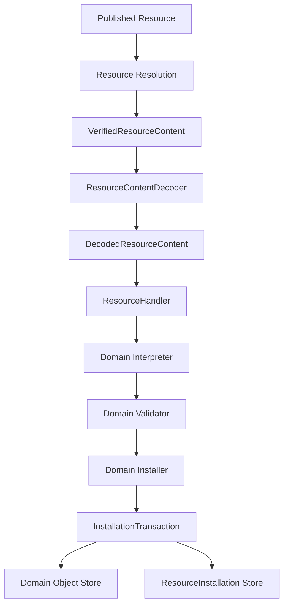

# Resource Installation

## Status

Current

---

# Purpose

This document describes the current Resource installation boundary used by the KJVOnly.bible client.

Installation is the point where generic decoded Resource content becomes durable Domain state.

The generic Resource pipeline owns:

```text
Resource discovery
    ↓
Resource representation resolution
    ↓
verified Resource content
    ↓
media-type decoding
    ↓
DecodedResourceContent
```

The Domain then owns:

```text
ResourceHandler
    ↓
interpretation
    ↓
validation
    ↓
Domain installer
    ↓
Domain Object identity
    ↓
Domain Object persistence
    +
ResourceInstallation provenance
```

The central rule is:

> The Resource layer delivers decoded content and dispatches by Resource Type. The Domain decides what that content means, which Domain Objects it produces, whether those objects should be installed, and how those writes are committed atomically.

This boundary prevents generic Resource infrastructure from acquiring Domain-specific knowledge.

---

# Scope

This document covers:

* `ResourceHandler`,
* Resource Type dispatch,
* Domain interpretation and validation,
* Domain installers,
* `InstallationTransaction<TStores>`,
* Domain-specific installation-store contracts,
* `ResourceInstallation`,
* object-level installation freshness,
* atomic Domain Object + installation-provenance writes,
* installation failure behavior,
* the relationship between `ResourceReceipt` and `ResourceInstallation`,
* representative Bible, Strong's, Notes, and Reading Plans installation behavior,
* worker ownership,
* and testing expectations.

This document does not redefine:

* Resource discovery,
* descriptor recursion,
* Resource content decoding,
* Resource publication,
* Outbox behavior,
* Module Resource selection,
* Domain Object read APIs,
* or synchronization policy.

Those are separate concerns.

---

# Related Documents

Read this document together with:

```text
docs/03_implementation/resources/001-resource-transport.md
docs/03_implementation/resources/005-resource-lifecycle-content.md
docs/03_implementation/010-domain-implementation-map.md
docs/03_implementation/011-target-code-organization.md
```

The lifecycle document explains how verified content reaches installation.

This document focuses specifically on the boundary after decoding.

---

# Architectural Position

Installation sits between generic Resource processing and Domain persistence.



The important boundary is between `DecodedResourceContent` and Domain interpretation.

Before that point, the Resource pipeline is generic.

After that point, semantics are Domain-owned.

---

# High-Level Installation Flow

For one resolved Resource content item:

```text
ResourceProcessor.processContent()
    ↓
find ResourceHandler by content.resourceType
    ↓
ResourceContentDecoder.decode(...)
    ↓
DecodedResourceContent
    ↓
ResourceHandler.handle(...)
    ↓
ResourceInterpreter.interpret(...)
    ↓
Domain candidate(s)
    ↓
ResourceValidator.validate(...)
    ↓
validated candidate(s)
    ↓
Domain Installer.install(...)
    ↓
InstallationTransaction.run(...)
    ↓
read current Domain/install state
    ↓
decide install / skip / reject
    ↓
write Domain Object(s)
    +
write ResourceInstallation record(s)
    ↓
transaction commits
    ↓
ResourceProcessor marks ResourceReceipt
    ↓
ResourceInstallOutcome = handled
```

If any decode, handler, interpretation, validation, or installation step throws, `ResourceProcessor` converts that content item to a failed install outcome.

The Resource receipt is not written when Domain handling fails.

---

# DecodedResourceContent

The Domain installation boundary receives `DecodedResourceContent`.

Conceptually:

```ts
interface DecodedResourceContent {
    readonly publisher: string;
    readonly resourceId: string;
    readonly resourceType: string;
    readonly modifiedAt: number;
    readonly mediaType: string;
    readonly value: unknown;
}
```

This object preserves Resource provenance while exposing decoded content.

The Domain should not need the original Nostr event, Blossom URL, descriptor document, gzip bytes, or transport-specific request objects.

Important fields have different responsibilities:

```text
publisher
    identifies who published the Resource

resourceId
    identifies the published Resource

resourceType
    selects the Domain ResourceHandler

modifiedAt
    participates in freshness decisions

mediaType
    describes the decoded Resource representation lineage

value
    contains generic decoded data that still requires Domain interpretation
```

`value` remains `unknown` intentionally.

Generic JSON decoding does not make content a valid Domain Object.

---

# ResourceHandler

The generic handler contract is deliberately small:

```ts
interface ResourceHandler {
    readonly resourceType: string;

    handle(
        resource: DecodedResourceContent
    ): Promise<void>;
}
```

A handler belongs to a Domain Resource Type.

Its responsibility is to connect generic decoded content to Domain-specific processing.

A typical handler performs:

```text
DecodedResourceContent
    ↓
interpret
    ↓
validate
    ↓
install
```

A handler should not become a second generic Resource pipeline.

It should remain a thin Domain entry point.

---

# Resource Type Dispatch

`ResourceProcessor` receives a list of `ResourceHandler` instances during composition.

It builds a map keyed by:

```text
handler.resourceType
```

Conceptually:

```text
resourceType
    → ResourceHandler
```

Examples include Resource Types owned by:

```text
Bible
    chapters
    paragraphs
    pericopes
    book names
    search index
    text markup

Strong's
    definitions

Notes
    notes

Reading Plans
    plan definitions
```

The Resource layer does not contain a switch such as:

```ts
if (resourceType === 'bible/chapter') {
    // Bible behavior
}
```

That would leak Domain knowledge into generic infrastructure.

Instead, composition registers Domain handlers.

---

# Duplicate Handler Protection

`ResourceProcessor` rejects duplicate handlers for the same Resource Type during construction.

This is important because Resource Type dispatch must be deterministic.

The composition root must not accidentally register two competing handlers for one Resource Type.

The invariant is:

```text
one Resource Type
    → zero or one registered ResourceHandler
```

Zero handlers means the Resource Type is unsupported by that worker composition.

More than one handler is a composition error.

---

# Unsupported Resource Types

If decoded content resolves successfully but no handler is registered for its Resource Type, installation does not throw globally.

The Resource outcome becomes:

```text
status = unsupported
```

This allows descriptor collections to contain Resource Types the current client does not understand without requiring the entire resolved collection to fail.

Unsupported content is not installed.

---

# Domain Interpretation

Interpretation converts generic decoded data into Domain candidates.

The generic contract is represented by `ResourceInterpreter<TCandidate>`.

Conceptually:

```text
DecodedResourceContent.value
    ↓
Domain Resource Interpreter
    ↓
zero, one, or many Domain candidates
```

Interpretation owns questions such as:

* what JSON shape belongs to this Resource Type,
* how one Resource expands into multiple Domain candidates,
* which values are identifiers versus content,
* what Resource-relative metadata must be carried into a candidate,
* and how serialized Resource structure maps to Domain concepts.

Interpretation does not persist data.

---

# Domain Validation

Validation converts interpreted candidates into validated candidates.

Conceptually:

```text
candidate
    ↓
ResourceValidator
    ↓
validated candidate
```

Validation owns Domain invariants.

Examples include:

* required fields,
* valid chapter references,
* valid plan-definition structure,
* valid Strong's keys,
* valid note structure,
* valid text-markup shape,
* and constraints specific to one Domain Resource Type.

Generic Resource infrastructure should not know these rules.

A validation error aborts handling of that content item.

---

# Domain Installer

The installer owns the final transition from validated Domain candidates to durable Domain Objects.

A typical installer receives:

```text
DecodedResourceContent
+
validated candidate(s)
```

It then decides:

```text
Domain Object identity
freshness policy
duplicate policy
supporting Domain Object creation
which stores participate
which writes are atomic
ResourceInstallation provenance
```

This is intentionally Domain-owned.

There is no generic Resource installer that knows how every Domain Object should be identified or updated.

---

# Why Installation Is Domain-Owned

One published Resource can map to very different Domain storage shapes.

For example:

```text
one Bible Chapter Resource
    → one or more Chapter objects
    → may also ensure BibleVersion exists

one Strong's Resource
    → many Strong's definition objects

one Plan Definition Resource
    → exactly one PlanDefinition object

one Notes Resource
    → one or more Note objects
```

Those mappings cannot be expressed correctly by a generic persistence layer without teaching it Domain semantics.

The Resource layer therefore stops at decoded content and handler dispatch.

---

# Domain Object Identity

Domain Object identity is not Resource identity.

This distinction is fundamental.

```text
Published Resource identity
    = publisher + resourceId

Domain Object identity
    = objectType + objectId
```

A Resource may install:

```text
zero Domain Objects
one Domain Object
many Domain Objects
```

A Domain Object ID is derived by the Domain installer using Domain rules.

The Resource layer must not derive Domain Object IDs from Resource paths generically.

---

# ResourceInstallation

`ResourceInstallation` records the Resource revision currently associated with a Resource-backed Domain Object.

The record was originally introduced for externally installed Resources. It is now also written for locally authored Resource-backed state so local state has the same object-level Resource revision metadata used by archive export and later synchronization/publication.

Conceptually:

```ts
interface ResourceInstallation {
    readonly id: string;
    readonly objectType: string;
    readonly objectId: string;
    readonly publisher: string;
    readonly resourceId?: string;
    readonly modifiedAt: number;
}
```

`resourceId` is optional because a locally authored Resource-backed Domain Object may have Resource revision state without having been installed from an external Resource.

The ID is created as:

```text
${objectType}:${objectId}
```

through:

```text
createResourceInstallationId(objectType, objectId)
```

This keeps installation identity aligned with Domain Object identity.

---

# ResourceInstallation Purpose

A `ResourceInstallation` answers:

```text
For this Resource-backed Domain Object,
which Resource revision does the current stored value represent,
who is its publisher,
and what object-level modifiedAt is authoritative?
```

When `resourceId` is present it also preserves known Resource provenance.

It supports:

* provenance where available,
* object-level freshness decisions,
* idempotent installation,
* replacement/update decisions,
* local Resource revision tracking,
* and archive export/import workset selection.

It is stored separately from the Domain Object so Domain data does not need to embed Resource transport metadata.

---

# ResourceInstallationStore

The generic store contract is:

```ts
interface ResourceInstallationStore {
    get(
        objectType: string,
        objectId: string
    ): Promise<ResourceInstallation | undefined>;

    put(
        installation: ResourceInstallation
    ): Promise<void>;
}
```

Domain installation transactions expose this contract alongside the stores required by that installer.

The installer depends on the contract, not IndexedDB directly.

---

# ResourceReceipt vs ResourceInstallation

These two records solve different problems and must not be collapsed.

## ResourceReceipt

A Resource receipt is Resource-processing state.

Conceptually it answers:

```text
Has this published Resource revision already been processed?
```

Its identity is based on:

```text
publisher + resourceId
```

Receipts are used in generic Resource resolution, especially descriptor-backed processing, to avoid unnecessary reprocessing.

## ResourceInstallation

A Resource installation is Domain Object provenance.

It answers:

```text
Which published Resource revision installed this Domain Object?
```

Its identity is based on:

```text
objectType + objectId
```

## Why Both Exist

A single Resource can install many Domain Objects.

Therefore:

```text
one ResourceReceipt
```

cannot replace:

```text
many ResourceInstallation records
```

Likewise, checking every possible Domain Object installation is not a generic replacement for Resource-level receipt processing.

---

# Two Freshness Layers

The current implementation intentionally has two freshness layers.

```text
Resource-level freshness
    → ResourceReceipt

Domain Object-level freshness
    → ResourceInstallation
```

They operate at different boundaries.

The Resource layer can decide that a descriptor item is already processed.

A Domain installer can independently decide that a particular object is already current or otherwise should not be replaced.

Do not merge these responsibilities.

---

# Object-Level Freshness

Many installers use `ResourceInstallation.modifiedAt` to decide whether a candidate should replace the stored object.

Typical policy:

```text
if current installation exists
and incoming modifiedAt <= installed modifiedAt
    → skip object write
else
    → write object + new ResourceInstallation
```

This pattern is used by current installers such as:

* Bible Chapters,
* Bible Paragraphs,
* Bible Pericopes,
* Bible Booknames,
* Bible Search Index,
* Reading Plan Definitions,
* and Strong's Definitions.

The exact rule still belongs to the Domain installer.

---

# Domain-Specific Duplicate Policies

Not every installer uses identical freshness semantics.

For example, Notes installation currently treats an existing Note identity as already present and skips it rather than applying the generic modified-time replacement rule.

That difference is intentional at the architecture level:

> Generic Resource infrastructure does not dictate one universal Domain Object replacement policy.

If Notes synchronization semantics change later, that policy should be changed in the Notes installer/synchronization design rather than hidden in generic Resource code.

---

# InstallationTransaction

The generic transaction abstraction is intentionally tiny:

```ts
interface InstallationTransaction<TStores> {
    run<TResult>(
        operation: (
            stores: TStores
        ) => Promise<TResult>
    ): Promise<TResult>;
}
```

The generic abstraction does not know IndexedDB store names.

It does not know Bible, Notes, Plans, or Strong's.

It only establishes:

```text
run this installation operation
against a Domain-specific group of stores
as one transaction boundary
```

---

# Domain-Specific Installation Stores

Each installer defines the narrow store set it needs.

For example, Bible Chapter installation conceptually requires:

```text
ChapterStore
BibleVersionStore
ResourceInstallationStore
```

A Domain-specific contract groups those stores:

```text
BibleChapterInstallationStores
```

and specializes the generic transaction:

```text
InstallationTransaction<BibleChapterInstallationStores>
```

This gives the Domain installer a clean persistence boundary without importing the application database directly.

---

# Why Transactions Expose Narrow Stores

The installer should express Domain behavior in terms of meaningful storage capabilities.

It should not know:

```text
IndexedDB database name
object store names
IDB transaction APIs
StoredDomainObject envelope details
schema-version mechanics
```

Those are persistence-adapter concerns.

This keeps installer tests simple and prevents Domain installation logic from becoming coupled to IndexedDB.

---

# IndexedDB Installation Transactions

Concrete IndexedDB transaction adapters live in Domain persistence code.

A typical adapter:

```text
opens ApplicationDB
    ↓
starts one readwrite transaction
    ↓
opens DOMAIN_OBJECTS
    +
RESOURCE_INSTALLATIONS
    ↓
wraps raw stores in Domain-specific store contracts
    ↓
runs Domain installation callback
    ↓
awaits transaction.done
```

On failure it attempts to abort the transaction and then rethrows the original error.

The original operation error remains the meaningful failure.

---

# Atomic Write Requirement

When a Domain Object is installed from a Resource, the Domain Object and its `ResourceInstallation` state must be committed together.

Resource-backed local writes that queue a Resource publication also commit their Domain Object, `ResourceInstallation`, and Outbox publication intent in one transaction:

```text
DOMAIN_OBJECTS
+ RESOURCE_INSTALLATIONS
+ OUTBOX
```

The local write allocates one monotonic `modifiedAt` revision and stores the same value on the queued Resource publication intent. Nostr publication later reuses that revision as `created_at` rather than creating a newer timestamp.

The desired invariant for inbound installation remains:

```text
Domain Object write succeeds
AND
ResourceInstallation write succeeds
```

or:

```text
neither write is committed
```

This prevents states such as:

```text
new Domain Object
+
stale installation provenance
```

or:

```text
new installation provenance
+
missing Domain Object
```

---

# StoredDomainObject Persistence

Current IndexedDB Domain persistence uses a generic stored envelope in the application database.

Conceptually:

```text
StoredDomainObject {
    id
    objectType
    objectId
    value
}
```

The concrete installation transaction maps a Domain-specific store contract onto that generic persistence representation.

The Domain installer still works with `Chapter`, `Note`, `PlanDefinition`, `Strongs`, and other Domain types rather than `StoredDomainObject` directly.

---

# Bible Chapter Installation Example

Bible Chapter installation is a useful representative example.

High-level flow:

```text
Decoded Bible Chapter Resource
    ↓
BibleChapterResourceHandler
    ↓
BibleChapterInterpreter
    ↓
BibleChapterCandidate[]
    ↓
BibleChapterValidator
    ↓
ValidatedBibleChapterCandidate[]
    ↓
BibleChapterInstaller
```

The installer then:

```text
requires all candidates to use one Bible version
    ↓
ensures BibleVersion exists
    ↓
for each chapter candidate
    ↓
derives chapter Domain Object ID
    ↓
reads ResourceInstallation
    ↓
skips stale/equal incoming revision
    ↓
writes Chapter
    ↓
writes ResourceInstallation
```

All participating writes occur through one Bible Chapter installation transaction.

---

# Supporting Domain Objects

An installer may create supporting Domain state in addition to the directly represented object.

Bible Chapter installation demonstrates this by ensuring the corresponding `BibleVersion` exists.

That behavior belongs to the Bible Domain because only the Bible Domain understands the relationship between:

```text
Bible publisher
Bible version
Chapter identity
```

Generic Resource infrastructure should not manufacture those supporting Domain Objects.

---

# Strong's Installation Example

Strong's installation validates that all candidates in one Resource belong to one Bible version.

It then derives Strong's Domain Object IDs using:

```text
publisher
Bible version
Strong's key
```

For each definition it:

```text
checks current ResourceInstallation
    ↓
skips stale/equal incoming content
    ↓
writes Strong's Domain Object
    ↓
writes installation provenance
```

The Strong's Domain owns those identity and freshness rules.

---

# Reading Plan Definition Installation Example

A Plan Definition Resource currently requires exactly one validated Plan Definition candidate.

The installer derives a Domain Object ID from:

```text
publisher
group
plan key
```

It then compares the incoming Resource `modifiedAt` with the installed provenance and either:

```text
skip current/stale definition
```

or:

```text
write PlanDefinition
+
write ResourceInstallation
```

The cardinality rule—exactly one plan definition—is a Reading Plans rule, not a generic Resource rule.

---

# Notes Installation Example

Notes demonstrate that installation policy can differ from the common modified-time pattern.

The Notes installer:

```text
requires candidates to share one Notes resource name
    ↓
derives Note identity from publisher + name + note ID
    ↓
checks whether the Note already exists
    ↓
skips an existing Note
    ↓
writes new Note
+
writes ResourceInstallation
```

This is why installation behavior remains Domain-owned.

---

# Empty Candidate Sets

Some installers treat an empty interpreted/validated candidate collection as a no-op.

That behavior is also Domain-specific.

A generic Resource handler should not assume that every successfully decoded Resource must produce at least one Domain Object.

Some Resource Types may validly produce zero installable objects.

Other Resource Types may reject that condition.

For example, the Plan Definition installer requires exactly one candidate.

---

# ResourceHandler Failure Semantics

`ResourceProcessor` wraps Domain handling for each resolved content item.

If decoding or `handler.handle()` throws:

```text
ResourceInstallOutcome.status = failed
```

and the error is attached to that outcome.

The processor continues to model failure at the Resource-content level rather than allowing one thrown handler error to erase all context from the returned install result.

---

# Transaction Failure Semantics

Within a Domain installation transaction:

```text
operation throws
    ↓
transaction adapter attempts abort
    ↓
transaction completion is drained/observed
    ↓
original operation error is rethrown
```

The persistence adapter should not replace the meaningful Domain/install error with a secondary abort error.

---

# Receipt Write Happens After Domain Handling

After a handler completes successfully, `ResourceProcessor` attempts to write a Resource receipt.

Ordering is therefore:

```text
Domain installation succeeds
    ↓
Resource receipt markProcessed(...)
```

not:

```text
receipt first
    ↓
Domain installation later
```

This prevents a failed Domain install from being recorded as successfully processed.

---

# Receipt Write Failure Policy

A receipt write failure does not convert an otherwise successful Domain installation into a failed Resource outcome.

Current behavior logs a warning and returns:

```text
status = handled
```

This is deliberate because the Domain state has already committed successfully.

The consequence of a missing receipt is potential redundant future processing, not loss of the installed Domain Object.

Domain-level installation provenance still protects installers that use `ResourceInstallation` freshness checks.

---

# ResourceInstallResult

Installation returns structured outcomes rather than a single boolean.

A Resource can contain or resolve to multiple Resource content items.

Each item can independently be:

```text
handled
current
unsupported
failed
```

The overall result also records:

```text
requested PublishedResourceReference
found boolean
```

This allows callers to distinguish:

```text
Resource not found
Resource already current
Resource installed
Resource unsupported
Resource failed
partial descriptor success/failure
```

---

# `current` vs Installer Skip

There are two places where work may be skipped.

## Resolution-level current

Descriptor-backed resolution may use Resource receipts and produce:

```text
status = current
```

without decoding/installing that content again.

## Installer-level skip

A Domain installer may receive content but decide that a specific Domain Object should not be replaced because its `ResourceInstallation` is already as new or newer.

The handler can still complete successfully.

These are different levels of idempotence.

---

# Installation and Bundles

Installation does not need to know whether content originated from:

```text
direct content representation
single descriptor
bundle descriptor
nested descriptor collection
Blossom content
Nostr descriptor target
```

By the time content reaches a `ResourceHandler`, those acquisition details have already been normalized to `DecodedResourceContent`.

That separation is intentional.

---

# Installation and Module Resource Selection

Module Resource selection chooses which published Resource references a module instance uses.

Installation consumes those references downstream.

The Domain installer does not know:

```text
Pane ID
Buffer
ModuleResourceSelectionResolver
ResourceSelectionService
```

Its input is decoded Resource content.

Do not leak Pane/Buffer mechanics into installers.

---

# Installation and Publication

Inbound installation and outbound publication are separate boundaries.

Inbound:

```text
Published Resource
    → decoded content
    → Domain Object installation
```

Outbound:

```text
Domain write
    → ResourcePublication
    → Outbox
    → publication strategy
```

A Domain installer should not publish the object it is installing.

Installation is not synchronization echo logic.

---

# Installation and Synchronization

Installation is a mechanism used by acquisition/synchronization, but it is not itself the synchronization coordinator.

For example, Notes fetching/synchronization policy should determine which Resources to acquire.

The Notes installer only answers:

```text
Given this decoded Notes Resource,
how should its Domain Objects be installed?
```

Do not recreate removed acquisition coordinators inside installer code.

---

# Worker Ownership

Current Resource installation runs inside Resource worker composition.

The Resource worker constructs:

```text
Resource resolvers
content decoder
ResourceProcessor instances
Domain ResourceHandlers
Domain interpreters
Domain validators
Domain installers
installation transaction adapters
receipt service
```

Workers are separate composition roots.

They do not use Svelte `ApplicationContext`.

---

# Main Thread Ownership

The main application requests installation through the Resource Worker boundary.

Main-thread code should not manually reproduce Domain handler pipelines.

Application/domain services normally deal with:

```text
PublishedResourceReference
```

and receive Resource install results through the public Resource API.

---

# Public Resource API

Stable installation contracts are exported through:

```text
$lib/resource
```

This includes concepts such as:

```text
ResourceHandler
InstallationTransaction
ResourceInstallation
ResourceInstallationStore
createResourceInstallationId
ResourceInstallResult
ResourceInstallOutcome
```

Domain consumers should use the Resource root public API rather than deep-importing these contracts.

Internal Resource implementation code may still use direct internal imports.

---

# Domain Public APIs

Installation implementations remain Domain-owned.

External consumers should not generally import a concrete Bible or Notes installer to perform ordinary Resource installation.

The worker composition wires concrete implementations.

The Domain public root remains the boundary for stable Domain concepts.

Concrete persistence/resource implementation imports are appropriate in composition roots.

---

# Current Source Organization

Generic installation contracts live under:

```text
src/lib/resource/installation/
    installation-transaction.ts
    resource-handler.ts
    resource-installation.ts
    resource-installation-store.ts
```

Generic processing is under:

```text
src/lib/resource/services/
    resource-processor.ts
    resource-install-result.ts
```

Domain installation implementations live near their Resource Types, for example:

```text
src/lib/domains/bible/resources/chapters/
src/lib/domains/bible/resources/paragraphs/
src/lib/domains/bible/resources/pericopes/
src/lib/domains/bible/resources/booknames/
src/lib/domains/bible/resources/search/
src/lib/domains/bible/resources/text-markup/

src/lib/domains/notes/resources/

src/lib/domains/reading-plans/resources/definitions/

src/lib/domains/strongs/resources/definitions/
```

Concrete IndexedDB transaction adapters live in Domain persistence folders.

---

# Naming Pattern

The implementation commonly follows this naming sequence:

```text
<ResourceType>ResourceHandler
<ResourceType>Interpreter
<ResourceType>Validator
<ResourceType>Installer
<ResourceType>InstallationStores
IndexedDB<ResourceType>InstallationTransaction
```

Not every Resource Type must use exactly the same filenames, but the responsibilities should remain distinct.

---

# Testing Strategy

Installation behavior should be tested at several levels.

## ResourceHandler tests

Handler tests verify:

```text
interpret called
validated candidates produced
installer receives validated candidates
errors propagate appropriately
```

They should not require real IndexedDB.

## Installer tests

Installer tests verify Domain policy such as:

```text
identity derivation
freshness rules
duplicate rules
supporting-object creation
candidate cardinality
provenance records
```

Use in-memory/fake transaction stores where practical.

## Transaction tests

Concrete IndexedDB transaction tests verify:

```text
correct object store usage
Domain Object persistence
ResourceInstallation persistence
atomic commit
rollback on failure
```

## ResourceProcessor tests

Processor tests verify:

```text
handler dispatch
duplicate handler rejection
unsupported Resource Types
failure outcomes
receipt ordering
receipt failure policy
```

## Browser integration tests

Browser tests cover real worker/database boundaries when that behavior is the subject of the test.

---

# Important Invariants

## Generic Resource code does not own Domain Object identity

Domain installers derive Domain Object IDs.

## Resource identity is not Domain Object identity

Do not use `resourceId` as a universal Domain Object ID.

## Installation policy is Domain-owned

Freshness and duplicate behavior may differ by Domain Resource Type.

## Domain Object and installation provenance are atomic

When an installer records provenance for an object, both writes belong in one transaction.

## ResourceReceipt and ResourceInstallation remain separate

They track different identities and different lifecycle levels.

## Handlers are registered by Resource Type

Do not add generic Domain-specific switch statements to `ResourceProcessor`.

## Decoded content is still untrusted Domain input

JSON decoding does not replace interpretation and validation.

## Workers are composition roots

Worker installation code does not obtain services through Svelte `ApplicationContext`.

## Installation does not publish

Inbound installation and outbound publication remain separate flows.

---

# Common Anti-Patterns

Do not introduce code shaped like:

```ts
switch (resource.resourceType) {
    case 'bible/chapter':
        // generic Resource service now knows Bible
}
```

Do not make installers depend directly on:

```text
Pane
Buffer
Svelte context
Nostr event objects
rx-nostr
Blossom HTTP responses
raw descriptor documents
```

Do not write the Domain Object in one transaction and its `ResourceInstallation` later in another operation.

Do not treat Resource receipts as a replacement for Domain Object provenance.

Do not make one universal `modifiedAt` policy mandatory for every Domain installer.

Do not put IndexedDB transaction mechanics into the Domain installer.

---

# Extension Procedure for a New Resource Type

When adding a new installable Resource Type:

```text
1. define the Resource Type in the owning Domain
2. define interpretation candidate type
3. implement ResourceInterpreter
4. implement ResourceValidator
5. define Domain Object identity
6. define installer behavior
7. define required installation stores
8. implement InstallationTransaction adapter
9. implement ResourceHandler
10. register handler in Resource worker composition
11. add handler/interpreter/validator/installer tests
12. add persistence transaction tests where relevant
13. add browser integration coverage if the worker/database boundary matters
```

The generic Resource processor should normally require no Domain-specific change beyond handler registration.

---

# Review Checklist

When reviewing installation code, ask:

```text
Does the ResourceHandler remain thin?

Is interpretation separate from persistence?

Is validation explicit?

Does the Domain derive its own object identity?

Is freshness policy located in the Domain installer?

Are Domain Object and ResourceInstallation writes atomic?

Does the installer depend on narrow store contracts rather than IndexedDB?

Is Resource receipt logic still outside the Domain installer?

Does the code avoid Pane/Buffer/UI dependencies?

Is the handler registered exactly once?

Are worker and application composition responsibilities clear?
```

---

# Historical Notes

Earlier Resource architecture discussions sometimes treated installation as part of a larger monolithic Resource client flow.

That is not the current implementation.

The current separation is intentionally explicit:

```text
transport/discovery
    ↓
resolution
    ↓
decoding
    ↓
Domain handling
    ↓
Domain installation
```

Likewise, the current application does not use a generic Domain Store that blindly persists every decoded Resource object.

Installation is Domain-specific because identity, cardinality, supporting objects, and freshness semantics are Domain-specific.

---

# Summary

The Resource installation boundary is where generic Resource content becomes durable Domain state.

The current architecture is:

```text
DecodedResourceContent
    ↓
ResourceHandler selected by Resource Type
    ↓
Domain interpretation
    ↓
Domain validation
    ↓
Domain installer
    ↓
Domain-specific InstallationTransaction
    ↓
Domain Object write
    +
ResourceInstallation provenance write
    ↓
commit
```

The Resource layer owns dispatch and generic processing.

The Domain owns meaning, identity, validation, installation policy, and persistence behavior.

`ResourceInstallation` records object-level provenance and freshness.

`ResourceReceipt` records Resource-level processing state.

Those concepts remain separate.

The most important rule is:

> Generic Resource infrastructure delivers decoded content; the owning Domain decides what gets installed and commits the resulting Domain state atomically with its Resource provenance.
