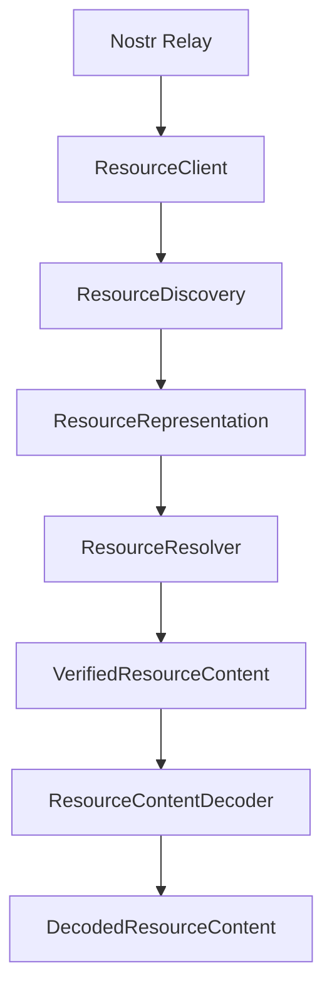
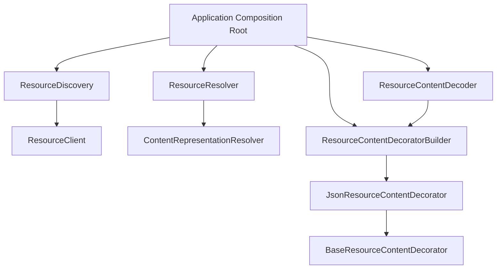
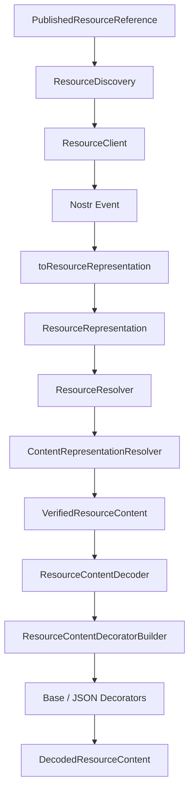
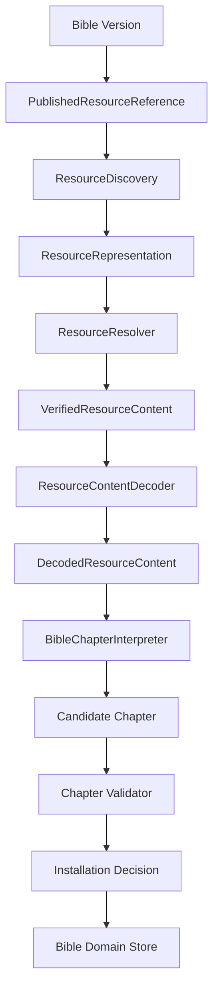

# Resource Lifecycle and Content

## Status

Current

---

# Purpose

This document describes the current implementation of the generic inbound Resource lifecycle above the Resource Client.

It covers the implemented path from a known Published Resource reference through:

* direct Resource Discovery,
* Nostr event validation and conversion,
* Resource Representation,
* representation dispatch,
* `content` representation resolution,
* Verified Resource Content,
* Resource content decoding,
* dynamic content-decorator construction,
* JSON decoding,
* pass-through binary content,
* Resource provenance preservation,
* Composition Root integration,
* and unit testing.

The implementation is intentionally generic.

It is designed to support all application Resource Types, including Bible chapters, Strong's data, reading plans, notes, overlays, search indexes, audio, binary assets, and future Resource Types.

The Bible chapter vertical slice is being used to prove the architecture, but the code in this document is not Bible-specific.

The central implementation goal is:

> Build one coherent Resource pipeline that every supported Resource Type can reuse until Domain interpretation begins.

---

# Scope

This document describes the implementation of:

```text
PublishedResourceReference
        ↓
ResourceDiscovery
        ↓
ResourceRepresentation
        ↓
ResourceResolver
        ↓
VerifiedResourceContent
        ↓
ResourceContentDecoder
        ↓
DecodedResourceContent
```

It also describes the extension points already established for:

* `descriptor` representations,
* `descriptors` representations,
* Blossom,
* other external content providers,
* gzip,
* hex,
* arbitrary binary media,
* and encrypted Resource content.

The current implementation supports:

```text
representation = content

media type = application/json
```

It also supports pass-through content for media types that require no registered decoding transformation, such as:

```text
audio/mpeg
application/octet-stream
image/png
```

The current implementation does **not** yet implement descriptor fetching, Blossom retrieval, descriptor collections, gzip, hex, Resource encryption, Bible Chapter interpretation, Domain validation, installation decisions, persistence, synchronization, or the Outbox.

Those stages are deliberately left outside this implementation until their phase begins.

---

# Architectural Context

The Resource lifecycle exists between external publication mechanisms and Domain Objects.

The complete inbound architecture is:

```text
Nostr / External Content
        ↓
Resource Representation
        ↓
Resource Resolution
        ↓
Verified Resource Content
        ↓
Resource Content Decoding
        ↓
Decoded Resource Content
        ↓
Resource Type Interpretation
        ↓
Candidate Domain Object
        ↓
Domain Validation
        ↓
Acceptance / Installation Decision
        ↓
Accepted Local Domain Object
        ↓
Persistence
```

The currently implemented portion stops at:

```text
Decoded Resource Content
```

No external Resource becomes authoritative local application state merely because it exists, was discovered, resolved, decoded, or came from a newer Nostr event.

The governing rule remains:

> **The network proposes. The application decides.**

---

# Core Separation

The implementation preserves several important distinctions.

```text
Discovery
    ≠ Resolution

Resolution
    ≠ Content Decoding

Content Decoding
    ≠ Domain Interpretation

Domain Interpretation
    ≠ Domain Validation

Domain Validation
    ≠ Installation

Installation
    ≠ Persistence
```

These seams prevent external transport state from becoming application authority accidentally.

---

# Relationship to Resource Client

The Resource Client is the Nostr transport boundary.

It returns Nostr events.

This document begins immediately above that boundary.



The Resource Client does not know Resource Identifier structure, Resource Type, Resource Representation tags, media-type transformations, Domain schemas, or installation policy.

Those responsibilities begin above it.

---

# Source Organization

The current implementation is organized approximately as:

```text
src/lib/

    resource/

        models/
            resource.model.ts

        nostr/
            resource-client.ts
            resource-event.ts
            resource-discovery.ts

        resolution/
            resource-representation-resolver.ts
            content-representation-resolver.ts
            resource-resolver.ts

        content/
            resource-content-decorator.ts
            base-resource-content-decorator.ts
            json-resource-content-decorator.ts
            resource-content-decorator-builder.ts
            resource-content-decoder.ts

    infrastructure/
        nostr/
            resource-client.ts
            nostr-signer.ts
            verification-client.ts
            verification.worker.ts

    application/
        runtime/
            application.ts
            application-context.ts
```

Tests are colocated with the Resource implementation where appropriate.

Browser-level Resource Client integration tests remain under `tests/browser/`.

---

# Resource Models

The shared Resource lifecycle models live in:

```text
src/lib/resource/models/resource.model.ts
```

This location follows the application's existing naming and organization conventions.

The file contains the generic values passed between Resource lifecycle stages.

---

# Generic Resource Kind

Current application Resources use the generic addressable Nostr kind:

```ts
export const RESOURCE_KIND = 37770;
```

The Nostr kind identifies the generic Resource protocol event.

It does not identify the application Resource Type.

For example, all of these may use kind `37770`:

```text
kjvonly/bible/chapters
kjvonly/strongs/definitions
kjvonly/plans/readings
kjvonly/notes/...
kjvonly/overlays/pericopes
```

Application meaning comes from the Resource Identifier and Resource Type.

---

# Published Resource Reference

A direct Resource lookup begins with:

```ts
export interface PublishedResourceReference {
    publisher: string;
    resourceId: string;
}
```

The reference contains the variable application inputs required to identify the Published Resource.

Nostr addressable-event identity remains formally:

```text
kind + publisher public key + d tag
```

Since the current application Resource kind is fixed to `37770`, direct application lookups normally provide `publisher` and `resourceId` while Resource Discovery supplies the generic kind.

---

# Publisher Is Per Request

Publisher identity is not constructor-bound to Resource Discovery.

For example, a Bible version may contain the publisher public key associated with that version.

A Resource request can therefore use:

```ts
await resourceDiscovery.get({
    publisher: bibleVersion.publisher,
    resourceId: 'kjvonly/bible/chapters/kjv/1_1'
});
```

Another version or publisher can use the same infrastructure with a different publisher.

This keeps Resource infrastructure independent from a single application publisher.

---

# Resource Identifier

Resource Identifiers follow:

```text
namespace/domain/resource-type/...resource-id
```

For example:

```text
kjvonly/bible/chapters/kjv/1_1
```

contains:

```text
namespace       = kjvonly
domain          = bible
resource type   = chapters
resource id     = kjv/1_1
```

The complete `d` value remains the Resource Identifier.

The first three segments identify the Resource Type.

---

# Resource Type

The Resource Type is:

```text
namespace/domain/resource-type
```

Examples:

```text
kjvonly/bible/chapters
kjvonly/strongs/definitions
kjvonly/plans/readings
```

Resource Type determines which later application component is responsible for interpreting decoded Resource content.

It does not affect Resource Client behavior, direct Nostr transport, representation resolution, generic content decoding, or binary transformations.

This is a key reason the generic lifecycle can be shared across all Resource Types.

---

# Resource Classification

The Nostr `t` tag stores Resource classification.

For a Bible Chapter Resource:

```text
d = kjvonly/bible/chapters/kjv/1_1
t = kjvonly/bible/chapters
```

The `d` tag identifies the specific Resource.

The `t` tag classifies the Resource for efficient discovery.

The implementation validates that the `t` value matches the Resource Type derived from `d`.

---

# Resource Representation Type

The architecture defines three Resource Representation types:

```ts
export type ResourceRepresentationType =
    | 'content'
    | 'descriptor'
    | 'descriptors';
```

Their meanings are:

```text
content
    serialized Resource content is embedded in the Nostr event

descriptor
    the Nostr event contains metadata describing how to obtain
    one Resource's content externally

descriptors
    the Nostr event contains a collection of descriptors
```

Representation answers:

> How does the Resource content become available?

It does not answer:

> What does the content mean to the Domain?

---

# Resource Representation Model

The application-level Resource Representation is:

```ts
export interface ResourceRepresentation {
    publisher: string;
    resourceId: string;
    resourceType: string;
    eventId: string;
    createdAt: number;
    representation: ResourceRepresentationType;
    mediaType: string;
    payload: string;
}
```

This is the point where raw Nostr `Event` stops leaking upward.

The model preserves publication context while removing direct dependency on the raw event structure.

---

# Resource Representation Responsibilities

`ResourceRepresentation` preserves publisher, Resource Identifier, Resource Type, Nostr event ID, publication timestamp, representation type, media type, and representation payload.

It does not contain Domain Objects, installed state, local persistence state, Domain validation results, decoded JSON objects, or installation decisions.

---

# Event Model Boundary

The Nostr event conversion implementation lives in:

```text
src/lib/resource/nostr/resource-event.ts
```

Its responsibility is:

```text
validated Nostr Event
        ↓
Resource Representation
```

This is the protocol-facing Event Model seam.

It is not Resource Resolution.

It is not Domain interpretation.

---

# Event Validation

The event conversion verifies Resource-envelope requirements before producing a `ResourceRepresentation`.

The implementation checks:

* Nostr kind is `RESOURCE_KIND`,
* a `d` tag exists,
* the Resource Identifier contains at least three segments,
* a `t` classification tag exists,
* the `t` tag matches the Resource Type derived from `d`,
* a `representation` tag exists,
* representation is one of the supported representation values,
* and an `m` media-type tag exists.

This validation concerns the Resource publication envelope.

It does not validate the Resource payload's Domain schema.

---

# Nostr Event to Resource Representation

Conceptually:

```text
Event
    kind
    pubkey
    id
    created_at
    tags
    content

        ↓

toResourceRepresentation()

        ↓

ResourceRepresentation
    publisher
    resourceId
    resourceType
    eventId
    createdAt
    representation
    mediaType
    payload
```

The mapping is deliberately mechanical.

---

# Resource Type Derivation

Resource Type is derived from the first three Resource Identifier segments.

For:

```text
kjvonly/bible/chapters/kjv/1_1
```

it is:

```text
kjvonly/bible/chapters
```

For:

```text
kjvonly/plans/readings/365-bible/v1
```

it is:

```text
kjvonly/plans/readings
```

Additional identifier segments remain part of Resource identity but do not change Resource Type interpretation ownership.

---

# Classification Validation

The implementation requires:

```text
t tag = derived Resource Type
```

For example:

```text
d = kjvonly/bible/chapters/kjv/1_1
t = kjvonly/bible/chapters
```

is valid.

This:

```text
d = kjvonly/bible/chapters/kjv/1_1
t = kjvonly/strongs/definitions
```

is rejected as an invalid Resource classification.

This prevents inconsistent Resource metadata from moving deeper into the lifecycle.

---

# Resource Discovery

Direct Resource Discovery lives in:

```text
src/lib/resource/nostr/resource-discovery.ts
```

The current implementation begins with exact Resource Identity discovery.

Its input is:

```ts
PublishedResourceReference
```

Its output is:

```ts
Promise<ResourceRepresentation | null>
```

---

# Direct Discovery Query

A direct lookup builds the narrow Nostr filter:

```ts
{
    kinds: [RESOURCE_KIND],
    authors: [reference.publisher],
    '#d': [reference.resourceId]
}
```

Conceptually:

```text
publisher
    +
resourceId
    +
RESOURCE_KIND

        ↓

exact Nostr address query

        ↓

current matching publication
```

Direct discovery is preferred when complete Published Resource identity is already known.

---

# Resource Discovery Implementation

Conceptually:

```ts
export class ResourceDiscovery {
    constructor(
        private readonly resourceClient: ResourceClient
    ) {}

    async get(
        reference: PublishedResourceReference
    ): Promise<ResourceRepresentation | null> {
        const event = await this.resourceClient.getEvent({
            kinds: [RESOURCE_KIND],
            authors: [reference.publisher],
            '#d': [reference.resourceId]
        });

        if (event === null) {
            return null;
        }

        return toResourceRepresentation(event);
    }
}
```

Resource Discovery owns the Resource-specific Nostr query shape.

Resource Client remains generic to arbitrary Nostr filters.

---

# Discovery Absence

If the Resource Client returns `null`, Resource Discovery also returns `null`.

This represents normal absence.

It does not mean the Resource is invalid, the application should delete local data, or the local installation is obsolete.

It means only that the requested publication was not discovered through that query.

---

# Discovery Does Not Install

A discovered Resource Representation is still external data.

Discovery does not persist it, parse it as a Domain Object, compare it with installed state, or make it authoritative.

This preserves:

> The network proposes. The application decides.

---

# Current Discovery Scope

The current implementation proves direct exact Resource discovery.

Future Resource Discovery may add classification discovery using `#t`, publisher-wide discovery, descriptor reference discovery, recursive discovery, and limits for recursive graphs.

Those capabilities should extend Resource Discovery without moving their behavior into Resource Client.

---

# Resource Resolution

Resource Resolution converts a validated `ResourceRepresentation` into one or more `VerifiedResourceContent` results.

Conceptually:

```text
ResourceRepresentation
        ↓
ResourceResolver
        ↓
representation-specific resolver
        ↓
VerifiedResourceContent[]
```

Resolution ends while content is still serialized.

---

# Why Resolution Returns an Array

The public `ResourceResolver.resolve()` contract returns:

```ts
Promise<readonly VerifiedResourceContent[]>
```

even though the current `content` representation produces exactly one result.

This is deliberate.

Future `descriptors` may resolve into zero or more `VerifiedResourceContent` results.

Using an array now avoids changing the public Resolution contract when descriptor collections are implemented.

---

# Representation Resolver Contract

The representation-specific seam is:

```ts
export interface ResourceRepresentationResolver {
    readonly representation: ResourceRepresentationType;

    resolve(
        resource: ResourceRepresentation
    ): Promise<readonly VerifiedResourceContent[]>;
}
```

Each implementation owns one representation type.

The current implementation provides:

```text
ContentRepresentationResolver
```

Future implementations may provide:

```text
DescriptorRepresentationResolver
DescriptorsRepresentationResolver
```

---

# Resource Resolver

`ResourceResolver` is the representation-dispatch coordinator.

Conceptually:

```ts
export class ResourceResolver {
    constructor(
        private readonly resolvers:
            readonly ResourceRepresentationResolver[]
    ) {}

    async resolve(
        resource: ResourceRepresentation
    ): Promise<readonly VerifiedResourceContent[]> {
        const resolver = this.resolvers.find(
            (candidate) =>
                candidate.representation ===
                resource.representation
        );

        if (!resolver) {
            throw new Error(
                `Unsupported Resource representation: ${resource.representation}`
            );
        }

        return resolver.resolve(resource);
    }
}
```

The coordinator does not contain representation-specific logic.

Adding a new representation resolver does not require rewriting the coordinator.

---

# Representation Dispatch

Current composition:

```text
ResourceResolver
    ↓
ContentRepresentationResolver
```

Future composition:

```text
ResourceResolver
    ├── ContentRepresentationResolver
    ├── DescriptorRepresentationResolver
    └── DescriptorsRepresentationResolver
```

This provides Open/Closed-style extensibility without introducing a generic framework.

---

# Content Representation Resolution

A `content` representation already carries the serialized Resource content directly in the signed Nostr event payload.

Therefore the current `ContentRepresentationResolver` does very little.

That is intentional.

Its job is:

```text
ResourceRepresentation
        ↓
preserve serialized payload
        ↓
VerifiedResourceContent
```

It must not parse JSON, decode hex, decompress gzip, interpret Bible data, validate Domain schemas, or write local storage.

---

# Serialized Resource Content

The implemented serialized-content type is:

```ts
export type SerializedResourceContent =
    | string
    | Uint8Array;
```

This is an important implementation clarification.

---

# Why Serialized Content Is Not Always Uint8Array

The architecture's conceptual Resolution result described content as bytes.

That remains natural for external content fetched from Blossom, HTTP, local archives, or other binary providers.

However, Nostr `event.content` is a string.

Blindly calling:

```ts
new TextEncoder().encode(event.content)
```

would incorrectly assume the Nostr string itself is literal UTF-8 Resource bytes.

That assumption breaks for content such as hex-encoded gzip, encrypted payload strings, or other textual transfer encodings.

For example, if the payload is:

```text
1f8b0800...
```

and represents hex-encoded compressed bytes, UTF-8 encoding that string produces bytes for the characters `1`, `f`, `8`, `b`, and so on—not the underlying gzip bytes.

The implementation therefore preserves the source representation:

```text
inline Nostr content
    → string

external fetched content
    → Uint8Array
```

Content decoding later decides what transformations are required.

---

# Verified Resource Content

The current model is:

```ts
export interface VerifiedResourceContent {
    readonly publisher: string;
    readonly resourceId: string;
    readonly resourceType: string;
    readonly eventId: string;
    readonly createdAt: number;
    readonly mediaType: string;
    readonly content: SerializedResourceContent;
}
```

This preserves Resource identity and provenance alongside serialized content.

---

# Meaning of Verified

`VerifiedResourceContent` means that Resource Resolution has successfully obtained the serialized content through the selected representation path and completed the integrity verification appropriate to that path.

For inline `content`:

* the event has already passed Nostr event verification,
* the signed event protects the embedded event payload,
* and the content is preserved for later decoding.

For future external descriptors:

* content must be fetched,
* descriptor integrity metadata such as SHA-256 can be verified,
* and only then should a `VerifiedResourceContent` result be produced.

"Verified" does **not** mean valid Bible Chapter, valid Reading Plan, valid Note, or valid Domain Object.

Those are later Domain responsibilities.

---

# Publication Timestamp Is Metadata

`VerifiedResourceContent.createdAt` preserves the Nostr publication timestamp.

It is not automatically the Domain Object's `modifiedAt`.

Nostr `created_at` describes the publication.

A Domain model may have its own modification metadata and installation policy.

The implementation keeps these concepts separate.

---

# Content Resolution Is Lossless

For a current inline Resource such as:

```text
payload = {"chapter":1}
mediaType = application/json
```

Resolution produces:

```text
content = '{"chapter":1}'
mediaType = application/json
```

The content remains serialized.

A deliberately invalid JSON payload such as:

```text
not-json
```

must still successfully pass through Resource Resolution.

That test proves the Resolution boundary has not accidentally become a JSON parser.

---

# Resource Content Decoding

Content decoding begins **after** Resource Resolution.

The input is `VerifiedResourceContent`.

The output is `DecodedResourceContent`.

Conceptually:

```text
Verified serialized content
        ↓
ResourceContentDecoder
        ↓
Decoded Resource Content
```

The decoder remains Domain-agnostic.

---

# Decoded Resource Content

The current model is:

```ts
export interface DecodedResourceContent {
    readonly publisher: string;
    readonly resourceId: string;
    readonly resourceType: string;
    readonly eventId: string;
    readonly createdAt: number;
    readonly mediaType: string;
    readonly value: unknown;
}
```

The decoded value is intentionally `unknown`.

At this point the Resource system may know:

```text
this is valid JSON
```

but it does not know:

```text
this is a valid Bible Chapter
```

That distinction is critical.

---

# Resource Metadata Survives Decoding

Only the `content` field is transformed.

Resource identity and provenance continue through the decoder.

```text
publisher ───────────────────────────────┐
resourceId ──────────────────────────────┤
resourceType ────────────────────────────┤
eventId ─────────────────────────────────┤
createdAt ───────────────────────────────┤
mediaType ───────────────────────────────┤
                                        │
content                                  │
    ↓                                    │
decorator chain                          │
    ↓                                    │
value                                    │
                                        │
DecodedResourceContent ←────────────────┘
```

This metadata will later support provenance, installation decisions, update comparisons, diagnostics, synchronization, and publication relationships.

---

# Content Transformations Use the Decorator Pattern

A strategy-per-MIME-combination would create combinatorial duplication.

For example, a strategy-based implementation might eventually require:

```text
JsonCodec
JsonGzipCodec
JsonHexCodec
JsonGzipHexCodec
AudioGzipCodec
AudioGzipHexCodec
...
```

That does not scale.

Instead, MIME types are treated as a sequence of independent transformations.

The implementation uses dynamically composed decorators.

---

# Resource Content Decorator Contract

The generic contract is:

```ts
export interface ResourceContentDecorator {
    encode(value: unknown): Promise<unknown>;
    decode(value: unknown): Promise<unknown>;
}
```

The interface deliberately uses `unknown` for input and output.

Each decorator owns runtime validation for the concrete value types it accepts.

This allows different transformations to have different natural data types without forcing an inaccurate common static type.

---

# Why Decorators Support Encode and Decode

Each Resource content transformation is bidirectional.

Examples:

```text
JSON
    encode:
        application value → JSON string

    decode:
        JSON string/bytes → application value
```

```text
gzip
    encode:
        content → compressed bytes

    decode:
        compressed bytes → uncompressed content
```

```text
hex
    encode:
        bytes → hex string

    decode:
        hex string → bytes
```

Although the current phase focuses on inbound decoding, using one bidirectional decorator contract prepares the same implementation for later Resource serialization and publication.

---

# Base Resource Content Decorator

Every decorator chain begins with:

```text
BaseResourceContentDecorator
```

Its implementation is intentionally trivial:

```ts
export class BaseResourceContentDecorator
    implements ResourceContentDecorator {

    async encode(value: unknown): Promise<unknown> {
        return value;
    }

    async decode(value: unknown): Promise<unknown> {
        return value;
    }
}
```

The Base decorator is the identity operation.

It is the concrete bottom of every decorator chain.

---

# Why the Base Decorator Exists

The base is important because not every Resource media type requires semantic decoding by the generic Resource content layer.

For example:

```text
audio/mpeg
```

may already be represented as the exact MP3 bytes needed by the later Resource Type interpreter or consumer.

The chain is simply:

```text
Base
```

Decoding returns the same bytes unchanged.

---

# Pass-Through Binary Content

Suppose Blossom eventually returns a `Uint8Array` containing MP3 bytes with:

```text
mediaType = audio/mpeg
```

No `audio/mpeg` decorator needs to exist.

The builder produces:

```text
Base
```

and:

```text
Base.decode(mp3Bytes)
```

returns the same `Uint8Array`.

This is not a decoding failure.

It means the media type declares no Resource content transformation that this layer needs to remove.

---

# JSON Resource Content Decorator

JSON is implemented as:

```text
JsonResourceContentDecorator
```

wrapping another `ResourceContentDecorator`.

Current composition:

```text
Json(Base)
```

The JSON decorator handles the transformation between serialized JSON and a JavaScript value.

---

# JSON Decode

The JSON decorator accepts:

```text
string
or
Uint8Array
```

A string is parsed directly.

A `Uint8Array` is first decoded as text using `TextDecoder`.

Then `JSON.parse(...)` produces `unknown`.

The result is passed inward to the wrapped decorator.

With `Base` underneath, it returns unchanged.

---

# JSON Encode

Encoding performs the reverse conceptual operation.

The value first flows inward through the wrapped decorator.

Then `JSON.stringify(...)` produces serialized JSON text.

If the value cannot be represented by `JSON.stringify`, the decorator reports an error.

---

# MIME Transformation Convention

The implementation establishes the following convention:

```text
application/json+gzip+hex
```

describes a transformation stack.

Encoding is read left-to-right:

```text
application value
    ↓ JSON
JSON serialization
    ↓ gzip
compressed bytes
    ↓ hex
hex string
```

Decoding is the reverse:

```text
hex string
    ↓ hex decode
compressed bytes
    ↓ gzip decompress
JSON bytes/text
    ↓ JSON parse
application value
```

The decorator graph mirrors this structure.

---

# Decorator Object Graph

For:

```text
application/json+gzip+hex
```

the builder will produce:

```text
Hex(
    Gzip(
        Json(
            Base
        )
    )
)
```

Encoding naturally flows from the inside outward.

Decoding naturally flows from the outside inward.

This is exactly the behavior required by the MIME token sequence.

---

# Arbitrary Binary Media with Encodings

The same mechanism supports non-JSON Resource content.

For:

```text
audio/mpeg+gzip
```

the builder should produce:

```text
Gzip(
    Base
)
```

Decoding produces raw MP3 bytes.

For:

```text
audio/mpeg+gzip+hex
```

the eventual graph is:

```text
Hex(
    Gzip(
        Base
    )
)
```

Decoding again produces raw MP3 bytes.

No MP3-specific generic Resource decoder is required.

---

# Resource Content Decorator Registration

Decorator creation is configured using:

```ts
export interface ResourceContentDecoratorRegistration {
    readonly token: string;

    decorate(
        inner: ResourceContentDecorator
    ): ResourceContentDecorator;
}
```

Examples of registration tokens are:

```text
application/json
gzip
hex
```

The builder does not need different object-level concepts for media-type decorators and encoding decorators.

All registered transformations are Resource content decorators.

---

# Resource Content Decorator Builder

The builder dynamically constructs the chain from the MIME string.

The algorithm is:

```text
1. split media type by +
2. first token is the base media type
3. remaining tokens are declared encoding layers
4. create BaseResourceContentDecorator
5. if the base media type has a registered decorator, wrap Base
6. for every suffix in order, require a registered decorator and wrap again
7. return the outermost decorator
```

The builder is generic.

It does not contain hard-coded JSON, gzip, or hex implementation logic.

---

# Base MIME Type Behavior

For:

```text
application/json+gzip+hex
```

the builder parses:

```text
base:
    application/json

encodings:
    gzip
    hex
```

The base media type may or may not have a registered decorator.

---

# Unknown Base Media Types Pass Through

An unregistered base media type is allowed.

For example:

```text
audio/mpeg
```

has no generic content decorator.

The builder keeps:

```text
Base
```

This supports arbitrary Resource payloads without requiring the generic Resource layer to know how every MIME type is consumed.

Other examples include:

```text
image/png
application/octet-stream
video/mp4
```

These may remain binary values for later application behavior.

---

# Unknown Encoding Suffixes Fail

Encoding suffixes are different.

If a Resource declares:

```text
audio/mpeg+gzip
```

then `gzip` explicitly says the serialized content has an encoding layer that must be removed.

If no gzip decorator is registered, silently ignoring that suffix would return incorrect content.

Therefore:

```text
unknown base MIME
    → pass through

unknown declared encoding suffix
    → error
```

This rule protects correctness without requiring the Resource layer to understand every media type.

---

# Builder Examples

## application/json

Registered `application/json` produces:

```text
Json(Base)
```

## audio/mpeg

No matching registration produces:

```text
Base
```

## audio/mpeg+gzip

Assuming gzip is registered:

```text
Gzip(Base)
```

## application/json+gzip

Assuming JSON and gzip are registered:

```text
Gzip(Json(Base))
```

## application/json+gzip+hex

Assuming all are registered:

```text
Hex(Gzip(Json(Base)))
```

---

# Current Builder Registration

The current Composition Root registers only JSON:

```ts
const resourceContentDecoratorBuilder =
    new ResourceContentDecoratorBuilder([
        {
            token: 'application/json',
            decorate: (inner) =>
                new JsonResourceContentDecorator(inner)
        }
    ]);
```

Therefore current behavior is:

```text
application/json
    → Json(Base)

audio/mpeg
    → Base

application/octet-stream
    → Base

application/json+gzip
    → unsupported encoding error

audio/mpeg+gzip
    → unsupported encoding error
```

The last two become supported when gzip is implemented and registered.

---

# Resource Content Decoder

The `ResourceContentDecoder` is the coordinator that:

1. receives `VerifiedResourceContent`,
2. builds the decorator chain from `mediaType`,
3. decodes only the serialized content,
4. preserves Resource metadata,
5. and returns `DecodedResourceContent`.

Conceptually:

```ts
export class ResourceContentDecoder {
    constructor(
        private readonly decoratorBuilder:
            ResourceContentDecoratorBuilder
    ) {}

    async decode(
        resource: VerifiedResourceContent
    ): Promise<DecodedResourceContent> {
        const decorator =
            this.decoratorBuilder.build(
                resource.mediaType
            );

        const value =
            await decorator.decode(
                resource.content
            );

        return {
            publisher: resource.publisher,
            resourceId: resource.resourceId,
            resourceType: resource.resourceType,
            eventId: resource.eventId,
            createdAt: resource.createdAt,
            mediaType: resource.mediaType,
            value
        };
    }
}
```

---

# Content Decoder Is Not Domain Validation

The content decoder accepts valid serialization even if the resulting object is meaningless to the intended Domain.

For example:

```json
{
    "anything": "goes"
}
```

is valid JSON.

Therefore `ResourceContentDecoder` succeeds even if the Resource Type is `kjvonly/bible/chapters`.

The later Bible Chapter interpreter and validator determine whether the decoded value is a valid Chapter.

---

# Three Different Kinds of Validity

The pipeline distinguishes at least three forms of validity.

## Resource Representation Validity

```text
Does the Nostr publication satisfy the Resource envelope contract?
```

Examples:

* correct kind,
* `d`,
* matching `t`,
* valid representation tag,
* media type.

## Serialization / Content Decoding Validity

```text
Can the declared serialized content be decoded?
```

Examples:

* valid JSON,
* valid gzip stream,
* valid hex string.

## Domain Validity

```text
Does the decoded value satisfy the target Domain schema and invariants?
```

Example:

```text
Is this actually a valid Bible Chapter?
```

These must remain separate.

---

# Why JSON Parsing Happens After Resolution

Resolution answers:

> Did we successfully obtain and verify the serialized Resource content?

It does not answer:

> What application object is inside it?

Therefore JSON parsing belongs after Resolution.

This keeps Resource Resolution independent from JSON, audio, image formats, compressed content, and Domain schemas.

---

# Future Gzip Decorator

A future:

```text
gzip-resource-content-decorator.ts
```

will implement the same `ResourceContentDecorator` contract and wrap another decorator.

Conceptually:

```text
Gzip(inner)
```

Decode:

```text
compressed content
    ↓
decompress
    ↓
inner.decode(...)
```

Encode:

```text
inner.encode(...)
    ↓
compress
```

Registering gzip should require no changes to ResourceContentDecoder, ResourceContentDecoratorBuilder, ResourceResolver, ResourceDiscovery, or Domain interpreters.

---

# Future Hex Decorator

A future:

```text
hex-resource-content-decorator.ts
```

will also implement `ResourceContentDecorator`.

Decode:

```text
hex string
    ↓
hex bytes
    ↓
inner.decode(...)
```

Encode:

```text
inner.encode(...)
    ↓
bytes
    ↓
hex string
```

Again, registration extends behavior without changing the generic coordinator.

---

# Encryption

Resource encryption is intentionally not implemented yet.

The current design expectation is that encryption metadata will likely be declared separately from the MIME transformation chain, for example through Resource/Nostr metadata.

This is because JSON, gzip, and hex describe serialization/encoding transformations, while encryption has additional concerns such as key ownership, recipient identity, algorithm/version, authorization, and decryption capability.

The implementation should not invent the encryption event contract prematurely.

---

# Encryption and the Decorator Pipeline

Even if encryption is declared outside `m`, the same decorator-style mechanism may still be reused for transformation.

Conceptually:

```text
VerifiedResourceContent
        ↓
encryption handling if declared
        ↓
MIME decorator chain
        ↓
DecodedResourceContent
```

The exact composition should be decided when the encryption contract is implemented.

The important constraint is:

> Domain interpreters must not need to know whether transport content was encrypted, gzip-compressed, hex-encoded, or externally stored.

---

# Descriptor Integration

The current implementation supports only:

```text
representation = content
```

but the existing seams are designed specifically so descriptor-based content reuses the same downstream content decoder.

This is a critical design requirement.

---

# Descriptor Representation

A descriptor event may look conceptually like:

```json
{
    "kind": 37770,
    "tags": [
        ["d", "kjvonly/bible/chapters/kjv"],
        ["t", "kjvonly/bible/chapters"],
        ["representation", "descriptor"],
        ["m", "application/json"]
    ],
    "content": "{ ... descriptor JSON ... }"
}
```

The descriptor body may contain:

```json
{
    "strategy": "blossom",
    "url": "https://...",
    "sha256": "...",
    "mediaType": "application/json+gzip"
}
```

There are two distinct media concepts here.

---

# Descriptor Media Type vs Resource Content Media Type

The event-level:

```text
m = application/json
```

describes the serialized descriptor document itself.

Inside the descriptor:

```text
mediaType = application/json+gzip
```

describes the actual Resource content retrieved from the external provider.

These must not be confused.

---

# Future Descriptor Resolution Flow

Conceptually:

```text
Nostr Event
    ↓
ResourceRepresentation
    representation = descriptor
    payload = descriptor JSON
    ↓
DescriptorRepresentationResolver
    ↓
parse descriptor
    ↓
select provider / strategy
    ↓
fetch external content
    ↓
verify SHA-256
    ↓
VerifiedResourceContent
        content = fetched Uint8Array
        mediaType = descriptor.mediaType
        publisher = original Resource publisher
        resourceId = original Resource ID
        eventId = descriptor publication event ID
        ...
    ↓
ResourceContentDecoder
```

Once the `VerifiedResourceContent` exists, the decoder does not care whether its content came from Nostr, Blossom, HTTP, an archive, or another provider.

---

# Blossom Reuse

Suppose Blossom returns gzip-compressed JSON bytes.

Descriptor:

```text
mediaType = application/json+gzip
```

Future flow:

```text
Blossom
    ↓
Uint8Array
    ↓
integrity verification
    ↓
VerifiedResourceContent
    ↓
Gzip(Json(Base))
    ↓
DecodedResourceContent.value
```

The same content decoder is reused.

---

# Blossom Audio Example

Suppose Blossom returns a gzip-compressed sermon MP3.

Descriptor:

```text
mediaType = audio/mpeg+gzip
```

Future flow:

```text
Blossom
    ↓
compressed Uint8Array
    ↓
integrity verification
    ↓
VerifiedResourceContent
    ↓
Gzip(Base)
    ↓
raw MP3 Uint8Array
```

No audio-specific generic Resource decoder is needed.

---

# Blossom Hex + Gzip Example

If external content is represented as:

```text
audio/mpeg+gzip+hex
```

future decoding becomes:

```text
hex payload
    ↓ Hex
gzip bytes
    ↓ Gzip
MP3 bytes
    ↓ Base
MP3 bytes
```

The same decorator builder handles it.

---

# Why Provider and Content Decoding Are Separate

The provider answers:

> Where and how do I retrieve the serialized Resource content?

The media type answers:

> Which transformations must be removed to obtain the decoded content?

These are separate concerns.

For example:

```text
strategy = blossom
mediaType = application/json+gzip+hex
```

Blossom does not need JSON, gzip, or hex knowledge.

The content decoder does not need Blossom knowledge.

---

# Descriptor Collections

Future `descriptors` support may produce many independently resolvable Resources.

This is why `ResourceResolver.resolve(...)` already returns:

```ts
readonly VerifiedResourceContent[]
```

The content decoder can then operate independently on each result.

Conceptually:

```text
descriptors representation
        ↓
resolve child descriptors
        ↓
VerifiedResourceContent[]
        ↓
decode each result
        ↓
DecodedResourceContent[]
```

The array contract prevents later API churn.

---

# Domain Interpretation Boundary

The generic Resource implementation ends after:

```text
DecodedResourceContent
```

The next stage is Resource-Type interpretation.

Conceptually:

```text
DecodedResourceContent
        ↓
resourceType
        ↓
Domain interpreter
```

Examples:

```text
kjvonly/bible/chapters
    → BibleChapterInterpreter

kjvonly/strongs/definitions
    → BibleStrongsInterpreter

kjvonly/plans/readings
    → ReadingPlanInterpreter
```

The interpreters are not implemented yet.

---

# Bible Chapter Future Flow

The next planned vertical slice is:

```text
DecodedResourceContent
        ↓
BibleChapterInterpreter
        ↓
Candidate Chapter
        ↓
Chapter Validator
        ↓
Valid Chapter Candidate
```

The interpreter will map generic decoded data into a Bible-domain candidate.

The validator will enforce actual Chapter schema and invariants.

---

# Why the Interpreter Does Not Own Generic Decoding

The Bible Chapter interpreter should never need to know Nostr event content, Blossom, gzip, hex, JSON byte conversion, encryption, or Resource Representation types.

Those concerns have already been removed.

The interpreter should receive decoded value plus Resource metadata and focus only on Bible Chapter meaning.

---

# Domain Validation Comes After Interpretation

A serialized payload cannot be validated as a Chapter while it remains an opaque string or byte array.

The correct sequence is:

```text
VerifiedResourceContent
        ↓
ResourceContentDecoder
        ↓
DecodedResourceContent
        ↓
BibleChapterInterpreter
        ↓
Candidate Chapter
        ↓
ChapterValidator
```

Only the candidate Domain shape can be validated against Chapter-specific rules.

---

# Candidate Does Not Mean Accepted

Even a structurally valid Chapter candidate is not automatically installed.

Later:

```text
Candidate Chapter
        ↓
Domain Validation
        ↓
Valid Candidate
        ↓
Installation Decision
        ↓
Install or Ignore
```

This preserves local authority.

---

# Installation Is a Separate Operation

The architecture should not hide installation behind a boolean such as:

```ts
getResource(ref, { store: true });
```

Instead, resolution and installation should remain semantically separate operations.

Conceptually:

```text
resolve(reference)
    → external Resource content
    → no local state mutation
```

Later:

```text
install(reference)
    → resolve
    → decode
    → interpret
    → validate
    → installation decision
    → persistence
```

The operation name should communicate the architectural behavior.

---

# Installation Decision

A future installation decision compares:

```text
Candidate Domain Object
        +
Installed Domain Object
        ↓
Installation Policy
        ↓
Install / Ignore
```

A common policy may include:

```text
no installed object
    → install

candidate.modifiedAt > installed.modifiedAt
    → install

candidate older or equal
    → ignore
```

But this policy does not belong to generic Resource Resolution or content decoding.

---

# Local Authority

The current implementation deliberately stops before mutating local Domain state.

This preserves:

```text
network publication
    ≠
installed application state
```

A newer Nostr event does not automatically overwrite a local Domain Object.

A successfully decoded Resource does not automatically overwrite local data.

The application still owns the acceptance decision.

---

# Composition Root

The generic Resource lifecycle dependencies are created by the Application Composition Root.

The relevant graph currently resembles:

```text
Application
    │
    ├── ResourceClient
    │
    ├── ResourceDiscovery
    │       └── ResourceClient
    │
    ├── ResourceResolver
    │       └── ContentRepresentationResolver
    │
    ├── ResourceContentDecoratorBuilder
    │       └── application/json
    │               └── JsonResourceContentDecorator
    │                       └── BaseResourceContentDecorator
    │
    └── ResourceContentDecoder
            └── ResourceContentDecoratorBuilder
```

Long-lived dependencies are created explicitly.

No DI framework is required.

---

# Application Context

The Application Context exposes the long-lived Resource dependencies needed by later application services.

The current Resource-related context includes values equivalent to:

```ts
readonly resourceClient: ResourceClient;
readonly resourceDiscovery: ResourceDiscovery;
readonly resourceResolver: ResourceResolver;
readonly resourceContentDecoratorBuilder:
    ResourceContentDecoratorBuilder;
readonly resourceContentDecoder:
    ResourceContentDecoder;
```

The exact context may grow as later lifecycle stages are implemented.

---

# Why the Builder Is Exposed

The `ResourceContentDecoratorBuilder` is a legitimate long-lived Resource dependency because it will likely serve both directions:

```text
inbound:
    ResourceContentDecoder

outbound:
    future ResourceContentEncoder
```

Both can construct the same media-type transformation chain.

This avoids duplicated registration rules between reading and publication.

---

# Dependency Direction



The Domain has not entered this graph yet.

---

# Testing Strategy

The implementation uses focused tests around stable seams.

Tests validate contracts, transformation boundaries, Resource metadata preservation, decorator composition, and failure semantics.

They do not test private implementation details unnecessarily.

---

# Resource Event Tests

Tests for `resource-event.ts` prove:

```text
✓ maps a valid Nostr Resource event
✓ derives Resource Type from d
✓ requires Resource kind 37770
✓ requires d
✓ rejects Resource Identifier with fewer than three segments
✓ requires t
✓ requires t to match derived Resource Type
✓ requires representation
✓ rejects unsupported representation
✓ requires m
```

These tests verify Resource-envelope behavior.

They do not inspect Domain payload semantics.

---

# Resource Discovery Tests

Tests prove:

```text
✓ queries kind 37770 + publisher + #d
✓ returns null for normal absence
✓ converts a returned Event into ResourceRepresentation
```

This locks down direct Resource Identity discovery independently from later lifecycle behavior.

---

# Resource Resolver Tests

Tests prove:

```text
✓ content representation resolves to one result
✓ serialized payload remains unchanged
✓ non-JSON payload still resolves
✓ unsupported representation fails
✓ registered representation resolver receives the ResourceRepresentation
```

The deliberately invalid JSON test is especially important.

It proves:

```text
Resolution
    ≠
JSON parsing
```

---

# Base Decorator Tests

Tests for `BaseResourceContentDecorator` prove:

```text
✓ decode passes the exact value through
✓ encode passes the exact value through
```

Reference identity can be checked with `toBe(...)` for objects or byte arrays.

This locks down arbitrary binary pass-through.

---

# JSON Decorator Tests

Tests prove:

```text
✓ JSON string decodes
✓ JSON Uint8Array decodes
✓ application value encodes to JSON
✓ invalid JSON rejects
✓ unsupported input types reject
```

These tests validate only JSON serialization behavior.

They do not validate any Domain schema.

---

# Decorator Builder Tests

The builder tests are architectural tests.

They prove:

```text
✓ unregistered base media type returns Base
✓ registered application/json wraps Base
✓ decorators are built in MIME token order
✓ unregistered base media type can still use registered suffix decorators
✓ unsupported suffix fails
✓ missing media type fails
```

The most important order test proves:

```text
application/json+gzip+hex
```

builds conceptually:

```text
Hex(
    Gzip(
        Json(
            Base
        )
    )
)
```

---

# Typed Vitest Decorator Mocks

When mocking decorator factories with Vitest, the mock should use the actual function signature.

For example:

```ts
const gzipDecorator =
    vi.fn<
        (
            inner: ResourceContentDecorator
        ) => ResourceContentDecorator
    >(
        () => gzip
    );
```

Without this explicit type, TypeScript may infer the mock as a zero-argument function and report:

```text
Tuple type '[]' of length '0'
has no element at index '0'
```

Prefer `toHaveBeenCalledWith(...)` where that better communicates the test intent.

---

# Resource Content Decoder Tests

Tests prove:

```text
✓ application/json uses the decorator chain
✓ unregistered base media type passes bytes through unchanged
✓ Resource metadata survives decoding
✓ Domain validation does not happen here
```

For example, valid JSON such as:

```json
{
    "anything": "goes"
}
```

must decode successfully even when it would not be a valid Chapter.

This protects the Domain boundary.

---

# Browser Tests Are Below This Layer

The browser integration tests described in the Resource Client implementation document prove real WebSockets, real signing, real relay reads, real Workers, and Nostr verification.

The Resource lifecycle code described here is mostly plain TypeScript and is therefore unit-tested without requiring browser infrastructure.

This is intentional.

Browser dependencies remain below the Resource Client boundary.

---

# Error Boundaries

The implementation currently uses focused errors near the responsibility that detects the problem.

Examples include:

```text
invalid Resource kind
missing d tag
invalid Resource Identifier
missing t tag
invalid Resource classification
missing representation tag
unsupported Resource representation
missing media type
unsupported Resource content encoding
invalid JSON
```

A giant Resource error hierarchy is not required at this stage.

Errors should preserve enough information to identify which lifecycle seam failed.

---

# Failure Meaning

Different failures mean different things.

## Discovery Failure

```text
Could not obtain the expected Nostr publication.
```

## Invalid Resource Representation

```text
The Nostr event does not satisfy the Resource envelope contract.
```

## Resolution Failure

```text
The Resource Representation could not produce verified serialized content.
```

## Content Decode Failure

```text
The serialized content does not satisfy its declared encoding/serialization contract.
```

## Domain Validation Failure

Future:

```text
The decoded value does not satisfy the target Domain schema.
```

These should not be collapsed into one generic "resource failed" condition if the application needs meaningful diagnostics.

---

# Current Complete Generic Flow



---

# Example: Bible Chapter JSON

Input reference:

```text
publisher = <Bible version publisher>
resourceId = kjvonly/bible/chapters/kjv/1_1
```

Discovery query:

```text
kind = 37770
author = publisher
d = kjvonly/bible/chapters/kjv/1_1
```

Discovered event:

```text
representation = content
m = application/json
content = serialized Chapter JSON
```

Flow:

```text
Event
    ↓
ResourceRepresentation
    ↓
VerifiedResourceContent
        content = JSON string
    ↓
Json(Base)
    ↓
DecodedResourceContent
        value = unknown JavaScript value
```

At this point the value is still not a Chapter Domain Object.

---

# Example: Future Blossom JSON + Gzip

Nostr event:

```text
representation = descriptor
m = application/json
```

Descriptor:

```text
strategy = blossom
url = ...
sha256 = ...
mediaType = application/json+gzip
```

Future flow:

```text
ResourceRepresentation
    ↓
DescriptorRepresentationResolver
    ↓
Blossom fetch
    ↓
SHA-256 verification
    ↓
VerifiedResourceContent
        content = Uint8Array
        mediaType = application/json+gzip
    ↓
Gzip(Json(Base))
    ↓
DecodedResourceContent
```

The Domain interpreter is unchanged.

---

# Example: Future Blossom Sermon Audio

Descriptor Resource:

```text
mediaType = audio/mpeg+gzip
```

Future flow:

```text
Blossom fetch
    ↓
verify external content
    ↓
VerifiedResourceContent
        content = compressed bytes
    ↓
Gzip(Base)
    ↓
DecodedResourceContent
        value = raw MP3 Uint8Array
```

Again, no generic MP3 parser is required.

---

# DRY Principle

The Resource lifecycle is intentionally shared until Resource Type interpretation.

All Resource Types reuse:

```text
ResourceClient
ResourceDiscovery
ResourceRepresentation
ResourceResolver
representation resolvers
VerifiedResourceContent
ResourceContentDecoder
content decorator chain
DecodedResourceContent
```

Only after that point does behavior branch by Resource Type.

This is the key DRY boundary.

---

# Open/Closed Extension

The implementation supports extension by registration and composition rather than by repeatedly rewriting coordinators.

New representation:

```text
add ResourceRepresentationResolver
register it with ResourceResolver
```

New content encoding:

```text
add ResourceContentDecorator
register token with ResourceContentDecoratorBuilder
```

New Resource Type:

```text
add Domain interpreter
register/select by resourceType
```

Each extension has a clear seam.

---

# What the Generic Resource Layer Must Never Own

The generic Resource lifecycle must not own Bible Chapter schema, Reading Plan schema, Notes validation, Domain-specific `modifiedAt` semantics, IndexedDB table selection, UI state, Pane state, Workspace behavior, local installation authority, or Domain-specific conflict policy.

If generic Resource code begins accumulating those concepts, the boundary has been crossed incorrectly.

---

# Relationship to Persistence

The current flow performs no persistence.

This is intentional.

Later:

```text
Decoded Resource Content
    ↓
Domain Interpretation
    ↓
Domain Validation
    ↓
Installation Decision
    ↓
Persistence
```

Persistence belongs after acceptance.

Resolution and decoding should remain usable for workflows that intentionally do not install the Resource.

---

# Resolve Without Install

A caller may need to inspect or use a remote Resource without storing it locally.

The architecture therefore prefers explicit operations over a boolean storage flag.

Prefer:

```text
resolve(...)
```

for external retrieval without state mutation.

Later provide a distinct:

```text
install(...)
```

workflow for accepted local installation.

Avoid hiding this distinction behind:

```ts
getResource(ref, { store: false });
```

The operation itself should communicate whether application state may change.

---

# Relationship to Offline API

The older Offline API mixes local cache and network concepts and accepts raw Nostr filters.

That design predates the current Resource architecture.

The current Resource lifecycle should be proven before the Offline API is redesigned.

A future local-first access layer may resemble:

```text
Domain Data Access
    ↓
check installed local Domain Object
    ↓
if needed, delegate to Resource workflow
    ↓
interpret / validate / install
```

Raw Nostr filters should not leak into Domain-facing data-access APIs.

---

# Migration From Older Bible Nostr Code

Older Bible Nostr code directly combines concerns such as Nostr filter construction, relay retrieval, JSON parsing, local caching, and Domain-specific identifiers.

The new lifecycle separates those responsibilities.

Future Bible Chapter retrieval should become:

```text
Bible Domain
    ↓
PublishedResourceReference
    ↓
ResourceDiscovery
    ↓
ResourceResolver
    ↓
ResourceContentDecoder
    ↓
BibleChapterInterpreter
    ↓
ChapterValidator
    ↓
Installation Decision
    ↓
Bible persistence
```

The old API remains implementation evidence until that vertical slice replaces it.

---

# Design Constraints

The current implementation should preserve the following constraints.

## Resource Is Not a Nostr Event

A Nostr event is one publication representation.

The Resource remains a logical application distribution unit.

## Nostr Event ID Is Publication Metadata

It identifies one signed publication.

It does not become a new Resource Identity system.

## Resource Type Comes From Resource Identifier

Do not use Nostr kind to create separate protocol kinds for every application Resource Type.

## Discovery Does Not Parse Content

Discovery produces `ResourceRepresentation`.

## Resolution Does Not Parse Domain Schemas

Resolution produces serialized content.

## Content Decoder Does Not Validate Domains

It produces `DecodedResourceContent.value: unknown`.

## Unknown Base MIME Types May Pass Through

Binary media can remain bytes.

## Declared Unknown Encoding Suffixes Must Fail

Do not silently return encoded content as if it were decoded.

## Resource Metadata Must Survive

Publisher, Resource ID, publication metadata, and media type remain attached through generic decoding.

## External Providers Must Reuse the Same Decoder

Blossom and HTTP content should become `VerifiedResourceContent`, then use the same decorator chain.

## Local State Is Not Mutated Yet

Discovery, Resolution, and decoding do not install.

---

# Anti-Patterns

Avoid these implementations.

## Parsing JSON in Resource Discovery

```ts
const event = await resourceClient.getEvent(...);
return JSON.parse(event.content);
```

This collapses Discovery, decoding, and Domain interpretation.

## Parsing JSON in Content Resolution

```text
ContentRepresentationResolver.resolve(...)
    → JSON.parse(payload)
```

Resolution must preserve serialized content.

## Text-Encoding Every Nostr Payload

```ts
new TextEncoder().encode(resource.payload)
```

This invents a representation assumption before the media-type decoding stage.

## Strategy Per MIME Combination

```text
JsonGzipHexStrategy
AudioGzipStrategy
JsonHexStrategy
...
```

This creates combinatorial duplication.

Use composable decorators.

## Throwing for Every Unknown Base MIME Type

```text
audio/mpeg
    → unsupported
```

This prevents arbitrary binary Resources from passing through.

Unknown base MIME types may remain raw values.

## Ignoring Unknown Encoding Suffixes

```text
audio/mpeg+unknown
    → silently return bytes
```

This is unsafe because declared transformations were not removed.

## Domain Logic in Decorators

```text
JsonBibleChapterDecorator
```

JSON is generic serialization.

Bible semantics belong after generic decoding.

## Provider Logic in Decoder

```text
ResourceContentDecoder
    if blossom ...
```

Provider retrieval belongs to Resolution.

---

# Current Phase Completion

The following phases are complete.

## Resource Client

Complete:

* contract,
* rx-nostr implementation,
* bounded reads,
* subscriptions,
* publication,
* signing,
* NIP-42,
* verification worker,
* browser integration,
* relay integration tests,
* Composition Root integration.

## Generic Resource Discovery

Complete:

* `PublishedResourceReference`,
* exact direct discovery,
* Resource kind `37770`,
* publisher + `d`,
* event-to-ResourceRepresentation conversion,
* envelope validation.

## Minimal Resource Resolution

Complete:

* representation-resolver seam,
* ResourceResolver dispatch,
* `content` representation,
* VerifiedResourceContent,
* serialized-content preservation.

## Generic Resource Content Decoding

Complete:

* `SerializedResourceContent`,
* `DecodedResourceContent`,
* Base decorator,
* JSON decorator,
* dynamic decorator builder,
* MIME token ordering,
* binary pass-through,
* unsupported suffix behavior,
* Composition Root integration,
* unit tests.

---

# Next Implementation Phase

The next phase is Resource Type interpretation using Bible Chapters as the first vertical proof.

Conceptually:

```text
DecodedResourceContent
        ↓
BibleChapterInterpreter
        ↓
Candidate Chapter
```

That phase should define how the Resource Type selects the Bible Chapter interpreter, the candidate Chapter shape, the boundary between mapping and validation, and tests proving the interpreter does not own generic Resource concerns.

---

# Following Phase

After interpretation:

```text
Candidate Chapter
        ↓
Chapter Validator
        ↓
Validated Chapter Candidate
```

This is where the application finally answers:

> Does the decoded Resource actually conform to the allowed Bible Chapter object specification?

That cannot be answered while content is still serialized.

---

# Installation Phase

After Domain validation:

```text
Validated Candidate
        +
Installed Chapter
        ↓
Installation Policy
        ↓
Install / Ignore
```

Only after this decision may external data become accepted local state.

---

# End-to-End Target



The current implementation has completed the generic portion through `DecodedResourceContent`.

---

# Key Takeaways

The Resource lifecycle implementation is deliberately layered.

The important implemented sequence is:

```text
PublishedResourceReference
        ↓
ResourceDiscovery
        ↓
ResourceRepresentation
        ↓
ResourceResolver
        ↓
VerifiedResourceContent
        ↓
ResourceContentDecoder
        ↓
DecodedResourceContent
```

Each stage removes one kind of external concern.

Discovery removes direct relay-query mechanics.

Resource Representation removes raw Nostr event structure.

Resolution removes representation and storage-location differences.

Content decoding removes serialization and encoding layers.

Only then does Resource Type interpretation begin.

The most important design rules are:

> **Representation determines how Resource content is obtained.**

> **Media type determines how serialized content is decoded.**

> **Resource Type determines how decoded content is interpreted.**

> **Domain validation determines whether the candidate is valid.**

> **Installation policy determines whether valid external data becomes local authoritative state.**

This separation allows inline Nostr JSON, Blossom-hosted compressed JSON, binary audio, future archives, and other Resource forms to share one coherent implementation without coupling transport, serialization, Domain semantics, and local authority.
