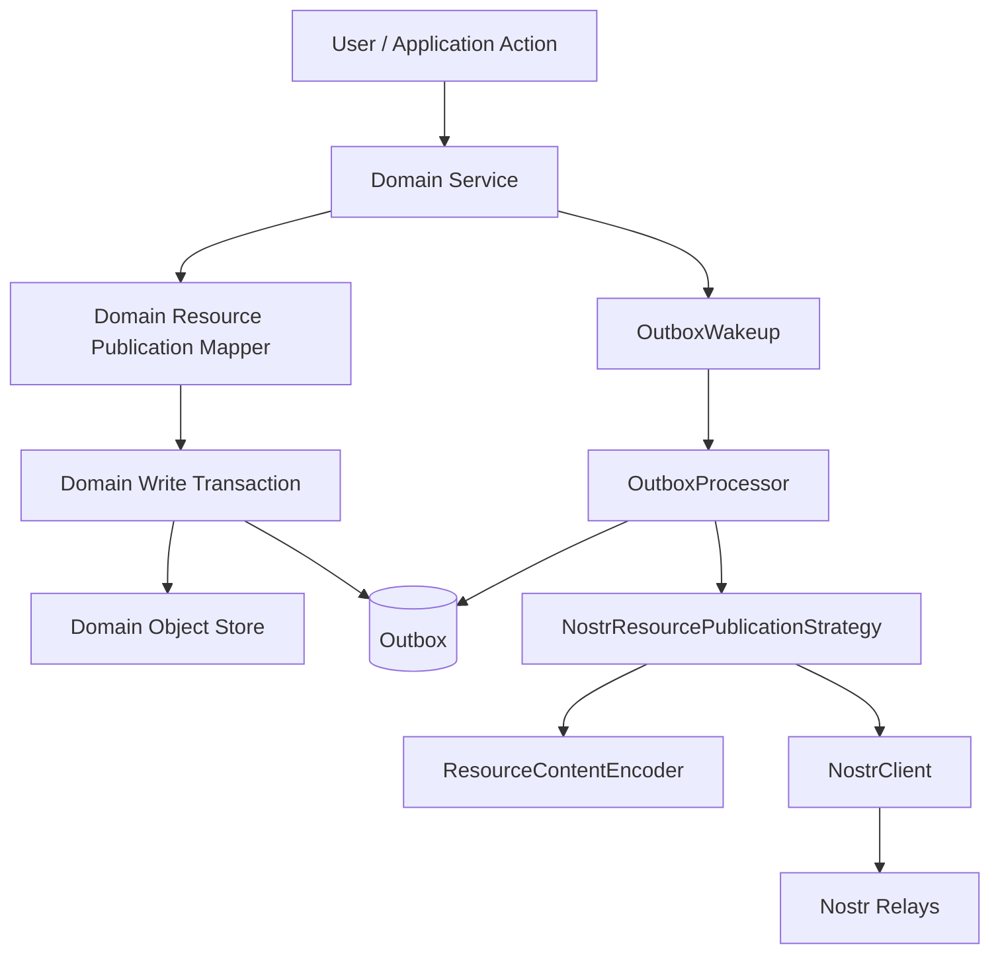

# Resource Publication

## Status

Current

---

# Purpose

This document describes the current outbound Resource publication implementation used by the KJVOnly.bible client.

Publication begins after the application has accepted a local Domain change.

The write side is deliberately separate from inbound Resource installation.

The current Resource publication path is:

```text
Domain operation
    ↓
accepted local Domain state
    ↓
Domain-owned Resource publication mapping
    ↓
ResourcePublication / ResourceDeletionPublication
    ↓
atomic local write
    Domain state
    + ResourceInstallation revision state
    + pending Outbox entry
    ↓
Outbox wakeup
    ↓
OutboxProcessor
    ↓
NostrResourcePublicationStrategy
    ↓
Resource content encoding
    ↓
Nostr event construction + signing + relay publication
```

The central rule is:

> The Domain decides what accepted local information should be published and converts it into a complete Resource publication intent before the intent enters the Outbox. The Outbox persists and delivers that intent without rereading Domain state or acquiring Domain-specific knowledge.

This keeps Domain meaning on the Domain side of the boundary while allowing publication infrastructure to remain generic.

---

# Scope

This document covers:

* the outbound Resource publication boundary,
* `ResourcePublication`,
* `ResourceDeletionPublication`,
* Domain-specific Resource publication mappers,
* Domain identity versus Resource identity,
* local write transactions,
* atomic Domain state + ResourceInstallation + Outbox persistence,
* the application-wide Outbox,
* Outbox identity and last-write-wins behavior,
* `OutboxEntry`,
* `OutboxStore`,
* `IndexedDBOutboxStore`,
* `OutboxWakeup`,
* `OutboxProcessor`,
* publication-strategy registration,
* Resource content encoding,
* `NostrResourcePublicationStrategy`,
* Resource Nostr event construction,
* Resource deletion publication,
* signer/publisher validation,
* relay acknowledgement requirements,
* startup and retry behavior,
* publication concurrency and supersession,
* the relationship between Resource publication and native Nostr-event publication,
* representative Domain write paths,
* testing expectations,
* and current limitations.

This document does **not** define:

* inbound Resource discovery,
* inbound Resource resolution,
* Resource installation policy,
* synchronization policy,
* conflict resolution between independently authored remote state,
* authorization policy for accepting remote data,
* relay-server implementation,
* Blossom upload behavior,
* or a generic REST/RPC publisher.

Those concerns belong to other boundaries.

---

# Architectural Position

The outbound publication boundary sits between accepted local application state and external transport.

Conceptually:

```text
Application / Domain
    owns accepted local state

Domain Resource code
    owns Domain → Resource mapping

Application Outbox
    owns durable publication intent

Publication strategy
    owns protocol-specific publication

NostrClient
    owns Nostr transport
```

The boundaries are intentionally distinct.

The Domain does not construct raw Nostr events.

The Outbox does not interpret Domain Objects.

The Resource publication strategy does not know Pane, Buffer, module, or Domain-store concepts.

`NostrClient` does not know Resource semantics.

---

# Inbound and Outbound Resource Lifecycles Are Different

Inbound processing asks:

```text
What does this externally published Resource mean,
and should it become accepted local Domain state?
```

Outbound publication asks:

```text
How should this already-accepted local Domain state
be represented and published externally?
```

The implementation therefore does not send local writes through the inbound Resource installation pipeline.

The two directions share Resource concepts such as:

```text
publisher
Resource Type
Resource ID
representation
media type
content encoding
```

but their responsibilities differ.

Inbound:

```text
PublishedResourceReference
    ↓
resolution
    ↓
decoding
    ↓
interpretation
    ↓
validation
    ↓
installation
```

Outbound:

```text
Domain Object
    ↓
Domain publication mapper
    ↓
ResourcePublication
    ↓
Outbox
    ↓
publication strategy
    ↓
transport
```

Do not attempt to make one implementation path mechanically reverse the other.

---

# Core Publication Principles

The current implementation follows several important rules.

## 1. Local-first durability

A local Domain write does not wait for relay publication to succeed.

The application first commits:

```text
accepted local state
+
ResourceInstallation revision state
+
pending publication intent
```

Publication occurs afterward.

## 2. Atomic local state, Resource revision state, and publication intent

When a Resource-backed Domain write must be externally published, the Domain write, corresponding `ResourceInstallation`, and Outbox entry are committed in one IndexedDB transaction.

The application must not reach this state:

```text
local state committed
Resource revision state/publication intent lost
```

## 3. The Outbox stores the final publication intent

The Outbox does not store only a Domain object ID and later reread Domain storage to reconstruct publication.

Instead:

```text
Domain Object
    ↓
Domain Resource publication mapper
    ↓
complete Resource publication intent
    ↓
Outbox
```

## 4. Last write wins for the same local publication key

Outbox entries are stored by stable application key.

Writing the same key again replaces the previous pending entry.

This naturally coalesces multiple local updates before publication.

## 5. Publication strategy is selected by intent type

The Outbox is application-wide.

It does not contain a hardcoded Resource switch.

Strategies register by:

```text
publication.type
```

Current application-owned publication types include:

```text
resource
nostr-event
```

## 6. Transport remains below the Resource boundary

Resource publication constructs Resource-specific Nostr event data through `NostrResourcePublicationStrategy`.

Generic relay transport remains in `NostrClient`.

---

# High-Level Architecture



The critical transaction boundary for Resource-backed local writes is:

```text
Domain write transaction
    ├── Domain Object mutation
    ├── ResourceInstallation mutation
    └── Outbox mutation
```

Network publication is outside that transaction.

---

# `ResourcePublication`

The generic Resource publication contract lives in:

```text
src/lib/resource/publication/resource-publication.ts
```

Conceptually:

```ts
interface ResourcePublication
    extends OutboxPublicationIntent {
    readonly type: 'resource';
    readonly publisher: string;
    readonly resourceType: string;
    readonly resourceId: string;
    readonly modifiedAt?: number;
    readonly representation: ResourceRepresentationType;
    readonly mediaType: string;
    readonly value: unknown;
}
```

A Resource publication contains Resource-side information only.

For locally authored Resource-backed writes, the durable write transaction stamps `modifiedAt` once and stores that same revision on both the `ResourceInstallation` and queued `ResourcePublication`. `NostrResourcePublicationStrategy` reuses it as the Nostr event `created_at` value rather than inventing a newer revision at transport time.

It does not contain:

```text
Pane ID
Buffer ID
module name
Domain objectType
Domain objectId as a separate field
IndexedDB store name
Nostr event ID
relay connection state
raw signer state
```

The intent is complete enough for Resource publication infrastructure to construct the external Resource without reading Domain storage again.

---

# Publication Type

Every application Outbox publication extends:

```ts
interface OutboxPublicationIntent {
    readonly type: string;
}
```

Resource publications use:

```text
type = resource
```

Native application-owned Nostr event publications use:

```text
type = nostr-event
```

The type exists for Outbox strategy dispatch.

It is not the Resource Type.

Resource Type is carried separately in:

```text
resource.resourceType
```

---

# `publisher`

`publisher` is the intended Resource publisher public key.

It participates in Resource provenance and addressable Nostr Resource identity.

Before publishing, `NostrResourcePublicationStrategy` obtains the active Nostr public key and verifies:

```text
configured signer public key
    ==
ResourcePublication.publisher
```

A mismatch fails publication.

This prevents the publication strategy from silently publishing a Resource under an identity different from the Domain's intended publisher.

---

# `resourceType`

`resourceType` is the logical Resource Type.

Examples include application Resource categories such as:

```text
Bible Text Markup
Notes
Reading Plan Subscription
Reading Plan Progress
```

The concrete string is Domain-owned.

The Outbox does not infer or interpret it.

For Nostr Resource publication it becomes the Resource event's `t` tag.

---

# `resourceId`

`resourceId` is the Resource-side identity path.

It is not the application's Domain Object storage ID.

For addressable Nostr Resource publication it becomes the `d` tag.

A Domain publication mapper derives it from Domain identity according to that Domain's Resource contract.

---

# `representation`

The current writable Domain Resources publish the:

```text
content
```

representation.

The representation value becomes the Resource event's:

```text
representation
```

tag.

The generic contract allows Resource publication semantics to remain explicit instead of assuming all future Resource publications are content representations.

---

# `mediaType`

`mediaType` describes the Resource content encoding pipeline.

Current writable JSON Resource publications use:

```text
application/json+gzip+hex
```

This means the logical Resource value is processed through:

```text
JSON serialization
    ↓
gzip
    ↓
hex encoding
```

The publication mapper declares the media type.

The generic encoder performs the encoding later.

---

# `value`

`value` is the logical Resource payload before media-type encoding.

It is not necessarily the whole Domain Object.

A Domain publication mapper intentionally selects what belongs in Resource content.

For example, Bible Text Markup publishes:

```text
textMarkup.markings
```

rather than publishing the complete Domain envelope containing application identity fields.

Similarly, Notes removes the application-local `id` from the Resource content and derives Resource identity separately.

This distinction is important:

```text
Domain identity
    ≠
Resource content
```

---

# Resource Deletion Publication

Deletion is explicit.

The generic contract is:

```ts
interface ResourceDeletionPublication
    extends OutboxPublicationIntent {
    readonly type: 'resource';
    readonly operation: 'delete';
    readonly publisher: string;
    readonly resourceType: string;
    readonly resourceId: string;
}
```

A local deletion does **not** automatically imply an external Resource deletion.

The Domain must deliberately create a `ResourceDeletionPublication`.

This prevents generic persistence infrastructure from inventing external deletion semantics.

The current concrete Domain using this path is Notes.

---

# Domain-Owned Publication Mapping

Each writable Resource-backed Domain owns the mapping from its Domain Object to outbound Resource identity and content.

Current mappers include:

```text
BibleTextMarkupResourcePublication
NotesResourcePublication
PlanSubscriptionResourcePublication
PlanProgressResourcePublication
```

The mapper is the point where Domain meaning becomes a Resource publication intent.

The caller passes a Domain Object.

The caller does not pass raw Nostr event tags or transport details.

Conceptually:

```text
Domain Object
    ↓
Domain Resource publication mapper
    ├── derive publisher
    ├── derive Resource Type
    ├── derive Resource ID
    ├── choose representation
    ├── choose media type
    └── select Resource content value
    ↓
ResourcePublication
```

---

# Why Publication Mapping Belongs to the Domain

Generic Resource infrastructure cannot know how application identity maps to Resource identity.

For example, Bible Text Markup has application identity shaped conceptually as:

```text
publisher/name/chapterRef
```

while its Resource identity is constructed under the Bible Text Markup Resource Type namespace.

Notes has its own identity parser and Resource content projection.

Reading Plan subscriptions and progress have their own group/subscription identity rules.

Those mappings are Domain semantics.

Therefore:

> Domain Resource code creates the publication. Generic Outbox and transport code only deliver it.

---

# Domain Identity and Resource Identity

Do not conflate:

```text
Domain Object identity
Resource identity
Outbox persistence identity
Nostr event identity
```

They solve different problems.

A typical Resource-backed write has four useful identities.

## Domain Object identity

Identifies the accepted application object.

Example conceptually:

```text
<publisher>/kjvs/50_3
```

## Stored Domain Object ID

The shared Domain Object store combines:

```text
objectType:objectId
```

For example:

```text
bible/text-markup:<publisher>/kjvs/50_3
```

## Resource identity

Resource-side identity uses:

```text
publisher
resourceType
resourceId
```

## Nostr event ID

The Nostr event ID identifies one signed external publication.

It is produced during transport publication.

It is not the durable application identity of the Domain Object or Resource.

---

# Outbox Identity

For Resource-backed Domain writes, the Outbox key uses the same stored application ID as the Domain Object record.

Conceptually:

```text
Stored Domain Object ID
    bible/text-markup:<publisher>/kjvs/50_3

Outbox ID
    bible/text-markup:<publisher>/kjvs/50_3
```

The Outbox key is an application persistence key.

It is not a Resource ID.

It is not a Nostr event ID.

It is not constructed from Nostr kind.

---

# Why Shared Domain/Outbox Identity Is Useful

Using the same stable local key gives simple overwrite semantics.

Suppose a user modifies one Text Markup object repeatedly while offline:

```text
state A
    ↓
outbox.put(id, publication A)

state B
    ↓
outbox.put(id, publication B)

state C
    ↓
outbox.put(id, publication C)
```

Because IndexedDB `put` replaces the entry under the same key, the durable pending Outbox contains the newest intent.

The Outbox does not need a separate coalescing job.

For the current replaceable/addressable publication use cases this implements a simple:

```text
last local write wins
```

pending-publication model.

---

# `OutboxEntry`

The current Outbox entry shape is:

```ts
interface OutboxEntry {
    readonly id: string;
    readonly publication: OutboxPublicationIntent;
    readonly status: OutboxStatus;
    readonly attempts: number;
}
```

Declared statuses are:

```text
pending
publishing
published
failed
```

Current processing behavior is intentionally simpler than the full declared state vocabulary.

New entries are created as:

```text
status = pending
attempts = 0
```

The current processor:

```text
lists pending entries
attempts publication
success → conditionally deletes the current entry
failure → leaves the pending entry in place
```

It does not currently persist transitions through `publishing`, `published`, or `failed`, and it does not increment `attempts`.

Those fields therefore must not be documented as active retry-state machinery.

---

# `createPendingPublication()`

Application/domain write transactions use:

```ts
createPendingPublication(id, publication)
```

to create the durable Outbox entry.

This centralizes the current initial state:

```text
status = pending
attempts = 0
```

The write transaction persists the complete publication intent.

---

# Atomic Domain Write + Outbox Persistence

Publishable local writes use Domain-specific write transactions.

Representative implementations include:

```text
IndexedDBBibleTextMarkupWriteTransaction
IndexedDBNotesWriteTransaction
IndexedDBPlanSubscriptionWriteTransaction
IndexedDBPlanProgressWriteTransaction
IndexedDBNostrEventWriteTransaction
```

Resource-backed write transactions open a single IndexedDB transaction covering:

```text
domain_objects
resource_installations
outbox
```

Native Nostr-event writes use:

```text
nostr_events
outbox
```

The operation receives narrow store contracts instead of the raw database.

Conceptually:

```text
transaction.begin
    ↓
Domain state write
    ↓
ResourceInstallation revision write
    ↓
Outbox pending intent write with same modifiedAt
    ↓
transaction.commit
```

If the operation fails, the transaction is aborted and the original error is preserved.

---

# Why Atomicity Matters

Without atomic persistence the application could commit local data but lose its required publication intent.

Bad state:

```text
Domain Object exists locally
Outbox entry was never persisted
```

That would violate local-first durability because there would be no reliable mechanism to publish the accepted change later.

Other partial states are also undesirable:

```text
Outbox intent persisted
Domain write failed
```

or:

```text
Domain state + Outbox persisted
ResourceInstallation revision missing/stale
```

Using one IndexedDB transaction prevents these partial outcomes for the covered Resource-backed writes.

---

# Narrow Write-Store Contracts

Domain services do not receive raw IndexedDB transaction objects.

Each Domain defines a narrow transaction contract.

For example, Notes conceptually receives:

```text
notes.put()
notes.delete()
outbox.put()
```

Bible Text Markup receives:

```text
textMarkup.put()
outbox.put()
```

Reading Plan Progress receives:

```text
progress.get()
progress.put()
outbox.put()
```

The transaction adapter hides the `ResourceInstallation` bookkeeping behind these narrow contracts. When `outbox.put()` receives a Resource publication intent, the adapter allocates a monotonic local `modifiedAt`, updates/removes the matching `ResourceInstallation` as appropriate, and persists the stamped publication.

This keeps Domain service behavior testable and prevents persistence details from leaking upward.

---

# Domain Service Write Pattern

The common service pattern is:

```text
validate / prepare Domain change
    ↓
create Resource publication intent
    ↓
write transaction
    ├── persist Domain change
    └── persist Outbox entry
    ↓
update in-memory/local runtime state if required
    ↓
outbox.wake()
```

`outbox.wake()` occurs only after the durable transaction has completed successfully.

The service does not await relay success.

---

# Bible Text Markup Write Flow

`BibleTextMarkupService.put()` follows:

```text
BibleTextMarkup
    ↓
BibleTextMarkupResourcePublication.create()
    ↓
ResourcePublication
    ↓
IndexedDBBibleTextMarkupWriteTransaction
    ├── domain_objects.put(text markup)
    ├── resource_installations.put(local revision state)
    └── outbox.put(pending publication with same modifiedAt)
    ↓
notify local subscribers
    ↓
OutboxProcessor.wake()
```

The Resource mapper validates that the chapter encoded in Domain identity matches `textMarkup.chapterRef` before producing the publication.

The published Resource value is:

```text
textMarkup.markings
```

rather than the entire Domain Object envelope.

---

# Notes Write Flow

`NotesService.put()` follows:

```text
Note
    ↓
NotesResourcePublication.create()
    ↓
ResourcePublication
    ↓
IndexedDBNotesWriteTransaction
    ├── domain_objects.put(note)
    ├── resource_installations.put(local revision state)
    └── outbox.put(pending publication with same modifiedAt)
    ↓
update Notes search runtime
    ↓
OutboxProcessor.wake()
```

The Note mapper:

```text
parses Note Domain identity
    ↓
derives publisher
    ↓
derives Resource ID
    ↓
projects Resource content without application-local id
```

Resource mapping remains Notes-owned.

---

# Notes Deletion Flow

Notes also demonstrates explicit Resource deletion.

`NotesService.delete()` performs:

```text
noteId
    ↓
NotesResourcePublication.createDeletion()
    ↓
ResourceDeletionPublication
    ↓
IndexedDBNotesWriteTransaction
    ├── delete local Domain Object
    ├── delete ResourceInstallation revision state
    └── replace same Outbox key with deletion intent
    ↓
remove from local Notes search runtime
    ↓
OutboxProcessor.wake()
```

Because the deletion uses the same Outbox key as the Note, it supersedes an older pending publication for that Note.

That is important when a user:

```text
creates/updates a Note
then deletes it
before the earlier publication drains
```

The newest durable intent is deletion.

---

# Reading Plan Subscription Write Flow

`PlanSubscriptionsService.put()` follows the same pattern:

```text
PlanSubscription
    ↓
PlanSubscriptionResourcePublication.create()
    ↓
ResourcePublication
    ↓
IndexedDBPlanSubscriptionWriteTransaction
    ├── persist subscription
    ├── persist ResourceInstallation revision state
    └── persist Outbox entry with same modifiedAt
    ↓
OutboxProcessor.wake()
```

The mapper owns conversion from application subscription identity to Resource identity.

---

# Reading Plan Progress Write Flow

`PlanProgressService.completeReading()` is slightly more selective.

It first determines whether the requested completion changes accepted state.

If the reading is already complete:

```text
return existing progress
no new Outbox publication
no wake
```

If progress changes:

```text
create updated PlanProgress
    ↓
PlanProgressResourcePublication.create()
    ↓
transaction
    ├── persist progress
    ├── persist ResourceInstallation revision state
    └── persist Outbox entry with same modifiedAt
    ↓
OutboxProcessor.wake()
```

This prevents no-op state transitions from producing unnecessary publication work.

---

# The Outbox Is Application-Wide

The current Outbox is not Resource-specific.

Its durable publication intent is generic:

```ts
interface OutboxPublicationIntent {
    readonly type: string;
}
```

Current registered publication strategies are:

```text
resource
    → NostrResourcePublicationStrategy

nostr-event
    → NostrEventPublicationStrategy
```

This allows Resource-backed application data and native application-owned Nostr events to share:

```text
one durable Outbox
one processor
one wakeup mechanism
```

without forcing native Nostr events into the Resource model.

---

# Native Nostr Events and Resource Publications

Some application-owned data is naturally a Nostr event rather than a Resource.

Examples include account/profile-related events.

Those writes follow:

```text
NostrEvent Domain/application state
    ↓
NostrEventPublication.create()
    ↓
type = nostr-event
    ↓
atomic nostr_events + outbox transaction
    ↓
OutboxProcessor
    ↓
NostrEventPublicationStrategy
    ↓
NostrClient
```

This shares durability and retry mechanics while preserving protocol-specific meaning.

The distinction is intentional:

```text
Resource publication
    = Resource semantics transported over Nostr

Nostr event publication
    = native Nostr application semantics
```

---

# Outbox Store

The Outbox persistence port is:

```ts
interface OutboxStore {
    get(id): Promise<OutboxEntry | undefined>;
    put(entry): Promise<void>;
    listByStatus(status): Promise<readonly OutboxEntry[]>;
    deleteIfCurrent(entry): Promise<boolean>;
}
```

The current implementation is:

```text
IndexedDBOutboxStore
```

It uses the application IndexedDB database and the `outbox` object store.

The store has a status index used by the processor to retrieve pending entries.

---

# Why `deleteIfCurrent()` Exists

A publication may take time.

During that time the application may write a newer publication under the same Outbox key.

Consider:

```text
Outbox contains publication A
    ↓
processor starts publishing A
    ↓
user makes another local change
    ↓
Outbox key is replaced by publication B
    ↓
publication A succeeds
```

A naive processor would now delete the Outbox key and accidentally remove publication B.

That would lose the newest local change.

The current implementation prevents this with:

```text
deleteIfCurrent(processedEntry)
```

---

# `deleteIfCurrent()` Semantics

`IndexedDBOutboxStore.deleteIfCurrent()` opens a read/write Outbox transaction and rereads the current entry by ID.

It deletes only when:

```text
current entry exists
AND
current.status == pending
AND
current.publication == processed publication
```

Publication equality is currently compared by serialized publication value.

If the current entry differs, deletion is skipped.

Therefore:

```text
older publication completion
    cannot delete
newer pending publication
```

The same protection applies when the newer intent is a Resource deletion.

---

# Last-Write-Wins and In-Flight Publication

The current Outbox therefore has two related safety properties.

## Before processing

Repeated writes to one key replace older pending intent:

```text
A → B → C
```

leaves:

```text
C
```

pending.

## During processing

If A is already in flight and B replaces it:

```text
A publishes successfully
    ↓
deleteIfCurrent(A)
    ↓
sees B
    ↓
does not delete
```

B remains pending for a later processor pass.

This is the core concurrency protection for Outbox supersession.

---

# `OutboxWakeup`

Domain/application services do not need the whole processor API.

They depend on the small port:

```ts
interface OutboxWakeup {
    wake(): void;
}
```

`OutboxProcessor` implements this interface.

This keeps services coupled to the capability they actually need:

```text
new durable publication exists
please schedule processing
```

They do not control processing internals.

---

# `wake()` Is Non-Blocking

`OutboxProcessor.wake()` does not return a publication-completion promise.

The local operation has already committed its durable state and Outbox entry.

`wake()` schedules asynchronous draining.

This preserves the local-first model:

```text
local write success
    ≠
relay publication success
```

---

# Serialized Wake Processing

The processor prevents concurrent drain loops with internal state:

```text
processing
wakeRequested
```

When `wake()` is called:

```text
wakeRequested = true
```

If a loop is already processing, no second concurrent loop starts.

Instead, the current loop notices another wake was requested and performs another pass.

Conceptually:

```text
wake
    ↓
pass 1 begins
    ↓
new write calls wake during pass 1
    ↓
wakeRequested = true
    ↓
pass 1 completes
    ↓
pass 2 runs
```

This prevents competing Outbox drain loops while ensuring work added during processing is not ignored.

---

# `OutboxProcessor.processPending()`

A processing pass performs:

```text
store.listByStatus('pending')
    ↓
for each entry
    ↓
resolve strategy by publication.type
    ↓
strategy.publish(publication)
    ↓
store.deleteIfCurrent(entry)
```

If publication throws:

```text
entry remains pending
processor continues with later entries
```

One failed publication does not prevent other pending entries from being attempted during the same pass.

---

# Publication Strategy Registry

`OutboxProcessor` receives publication strategies in the application composition root.

It builds a map keyed by:

```text
strategy.type
```

Duplicate strategy types fail during processor construction.

This makes Outbox dispatch open for extension without a type switch inside the processor.

To add another application publication type:

```text
1. define a publication intent
2. define an OutboxPublicationStrategy
3. register the strategy in Application
```

The processor itself does not need modification.

---

# `OutboxPublicationStrategy`

The strategy port is conceptually:

```ts
interface OutboxPublicationStrategy {
    readonly type: string;

    publish(
        publication: OutboxPublicationIntent
    ): Promise<void>;
}
```

A strategy owns delivery semantics for one publication type.

Current strategies are:

```text
NostrResourcePublicationStrategy
NostrEventPublicationStrategy
```

---

# Application Composition

`Application` creates:

```text
ResourceContentDecoratorBuilder
ResourceContentEncoder
NostrResourcePublicationStrategy
IndexedDBOutboxStore
NostrEventPublicationStrategy
OutboxProcessor
```

The processor is registered with both strategies:

```text
OutboxProcessor
    ├── resource → NostrResourcePublicationStrategy
    └── nostr-event → NostrEventPublicationStrategy
```

Domain services receive the processor only through the `OutboxWakeup` capability.

They do not receive the concrete strategy registry.

---

# Resource Content Encoding

Resource publication stores a logical Resource value in the Outbox.

Transport encoding occurs when the Resource strategy publishes it.

The current path is:

```text
ResourcePublication.value
    ↓
ResourceContentEncoder
    ↓
ResourceContentDecoratorBuilder
    ↓
media-type decorator chain
    ↓
encoded string
```

For:

```text
application/json+gzip+hex
```

the logical order is:

```text
value
    ↓
JSON
    ↓
gzip
    ↓
hex
    ↓
Nostr event content string
```

This keeps the durable Outbox publication intent at the Resource-value level rather than storing a prebuilt raw Nostr event.

---

# Why Encoding Happens During Publication

The Domain mapper owns:

```text
what the Resource value is
which media type declares its representation
```

The generic Resource encoder owns:

```text
how that media type becomes wire content
```

This separation prevents Domain code from duplicating gzip/hex/JSON mechanics.

It also keeps encoding registration shared with generic Resource content infrastructure.

---

# `NostrResourcePublicationStrategy`

`NostrResourcePublicationStrategy` is the current transport-specific publisher for Resource intents.

It owns:

```text
validate Outbox publication type
validate active publisher identity
encode Resource content
construct Resource Nostr tags
construct deletion Nostr tags
publish through NostrClient
validate relay acceptance
```

It does not own:

```text
Domain mapping
Outbox persistence
retry scheduling
Resource installation
relay connection management
signer implementation
```

---

# Resource Publication Event Construction

For a normal Resource publication, the strategy publishes a Resource event using the application's Resource kind.

The event carries these tags:

```text
d              Resource ID
m              media type
t              Resource Type
representation Resource representation
```

Conceptually:

```text
kind = RESOURCE_KIND

tags = [
    ['d', resource.resourceId],
    ['m', resource.mediaType],
    ['t', resource.resourceType],
    ['representation', resource.representation]
]

content = encoded Resource value
```

`NostrClient.publishEvent()` owns signing and relay transport.

---

# Resource Event Identity

The strategy does not precompute or persist the final Nostr event ID in the Outbox.

The event ID is created by the Nostr publication/signing path.

This is correct because:

```text
Outbox identity
    = durable local publication slot

Resource identity
    = publisher + Resource ID / Resource semantics

Nostr event ID
    = one concrete signed publication
```

Those identities should remain separate.

---

# Publisher Validation

Before normal Resource publication or Resource deletion, the strategy retrieves the active Nostr public key.

It requires:

```text
active pubkey == publication.publisher
```

If not, publication fails and the Outbox entry remains pending.

This is especially important when an Outbox survives application restart and the currently authenticated signer may differ from the publisher associated with older pending work.

The processor does not silently rewrite publisher identity.

---

# Relay Acceptance Requirement

`NostrClient.publishEvent()` returns publication acknowledgement information.

Resource publication is considered successful only when:

```text
acceptedByAnyRelay == true
```

If every configured relay rejects the publication, `NostrResourcePublicationStrategy` throws.

The Outbox entry therefore remains pending.

This avoids treating a signed event as successfully published merely because event construction succeeded.

---

# Resource Deletion on Nostr

A `ResourceDeletionPublication` is published as a Nostr deletion event.

The current strategy uses:

```text
kind = 5
```

with tags:

```text
a = <RESOURCE_KIND>:<publisher>:<resourceId>
k = <RESOURCE_KIND>
```

and empty content.

Conceptually:

```text
kind 5
    ↓
'a' tag addresses the Resource event coordinate
    ↓
'k' tag identifies the deleted event kind
```

The deletion is still routed through the same Outbox `resource` strategy.

---

# Why Deletion Is a Resource Intent

Resource deletion remains part of Resource publication semantics.

It is not modeled as a generic Nostr-event publication because the Domain intent is:

```text
delete this Resource identity
```

not:

```text
publish arbitrary kind-5 Nostr data
```

`NostrResourcePublicationStrategy` owns the transport representation of that Resource deletion.

---

# Current Resource Deletion Scope

The generic Resource publication contract supports deletion.

Current Domain usage is narrower.

Notes explicitly create deletion intents.

Other writable Resource-backed Domains do not automatically publish a Resource deletion simply because local data disappears.

Do not infer deletion policy generically.

Deletion must remain a deliberate Domain operation.

---

# Nostr Event Publication Strategy

The application-wide Outbox also supports native Nostr event publication through:

```text
NostrEventPublicationStrategy
```

The strategy performs a similar publisher invariant:

```text
active signer pubkey
    ==
publication.publisher
```

It publishes the event parameters through the same `NostrClient`.

A native Nostr event is successful only if at least one relay accepts it.

This demonstrates why the Outbox is generic while Resource publication remains Resource-specific.

---

# One Nostr Transport Path

Resource and native Nostr-event publication both converge on the application-owned `NostrClient`.

Conceptually:

```text
ResourcePublication
    ↓
NostrResourcePublicationStrategy
    ┐
    │
    ├──→ NostrClient → rx-nostr → relays
    │
NostrEventPublication
    ↓
NostrEventPublicationStrategy
    ┘
```

The application does not create one Nostr transport stack per Domain.

---

# Startup Behavior

Pending Outbox entries are durable across page/application restart.

During `Application.start()` the application first establishes the runtime state required for publication, including:

```text
settings/runtime initialization
Resource selection restoration
Workspace initialization
Nostr default relay configuration
available account state
```

Then it calls:

```text
outboxProcessor.wake()
```

The intent is:

> Once signing and relay configuration are ready, attempt any durable pending application publications left from earlier sessions.

Startup does not wait for the Outbox to become empty.

---

# Retry Behavior

The current retry model is deliberately simple.

On publication failure:

```text
strategy throws
    ↓
OutboxProcessor catches
    ↓
entry remains pending
```

A later wake retries pending entries.

Current wake sources include:

```text
successful local publishable writes
application startup
additional writes arriving while processing
```

There is currently no persisted retry schedule, exponential backoff policy, or attempt counter update in active processor behavior.

Do not document those as implemented.

---

# Failure Does Not Roll Back Accepted Local State

After the local IndexedDB transaction commits, relay publication is asynchronous.

Therefore:

```text
relay offline
relay rejection
publisher mismatch
encoding error
transport error
```

may leave publication pending, but they do not retroactively undo the accepted local Domain write.

This is the intended local-first behavior.

---

# Publication Errors Are Processor-Level Retry Signals

`OutboxProcessor.processPending()` catches publication errors per entry.

The processor does not currently surface those errors back to the Domain service that originally committed the write.

This means:

```text
Domain service success
    means local write + durable publication intent succeeded
```

It does **not** mean:

```text
remote relays accepted the publication
```

Any future UI publication-status feature must respect that distinction.

---

# Processing Continues After One Failure

If one pending publication fails, the processor continues attempting later entries in the same pending list.

Conceptually:

```text
A fails
B succeeds
C succeeds
```

A remains pending.

B and C can still be removed after successful publication.

A single broken publication therefore does not block all other pending work.

---

# Supersession During Failure

Because pending entries may be replaced while processing, retry behavior always operates against durable current state.

If an older entry fails after a newer entry has replaced it, the newer entry remains in the store.

If an older entry succeeds after replacement, `deleteIfCurrent()` protects the newer entry from deletion.

The Outbox therefore does not require explicit cancellation tokens for current overwrite semantics.

---

# No Domain Readback During Publication

The processor and Resource publication strategy never perform:

```text
Outbox ID
    ↓
Domain Object store lookup
    ↓
rebuild Resource
```

That design was intentionally rejected.

The publication intent already contains the Resource information needed for publication.

This avoids coupling generic application publication infrastructure to every writable Domain.

---

# Why the Outbox Stores Logical Resource Content

Although the Outbox stores the complete Resource publication intent, it stores:

```text
logical Resource value
+
media type
```

rather than only a fully encoded Nostr content string.

This keeps:

```text
Resource content semantics
```

separate from:

```text
transport publication
```

and lets `ResourceContentEncoder` perform the declared encoding consistently at publication time.

---

# Public API Boundaries

Stable generic Resource publication contracts are exposed through:

```text
$lib/resource
```

Examples include:

```text
ResourcePublication
ResourceDeletionPublication
ResourcePublicationIntent
isResourceDeletionPublication
```

Application Outbox contracts are exposed through:

```text
$lib/application
```

Examples include:

```text
OutboxPublicationIntent
OutboxPublicationStrategy
OutboxWakeup
OutboxEntry
createPendingPublication
```

Concrete persistence and Nostr transport implementations remain concrete implementation imports where appropriate.

Do not expose every strategy/store merely to shorten paths.

---

# Composition-Root Ownership

`Application` owns construction of the main publication runtime.

It creates and wires:

```text
NostrClient
ResourceContentDecoratorBuilder
ResourceContentEncoder
NostrResourcePublicationStrategy
IndexedDBOutboxStore
NostrEventPublicationStrategy
OutboxProcessor
```

It also constructs Domain publication mappers and injects them into the corresponding Domain services.

Svelte components do not construct Outbox processors, publication strategies, or Resource publication mappers.

---

# Domain Services Depend on Capabilities, Not Processor Internals

Writable Domain services generally receive:

```text
Domain store/read capability
Domain write transaction
Domain Resource publication mapper
OutboxWakeup
```

They do not receive:

```text
IndexedDBOutboxStore
NostrResourcePublicationStrategy
NostrClient
raw Outbox strategy registry
```

This keeps the Domain service focused on application behavior.

---

# Representative Service Dependency Shape

Conceptually:

```text
BibleTextMarkupService
    ├── BibleTextMarkupStore
    ├── ResourceLoader
    ├── BibleTextMarkupWriteTransaction
    ├── BibleTextMarkupResourcePublication
    ├── OutboxWakeup
    └── BibleLocationReferenceService
```

The publication-related dependencies are deliberately narrow.

The service does not know how Nostr tags are created or how relays acknowledge publication.

---

# Testing Strategy

Publication behavior is tested at several layers.

## Domain publication mapper tests

Verify:

```text
Domain identity → Resource identity
Resource Type
representation
media type
published content projection
invalid identity rejection
explicit deletion mapping where supported
```

Examples include specs for:

```text
BibleTextMarkupResourcePublication
NotesResourcePublication
PlanSubscriptionResourcePublication
PlanProgressResourcePublication
```

## Domain service tests

Verify:

```text
publication mapper is called
local write and Outbox intent occur together
no-op updates do not publish where applicable
Outbox is woken after successful durable write
local runtime/search subscribers update correctly
```

## Write-transaction tests

Verify:

```text
Domain Object and Outbox use one transaction
correct stable Outbox key is used
operation failure aborts the transaction
Resource deletion can be stored atomically with local deletion
```

## Outbox store tests

Verify:

```text
entry persistence
status lookup
successful current-entry deletion
newer publication is not deleted by older completion
newer deletion is not deleted by older publication completion
```

## Outbox processor tests

Verify:

```text
strategy routing by publication.type
duplicate strategy registration rejection
failed publication remains pending
later entries continue processing
wake serialization
additional pass when wake arrives during processing
```

## Nostr Resource strategy tests

Verify:

```text
Resource content encoding
expected Resource tags
publisher/signing identity enforcement
relay acceptance requirement
Resource deletion event construction
```

---

# Adding a New Writable Resource-Backed Domain Type

A new writable Resource-backed Domain normally requires the following steps.

## 1. Define Domain identity

The Domain must own a stable Domain Object identity.

## 2. Define Resource identity

Specify:

```text
Resource Type
Resource ID mapping
publisher
representation
media type
```

## 3. Implement a Domain Resource publication mapper

The mapper accepts Domain state and creates a complete `ResourcePublication` or explicit deletion intent.

## 4. Define a narrow write transaction contract

The Domain service should receive only the stores/capabilities required by that operation.

## 5. Implement atomic persistence

The concrete transaction should commit:

```text
Domain state mutation
+
pending Outbox entry
```

in one IndexedDB transaction where they share persistence.

## 6. Wake the Outbox after commit

Call the injected `OutboxWakeup` only after durable commit succeeds.

## 7. Reuse the existing Resource publication strategy

If the Resource uses the existing Resource/Nostr contract, no new Outbox publication strategy is needed.

The new Domain should not add a switch to `OutboxProcessor`.

---

# Adding a New Outbox Publication Type

A new publication type is different from a new Resource Type.

If the new outbound data is not a Resource and not an existing native Nostr-event intent, then:

```text
1. define a new OutboxPublicationIntent subtype
2. assign a unique publication.type
3. implement OutboxPublicationStrategy
4. register it in Application
5. add durable write integration
```

Do not add type-specific branching to `OutboxProcessor`.

---

# Resource Type vs Outbox Publication Type

These are different concepts.

```text
Outbox publication type
    resource
```

routes to:

```text
NostrResourcePublicationStrategy
```

Inside that publication are many possible:

```text
Resource Types
```

such as Notes or Text Markup.

The Outbox does not need one strategy per Resource Type because Resource-specific identity/content mapping has already happened before enqueue.

---

# Local Delete vs Published Delete

The application must distinguish:

```text
remove local Domain state
```

from:

```text
publish external deletion intent
```

Those actions may coincide for a Domain operation, as Notes currently demonstrates, but they are not automatically equivalent.

This matters for future data where local uninstallation or local hiding must not delete externally published content.

---

# Resource Installation State vs Local Authoring

A remotely installed Resource does not automatically enter the Outbox.

Inbound installation means:

```text
accept external Resource as local Domain state
+
record its ResourceInstallation revision/provenance state
```

It does not mean:

```text
republish the same Resource as the current user
```

Explicit local authoring/application write paths also create/update `ResourceInstallation` state, but for a different reason: the record tracks the Resource revision currently backing the locally authored Domain Object and gives Archive export/future synchronization a stable `modifiedAt`.

Only explicit local authoring/application write paths enqueue outbound publication intent.

This prevents publication loops while keeping local and externally installed Resource-backed objects on one object-level revision model.

---

# Resource Receipt Is Not Outbox State

Inbound Resource processing uses `ResourceReceipt` to record successfully processed external Resources.

Outbound publication uses `OutboxEntry` to record pending local publication work.

These must not be conflated.

```text
ResourceReceipt
    = inbound processing receipt

OutboxEntry
    = outbound durable publication intent
```

They solve opposite sides of the Resource boundary.

---

# ResourceInstallation Is Not Outbox State

Likewise:

```text
ResourceInstallation
```

records the Resource revision/state currently associated with a Resource-backed Domain Object. For externally installed objects it can preserve Resource provenance; for locally authored objects `resourceId` may be absent while publisher + `modifiedAt` still track the current Resource revision.

It is not pending-publication state.

The Outbox does not inspect `ResourceInstallation` to decide what to publish.

A Domain write explicitly creates the outbound Resource publication. The write transaction only keeps the accepted Domain state, Resource revision state, and queued publication revision atomic.

---

# Current Retry Limitations

The current Outbox intentionally does not yet provide a sophisticated scheduler.

Not currently implemented as active behavior:

```text
retry timestamps
exponential backoff
maximum attempt count
persistent last-error field
failed-state escalation
periodic timer-based retry
manual retry UI
per-relay retry state
```

The durable pending entry is the retry mechanism.

A later wake causes another attempt.

These features can be added without moving Domain mapping back into the Outbox.

---

# Current Status Fields Are Broader Than Runtime Use

`OutboxStatus` declares:

```text
pending
publishing
published
failed
```

but current runtime processing primarily uses:

```text
pending
```

and removes successfully published current entries.

Do not infer a persisted state machine that the current implementation does not execute.

Future status tracking may make fuller use of the declared vocabulary.

---

# Current Attempt Field Is Reserved

`OutboxEntry.attempts` currently starts at:

```text
0
```

The current processor does not increment it.

It should therefore be treated as reserved structure rather than documented as active retry accounting.

---

# Publication Ordering

The current processor iterates the pending list returned by the store.

There is no explicit global ordering policy documented or enforced for independent Outbox entries.

Correctness should not depend on cross-key publication order.

For one stable key, overwrite/supersession semantics ensure the durable Outbox retains the newest pending intent.

---

# Relay Targeting

Resource publication strategy publishes through the application-owned `NostrClient` using its configured relay state.

The Resource publication intent itself does not carry a relay list.

This is deliberate.

Resource meaning is separated from current transport routing configuration.

The application's Nostr/account/relay configuration determines where publication is attempted.

---

# Signing Ownership

Domain publication mappers do not sign.

The Outbox does not sign.

`NostrResourcePublicationStrategy` does not manually construct a second signer pipeline.

Publication is delegated through `NostrClient`, which owns the application's Nostr publication transport/signing path.

This keeps one signing path for application Nostr publication.

---

# Why Publication Intent Is Durable Before Signing

The application may accept a local write while remote transport is unavailable.

Therefore durable intent must exist independently from a successful signed external event.

The Outbox preserves:

```text
what the application intends to publish
```

rather than requiring:

```text
a completed external publication
```

at write time.

---

# Authentication and Pending Publications

Because publisher identity is validated at publication time, an Outbox entry may remain pending if the currently configured signer does not match its intended publisher.

The processor does not rewrite the publication to another user.

This preserves publisher identity correctness across:

```text
logout
login as another account
application restart
pending offline work
```

A future user-facing pending-publication policy may need to surface such mismatches explicitly.

---

# Browser and Runtime Ownership

The Outbox is application/runtime infrastructure.

Svelte modules do not directly manipulate Outbox storage.

Svelte actions call Domain/application services.

Those services perform durable Domain writes and wake the application-owned Outbox processor.

Conceptually:

```text
Svelte UI
    ↓
Domain Service
    ↓
Domain Write Transaction + Resource Publication Mapper
    ↓
OutboxWakeup
```

not:

```text
Svelte UI
    ↓
IndexedDB Outbox Store
```

---

# Worker Relationship

The current outbound Outbox processor runs in the main application runtime.

It is separate from the inbound Resource Worker architecture.

Inbound Resource processing uses workers for resolution/decoding/installation.

Outbound publication currently uses:

```text
main-thread Domain service
main-thread IndexedDB write transaction
main-thread OutboxProcessor
main-thread NostrClient
```

Do not assume inbound and outbound Resource execution must share one worker model.

---

# Important Files

The central current implementation files include:

```text
src/lib/resource/publication/
    resource-publication.ts

src/lib/application/outbox/
    outbox-entry.ts
    outbox-publication-intent.ts
    outbox-publication-strategy.ts
    outbox-store.ts
    indexeddb-outbox-store.ts
    outbox-processor.ts
    outbox-wakeup.ts

src/lib/resource/nostr/
    nostr-resource-publication-strategy.ts

src/lib/resource/content/
    resource-content-encoder.ts
    resource-content-decorator-builder.ts

src/lib/domains/bible/resources/text-markup/
    bible-text-markup-resource-publication.ts
    bible-text-markup-write-stores.ts

src/lib/domains/bible/persistence/
    bible-text-markup-write-transaction.ts

src/lib/domains/notes/resources/
    notes-resource-publication.ts
    notes-write-stores.ts

src/lib/domains/notes/persistence/
    notes-write-transaction.ts

src/lib/domains/reading-plans/resources/subscriptions/
    plan-subscription-resource-publication.ts
    plan-subscription-write-stores.ts

src/lib/domains/reading-plans/resources/progress/
    plan-progress-resource-publication.ts
    plan-progress-write-stores.ts

src/lib/domains/reading-plans/persistence/
    plan-subscription-write-transaction.ts
    plan-progress-write-transaction.ts

src/lib/infrastructure/nostr/events/publication/
    nostr-event-publication.ts
    nostr-event-publication-strategy.ts
    nostr-event-write-stores.ts

src/lib/infrastructure/nostr/events/persistence/
    nostr-event-write-transaction.ts

src/lib/application/runtime/
    application.ts
```

---

# Relationship to Other Implementation Documents

This document should be read with:

```text
resources/001-resource-transport.md
    transport/discovery and Nostr boundary

resources/004-resource-installation.md
    Domain installation boundary

resources/005-resource-lifecycle-content.md
    full inbound Resource lifecycle

persistence/004-outbox-implementation.md
    broader Outbox persistence history/implementation notes
```

When older Outbox documents disagree with the current source or this document, the current source is authoritative.

---

# Design Rules

The following rules summarize the current implementation.

## Rule 1

Accepted local publishable state and its pending publication intent are committed atomically where they share persistence.

## Rule 2

A Domain owns the mapping from Domain state to Resource publication.

## Rule 3

The Outbox stores a complete durable publication intent and does not reread Domain storage to reconstruct Resources.

## Rule 4

The same stable local Outbox key is overwritten by newer pending state for that logical application object.

## Rule 5

A completed older publication must never delete a newer pending intent.

`deleteIfCurrent()` enforces this.

## Rule 6

The Outbox is application-wide and dispatches by publication type through registered strategies.

## Rule 7

Resource Type is not Outbox publication type.

All Resource Types currently share the `resource` publication strategy.

## Rule 8

Resource encoding happens in generic Resource publication infrastructure according to the declared media type.

## Rule 9

Nostr transport is owned by `NostrClient`, not by Domain services.

## Rule 10

The intended Resource publisher must match the active signer before publication.

## Rule 11

Relay publication succeeds only when at least one configured relay accepts the event.

## Rule 12

Publication failure leaves the durable entry pending and does not roll back accepted local Domain state.

## Rule 13

A local delete does not imply Resource deletion unless the Domain explicitly creates a deletion publication.

## Rule 14

Inbound Resource installation does not automatically enqueue outbound publication.

## Rule 15

Do not recreate a Domain-aware Outbox handler chain that reads Domain stores to rebuild Resources.

---

# End-to-End Resource Write Example

A Bible Text Markup update demonstrates the complete path.

```text
User changes markup
    ↓
BibleTextMarkupService.put(textMarkup)
    ↓
BibleTextMarkupResourcePublication.create(textMarkup)
    ↓
ResourcePublication {
    type: resource
    publisher
    resourceType
    resourceId
    representation: content
    mediaType: application/json+gzip+hex
    value: markings
}
    ↓
IndexedDBBibleTextMarkupWriteTransaction
    ├── write StoredDomainObject
    └── write OutboxEntry(status=pending)
    ↓
transaction commits
    ↓
local subscribers notified
    ↓
OutboxProcessor.wake()
    ↓
OutboxProcessor lists pending entries
    ↓
strategy[type=resource]
    ↓
NostrResourcePublicationStrategy
    ↓
verify publisher == active signer
    ↓
ResourceContentEncoder
    ↓
JSON + gzip + hex
    ↓
construct kind RESOURCE_KIND event
    tags:
        d = Resource ID
        m = media type
        t = Resource Type
        representation = content
    ↓
NostrClient.publishEvent()
    ↓
relay acknowledgement
    ↓
acceptedByAnyRelay == true
    ↓
IndexedDBOutboxStore.deleteIfCurrent(entry)
    ↓
entry removed only if no newer publication replaced it
```

This is the canonical outbound Resource publication model for the current application.

---

# Final Summary

The current outbound Resource architecture is intentionally simple:

```text
Domain state
    ↓
Domain-owned Resource mapping
    ↓
complete Resource publication intent
    ↓
atomic local state + Outbox persistence
    ↓
non-blocking Outbox wake
    ↓
strategy-based publication
    ↓
Resource encoding
    ↓
Nostr transport
```

The most important implementation properties are:

```text
local-first durability
atomic publication intent
Domain-owned Resource mapping
generic application-wide Outbox
same-key last-write-wins coalescing
in-flight supersession protection
strategy-based publication dispatch
one Nostr transport path
explicit deletion semantics
retry by durable pending state
```

The Outbox is not a second Domain layer.

It is the durable boundary between accepted local application state and eventual external publication.
