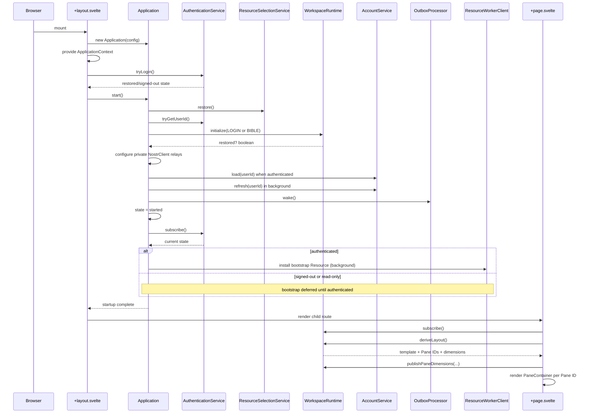
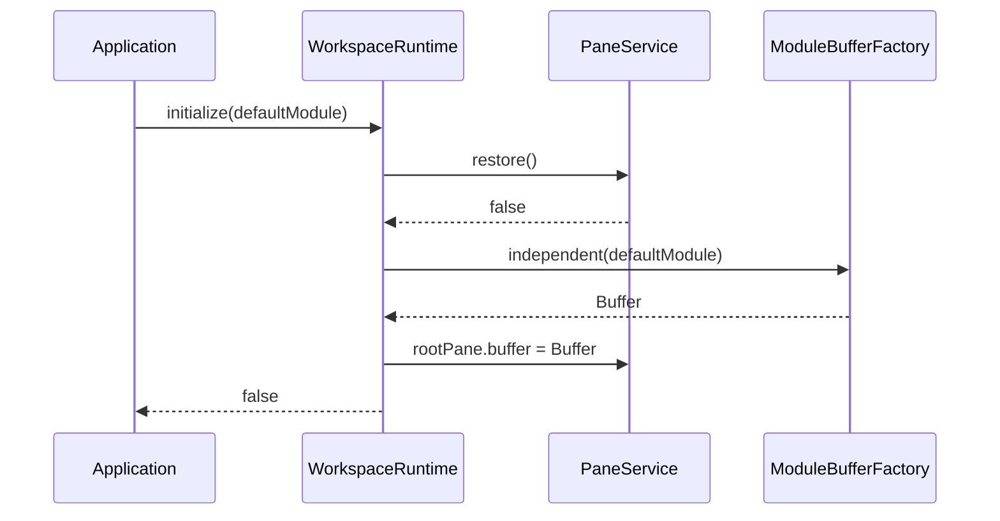
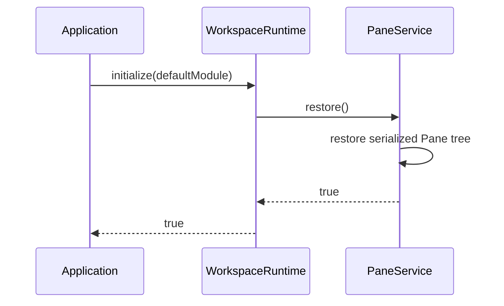
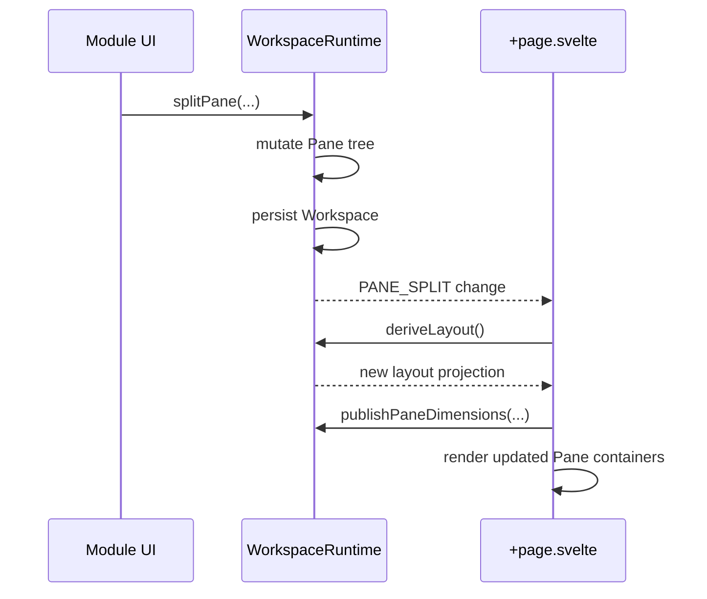

# Root Runtime

## Status

Current

---

# Purpose

This document describes the concrete root runtime used to start, expose, present,
and stop the KJVOnly.bible application.

The root runtime is the bridge between the browser/Svelte lifecycle and the
application-owned runtime object graph.

At a high level:

```text
Browser
    ↓
+layout.svelte
    ↓
Application
    ↓
ApplicationContext
    ↓
WorkspaceRuntime + application/domain services
    ↓
+page.svelte
    ↓
visible Workspace
```

The most important ownership rule is:

> Svelte starts and presents the Application, but the Application owns the
> runtime capabilities and infrastructure that make the application work.

The root Svelte files therefore remain intentionally thin.

They do not construct Domain services, Nostr transport, Resource workers,
Outbox processors, Workspace persistence, or module Resource-selection logic.

Related documents:

```text
docs/01_application-architecture/001-application-overview.md
docs/01_application-architecture/002-workspace-runtime.md
docs/01_application-architecture/003-runtime-rendering.md
docs/03_implementation/runtime/002-pane-tree.md
docs/03_implementation/runtime/003-grid-layout.md
docs/03_implementation/runtime/004-rendering-engine.md
docs/03_implementation/runtime/005-buffer-contract.md
docs/03_implementation/runtime/006-runtime-services.md
```

---

# Scope

This document covers:

* the root Svelte layout,
* `Application` construction,
* `ApplicationContext` provisioning,
* authentication restoration ordering,
* `Application.start()`,
* Workspace initialization,
* Resource-selection restoration,
* Nostr relay startup configuration,
* account loading and refresh,
* Outbox wakeup,
* authentication-gated asynchronous bootstrap Resource installation,
* the root Workspace page,
* Workspace change subscriptions,
* layout refresh,
* Pane-dimension publication,
* toast presentation,
* startup failure handling,
* shutdown,
* and root-runtime invariants.

This document does not redefine:

* Pane-tree algorithms,
* CSS Grid derivation,
* Buffer semantics,
* Domain behavior,
* Resource resolution internals,
* Nostr protocol implementation,
* Outbox publication internals,
* or persistence schemas.

Those concerns are documented separately.

---

# Root Runtime Entry Points

The root runtime is implemented primarily by:

```text
src/routes/+layout.svelte
src/routes/+page.svelte
src/lib/application/runtime/application.ts
src/lib/application/runtime/application-context.ts
src/lib/application/runtime/workspace/workspace-runtime.ts
```

The public application-facing boundaries are:

```text
src/lib/application/index.ts
src/lib/application/ui/index.ts
```

Code outside the `application` layer should normally consume browser-safe
application/runtime contracts through `$lib/application`. Browser/Svelte
presentation components and DOM helpers are exposed separately through
`$lib/application/ui` so Node-side consumers do not evaluate browser-only
modules.

The concrete composition root is intentionally different:

```text
src/lib/application/runtime/application.ts
```

`Application` is not exported from `$lib/application`. The root route
`src/routes/+layout.svelte` is the one runtime bootstrap location that imports
the concrete `Application` class directly. Other runtime code should consume
`$lib/application`, `$lib/application/ui`, or `ApplicationContext` instead.

---

# Responsibilities by File

The current responsibilities are intentionally separated.

```text
+layout.svelte
    = browser/Svelte lifecycle bridge

Application
    = composition root + application lifecycle

ApplicationContext
    = selected runtime capabilities exposed to Svelte

WorkspaceRuntime
    = visible Workspace coordinator

+page.svelte
    = root Workspace presentation
```

The flow is not:

```text
+layout.svelte
    → construct every service
    → initialize every service
    → manipulate Pane tree
    → publish Resources
```

Instead:

```text
+layout.svelte
    → construct Application
    → provide ApplicationContext
    → restore authentication
    → start Application
    → render child routes
```

---

# High-Level Startup Flow

The current startup path is:

```text
+layout.svelte module initialization
    ↓
new Application(createApplicationConfig())
    ↓
provideApplicationContext(application.context)
    ↓
Svelte onMount
    ↓
request persistent browser storage (best effort)
    ↓
authenticationService.tryLogin()
    ↓
application.start()
    ↓
restore Resource selections
    ↓
initialize Workspace
    ↓
configure Nostr default relays
    ↓
load current account when authenticated
    ↓
wake durable Outbox
    ↓
mark Application started
    ↓
observe authentication state
    ↓
if authenticated: start bootstrap Resource installation asynchronously
if signed-out/read-only: defer bootstrap until authenticated
    ↓
+layout.svelte sets ready = true
    ↓
child page renders
    ↓
+page.svelte derives/presents Workspace layout
```

The ordering is deliberate.

---

# `+layout.svelte` Is the Browser Lifecycle Bridge

The application shell lives in:

```text
src/routes/+layout.svelte
```

Its first important operation is to construct one `Application` instance:

```typescript
import {
    createApplicationConfig,
    provideApplicationContext
} from '$lib/application';

// `+layout.svelte` is the application bootstrap boundary.
import { Application } from '$lib/application/runtime/application';

const application =
    new Application(
        createApplicationConfig()
    );
```

That direct `Application` import is intentional and should remain unique to the
root bootstrap route. Exporting `Application` from the public application barrel
would let lower layers import the barrel while the composition root imports
those same lower layers, creating circular dependency paths.

That `Application` instance owns the object graph for the lifetime of the root
layout.

The layout does not separately instantiate:

```text
WorkspaceRuntime
PaneService
AuthenticationService
AccountService
NostrClient
ResourceWorkerClient
OutboxProcessor
Domain stores
Domain services
```

Those objects are composed by `Application`.

---

# Application Configuration

The root layout creates the Application using:

```typescript
createApplicationConfig()
```

The resulting configuration supplies environment-dependent application policy,
including Resource/Nostr relay configuration.

The route should not reach into environment variables and manually configure
individual infrastructure objects.

The direction remains:

```text
environment
    ↓
ApplicationConfig
    ↓
Application composition
```

not:

```text
environment
    ↓
random Svelte components
    ↓
infrastructure objects
```

---

# Application Context Is Provided Before Startup

Immediately after constructing the Application, the layout calls:

```typescript
provideApplicationContext(
    application.context
);
```

This makes the same Application-owned capability graph available to descendant
Svelte components through:

```typescript
useApplicationContext()
```

The context object exists before `Application.start()` completes.

That does **not** mean every capability is safe to use before startup.

The root layout controls when child routes become visible using its `ready`
state.

Conceptually:

```text
construct Application
    ↓
provide stable context object
    ↓
perform startup
    ↓
show application UI
```

This avoids rebuilding or replacing the context object after startup.

---

# Why Context Provisioning Is Separate From Startup

`ApplicationContext` is a dependency surface, not a lifecycle signal.

Providing context answers:

> Which Application-owned capabilities do descendants use?

Startup answers:

> When has the Application completed the required initialization for normal UI
> interaction?

Keeping those concepts separate prevents Svelte context from becoming a mutable
service locator whose shape changes during startup.

---

# Root Layout State

The root layout currently owns two pieces of presentation state:

```typescript
let ready = $state(false);
let startupError: unknown = $state();
```

These values represent only the root rendering decision:

```text
not ready + no error
    → Loading...

ready
    → render child application

startupError
    → Application startup failed.
```

They are not substitutes for Application lifecycle state.

`Application` still owns its internal lifecycle state.

---

# Persistent Browser Storage Request

During `onMount`, the layout performs a best-effort browser storage persistence
request.

The flow is:

```text
navigator.storage.persisted()
    ↓
already persistent?
    ├── yes → done
    └── no
          ↓
      navigator.storage.persist()
```

The request is intentionally non-blocking relative to Application startup:

```typescript
void requestPersistentStorage();
```

Failure to receive persistent-storage permission does not prevent the
Application from starting.

This is browser-shell behavior rather than Domain behavior.

---

# Authentication Restoration Happens Before `Application.start()`

The layout currently performs:

```typescript
await application
    .context
    .authenticationService
    .tryLogin();

await application.start();
```

This order is important.

`Application.start()` may need the authenticated user identity for startup
policy such as:

* loading account state,
* user-specific Resource defaults,
* Outbox publication readiness,
* and application bootstrap selection policy.

The Application does not independently create a second authentication restore
path.

There is one authoritative application authentication service.

---

# Root Authentication Boundary

The root layout knows only the application-facing operation:

```text
AuthenticationService.tryLogin()
```

It does not know how authentication was restored.

Nostr-specific details such as:

```text
nsec
NIP-07
NIP-46
signer state
relay AUTH signing
```

remain behind the authentication/infrastructure boundary.

This keeps root startup expressed in application terms:

```text
restore login
    ↓
start application
```

rather than protocol terms.

---

# Application Lifecycle State

`Application` currently has four lifecycle states:

```typescript
type ApplicationState =
    | 'created'
    | 'starting'
    | 'started'
    | 'stopped';
```

The lifecycle is conceptually:

```text
created
   ↓ start()
starting
   ↓ success
started
   ↓ stop()
stopped
```

If startup fails:

```text
starting
   ↓ failure
created
```

The failed startup promise is cleared so a subsequent `start()` attempt is not
forced to reuse the failed promise.

---

# `Application.start()` Is Idempotent While Running

The public operation is:

```typescript
start(): Promise<void>
```

The method protects the lifecycle in three ways.

## Already started

If state is:

```text
started
```

`start()` resolves immediately.

It does not rebuild or reinitialize the object graph.

## Startup already in progress

If `startPromise` already exists, subsequent callers receive the same Promise.

Conceptually:

```text
caller A → start()
             ↓
        one startInternal()
             ↑
caller B → same Promise
```

This prevents duplicate concurrent startup work.

## Already stopped

A stopped Application cannot be restarted.

Calling `start()` after `stop()` rejects with:

```text
Application has already been stopped.
```

The current lifecycle therefore treats one `Application` instance as one
browser-shell lifetime.

---

# `Application.startInternal()` Owns Startup Policy

The private startup sequence lives in:

```text
src/lib/application/runtime/application.ts
```

inside:

```typescript
private async startInternal(): Promise<void>
```

The method coordinates application startup policy across otherwise independent
capabilities.

It does not push this coordination into Svelte components.

---

# Startup Step 1: Restore Global Resource Selections

The first current startup operation is:

```typescript
this.resourceSelectionService
    .restore();
```

`ResourceSelectionService` is private to `Application`.

It is not exposed through `ApplicationContext`.

The service owns current/fallback Resource-selection state used when new module
Buffers are constructed.

Restoring it before Workspace initialization matters because a fresh default
Buffer may capture Resource selections during creation.

The intended dependency order is:

```text
restore application Resource selections
    ↓
create/restore module Buffers
```

not the reverse.

---

# Startup Step 2: Resolve Authentication and Initialize the Workspace

Authentication restoration has already completed in the root layout. Application startup reads the restored user identity and chooses the fresh Workspace default:

```typescript
const userId = this.context
    .authenticationService
    .tryGetUserId();

this.context
    .workspaceRuntime
    .initialize(
        userId === undefined
            ? Modules.LOGIN
            : Modules.BIBLE
    );
```

`WorkspaceRuntime.initialize()` first attempts to restore persisted Workspace
state.

Conceptually:

```text
WorkspaceRuntime.initialize(defaultModule)
    ↓
PaneService.restore()
    ↓
restored?
    ├── yes → use restored Pane tree and Buffers
    └── no  → create independent default Buffer
              and assign it to root Pane
```

The fresh root module depends on restored authentication state:

```text
signed-out             → Modules.LOGIN
authenticated/read-only → Modules.BIBLE
```

---

# Default Root Pane

Before persistence restoration, the Pane state begins with one root leaf:

```typescript
{
    id: 'a',
    split: undefined,
    left: undefined,
    right: undefined,
    buffer: undefined
}
```

The root Pane is storage/runtime implementation state hidden behind
`WorkspaceRuntime`.

Normal Svelte consumers no longer access `PaneService` directly.

---

# Fresh Workspace Initialization

When no persisted Workspace exists, `WorkspaceRuntime` creates the default
Buffer using:

```typescript
buffers.independent(
    defaultModule
)
```

and assigns it to:

```text
rootPane.buffer
```

This creates a new Buffer identity and captures a fresh module Resource-selection
snapshot.

The default Workspace therefore becomes conceptually:

```text
Root Leaf Pane "a"
    ↓
new independent Bible Buffer
    ↓
Bible Module Instance
```

---

# Fresh Initialization Does Not Immediately Persist

A subtle current behavior is intentional:

> Creating the default Workspace during startup does not immediately call
> `PaneService.save()`.

The existing WorkspaceRuntime characterization test explicitly preserves this
behavior.

The startup operation establishes runtime state.

Persistence occurs when subsequent Workspace/module operations request it.

This avoids changing historical startup persistence semantics during the
runtime refactor.

Do not add an eager save merely because initialization created a Buffer unless
the persistence policy is deliberately changed.

---

# Restored Workspace Initialization

When persisted Pane state exists:

```text
PaneService.restore()
    ↓
restorePane(serialized)
    ↓
root Pane tree replaced with restored runtime objects
```

`WorkspaceRuntime.initialize()` returns:

```text
true
```

and does not create a new default Buffer.

This is important because restored Buffer identities, module state, and Resource
selection snapshots should be preserved.

The restored Workspace takes precedence over the authentication-aware default module.

---

# Workspace Initialization Return Value

`WorkspaceRuntime.initialize()` returns a boolean:

```text
true  = persisted Workspace restored
false = fresh default Workspace created
```

The current `Application` does not need to branch on that return value.

The value remains useful as an explicit runtime contract and for tests.

---

# Startup Step 3: Configure Nostr Relays

After Workspace initialization, Application startup configures the private
Nostr client:

```typescript
this.nostrClient
    .setDefaultRelays(
        this.config.resourceRelays
    );
```

`NostrClient` is private Application infrastructure.

It is deliberately not exposed through `ApplicationContext`.

The root UI therefore does not configure relays directly.

The direction is:

```text
ApplicationConfig
    ↓
Application.start()
    ↓
private NostrClient
```

---

# Startup Step 4: Load Account State

Application startup reads the current application user identity through:

```typescript
authenticationService.tryGetUserId()
```

If no user is authenticated:

```text
userId = undefined
```

and account startup work is skipped.

If a user exists, startup performs:

```typescript
await accountService.load(userId);
```

This loads the account state required for the initial interactive application.

---

# Account Refresh Is Background Work

After the initial account load, Application starts:

```typescript
void accountService
    .refresh(userId)
    .catch(...);
```

The refresh does not block Application startup.

This separates:

```text
required initial account state
```

from:

```text
network/background account refresh
```

A refresh failure is logged as a warning rather than failing the root runtime.

This is an intentional availability policy.

---

# Startup Step 5: Wake the Durable Outbox

Startup calls:

```typescript
this.outboxProcessor
    .wake();
```

The Outbox is durable.

Startup does not reconstruct pending publications in Svelte code.

It simply wakes the Application-owned processor after authentication and relay
configuration are ready.

Conceptually:

```text
authentication restored
    +
relay transport configured
    ↓
OutboxProcessor.wake()
```

This lets pending application publications resume after reload.

---

# Startup Step 6: Mark the Application Interactive

The Application sets:

```text
state = started
```

before bootstrap Resource installation finishes.

This is a deliberate boundary.

The application considers itself interactive once required runtime startup is
complete.

Bootstrap Resource processing is useful background work, but it should not hold
the entire UI behind the loading screen.

---

# Startup Step 7: Bootstrap Resources Require Authentication

After entering the started state, Application observes `AuthenticationService`.
The current authentication state is delivered immediately.

Application starts bootstrap Resource installation only when:

```text
AuthenticationState.status = authenticated
```

A signing identity is required because the configured Nostr relay may require
AUTH before Resource discovery. `signed-out` and `read-only` states therefore do
not start bootstrap work.

The sequence for restored authentication is:

```text
required startup complete
    ↓
Application state = started
    ↓
authentication state = authenticated
    ↓
start bootstrap Resource install asynchronously
    ↓
return from Application.start()
```

For a fresh signed-out session:

```text
Application state = started
    ↓
bootstrap deferred
    ↓
user successfully authenticates
    ↓
AuthenticationService publishes authenticated state
    ↓
start bootstrap Resource install asynchronously
```

The install is intentionally not awaited. This keeps startup and login responsive
while the Resource worker continues background installation.

---

# Bootstrap Resource Ownership

Bootstrap Resource installation is Application policy.

It is not owned by:

* `+layout.svelte`,
* `+page.svelte`,
* `WorkspaceRuntime`,
* a Pane,
* a Buffer,
* or an individual module component.

The Application knows which bootstrap Resource reference represents the default
application dataset/collection.

The Resource worker owns the actual Resource-processing pipeline.

---

# Bootstrap Resource Processing Boundary

The Application asks the private `ResourceWorkerClient` to install the
application bootstrap Resource.

Conceptually:

```text
Application policy
    ↓
ResourceWorkerClient.install(reference)
    ↓
Resource resolution / descriptor processing
    ↓
content decoding
    ↓
Domain interpretation / validation
    ↓
installation
```

Nostr discovery remains a transport concern.

The root runtime does not decode or install Resource content itself.

---

# Bootstrap Resource Failures Do Not Tear Down the Started UI

The asynchronous bootstrap path handles incomplete/not-found conditions using
warnings.

That policy follows from the startup boundary:

```text
Application already interactive
    ↓
bootstrap problem
    ↓
report/log problem
```

rather than:

```text
bootstrap problem
    ↓
replace entire application with startup failure screen
```

Required startup failures and background bootstrap failures are therefore
intentionally different classes of failure.

---

# Root Layout Becomes Ready After `Application.start()`

Back in `+layout.svelte`:

```typescript
await application.start();

if (!disposed) {
    ready = true;
}
```

Once `ready` becomes true, the layout renders its child route content.

This means the root page does not normally mount while required Application
startup is still in progress.

---

# Disposal Guard During Startup

The layout tracks:

```typescript
let disposed = false;
```

If Svelte disposes the layout before asynchronous startup finishes, the
completion handler does not update `ready` or `startupError` on the disposed
component.

Conceptually:

```text
start async work
    ↓
layout disposed?
    ├── yes → do not update Svelte state
    └── no  → publish result to Svelte state
```

This is normal UI-lifecycle hygiene and is separate from Application lifecycle
ownership.

---

# Startup Failure Presentation

If authentication restoration or `Application.start()` throws, the layout
stores the thrown value in:

```typescript
startupError
```

and renders:

```text
Application startup failed.
```

The current shell intentionally keeps this presentation minimal.

The important boundary is that the startup exception reaches the root shell
instead of being silently swallowed.

---

# Startup Failure Resets Application State

Inside `Application.startInternal()`, startup exceptions reset:

```text
state → created
startPromise → undefined
```

before rethrowing.

This means a failed startup attempt does not leave the Application permanently
stuck in:

```text
starting
```

or permanently cache a rejected startup Promise.

---

# Root Page Responsibility

After startup, the root visible Workspace is presented by:

```text
src/routes/+page.svelte
```

The route is intentionally a rendering/composition surface.

Its current responsibilities are:

* obtain `WorkspaceRuntime` and `ToastService` from ApplicationContext,
* derive the current visible Workspace layout,
* keep the rendered Pane-ID list,
* retain deleted Pane IDs for Svelte DOM stability,
* publish current Pane dimensions,
* subscribe to Workspace structural changes,
* subscribe to toast messages,
* and render `PaneContainer` instances.

It does not own Pane-tree algorithms.

---

# Root Page Context Access

The page imports the public runtime boundary:

```typescript
import {
    sortPaneIDs,
    WorkspaceChangeType,
    type WorkspaceChange,
    useApplicationContext
} from '$lib/application';
```

and gets runtime capabilities using:

```typescript
const {
    workspaceRuntime,
    toastService
} = useApplicationContext();
```

The page does not import `PaneService`.

That implementation detail is hidden behind `WorkspaceRuntime`.

---

# Root Page Does Not Own the Pane Tree

The route never stores a second authoritative Pane tree.

Instead it asks:

```typescript
workspaceRuntime.deriveLayout()
```

for a projection of the current Workspace state.

The direction is:

```text
WorkspaceRuntime Pane tree
    ↓
deriveLayout()
    ↓
rendering projection
    ↓
+page.svelte
```

The page therefore remains a consumer of runtime state rather than a parallel
runtime model.

---

# Root Layout Projection

The root page stores rendering state such as:

```typescript
let template = $state();
let paneIds: string[] = $state([]);
let deletedPaneIds: any = $state({});
```

These values are presentation state derived from the Workspace.

They are not persisted application state.

`template` contains the CSS Grid template generated from the Pane tree.

`paneIds` identifies Pane regions that should have stable rendered containers.

`deletedPaneIds` supports the Svelte DOM-retention workaround described in the
rendering implementation document.

---

# Grid Update Flow

The root page centralizes its projection refresh in:

```typescript
onGridUpdate()
```

The flow is:

```text
workspaceRuntime.deriveLayout()
    ↓
layout.activePaneIDs
    + retained deleted IDs
    ↓
sortPaneIDs(...)
    ↓
update rendered paneIds
    ↓
update CSS Grid template
    ↓
publish Pane dimensions
```

The page does not calculate split geometry itself.

---

# Pane-Dimension Publication

After deriving layout, the root page calls:

```typescript
workspaceRuntime.publishPaneDimensions(
    layout.paneDimensionsByID
);
```

The layout engine produces normalized Workspace-relative Pane dimensions.

`WorkspaceRuntime` exposes those dimensions to interested Pane/module
presentation consumers.

This keeps the dimension source tied to the same projection that produced the
visible grid.

---

# Why Dimensions Are Published After Layout Derivation

Pane dimensions are a property of the current visible Workspace layout.

The ordering is therefore:

```text
mutate Pane tree
    ↓
derive new layout
    ↓
publish new dimensions
    ↓
Pane consumers update
```

not:

```text
Pane consumer guesses its own tree geometry
```

This gives one consistent source for Workspace-relative dimensions.

---

# Root Page Workspace Subscription

The root page subscribes during `onMount`:

```typescript
const unsubscribeWorkspace =
    workspaceRuntime.subscribe(
        onWorkspaceChange
    );
```

`WorkspaceRuntime` publishes explicit structural/runtime changes rather than
requiring the page to monkey-patch tree operations.

Current change types are:

```text
PANE_SPLIT
PANE_DELETED
PANE_BUFFER_REPLACED
```

The root page only reacts to the changes that require a grid projection update.

---

# Split Changes

When the page receives:

```text
WorkspaceChangeType.PANE_SPLIT
```

it calls:

```text
onGridUpdate()
```

because the visible Pane tree gained another leaf and the CSS Grid projection
must be recomputed.

---

# Delete Changes

When the page receives:

```text
WorkspaceChangeType.PANE_DELETED
```

it records the deleted Pane ID and recalculates the layout.

The retained ID behavior is a rendering workaround, not a Pane-tree behavior.

The authoritative Pane has already been deleted from `WorkspaceRuntime`.

---

# Buffer Replacement Does Not Recompute the Grid

`WorkspaceRuntime` may publish:

```text
PANE_BUFFER_REPLACED
```

when the module presented by an existing leaf changes.

The root page does not need to rebuild the grid because Pane structure has not
changed.

The same Pane occupies the same region.

The Pane/Buffer rendering path handles the module replacement.

This distinction is important:

```text
Workspace structure change
    → rederive grid

Buffer/module change inside existing Pane
    → keep grid
```

---

# Root Page Initial Layout

During mount, the page calls:

```typescript
onGridUpdate();
```

once after subscriptions are established.

At that point `Application.start()` has already initialized/restored the
Workspace because the root layout only renders child routes after startup.

The page therefore projects an already-valid Workspace.

---

# Root Pane Rendering

The page renders one `PaneContainer` for each currently active Pane ID:

```svelte
<PaneContainer {paneID}></PaneContainer>
```

The page does not resolve module components itself.

The rendering chain continues through the runtime UI boundary:

```text
+page.svelte
    ↓
PaneContainer(paneID)
    ↓
WorkspaceRuntime.findPane(paneID)
    ↓
Pane.buffer
    ↓
module component resolver
    ↓
module Svelte component
```

That path is documented in:

```text
004-rendering-engine.md
```

---

# Root Page Toast Presentation

The root page also subscribes to:

```text
ToastService
```

using:

```typescript
toastService.subscribeToToasts(
    enqueueToast
);
```

Toast messages are root-level transient presentation.

The route maintains its own display queue and timeout behavior.

`ToastService` owns the application capability for emitting toast messages;
`+page.svelte` owns how those messages are currently rendered.

---

# Subscription Cleanup

The root page returns cleanup from `onMount`:

```typescript
return () => {
    unsubscribeWorkspace();
    unsubscribeToasts();
};
```

This rule should remain universal for root/runtime subscriptions.

A runtime subscription that outlives its Svelte consumer creates stale callbacks
and can produce duplicate updates after remounting.

---

# Root Runtime and `PaneService`

`PaneService` still exists, but it is no longer part of `ApplicationContext`.

It is constructed inside `Application` and injected into `WorkspaceRuntime`.

Conceptually:

```text
Application
    ↓
PaneService
    ↓
WorkspaceRuntime
    ↓
Svelte runtime consumers
```

`PaneService` currently supplies implementation mechanics for:

* root Pane storage,
* Pane restore/save,
* current Pane-dimension storage,
* and Pane-dimension subscriptions.

Normal module/UI consumers should not depend on it.

---

# Why `PaneService` Is Hidden

The public runtime capability is the Workspace, not Pane persistence.

Exposing `PaneService` allowed UI code to bypass `WorkspaceRuntime` for
operations such as saving the Workspace or publishing dimensions.

The current boundary prevents that:

```text
UI intent
    ↓
WorkspaceRuntime operation
    ↓
internal PaneService mechanics
```

This keeps persistence and tree coordination behind one runtime entry point.

---

# Workspace Persistence at the Root Boundary

`WorkspaceRuntime` exposes:

```typescript
persistWorkspace(): void
```

for cases where module state changed inside an existing Buffer and the Pane tree
itself did not change.

Structural Workspace operations such as:

```text
splitPane
replaceBuffer
deletePane
```

persist as part of their operation.

This distinction lets callers request persistence without learning about the
underlying storage service.

---

# Current Persistence Medium

The current `PaneService` persists serialized Workspace state using browser
`Storage` under:

```text
pane
```

`WorkspaceRuntime` does not depend on browser `localStorage` directly.

It depends on the abstract Pane-state operations supplied to its constructor.

This improves testability and keeps the runtime coordination logic independent
from the concrete persistence API.

---

# Root Runtime and Buffer Resource Context

Fresh Buffers are created through `ModuleBufferFactory`.

The factory is composed before `WorkspaceRuntime`:

```text
ResourceSelectionService
    ↓
ModuleResourceSelectionBuilder
    ↓
ModuleBufferFactory
    ↓
WorkspaceRuntime
```

Therefore Workspace initialization does not manually assemble Resource
selection maps.

It simply asks the factory for an independent Buffer.

This is why Resource-selection restoration happens before Workspace
initialization.

---

# Root Runtime and Module Resource Resolution

`Application` also creates:

```text
ModuleResourceSelectionResolver
```

using the same `WorkspaceRuntime`.

That creates a coherent runtime path:

```text
WorkspaceRuntime
    ↓
Pane
    ↓
Buffer.resourceSelections
    ↓
ModuleResourceSelectionResolver
    ↓
module UI
```

The root page itself does not resolve Resource selections.

---

# Root Runtime and Domain Services

`ApplicationContext` exposes the Domain services modules need after startup.

Examples include:

```text
chapterService
paragraphsService
pericopesService
bibleTextMarkupService
bibleBooknamesService
searchService
verseService
bibleVersionsService
notesService
reading-plan services
strongsService
```

Those services are constructed by `Application` and consumed by modules.

The root layout/page do not coordinate their internal behavior.

See:

```text
006-runtime-services.md
```

for the complete ownership rules.

---

# Root Runtime Public API

External runtime consumers should prefer the browser-safe Application API:

```text
$lib/application
```

The current public boundary includes concepts such as:

```text
ApplicationContext
provideApplicationContext
useApplicationContext
WorkspaceRuntime
Workspace change types
PaneSplit
Pane type
workspace layout types/helpers
```

Rendering-specific components are exposed separately through:

```text
$lib/application/ui
```

The concrete `Application` composition root is intentionally excluded from
`$lib/application`; `src/routes/+layout.svelte` imports it directly from its
implementation path as the single bootstrap boundary. Keeping browser-only UI
exports under `$lib/application/ui` prevents Node-side consumers of the root
API from evaluating Svelte/browser-only modules.

---

# Root Runtime Is Not a Global Singleton

The object graph is owned by the `Application` instance created by the root
layout.

Application services are not supposed to hide module-global mutable singleton
instances behind imported variables.

The preferred pattern is:

```text
Application constructs instance
    ↓
ApplicationContext exposes instance when needed
    ↓
consumer uses injected/shared capability
```

This makes ownership and lifecycle visible.

---

# Root Runtime Does Not Own Domain State Directly

The Workspace contains runtime objects such as:

```text
Pane
Buffer
Module Instance state
```

It does not become the canonical store for Domain Objects.

Domain state remains behind Domain stores/services.

For example:

```text
Bible chapter Domain Object
    ≠
Buffer.bag
```

The Buffer may hold a chapter location/navigation reference, but the chapter
content itself belongs to the Bible Domain persistence/service layer.

---

# Root Runtime Does Not Own Resource Processing

The runtime may capture Resource references in Buffer selections, but it does
not decode/install Resources.

The direction remains:

```text
module runtime context
    ↓
PublishedResourceReference
    ↓
Domain service / Resource loader
    ↓
Resource Worker
```

Do not put Resource handlers or decoder logic into `WorkspaceRuntime` or root
routes.

---

# Root Runtime Does Not Own Nostr

Nostr is infrastructure behind Application boundaries.

The root runtime knows application concepts such as:

```text
authentication
account
Resource acquisition
publication via Outbox
```

It should not expose or manipulate:

```text
NostrSigner
NostrClient
raw relay subscriptions
raw event publication
```

unless a deliberately Nostr-specific infrastructure integration test is being
written.

---

# Shutdown Flow

When the root layout is disposed, it calls:

```typescript
void application.stop();
```

`Application.stop()` owns infrastructure shutdown ordering.

The current sequence is:

```text
ResourceWorkerClient.dispose()
    ↓
NostrClient.dispose()
    ↓
NostrSigner.clear()
    ↓
Application state = stopped
```

The Resource worker is stopped before the main-thread discovery transport.

This avoids allowing an active worker request to race with transport teardown.

---

# `Application.stop()` Is Idempotent

If the Application is already stopped, `stop()` simply returns.

This allows root lifecycle cleanup to safely call stop without coordinating an
extra external stopped flag.

The Application remains the authority for its own lifecycle.

---

# Stop Does Not Persist Arbitrary UI State

Shutdown is not currently a universal “save everything” hook.

Workspace persistence happens through the runtime operations that mutate
persisted state.

Domain persistence happens through Domain stores/transactions.

Outbox entries are durable as they are created.

Do not add broad shutdown-time persistence as a substitute for correct ownership
at the point state changes.

---

# Root Runtime Sequence Diagram

The complete startup/presentation sequence can be summarized as:



---

# Fresh-Workspace Sequence

When no Workspace has been saved:



Notice that no immediate `save()` appears in this sequence.

---

# Restored-Workspace Sequence

When persisted state exists:



No default Buffer is created in this path.

---

# Workspace-Change Presentation Sequence

A structural operation such as a split flows as:



The module does not update the CSS Grid itself.

---

# Root Runtime Invariants

The current implementation should preserve the following rules.

## One Application object graph per root layout

```text
+layout.svelte
    → one Application
```

Do not construct Domain/application services independently in random route
components.

## Authentication restoration precedes Application startup

```text
tryLogin()
    ↓
Application.start()
```

This preserves authenticated startup policy.

## Global Resource selections restore before fresh Buffer creation

```text
ResourceSelectionService.restore()
    ↓
WorkspaceRuntime.initialize()
```

A fresh Buffer should capture the restored current selection state.

## WorkspaceRuntime is the public Workspace coordinator

Svelte consumers should not bypass it to mutate `PaneService.rootPane` or call
Pane persistence directly.

## Restored Workspace state wins over the default module

The authentication-aware default Buffer is only created when no persisted Workspace exists. Signed-out fresh state opens Login; authenticated/read-only fresh state opens Bible.

## Fresh default Workspace creation does not currently force an immediate save

Preserve this behavior unless persistence policy is deliberately changed.

## Root page stores only rendering projection state

`template`, rendered Pane IDs, and deleted-ID retention are not a second
Workspace model.

## Structural Workspace changes drive layout recalculation

Pane splits/deletes rederive grid layout.

Buffer replacement alone does not require grid geometry changes.

## Bootstrap Resources do not block interactivity

Required startup completes independently of bootstrap Resource installation. When signing authentication is already restored, bootstrap starts in the background; otherwise it is deferred until a later authenticated state.

## Nostr transport and Resource worker details remain private to Application

Do not expose them through `ApplicationContext` merely for UI convenience.

## Root subscriptions always clean up

Svelte runtime subscribers must release their subscriptions on component
unmount.

---

# Anti-Patterns

Do not reintroduce the following patterns.

## Rebuilding the composition root in Svelte

Avoid:

```typescript
const paneService = new PaneService(...);
const chapterService = new ChapterService(...);
const nostrClient = createBrowserNostrClient(...);
```

inside route/module components.

Use the Application-owned graph.

## Exposing infrastructure through ApplicationContext

Avoid context fields such as:

```text
nostrClient
nostrSigner
resourceWorkerClient
resourceDiscovery
resourceSelectionService
paneService
```

unless a real application-facing requirement changes the boundary.

## Mutating the Pane tree from `+page.svelte`

Avoid direct operations like:

```text
rootPane.left = ...
rootPane.right = ...
```

Use `WorkspaceRuntime`.

## Recomputing Pane geometry in module components

Use the layout/dimension runtime path rather than duplicating tree math.

## Waiting for all background acquisition before showing the app

Bootstrap Resource installation is intentionally asynchronous after required
startup.

## Treating ApplicationContext as startup state

Context provisioning says dependencies exist.

The root layout `ready` gate says required startup completed.

## Saving only during shutdown

Persist state at the owning operation rather than relying on browser teardown.

---

# Adding a New Root Startup Requirement

When a new capability needs required startup work, decide first whether the work
must block the initial UI.

Use this decision:

```text
new startup work
    ↓
Is it required before normal UI interaction is safe/correct?
    ├── yes → await inside required startup path
    └── no  → launch background work after required state is established
```

Examples of work that usually belongs in required startup:

```text
restore runtime state required to construct the initial Workspace
configure infrastructure needed by immediately-available operations
load state required to render authenticated account UI correctly
```

Examples that may be background work:

```text
refresh remote account metadata
install/update optional/default Resource collections
preload nonessential data
```

Do not block startup merely because an operation is convenient to run at startup.

---

# Adding a New Root-Level Application Capability

Construction alone does not imply context exposure.

Use this sequence:

```text
1. Determine the owner.
2. Construct the capability in Application if it is application-lifetime state.
3. Keep it private by default.
4. Identify actual Svelte/runtime consumers.
5. Expose only the narrow application-facing capability those consumers need.
6. Add lifecycle startup/shutdown only when the object actually requires it.
```

See:

```text
006-runtime-services.md
```

for the full decision framework.

---

# Adding a New Workspace Startup Default

The current default Workspace policy is:

```text
no persisted Workspace
    → one root Pane
    → signed-out: independent Modules.LOGIN Buffer
    → authenticated/read-only: independent Modules.BIBLE Buffer
```

If this policy changes, keep the decision in Application/Workspace startup
policy rather than in the rendering page.

The page should still receive an already initialized Workspace and project it.

---

# Testing the Root Runtime

The implementation uses several test layers.

## WorkspaceRuntime unit tests

File:

```text
src/lib/application/runtime/workspace/workspace-runtime.spec.ts
```

Important initialization behavior includes:

* persisted Workspace restoration,
* fresh default Buffer creation,
* no eager save for fresh initialization,
* layout delegation,
* Pane-dimension publication/subscription,
* persistence requests,
* split/delete/replace behavior,
* change notifications,
* Pane-ID allocation,
* and related vs independent Buffer creation.

## Pane persistence tests

These protect serialization/restoration of the runtime Pane/Buffer shape.

They are important because startup restoration depends on those boundaries.

## Browser tests

Browser tests cover real browser persistence and integration boundaries where
Node tests cannot prove IndexedDB/browser/relay behavior.

Root-runtime tests should not need transport infrastructure merely to test
Workspace coordination.

---

# Recommended Root Startup Tests

When changing startup policy, preserve tests for at least these cases:

```text
Application.start() called twice while starting
Application.start() called after started
Application.start() called after stopped
startup failure resets state for a retry
persisted Workspace is restored
fresh Workspace creates default Buffer
fresh Workspace does not eagerly save
authenticated account load occurs during startup
background account refresh failure does not fail startup
Outbox is woken after startup prerequisites
bootstrap Resource work does not block Application.start()
```

Some of these may live in focused service/runtime tests rather than one giant
Application spec.

---

# Debugging Startup

When the application remains on the loading screen, inspect the required startup
chain in this order:

```text
+layout.svelte onMount
    ↓
authenticationService.tryLogin()
    ↓
application.start()
    ↓
resource selection restore
    ↓
Workspace initialize
    ↓
Nostr relay configuration
    ↓
account load (when authenticated)
    ↓
Outbox wake
```

A bootstrap Resource warning after `Application.start()` has resolved is not the
same as a root startup failure.

---

# Debugging Missing Initial Module State

If the default/initial module has incorrect Resource context, inspect:

```text
ResourceSelectionService.restore()
    ↓
ModuleResourceSelectionBuilder
    ↓
ModuleBufferFactory.independent()
    ↓
root Pane Buffer.resourceSelections
```

Do not first add selection lookups to the module component.

The initial Buffer should contain the correct captured context.

---

# Debugging Restored Workspace State

If the application unexpectedly opens the fresh default module rather than the
saved Workspace, inspect:

```text
PaneService.restore()
    ↓
serialized "pane" value
    ↓
restorePane(...)
    ↓
WorkspaceRuntime.initialize() return value
```

If restore returns `false`, the default Buffer path is expected.

If restore returns `true`, `ModuleBufferFactory.independent(defaultModule)`
should not run.

---

# Debugging Root Layout Changes

If Pane structure changes but the visible CSS Grid does not update, inspect:

```text
WorkspaceRuntime operation
    ↓
WorkspaceChange publication
    ↓
+page.svelte onWorkspaceChange()
    ↓
onGridUpdate()
    ↓
workspaceRuntime.deriveLayout()
```

Then inspect `003-grid-layout.md` and `004-rendering-engine.md` for the projection
path.

---

# Debugging Pane Dimensions

If a module receives stale Pane dimensions, inspect:

```text
onGridUpdate()
    ↓
deriveLayout().paneDimensionsByID
    ↓
workspaceRuntime.publishPaneDimensions(...)
    ↓
Pane dimension subscribers
```

Do not add per-component DOM measurement as a first workaround unless the
runtime dimension model is intentionally being replaced.

---

# File Map

The most relevant current files are:

```text
client/kjvonly-pwa/src/routes/
    +layout.svelte
    +page.svelte

client/kjvonly-pwa/src/lib/application/runtime/
    application.ts
    application-context.ts
    index.ts

    workspace/
        workspace-runtime.ts
        workspace-runtime.spec.ts
        workspace-layout.ts
        workspace-layout.spec.ts
        workspace-pane-tree.ts
        workspace-pane-tree.spec.ts

    pane/
        models/
            pane.model.ts
            pane-split.ts
        persistence/
            pane-persistence.ts

    buffer/
        models/
            buffer.model.ts
        module-buffer-factory.ts

client/kjvonly-pwa/src/lib/application/services/
    pane.service.svelte.ts
    authentication.service.ts
    toast.service.ts
    settings.service.ts
    account/
        account.service.ts

client/kjvonly-pwa/src/lib/application/resources/
    resource-selection.service.ts
    module-resource-selection-builder.ts
    module-resource-selection-resolver.ts
```

---

# Dependency Direction

The intended root runtime dependency direction is:

```text
Browser / Svelte lifecycle
    ↓
Application
    ↓
Application-owned runtime/services
    ↓
Domain services / infrastructure boundaries
```

For Workspace presentation:

```text
+page.svelte
    ↓
WorkspaceRuntime
    ↓
Pane tree + Buffer runtime state
    ↓
derived layout
    ↓
PaneContainer
    ↓
module component
```

Domain services should not reverse that direction by depending on the Workspace
or root routes.

---

# Root Runtime Boundary Summary

The root runtime is intentionally small in concept even though `Application`
composes a large graph.

The browser shell does four things:

```text
construct
provide
start
stop
```

The Application does the lifecycle coordination.

The WorkspaceRuntime owns visible Workspace state and operations.

The root page projects that state into rendering.

Modules consume application/domain capabilities through the provided context.

The resulting boundary is:

```text
+layout.svelte
    ↓
Application lifecycle
    ↓
ApplicationContext
    ↓
+page.svelte / module UI
```

with infrastructure and persistence remaining behind the Application rather
than leaking into the root Svelte layer.

---

# Big Takeaway

The root runtime should answer one question:

> How does a browser session become one initialized, visible, and disposable
> KJVOnly.bible application runtime?

The current answer is:

```text
Create one Application
    ↓
provide its stable application-facing context
    ↓
restore authentication
    ↓
start required application/runtime state
    ↓
present the initialized Workspace
    ↓
run nonessential bootstrap work in the background
    ↓
stop Application-owned infrastructure when the root shell is disposed
```

Keeping that path explicit is what prevents startup policy, Workspace state,
transport infrastructure, and rendering concerns from collapsing back into the
root Svelte files.
