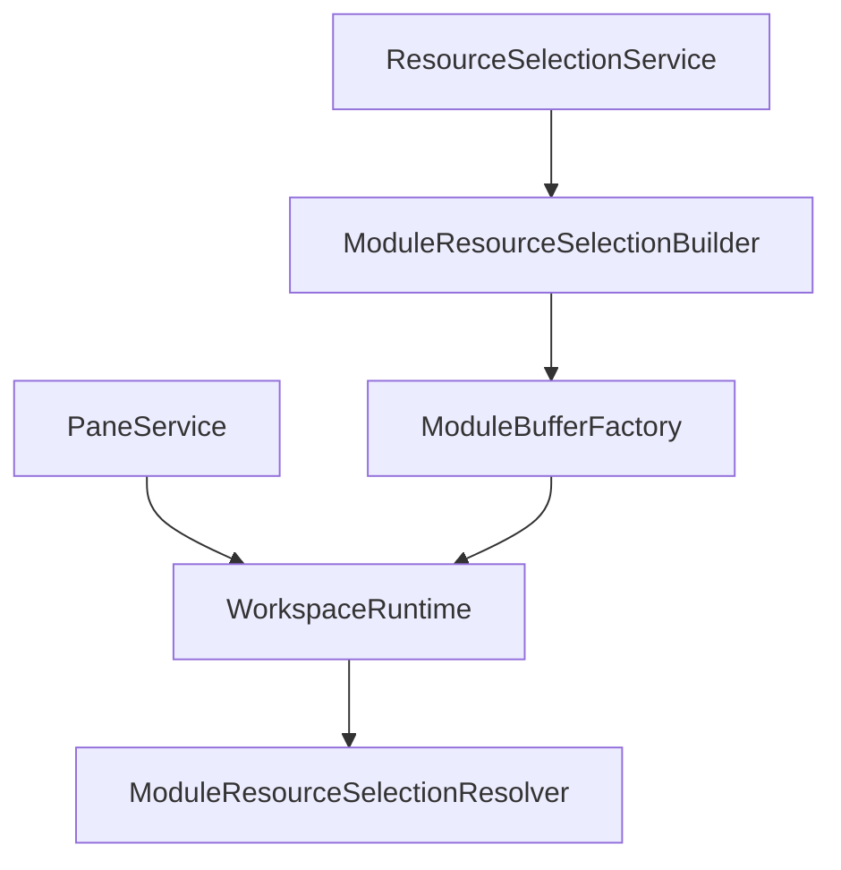
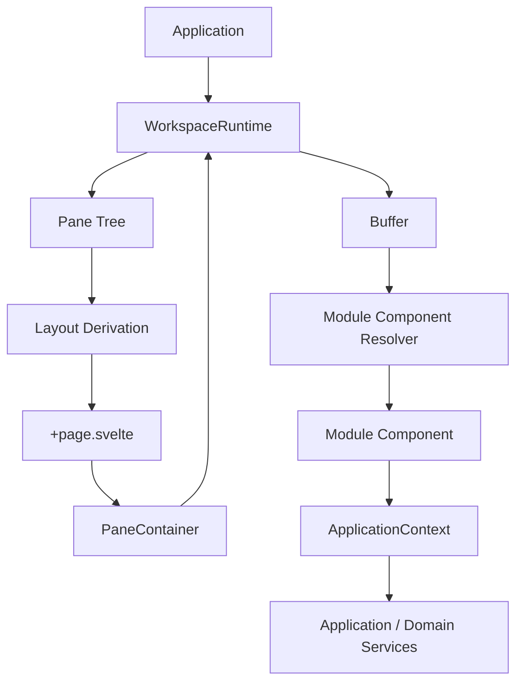

# Runtime Rendering Engine

## Status

Current

---

# Purpose

This document describes the concrete rendering implementation used by the
KJVOnly.bible Workspace Runtime.

The runtime owns the logical application state:

```text
Workspace
    ↓
Pane tree
    ↓
Leaf Pane
    ↓
Buffer
    ↓
Module Instance
```

The rendering engine projects that runtime state into Svelte components and a
CSS Grid layout.

This document answers the practical implementation questions:

```text
How does the Pane tree become the visible layout?
How does a Leaf Pane render its Buffer?
Where is module-to-component mapping performed?
How is a new Buffer created?
How are related Buffer Resource selections preserved?
How does a module get application services and Resource context?
What must be changed to add a new module?
```

The conceptual runtime model is defined in:

```text
docs/01_application-architecture/002-workspace-runtime.md
```

The rendering architecture is defined in:

```text
docs/01_application-architecture/003-runtime-rendering.md
```

This document focuses on the current implementation.

---

# Scope

This document covers:

* Application composition of the runtime,
* Workspace initialization,
* Pane-tree to CSS Grid projection,
* Leaf Pane rendering,
* Buffer-to-module component resolution,
* independent and related Buffer creation,
* Resource-selection snapshots,
* Pane dimension publication,
* Workspace rendering notifications,
* deleted Pane ID retention,
* the transient `Pane.toggle` workaround,
* runtime presentation components,
* module registration,
* and the tests protecting these boundaries.

It does not redefine Domain behavior, Resource acquisition, Resource
publication, synchronization, Outbox behavior, or persistence formats.

---

# High-Level Flow

The current rendering path is:

```text
Application
    ↓
WorkspaceRuntime
    ↓
recursive Pane tree
    ↓
deriveWorkspaceLayout()
    ↓
active Pane IDs + CSS Grid + Pane dimensions
    ↓
+page.svelte
    ↓
PaneContainer(paneID)
    ↓
WorkspaceRuntime.findPane(paneID)
    ↓
Pane.buffer
    ↓
Buffer.componentName
    ↓
resolveModuleComponent()
    ↓
module Svelte component
```

The renderer does **not** mirror the Pane tree with recursive Svelte
components.

The Pane tree is recursive runtime state. The visible application is a flattened
projection of its Leaf Panes into CSS Grid.

---

# Important Files

## Composition

```text
src/lib/application/runtime/application.ts
```

Creates and connects:

```text
ResourceSelectionService
ModuleResourceSelectionBuilder
ModuleBufferFactory
PaneService
WorkspaceRuntime
ModuleResourceSelectionResolver
```

## Workspace coordination

```text
src/lib/application/runtime/workspace/workspace-runtime.ts
```

Public runtime operations include:

```text
initialize
findPane
deriveLayout
replaceBuffer
splitPane
closePane
deletePane
persistWorkspace
Pane dimension pub/sub
Workspace change pub/sub
```

## Layout

```text
src/lib/application/runtime/workspace/workspace-layout.ts
src/lib/application/runtime/workspace/workspace-grid.ts
```

Converts the recursive Pane tree into:

```text
CSS grid-template-areas
CSS grid-template-columns
active Leaf Pane IDs
normalized Pane dimensions
```

## Root presentation

```text
src/routes/+page.svelte
```

Renders one `PaneContainer` for every active Leaf Pane ID.

## Leaf Pane presentation

```text
src/lib/application/runtime/pane/components/pane.svelte
```

Publicly exported as `PaneContainer` through the browser-only application UI
boundary:

```text
src/lib/application/ui/index.ts
```

## Buffer

```text
src/lib/application/runtime/buffer/models/buffer.model.ts
src/lib/application/runtime/buffer/module-buffer-factory.ts
```

## Module presentation resolution

```text
src/lib/application/runtime/rendering/module-component-resolver.ts
```

## Public application boundaries

```text
src/lib/application/index.ts
src/lib/application/ui/index.ts
```

Browser-safe runtime contracts such as `WorkspaceRuntime`, `PaneSplit`, Pane
types, and layout helpers are exported through `$lib/application`. Browser-only
Svelte components and DOM helpers are exported through `$lib/application/ui`.

The concrete `Application` composition root is deliberately not exported from
the root barrel; only `src/routes/+layout.svelte` imports it directly.

---

# Composition and Ownership

`Application` is the composition root.

The runtime object graph is conceptually:



The ownership rule is:

```text
Application
    owns concrete runtime dependencies

WorkspaceRuntime
    exposes Workspace behavior

Svelte/UI
    consumes WorkspaceRuntime
```

`PaneService` remains internal behind `WorkspaceRuntime`.

It supplies:

* root Pane state,
* Workspace persistence,
* and Pane dimension pub/sub.

It is deliberately not exposed through `ApplicationContext`.

UI code should not bypass `WorkspaceRuntime` and manipulate `PaneService`
directly.

---

# Workspace Initialization

`WorkspaceRuntime.initialize(defaultModule)` first attempts to restore the
persisted Pane tree.

```text
initialize(defaultModule)
    ↓
panes.restore()
    ↓
restored?
    ├── yes → use restored Pane/Buffer state
    └── no  → create root Buffer independently
```

If no Workspace is restored:

```ts
this.panes.rootPane.buffer =
    this.buffers.independent(
        defaultModule
    );
```

The default module therefore uses the same Buffer construction and Resource
selection rules as any other independently-created module instance.

---

# Pane Tree as Rendering Input

A runtime Pane has the current shape:

```ts
interface Pane {
    id: string | undefined;
    left: Pane | undefined;
    right: Pane | undefined;
    split: PaneSplit | undefined;
    buffer: Buffer | undefined;
    toggle?: boolean;
}
```

Conceptually there are two shapes.

## Leaf Pane

```text
id
buffer
```

## Branch Pane

```text
left
right
split
```

The same mutable interface represents both because current tree operations can
convert an existing Leaf node into a Branch node in place.

Branch Panes are not visible components. They describe structure used by layout
derivation.

---

# Layout Derivation

The UI requests the current presentation layout through:

```ts
workspaceRuntime.deriveLayout()
```

`WorkspaceRuntime` delegates to:

```ts
deriveWorkspaceLayout(
    rootPane
)
```

The result is:

```ts
interface WorkspaceLayout {
    activePaneIDs: string[];
    gridTemplateAreas: string[][];
    paneDimensionsByID:
        WorkspacePaneDimensionsByID;
    template: string;
}
```

The Pane tree remains authoritative. `WorkspaceLayout` is derived presentation
state.

---

# Grid Matrix Generation

`workspace-grid.ts` recursively renders Pane structure into a matrix of Leaf
Pane IDs.

A Leaf Pane becomes:

```ts
[[pane.id]]
```

A Branch Pane:

```text
renders left subtree
renders right subtree
joins both matrices according to PaneSplit
```

Current split values are:

```text
PaneSplit.VERTICAL
PaneSplit.HORIZONTAL
```

Nested subtrees can produce matrices with different row/column counts. The grid
algorithm repeats equivalent rows/columns so both children can be combined
without changing their relative logical proportions.

It uses greatest-common-divisor normalization to produce the minimal equivalent
matrix.

Example logical tree:

```text
vertical split
├── a
└── horizontal split
    ├── b
    └── c
```

can produce a matrix equivalent to:

```text
a b
a c
```

That matrix becomes CSS:

```css
display: grid;
grid-template-columns: repeat(2, 1fr);
grid-template-areas:
    "a b"
    "a c";
```

---

# Active Pane IDs

`deriveWorkspaceLayout()` collects unique Leaf Pane IDs from the grid matrix and
sorts them using the application alphabetic Pane sequence:

```text
a
b
c
...
z
aa
ab
...
```

The exported helper is:

```ts
sortPaneIDs(...)
```

This gives root presentation a deterministic Pane ordering independent from how
many times an ID appears in `grid-template-areas`.

---

# Pane Dimensions

Layout derivation also calculates normalized width and height for each visible
Pane.

Example:

```ts
{
    a: { width: 0.5, height: 1 },
    b: { width: 0.5, height: 0.5 },
    c: { width: 0.5, height: 0.5 }
}
```

These are viewport proportions rather than pixels.

`+page.svelte` publishes them through:

```ts
workspaceRuntime.publishPaneDimensions(
    layout.paneDimensionsByID
)
```

Each `PaneContainer` subscribes through:

```ts
workspaceRuntime.subscribeToPaneDimensions(
    paneID,
    updatePaneDimensions
)
```

and converts the fractions to:

```text
height: <fraction × 100>vh
width:  <fraction × 100>vw
```

Pane presentation therefore receives its visible dimensions without owning the
layout algorithm.

---

# Root Rendering in +page.svelte

`+page.svelte` is intentionally thin.

Its Workspace responsibilities are:

```text
derive the current layout
maintain rendered Pane ID ordering
retain deleted Pane IDs for rendering identity
apply the CSS Grid template
publish Pane dimensions
respond to structural Workspace notifications
render PaneContainer instances
```

It does not own:

```text
Pane-tree mutation
Buffer construction
Workspace persistence
Resource selection
module component mapping
```

The central root update is conceptually:

```ts
const layout =
    workspaceRuntime.deriveLayout();

paneIds = sortPaneIDs(
    layout.activePaneIDs.concat(
        retainedDeletedPaneIDs
    )
);

template = layout.template;

workspaceRuntime.publishPaneDimensions(
    layout.paneDimensionsByID
);
```

---

# Structural Workspace Notifications

The root page subscribes to `WorkspaceRuntime` changes.

Structural changes are:

```text
PANE_SPLIT
PANE_DELETED
```

Both cause layout derivation to run again because the Pane tree shape changed.

`PANE_BUFFER_REPLACED` does not change the CSS Grid structure, so it is handled
by the affected `PaneContainer` rather than by recalculating the root layout.

---

# Deleted Pane ID Retention

The root page intentionally remembers Pane IDs deleted during the current page
lifetime.

Deleted Panes are not visibly rendered, but their IDs remain in the unkeyed
`{#each}` iteration sequence.

Why:

```text
Before
    [a, b, c]

Delete b

If the sequence becomes
    [a, c]

then the second Svelte iteration can reuse the component instance that
previously represented b.
```

The implementation instead retains the historical slot:

```text
iteration IDs
    [a, b, c]

visible PaneContainers
    a, c
```

This protects surviving Pane component identities from shifting.

Pane IDs are also not reused during the current page lifetime.

Do not remove this bookkeeping solely because deleted Panes are no longer
visible.

---

# PaneContainer

`pane.svelte` is the rendering boundary for one Leaf Pane ID.

It is exported as:

```text
PaneContainer
```

through:

```text
$lib/application/ui
```

The stable input is:

```ts
paneID: string
```

The `Pane` object reference itself is not considered stable identity.

---

# Stable Pane Identity

Workspace mutations can replace or reshape objects in the recursive Pane tree.

For example, a split can turn the current Leaf object into a Branch while moving
the original visible Leaf state into a child object.

The rendered identity remains:

```text
paneID
```

Therefore `PaneContainer` re-resolves the current runtime object with:

```ts
workspaceRuntime.findPane(
    paneID
)
```

rather than assuming an older local Pane reference remains authoritative.

This learned behavior prevents stale Svelte state after Workspace mutations.

---

# PaneContainer Mount Lifecycle

On mount, `PaneContainer`:

```text
applies settings
    ↓
finds the current Pane by paneID
    ↓
initializes transient toggle state
    ↓
subscribes to Workspace changes
    ↓
subscribes to Pane dimensions
    ↓
applies current dimensions
```

On destroy it removes both subscriptions.

This cleanup is important because Pane components can be repeatedly created and
destroyed as the Workspace changes.

---

# Pane to Module Rendering

The rendering chain is:

```text
Pane
    ↓
pane.buffer
    ↓
buffer.componentName
    ↓
resolveModuleComponent(componentName)
    ↓
Svelte module component
```

A Buffer does **not** store a Svelte component constructor or component instance.

It stores persisted module identity:

```ts
componentName: Modules
```

The renderer resolves the framework component at runtime.

This keeps Svelte-specific references out of persisted runtime state.

---

# Module Component Resolver

The mapping lives in:

```text
src/lib/application/runtime/rendering/module-component-resolver.ts
```

Current mappings are:

```text
Modules.BIBLE      → BibleContainer
Modules.STRONGS    → RefsContainer
Modules.SEARCH     → SearchContainer
Modules.MODULES    → ModulesContainer
Modules.NOTES      → NotesContainer
Modules.LOGIN      → LoginContainer
Modules.SETTINGS   → SettingsContainer
Modules.PLANS      → PlansContainer
Modules.PROFILE    → ProfileContainer
Modules.NULL       → undefined
```

The resolver is deliberately explicit.

There is no fallback component.

An unknown persisted value throws:

```text
Unsupported module: <value>
```

This prevents stale or corrupt runtime state from silently rendering an
unrelated module.

---

# Modules.NULL

`Modules.NULL` is a valid Buffer sentinel meaning:

```text
no renderable module
```

The resolver returns `undefined` for it.

This differs from an unknown numeric value:

```text
NULL
    valid non-rendering state

unknown number
    invalid runtime state
```

---

# Persisted Module IDs

`Modules` uses explicit numeric values because `Buffer.componentName` is
persisted.

Existing values must not be renumbered casually.

Example:

```ts
export enum Modules {
    MODULES = 1,
    BIBLE = 2,
    STRONGS = 3,
    ...
}
```

Adding a module should allocate a new explicit value rather than shifting older
ones.

---

# Module Component Inputs

The renderer currently invokes the resolved module component as:

```svelte
<Component bind:pane {paneID}></Component>
```

The important stable runtime input is `paneID`.

The bound Pane is current implementation plumbing used by existing components.
New runtime coordination should prefer stable Pane identity and application
runtime services instead of treating the bound Pane object as globally stable.

---

# The Pane.toggle Workaround

`Pane.toggle` is intentionally retained even though it is presentation/runtime
state rather than conceptual Workspace state.

A known Svelte behavior caused module-local UI to remain stale when only the
underlying Buffer changed. This was observed particularly around Bible chapter
navigation and markup/annotation presentation.

Current replacement flow:

```text
WorkspaceRuntime.replaceBuffer(...)
    ↓
assign new Buffer
    ↓
flip pane.toggle
    ↓
persist Workspace
    ↓
publish PANE_BUFFER_REPLACED
    ↓
PaneContainer finds current Pane
    ↓
render through the opposite Svelte branch
    ↓
module component recreated
```

`pane.svelte` therefore contains two equivalent module-rendering branches:

```text
if pane.toggle
    render module

if !pane.toggle
    render module
```

They are intentionally duplicated.

Do not collapse them into one branch until the underlying Svelte reactivity
issue has been understood and regression-tested.

`toggle` is transient and is not persisted.

---

# Buffer Contract Used by Rendering

The current Buffer is intentionally small:

```ts
class Buffer {
    key: string;
    componentName: Modules;
    bag: any;
    resourceSelections: ResourceSelections;
}
```

Rendering directly consumes `componentName`, while the other fields preserve the
runtime identity and context of the module instance.

## key

Stable Buffer identity independent from Pane identity.

## componentName

Persisted module type used by `resolveModuleComponent()`.

## bag

Serializable navigation/module initialization context.

## resourceSelections

Resource source snapshot captured for this module instance.

---

# ModuleBufferFactory

Normal module Buffer construction goes through:

```text
ModuleBufferFactory
```

It exposes two modes:

```ts
independent(...)
related(...)
```

Both create a **new Buffer identity**.

They differ in how Resource selections are derived.

---

# Independent Buffer Creation

Use independent creation when the new module instance should derive Resource
context from current application selection policy.

```ts
moduleBufferFactory.independent(
    module,
    bag
)
```

Flow:

```text
current application Resource selections
    ↓
ModuleResourceSelectionBuilder.independent(module)
    ↓
registered module/domain contributor
    ↓
ResourceSelections snapshot
    ↓
new Buffer
```

Current uses include initial Workspace creation and the fallback path when
replacing a Pane that has no current Buffer.

Most UI should not call `ModuleBufferFactory` directly; `WorkspaceRuntime` owns
normal Buffer placement.

---

# Related Buffer Creation

Related creation starts from an existing Buffer and preserves compatible
Resource context.

```ts
moduleBufferFactory.related(
    module,
    originatingBuffer,
    bag
)
```

Flow:

```text
originating Buffer.resourceSelections
    ↓
ModuleResourceSelectionBuilder.related(...)
    ↓
registered module/domain contributor
    ↓
new ResourceSelections snapshot
    ↓
new Buffer identity
```

Current Workspace operations use related creation when:

* replacing the module in a Pane that already has a Buffer,
* splitting a Pane to create a new related module instance.

This prevents related navigation from discarding the originating module's
Resource context.

---

# Navigation Context

`Buffer.bag` carries serializable navigation/module initialization state.

`ModuleBufferFactory` copies the supplied top-level value:

```text
plain object → new object copy
array        → new array copy
primitive    → same value
null         → null
```

The bag may contain values such as:

```text
Bible location
search query state
note navigation context
reading-plan navigation context
```

It should not contain application services, DOM elements, or Svelte component
instances.

---

# Buffer Replacement Flow

The public operation is:

```ts
workspaceRuntime.replaceBuffer(
    paneID,
    module,
    bag
)
```

Flow:

```text
find target Pane
    ↓
read current Buffer
    ↓
select supplied bag or preserve current bag
    ↓
create related Buffer when current Buffer exists
    ↓
otherwise create independent Buffer
    ↓
assign Buffer
    ↓
flip pane.toggle
    ↓
persist Workspace
    ↓
publish PANE_BUFFER_REPLACED
```

The Pane identity and CSS Grid position do not change.

---

# Pane Split Flow

The public operation is:

```ts
workspaceRuntime.splitPane(
    paneID,
    split,
    module,
    bag
)
```

Flow:

```text
track existing Pane IDs
    ↓
find originating Pane
    ↓
allocate never-reused page-lifetime Pane ID
    ↓
create related Buffer
    ↓
mutate Pane tree into Branch + Leaf structure
    ↓
persist Workspace
    ↓
publish PANE_SPLIT
```

The root page receives `PANE_SPLIT`, derives a new grid, and renders the new
`PaneContainer`.

The existing Buffer is preserved for the original Pane. The new Pane receives a
new related Buffer.

---

# Pane Delete Flow

The public operation is:

```ts
workspaceRuntime.deletePane(
    paneID
)
```

Flow:

```text
track existing Pane IDs
    ↓
delete target Leaf
    ↓
collapse sibling into parent position
    ↓
unsubscribe deleted Pane dimensions
    ↓
persist Workspace
    ↓
publish PANE_DELETED
```

The root page records the deleted Pane ID and reruns layout derivation.

---

# Closing the Final Pane

The last root Leaf Pane is not structurally deleted.

`WorkspaceRuntime.closePane()` replaces its Buffer with:

```text
Modules.MODULES
```

This keeps the Workspace root valid while returning to the module chooser.

Because the Pane tree shape does not change, this follows Buffer-replacement
rendering rather than structural grid recalculation.

---

# Workspace Change Types

The runtime currently publishes:

```text
PANE_SPLIT
PANE_DELETED
PANE_BUFFER_REPLACED
```

Responsibility split:

```text
+page.svelte
    PANE_SPLIT
    PANE_DELETED
    → recalculate layout

PaneContainer
    matching PANE_BUFFER_REPLACED
    → find current Pane again
```

This keeps structural rendering updates separate from module-instance updates.

---

# Resource Selection Snapshots

A Buffer captures Resource selections at creation time:

```ts
buffer.resourceSelections
```

They are built by:

```text
ModuleResourceSelectionBuilder
```

using registered module/domain contributors.

A module should not derive its Resource source from global mutable selection
state during normal rendering.

Instead the application-facing lookup is:

```text
paneID
    ↓
WorkspaceRuntime.findPane()
    ↓
Buffer.resourceSelections
    ↓
ModuleResourceSelectionResolver
    ↓
PublishedResourceReference
```

Typical module UI usage:

```ts
moduleResourceSelectionResolver.require(
    paneID,
    RESOURCE_TYPE
)
```

The resolver is exposed through `ApplicationContext`.

Domain services receive the resolved Resource reference. Domain services should
not depend on Pane IDs, Buffers, or Workspace objects.

---

# Module Access to Application Services

Rendered modules obtain application capabilities through:

```ts
useApplicationContext()
```

The context contains application-facing services such as:

```text
workspaceRuntime
moduleResourceSelectionResolver
chapterService
paragraphsService
pericopesService
bibleTextMarkupService
searchService
notesService
reading-plan services
strongsService
settingsService
authenticationService
accountService
```

It intentionally does not expose infrastructure implementation details such as:

```text
NostrSigner
NostrClient
PaneService
ResourceDiscovery
ResourceSelectionService
```

Module UI should request application behavior through the context rather than
reaching directly into infrastructure.

---

# Public Runtime UI Primitives

The browser-only application UI barrel is:

```text
$lib/application/ui
```

It currently exports:

```text
PaneContainer
BufferContainer
BufferHeader
BufferBody
```

## PaneContainer

Connects a Leaf Pane ID to its current Buffer and resolved module component.

## BufferContainer

Provides the common outer module/Buffer presentation shell and responds to
settings such as maximum content width.

## BufferHeader

Provides the common module header layout and reports measured header height.

## BufferBody

Provides the scrollable body sized from container height minus header height.

Domain and application modules may compose these primitives without importing
deep runtime implementation paths.

---

# Runtime Public API

The browser-safe application API is:

```text
$lib/application
```

It intentionally exposes selected application-facing runtime APIs, including:

```text
ApplicationContext helpers
PaneSplit
Pane type
WorkspaceRuntime
Workspace change types
Workspace layout helpers
```

`Application` itself is not part of that public barrel. It is the concrete
composition root and is imported directly only by `src/routes/+layout.svelte`.

Browser-only runtime presentation primitives are available through:

```text
$lib/application/ui
```

External consumers should prefer these boundaries. Internal application/runtime
implementation files may continue to use direct internal imports where
necessary to avoid self-barrel cycles.

---

# Adding a New Module

The module registration path is explicit.

## 1. Add a Modules value

Update:

```text
src/lib/application/models/modules.model.ts
```

Use a new explicit numeric value.

Do not renumber existing persisted values.

## 2. Create the module component

Place it in the appropriate application/domain module area.

Domain-owned Svelte module components should be exposed through the domain's
browser-only `/ui` public boundary when one exists. Domain root APIs remain
free of Svelte/browser-only exports so Node-side consumers can import them
safely.

## 3. Register Resource-selection policy

Register a `ModuleResourceSelectionContributor` in `application.ts`.

If the module requires no Resources, register:

```ts
new NoResourceModuleResourceSelectionContributor(
    Modules.NEW_MODULE
)
```

If it uses Resources, its domain/module contributor defines the appropriate
selection behavior.

## 4. Register the renderable component

Update:

```text
module-component-resolver.ts
```

Add the explicit mapping:

```text
Modules.NEW_MODULE → NewModuleContainer
```

Do not add a generic fallback.

## 5. Update resolver tests

Update:

```text
module-component-resolver.spec.ts
```

Prove the new `Modules` value maps to the expected component.

## 6. Navigate through WorkspaceRuntime

Open the module using Workspace operations such as:

```text
replaceBuffer
splitPane
```

rather than directly assigning `pane.buffer.componentName`.

That ensures new Buffer identity, Resource-selection snapshotting, persistence,
and notifications happen consistently.

---

# Persistence Boundary

Rendering does not persist the Workspace itself.

Workspace mutations persist through:

```text
WorkspaceRuntime
    ↓
WorkspacePaneState.save()
```

The current concrete state implementation is `PaneService`, hidden behind the
runtime boundary.

The renderer consumes runtime state; it does not become a second persistence
owner.

---

# What Is Not Persisted

Framework-specific state should not become Workspace persistence.

Examples:

```text
Svelte component constructors
mounted component instances
DOM nodes
subscription callbacks
measured client heights
Pane.toggle
```

Persisted runtime state should contain enough information to reconstruct the
Workspace. Component presentation is reconstructed from persisted module
identity through `resolveModuleComponent()`.

---

# Invalid Runtime State

The rendering implementation distinguishes valid empty state from invalid state.

## Missing Pane

`WorkspaceRuntime.findPane()` can return `undefined`.

Presentation code tolerates that during runtime/layout transitions.

## Missing Buffer

No module is rendered. The renderer does not fabricate one.

## Modules.NULL

Valid sentinel; no component is rendered.

## Unknown Modules value

Invalid persisted/runtime state; the resolver throws.

Strict failure is intentional because silent fallback can hide persistence
compatibility defects.

---

# Test Coverage

## Component resolver

```text
src/lib/application/runtime/rendering/module-component-resolver.spec.ts
```

Protects:

* supported module mappings,
* `Modules.NULL`,
* unknown-value failure.

The test mocks Svelte modules because several production components pull in
browser-only dependencies that are irrelevant to the mapping contract.

## Workspace layout

```text
src/lib/application/runtime/workspace/workspace-layout.spec.ts
```

Protects derived active Pane IDs, dimensions, and CSS layout behavior.

## Grid generation

```text
src/lib/application/runtime/workspace/workspace-grid.spec.ts
```

Protects nested horizontal/vertical matrix normalization.

## Pane-tree operations

```text
src/lib/application/runtime/workspace/workspace-pane-tree.spec.ts
```

Protects structural mutation independent from Svelte rendering.

## Workspace Runtime

```text
src/lib/application/runtime/workspace/workspace-runtime.spec.ts
```

Protects orchestration including initialization, Buffer replacement, splitting,
deletion, persistence, notifications, layout delegation, and Pane dimensions.

## Buffer factory

```text
src/lib/application/runtime/buffer/module-buffer-factory.spec.ts
```

Protects new Buffer identity and Resource-selection construction.

## Runtime persistence

```text
src/lib/application/runtime/buffer/persistence/buffer-persistence.spec.ts
src/lib/application/runtime/pane/persistence/pane-persistence.spec.ts
```

Protects serialization/restoration of runtime state.

---

# Rendering Invariants

The current implementation should preserve these rules:

```text
The recursive Pane tree is authoritative Workspace structure.

CSS Grid is derived presentation state.

Only Leaf Panes receive visible PaneContainer instances.

paneID is stable rendering identity; Pane object references may change.

A Buffer stores module identity, not a Svelte component instance.

Module component mapping is explicit in resolveModuleComponent().

Unknown module values fail explicitly.

A module transition creates a new Buffer identity.

Related module creation derives Resource selections from the originating Buffer.

Independent module creation derives Resource selections from current application policy.

Module UI reads Resource context through ModuleResourceSelectionResolver.

Domain services do not depend on Pane/Buffer runtime objects.

Workspace mutation goes through WorkspaceRuntime.

PaneService remains internal behind WorkspaceRuntime.

Deleted Pane IDs remain reserved during the page lifetime.

Pane.toggle remains until the stale-Svelte-component behavior is replaced safely.
```

---

# Anti-Patterns

## Persisting components in Buffers

Do not do:

```ts
buffer.component = SomeSvelteComponent;
```

Persist module identity and resolve the presentation at runtime.

## UI importing PaneService

Do not bypass `WorkspaceRuntime` for Pane-tree or persistence operations.

## Direct module mutation

Do not normally do:

```ts
pane.buffer.componentName =
    Modules.NOTES;
```

Use a Workspace operation so Buffer identity, Resource selections, persistence,
and notifications stay consistent.

## Global Resource lookups for module read context

Do not ignore the Buffer snapshot and query mutable application selection state
inside normal module UI.

Use `ModuleResourceSelectionResolver`.

## Silent module fallback

Do not map unknown module numbers to Bible, Modules, or another default
component.

## Assuming recursive Svelte Pane rendering

The current renderer flattens Leaf Pane identities into CSS Grid.

## Removing toggle branches as duplicate code

The two branches in `pane.svelte` currently enforce module recreation. Remove
them only after the stale component behavior is understood and covered by a
replacement regression test.

---

# Debugging Rendering

When a module does not render correctly, trace the pipeline in order.

## 1. Pane lookup

```ts
workspaceRuntime.findPane(
    paneID
)
```

Verify the Pane exists.

## 2. Buffer

Inspect:

```text
pane.buffer
```

## 3. Module identity

Inspect:

```text
pane.buffer.componentName
```

## 4. Component mapping

Inspect:

```text
resolveModuleComponent()
```

## 5. Active layout

Inspect:

```text
workspaceRuntime.deriveLayout().activePaneIDs
```

## 6. Grid matrix/template

Inspect:

```text
gridTemplateAreas
template
```

## 7. Pane dimensions

Inspect:

```text
workspaceRuntime.getPaneDimensions()
```

## 8. Buffer replacement notification

For navigation problems, verify:

```text
PANE_BUFFER_REPLACED
```

was published for the expected Pane ID and `pane.toggle` changed.

## 9. Resource context

If the component renders but uses the wrong data source, inspect:

```text
pane.buffer.resourceSelections
```

and the result of:

```text
moduleResourceSelectionResolver.require(...)
```

That is module Resource context, not CSS Grid rendering.

---

# Boundary Summary



Responsibility summary:

```text
WorkspaceRuntime
    owns runtime operations and coordination

Pane tree
    owns logical Workspace structure

layout derivation
    projects that structure into CSS Grid

+page.svelte
    renders the root grid and Leaf Pane identities

PaneContainer
    resolves one Pane ID to its current Buffer

ModuleBufferFactory
    creates module-instance runtime state

module-component-resolver
    maps persisted module identity to presentation

ApplicationContext
    gives module UI access to application capabilities
```

No layer should become a second authoritative Workspace model.

---

# Related Documents

Architecture:

```text
docs/01_application-architecture/002-workspace-runtime.md
docs/01_application-architecture/003-runtime-rendering.md
```

Runtime implementation series:

```text
docs/03_implementation/runtime/001-root-runtime.md
docs/03_implementation/runtime/002-pane-tree.md
docs/03_implementation/runtime/003-grid-layout.md
docs/03_implementation/runtime/005-buffer-contract.md
docs/03_implementation/runtime/006-runtime-services.md
```

Resource-selection implementation:

```text
docs/03_implementation/resources/002-resource-selection.md
```

The remaining runtime implementation documents should fill in their own focused
contracts. This document should stay centered on the end-to-end rendering path.
