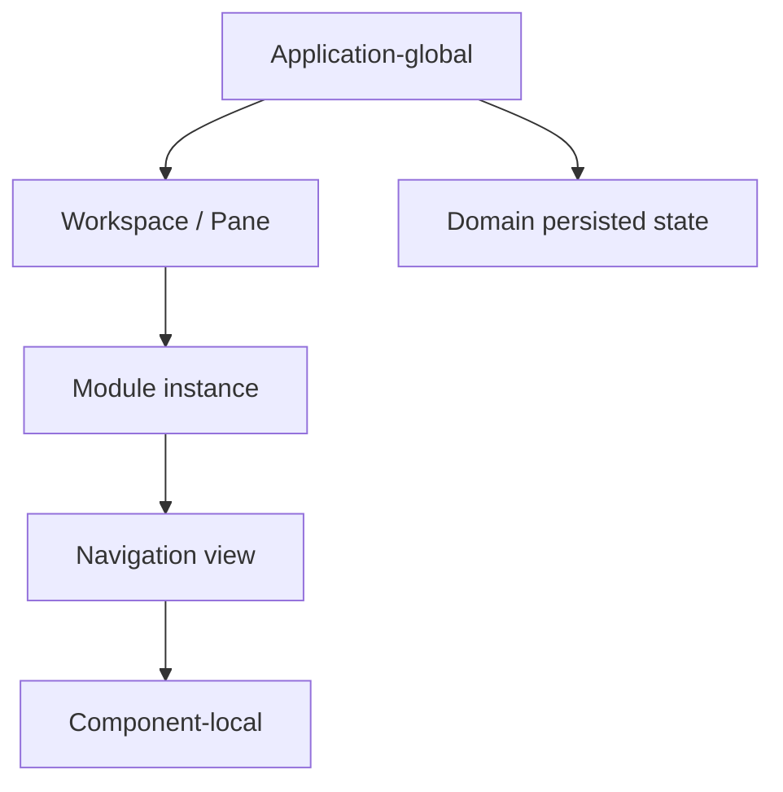
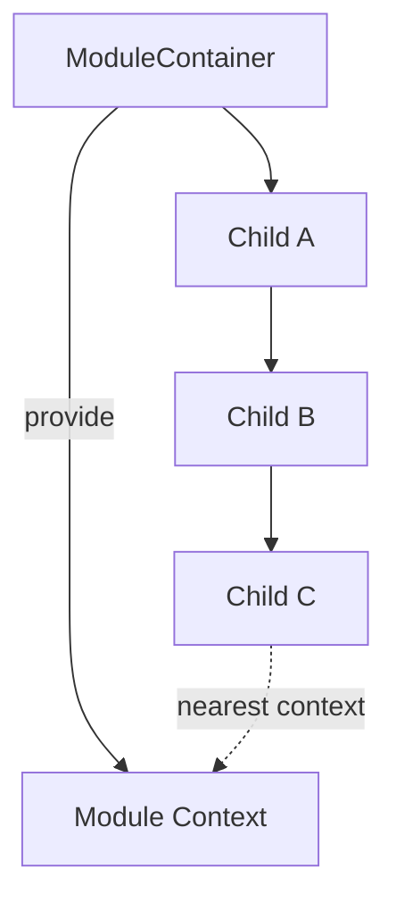
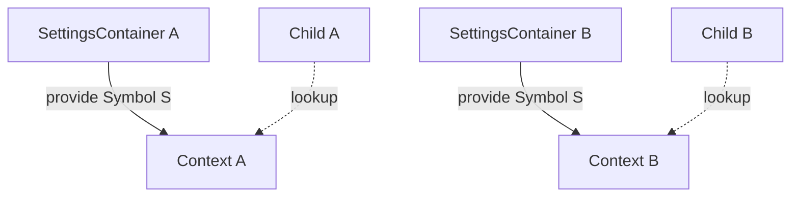
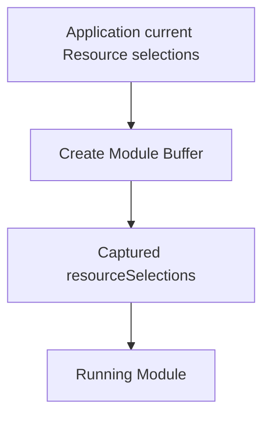
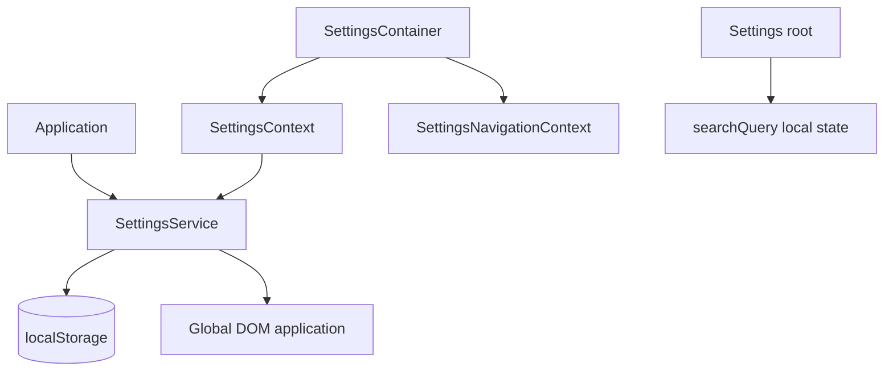
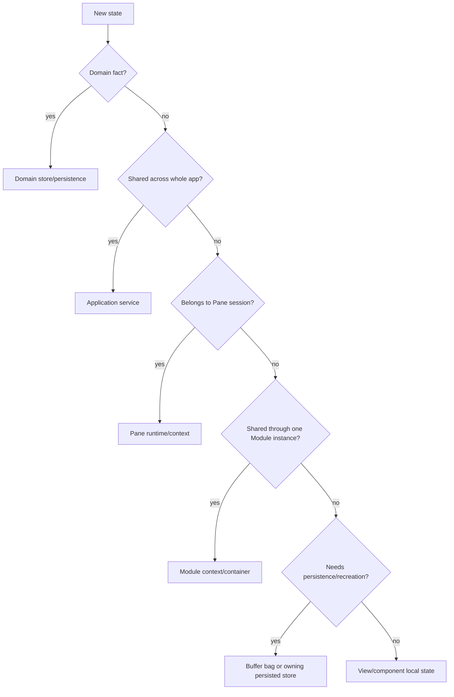

# State Ownership and Context Boundaries

## Status

**Application Standard / Architecture Guidance**

Suggested repository path:

```text
docs/03_implementation/runtime/007-state-ownership-context-boundaries.md
```

---

# 1. Purpose

This document defines how KJVOnly.bible should decide:

```text
who owns state
where state lives
how long state lives
how state is accessed
how state is synchronized
what should be persisted
what should remain ephemeral
```

The Settings refactor exposed a recurring architectural truth:

> Many bugs that appear to be reactivity, persistence, navigation, or synchronization problems are really state-ownership problems.

The application contains several different state lifetimes:

```text
application-global
workspace/pane-local
module-instance-local
navigation-view-local
domain-owned
persisted snapshot
live service state
```

They should not be collapsed into one generic "state" concept.

The main goal is:

> **State should live at the narrowest scope that correctly owns its lifecycle and sharing requirements.**

---

# 2. Ownership Before Storage

Before deciding whether to use:

```text
ApplicationContext
Svelte context
Buffer.bag
Buffer.resourceSelections
$state
IndexedDB
localStorage
service subscribers
```

first answer:

```text
Who owns this state?
Who needs to observe it?
How long should it live?
Should two module instances share it?
Should Back navigation preserve it?
Should reload preserve it?
```

Storage technology comes after ownership.

---

# 3. State Scope Hierarchy

The application should think in the following scopes:



These scopes overlap in runtime but represent different ownership contracts.

---

# 4. Application-Global State

Application-global state represents information intentionally shared across the entire running application.

Examples include:

```text
SettingsService
authentication identity
application ResourceSelectionService
application event services
Outbox services
global feature/runtime services
```

Application-global state should normally be composed through:

```text
Application
    ↓
ApplicationContext
```

Use application-global ownership when:

```text
multiple panes need the same authority
multiple module instances must observe the same live state
the state belongs to the application rather than one interaction
the service coordinates persistence or infrastructure
```

---

# 5. ApplicationContext

`ApplicationContext` is the application composition boundary.

It should expose:

```text
application-owned services
runtime capabilities
stable application authorities
```

It should not become a dumping ground for:

```text
one component's temporary UI state
one module's current search query
one navigation stack
one page's selected tab
one view's form draft
```

A useful rule is:

> **If two independently mounted module instances should not automatically share the state, it probably does not belong directly in ApplicationContext.**

---

# 6. Module-Instance State

Module-instance state belongs to one concrete running Module interaction.

Examples:

```text
Settings module navigation
Notes module local navigation
Plans navigation state
module-local editing projection
module-specific subscriptions
module-level temporary state
```

Two instances of the same Module may coexist.

Therefore:

```text
Module A instance 1 state
    must not automatically equal
Module A instance 2 state
```

Example:

```text
Settings pane A
    Appearance

Settings pane B
    Bible
```

Navigation state is independent even though both edit the same application Settings.

---

# 7. Svelte Context for Module-Local State

A Module container is a natural provider boundary.

Conceptually:



Use module-local Svelte context when:

```text
many descendants need the same module-instance capability
prop drilling would add meaningless plumbing
the state should be isolated between mounted module instances
the provider naturally matches the module lifecycle
```

Examples:

```text
SettingsContext
SettingsNavigationContext
future PaneNavigationContext
future ModuleRuntimeContext
```

---

# 8. Same Symbol Does Not Mean Global State

Svelte context is scoped by component ancestry.

Two module instances may use the same context key while receiving different values.



This is a useful property.

It allows one reusable module implementation to be mounted more than once safely.

---

# 9. Navigation-View State

Navigation-view state belongs to one mounted view in a navigation stack.

Examples:

```text
search query
scroll position
expanded section
input text
temporary filters
selected local tab
focus target
```

If a persistent navigation stack keeps the view mounted, the best owner is often the view itself.

Example:

```text
Settings root
    owns searchQuery
```

not:

```text
SettingsService
SettingsContainer
ApplicationContext
```

because the query is neither application-global nor module-wide.

---

# 10. Component-Local State

Use local `$state` when:

```text
only this component owns the value
children do not need to coordinate around it
the value is ephemeral
destroying the component should destroy the state
```

Examples:

```text
temporary input before Save
hover/open state
local animation state
temporary selection within a custom editor
```

Do not promote local state upward merely because it exists.

---

# 11. Domain State

Domain state represents business/domain information that should survive UI lifecycles.

Examples:

```text
Note Domain Objects
Plan definitions/subscriptions
Text Markup
completed readings
Resource installations
```

Domain state should not be stored only in Svelte component state.

The UI may keep a local editing projection, but the domain/store layer owns durable state.

---

# 12. Runtime Snapshot State

Some runtime state is intentionally captured rather than live.

The clearest example is:

```text
Buffer.resourceSelections
```

A running Module instance should continue using the Resource selections captured for that interaction.

Conceptually:



Later global changes should not silently rewrite the meaning of that existing Module instance.

---

# 13. Live State Versus Snapshot State

Every shared state concept should explicitly choose one semantic.

## Live state

Consumers should observe current application truth.

Examples:

```text
SettingsService
authentication state
application-wide events
```

## Snapshot state

Consumers should preserve the context captured when an interaction was created.

Examples:

```text
Buffer.resourceSelections
Buffer.bag initialization context
```

Do not accidentally implement snapshot semantics using a live global service.

Do not accidentally implement live semantics using stale copied objects.

---

# 14. Stable Identity Versus Object Reference

Prefer stable semantic identity when an object may be replaced.

Examples:

```text
paneID
Buffer key
Domain Object ID
Resource ID
Settings row ID
Settings page ID
navigation entry key
```

Avoid treating a mutable runtime object reference as permanent identity.

Example:

```text
Pane object
```

may be replaced or restructured.

Therefore:

```text
cache paneID
re-resolve current Pane
```

is safer than:

```text
cache Pane object forever
```

---

# 15. Pane Ownership

A Pane owns structural placement in the Workspace.

The stable identity is:

```text
paneID
```

Pane-local state includes concepts such as:

```text
navigation session
active Buffer
pane-specific interaction stack
```

It does not include application-global state such as:

```text
global Settings
authentication authority
global Resource selection defaults
```

---

# 16. Buffer Ownership

A Buffer represents one concrete Module interaction.

It owns:

```text
Buffer key
Module identity
bag
resourceSelections
```

A Buffer should not own:

```text
Workspace geometry
Svelte component instances
application services
domain services
global navigation service
```

For cross-module persistent navigation, each Module stack entry should retain its own Buffer.

---

# 17. `Buffer.bag`

`Buffer.bag` is explicit serializable Module-specific runtime context.

The generic runtime does not interpret its fields.

Good contents:

```text
Bible location
note ID
plan reading index
search initialization
navigation target
```

Avoid:

```text
DOM elements
Svelte components
service instances
Pane object references
functions
mutable framework objects
```

A useful rule is:

> **The bag transports Module semantics; it does not become a generic global state container.**

---

# 18. Persistence Ownership

Persistence should have one clear owner.

Examples:

```text
Settings
    → SettingsService

Notes
    → Notes domain/store architecture

Workspace
    → Workspace runtime/persistence

Resources
    → Resource installation/store layer
```

Avoid:

```text
UI component writes directly to storage
service also writes storage
subscriber writes storage again
```

Multiple writers create ambiguous authority.

---

# 19. Settings Example

Settings demonstrates a clean ownership split.



Ownership:

```text
Settings values
    application-global

Settings persistence
    SettingsService

Settings module reactive projection
    SettingsContext

Settings navigation
    module-local

root search query
    root-view-local
```

---

# 20. User Mutation Versus Synchronization

One of the most important rules from Settings is to distinguish:

```text
command
```

from:

```text
synchronization
```

## User-originated command

```text
user edits value
    ↓
module context update()
    ↓
application service
    ↓
persist / apply / broadcast
```

## Subscriber synchronization

```text
service publishes new snapshot
    ↓
module receives snapshot
    ↓
update local reactive projection only
```

Do not send the synchronization path back through the command path.

Otherwise:

```text
publish
    → subscriber
    → publish
    → subscriber
```

loops or duplicate writes can occur.

---

# 21. Multi-Instance Safety

Any state used by multiple mounted instances should answer:

```text
Should instances share values?
Should instances share navigation?
Should instances share local editing state?
```

Example Settings answer:

```text
values
    yes

navigation
    no

search query
    no
```

This question should be asked before choosing storage/context.

---

# 22. Context Versus Props

Use props when:

```text
the relationship is direct
the value is part of the child's explicit API
only one or two levels need it
the parent intentionally controls the child
```

Use context when:

```text
many descendants need the capability
intermediate components should not care
the state/capability belongs to a runtime scope
the provider lifecycle defines ownership
```

Do not use context merely to avoid writing any props.

Context should represent a meaningful ambient capability.

---

# 23. Context Versus Application Service

Use a module context when the value is:

```text
module-instance-local
navigation-local
view-tree-local
```

Use an application service when the value is:

```text
shared application authority
cross-pane
cross-module-instance
infrastructure/persistence ownership
```

Example:

```text
SettingsContext
    module local

SettingsService
    application global
```

---

# 24. Context Versus Buffer Bag

Use context for:

```text
live runtime capability
methods/services
reactive state shared through mounted descendants
```

Use Buffer bag for:

```text
serializable initialization/navigation data
state required to recreate the Module interaction
```

Example:

```text
PaneNavigationContext
    pushModule(), back()

Buffer.bag
    bibleLocationRef
```

They solve different problems.

---

# 25. Context Versus Domain Store

Use a domain store when:

```text
state is a domain fact
state must outlive UI trees
state participates in persistence/import/export/publication
```

Do not use Svelte context as a replacement for domain persistence.

---

# 26. Container as Composition Boundary

Module containers should compose runtime dependencies.

Typical responsibilities may include:

```text
read ApplicationContext
resolve module Buffer/runtime context
create module-local services
provide module contexts
subscribe/unsubscribe application services
mount navigation root
select close behavior
```

Feature children should not repeat this wiring.

---

# 27. Provider Lifetime Must Match State Lifetime

A context provider should live at the narrowest component whose lifecycle matches the state.

Bad:

```text
page component provides module-global service
```

if page navigation destroys/recreates it.

Good:

```text
module container provides module-global service
```

because the service should live for the whole Module instance.

---

# 28. Hidden Is Not Destroyed

Persistent navigation introduces a third lifecycle state:

```text
active
inactive but mounted
destroyed
```

State ownership should account for this.

A hidden view keeps:

```text
local $state
DOM input state
subscriptions unless explicitly paused
component identity
```

Do not assume hidden means cleanup ran.

---

# 29. Active/Inactive State

Expensive components may need explicit activity information.

Examples:

```text
workers
timers
audio
network subscriptions
search indexes
media observers
```

A future module runtime/navigation context may expose:

```text
isActive
```

so expensive runtime work can pause while UI state remains mounted.

---

# 30. Avoid Duplicate State Authorities

A warning sign is when the same logical value is independently authoritative in several places.

Example anti-pattern:

```text
local component Settings
+
SettingsService Settings
+
localStorage Settings
+
Buffer bag Settings
```

Choose one authority.

Other layers may hold projections or snapshots, but they should clearly derive from the authority.

---

# 31. Projection Versus Authority

A local reactive copy is not automatically the authority.

Settings demonstrates:

```text
SettingsService
    authority

SettingsContext.settings
    reactive projection
```

This distinction should be named explicitly in code/docs when necessary.

---

# 32. Read Model Versus Write Boundary

UI often needs a convenient read model while writes pass through a service.

Example:

```text
settingsContext.settings.showPericopes
```

for rendering,

but:

```text
settingsContext.update(...)
```

for mutation.

This protects persistence/synchronization rules.

The same pattern can be useful elsewhere.

---

# 33. Derived State

Prefer derived state over storing redundant copies.

Examples:

```text
search results
    derive from search query + index

selected option label
    derive from current setting + option definition

canGoBack
    derive from navigation stack depth
```

Do not persist values that can be deterministically reconstructed from authoritative state unless performance requires caching.

---

# 34. Event State Versus Stored State

Some things are events, not state.

Examples:

```text
ArchiveImported
PaneBufferReplaced
navigation action
publication completed
```

Do not keep an event forever as a boolean just because consumers need notification.

Use the event/pubsub boundary when the meaning is:

```text
something happened
```

rather than:

```text
this value currently is X
```

---

# 35. State Decision Table

| Question | Likely owner |
| --- | --- |
| Must every Pane see the same current value? | Application service |
| Must only one Module instance see it? | Module context/container |
| Must only one navigation view see it? | View-local `$state` |
| Must reload recreate it? | Persisted store / Buffer bag / domain store |
| Is it Domain truth? | Domain store |
| Is it captured interaction context? | Buffer |
| Is it application infrastructure? | ApplicationContext service |
| Is it just derived presentation? | `$derived` |
| Is it an event? | Pubsub/application event |
| Is it navigation capability? | Navigation context/service |

---

# 36. Decision Flow



This is guidance, not an inflexible type system.

---

# 37. JSDoc Expectations

Meaningful ownership boundaries should be documented.

Useful JSDoc explains:

```text
authority
scope
lifecycle
side effects
synchronization behavior
snapshot/live semantics
```

Example:

```ts
/**
 * Reactive projection of application Settings for one mounted Settings module.
 *
 * User-originated writes must use `update()`. SettingsService subscriber
 * updates mutate the projection directly to avoid republishing synchronized
 * state.
 */
export interface SettingsContext {
    ...
}
```

Avoid comments that merely repeat names.

---

# 38. Testing Ownership Boundaries

Tests should prove ownership contracts.

Examples:

```text
two Settings modules share values but not navigation
two Panes have independent navigation contexts
hidden Module keeps its own Buffer resource snapshot
subscriber synchronization does not republish
view-local search survives Back but does not appear in another instance
destroyed container unsubscribes from application service
```

These tests are stronger than tests that only check rendered text.

---

# 39. Common Failure Modes

## Globalizing module-local state

Symptom:

```text
two instances unexpectedly affect each other's navigation/UI
```

## Localizing application-global state

Symptom:

```text
changes do not synchronize
multiple persistence writers
stale copies overwrite each other
```

## Using live state where snapshot is required

Symptom:

```text
an open module silently changes Resource source
```

## Using snapshot state where live state is required

Symptom:

```text
other mounted views never observe current application setting
```

## Caching object references instead of IDs

Symptom:

```text
runtime references become stale after Pane/Buffer restructuring
```

---

# 40. Architecture Invariants

1. Application-wide authorities are composed through ApplicationContext.
2. Module-local state is isolated per mounted Module instance.
3. Navigation-view state remains local unless another scope truly owns it.
4. Domain state outlives Svelte UI lifecycle.
5. Buffer Resource selections are captured snapshots.
6. Buffer bag is explicit serializable Module context.
7. Stable IDs are preferred over cached mutable runtime object references.
8. Persistence has one clear owner.
9. User mutation and subscriber synchronization are different paths.
10. A local reactive projection is not automatically the authority.
11. Svelte context is used for meaningful runtime scopes, not as arbitrary global state.
12. Hidden mounted components retain state until explicitly destroyed.
13. Derived state should normally remain derived.
14. Events should not be modeled as permanent state without reason.

---

# 41. Summary

The most important question for new code is not:

```text
Which Svelte feature should hold this value?
```

It is:

```text
Who owns this value?
```

Once ownership is explicit, the implementation choice becomes much easier.

The preferred hierarchy is:

```text
Application service
    for application authority

Pane runtime/context
    for one Pane navigation session

Module context/container
    for one Module instance

Navigation view state
    for one persistent view

Component local state
    for one component

Buffer
    for captured Module runtime context

Domain store
    for Domain truth
```

Correct ownership reduces:

```text
prop drilling
stale references
feedback loops
duplicate persistence
cross-instance interference
unnecessary global state
hard-to-reproduce navigation bugs
```
