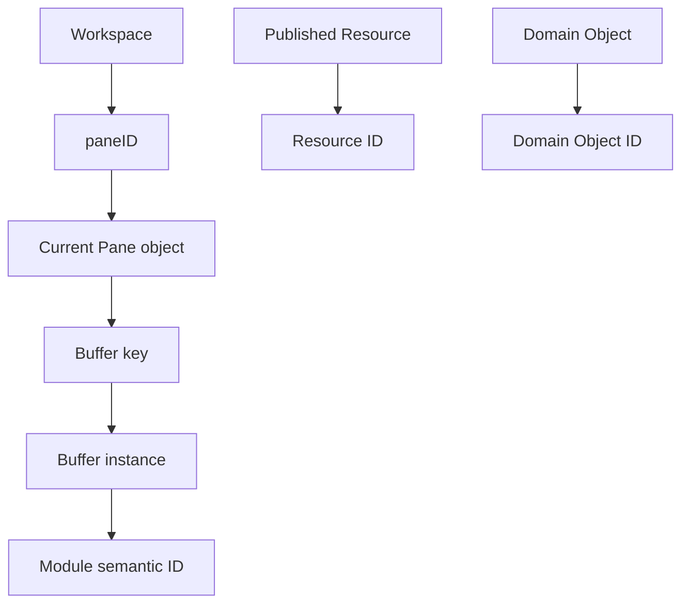
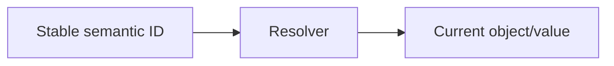
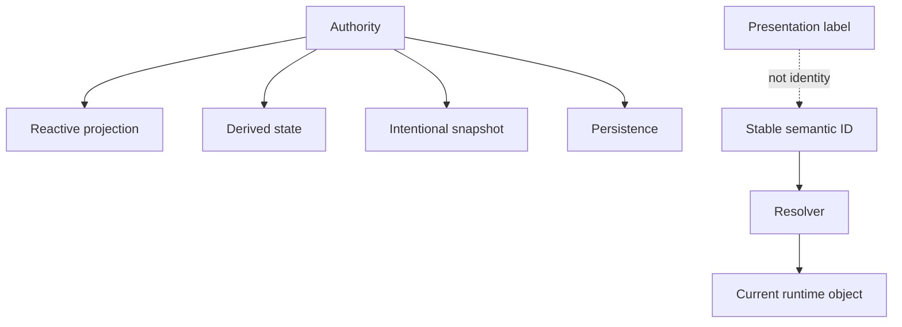

# Identity and Source-of-Truth Rules

## Status

**Application Standard / Architecture Guidance**

Save in the repository as:

```text
docs/03_implementation/runtime/008-identity-source-of-truth.md
```

---

# 1. Purpose

This document defines how KJVOnly.bible should distinguish:

```text
identity
runtime object
authority
projection
snapshot
derived state
presentation label
```

Many subtle bugs come from treating these concepts as interchangeable.

Examples from the current architecture include:

```text
paneID
    versus
Pane object

Buffer key
    versus
Pane identity

Resource ID
    versus
Domain Object ID

Settings page ID
    versus
page title

SettingsService
    versus
module-local Settings projection

application ResourceSelectionService
    versus
Buffer.resourceSelections
```

The central rule is:

> **Use stable semantic identity to refer to things, and keep exactly one clearly defined source of truth for each logical value.**

---

# 2. Identity Is Not the Object Reference

A runtime object may be replaced while representing the same logical entity.

For example:

```text
Pane object
```

may be reconstructed when:

```text
splitting
removing
restructuring
restoring Workspace state
replacing Buffer state
```

The stable identity is:

```text
paneID
```

Therefore code should prefer:

```text
remember paneID
re-resolve current Pane
```

rather than:

```text
remember Pane object reference forever
```

---

# 3. Stable Identity Hierarchy

The application currently contains several important identities.



Each identity describes a different thing.

They should not be reused merely because two values happen to point to related data.

---

# 4. Pane Identity

`paneID` means:

```text
where an interaction is displayed in the Workspace
```

It does not mean:

```text
which Buffer is active
which Module is active
which navigation view is active
```

A Pane can keep the same `paneID` while:

```text
Buffer changes
Module changes
navigation stack changes
layout tree changes around it
```

---

# 5. Buffer Identity

A Buffer key means:

```text
which concrete Module runtime interaction exists
```

Two Buffers may represent:

```text
same Module type
same Pane at different times
same Resource type
```

while remaining different interactions.

Example:

```text
Pane A
    Buffer 1
        Bible Genesis 1

later

Pane A
    Buffer 2
        Bible Romans 8
```

Same Pane.

Same Module type.

Different Buffer identity.

---

# 6. Module Identity

Module identity is semantic.

For example:

```text
Modules.BIBLE
Modules.NOTES
Modules.SETTINGS
Modules.PLANS
```

It identifies:

```text
what kind of Module this is
```

It does not uniquely identify:

```text
one running instance
```

Multiple Bible instances may exist simultaneously.

Therefore:

```text
Module ID
    !=
Module instance identity
```

---

# 7. Navigation Entry Identity

Persistent navigation introduces another identity:

```text
navigation entry key
```

It identifies one mounted layer in a navigation stack.

A navigation entry may point to:

```text
one Module Buffer
```

or:

```text
one internal view
```

depending on navigation layer.

Do not derive entry identity from title text or array position.

---

# 8. Resource Identity

Published Resource identity must remain separate from Domain Object identity.

Conceptually:

```text
Published Resource
    external/publishable representation

Domain Object
    application/domain representation
```

Even when a Resource produces one Domain Object, the IDs describe different layers.

Avoid accidental shortcuts such as:

```text
Resource ID = Domain Object ID
```

unless the architecture explicitly defines that mapping.

---

# 9. Domain Object Identity

A Domain Object ID identifies one application/domain object.

Examples include concepts such as:

```text
notes
text markup
plan subscriptions
completed readings
```

Domain identity should remain stable independently from:

```text
where the object was loaded
which Resource encoded it
which Pane is showing it
which Svelte component renders it
```

---

# 10. Presentation Labels Are Not Identity

Never use human-readable presentation text as identity when stable IDs exist.

Bad:

```text
"Appearance"
"Font Size"
"Bible Version"
```

as lookup keys.

Good:

```text
appearance
font-size
show-bible-version
```

Labels may change without invalidating:

```text
navigation
search destinations
tests
persistence
```

---

# 11. Source of Truth

For each logical value, identify one authority.

Examples:

```text
Settings values
    → SettingsService

current Workspace structure
    → Workspace runtime/store

Module Resource snapshot
    → Buffer.resourceSelections

Domain Note
    → Notes domain store

Settings definition
    → settingsDefinition
```

Other layers may hold:

```text
projections
derived values
snapshots
cached views
```

but they should not silently become competing authorities.

---

# 12. Authority Versus Projection

A projection mirrors authoritative state for convenience.

Example:

```text
SettingsService
    authority

SettingsContext.settings
    module-local reactive projection
```

The projection may be mutated locally for synchronization/rendering purposes, but persisted writes still flow through the authority.

This distinction should be explicit.

---

# 13. Authority Versus Snapshot

A snapshot captures state at a meaningful point in time.

Example:

```text
ResourceSelectionService
    application current/default state

Buffer.resourceSelections
    captured Module instance snapshot
```

The snapshot is intentionally allowed to diverge from later live state.

That is not stale-data corruption.

It is part of the Module interaction contract.

---

# 14. Authority Versus Derived State

Derived state is computed from authoritative state.

Examples:

```text
selected theme label
    derived from Settings + definition options

canGoBack
    derived from stack depth

search results
    derived from search query + search index

current Settings secondary text
    derived from setting value + formatter
```

Do not create a second mutable authority for a value that can be derived reliably.

---

# 15. Identity Versus Lookup Location

A common mistake is to treat:

```text
where I currently find the object
```

as:

```text
the identity of the object
```

Example:

```text
Pane.buffer
```

is a lookup location for the currently active Buffer.

It is not the stable identity of every mounted Module in a persistent navigation stack.

Once hidden Modules remain mounted, they need their own Buffer identity/context.

---

# 16. Re-Resolve Mutable Runtime Objects

When a stable ID is available, application/runtime code should generally:

```text
retain the ID
re-resolve the current runtime object when needed
```

This is particularly important for:

```text
Pane
Buffer lookup
navigation entry
Workspace tree nodes
```

because these structures can be replaced.

---

# 17. Identity Crossing Boundaries

When crossing an architecture boundary, prefer semantic IDs or domain values rather than framework objects.

Good:

```text
paneID
bufferKey
rowID
pageID
module ID
Domain Object ID
PublishedResourceReference
```

Avoid passing:

```text
Svelte component instance
DOM node
Pane object reference
service instance as data
```

unless the boundary explicitly owns that runtime object.

---

# 18. Resolver Pattern

Stable identity works best with resolvers.

Conceptually:



Examples:

```text
paneID
    → WorkspaceRuntime.findPane()

rowID
    → requireSettingsRow()

icon ID
    → resolveSettingsIconComponent()

Module ID
    → resolveModuleComponent()
```

Resolvers keep identity stable while implementation objects can change.

---

# 19. Replaceable Objects

Whenever code introduces an object reference, ask:

```text
Can this object be replaced while the logical thing remains?
```

If yes:

```text
do not treat reference equality as identity
```

unless the specific contract requires the same runtime object.

---

# 20. When Object Identity Does Matter

There are cases where exact object identity is the contract.

Example:

```text
persistent navigation
```

A hidden view is expected to remain the same mounted component/DOM tree.

Therefore browser tests should verify:

```ts
expect(restoredElement).toBe(originalElement);
```

The distinction is:

```text
semantic identity
    stable logical identity

object identity
    same runtime object instance
```

Both matter, but for different reasons.

---

# 21. Persist Semantic Identity

Persist:

```text
IDs
Module enums
Buffer data
bags
resource references
domain IDs
```

Do not persist:

```text
Svelte component constructors
DOM references
live service objects
context objects
functions
```

Persisted state must survive process/runtime recreation.

---

# 22. Identity and Serialization

A useful rule is:

> **If a value is part of persistent identity, it should normally have a clear serializable representation.**

Examples:

```text
paneID
buffer key
module enum/string
Domain Object ID
Resource ID
```

---

# 23. Source-of-Truth Decision Table

| Concept | Source of truth |
| --- | --- |
| Workspace structure | Workspace runtime/store |
| Pane identity | `paneID` |
| Active Module interaction | active Buffer/navigation entry |
| Module instance Resource selection | `Buffer.resourceSelections` |
| Application Resource defaults/current | `ResourceSelectionService` |
| Settings values | `SettingsService` |
| Settings structure | `settingsDefinition` |
| Domain objects | Domain store |
| Navigation stack | Navigation service |
| View search query | owning view local state |

---

# 24. Duplication Warning Signs

Look for architectural trouble when the same value is stored independently in several places.

Example:

```text
current Bible version
    in Settings
    in Buffer bag
    in component local state
    derived from Resource ID
```

Before adding another copy, decide:

```text
Which one is authority?
Which copies are projections/snapshots?
How do they synchronize?
```

---

# 25. Stale Snapshot Versus Stale Bug

Not every old value is a bug.

Intentional snapshot:

```text
Buffer.resourceSelections
```

Unintentional stale copy:

```text
module local Settings object used as merge base after another module changed Settings
```

The architecture must distinguish these.

---

# 26. Merge Against the Authority

When changing one field in live shared state, merge against the current authority.

Example:

```ts
SettingsService.updateSetting(...)
```

should start from:

```text
latest SettingsService state
```

not:

```text
possibly stale module-local projection
```

This prevents unrelated values from being overwritten.

---

# 27. Local Editing Drafts

Draft state can intentionally diverge from authority.

Example:

```text
Font Size editor
    local draft value

Save
    commits to Settings authority
```

This is valid when the draft lifecycle is explicit.

Do not confuse:

```text
draft
```

with:

```text
current application truth
```

---

# 28. Event Identity

Events should also have semantic meaning.

Examples:

```text
PaneBufferReplaced
ArchiveImported
Outbox publication completed
```

The event name identifies:

```text
what happened
```

It should not be repurposed as long-lived state identity.

---

# 29. Search Result Identity

Search results should return semantic destinations.

Example:

```text
pageID + rowID
```

not:

```text
array index
visible label
Svelte component
```

This makes search stable across reordering and visual changes.

---

# 30. Testing Identity Contracts

Important tests include:

```text
same semantic ID resolves after reordering
related Buffer gets new key
same Pane keeps same paneID across Buffer change
persistent navigation restores same DOM node
two same-type Modules have different Buffer keys
search result uses stable page/row IDs
```

Identity tests protect architecture better than superficial render checks.

---

# 31. Identity Anti-Patterns

Avoid:

## Array index as identity

Reordering breaks meaning.

## Display title as identity

Copy changes break behavior.

## Cached Pane object as identity

Workspace restructuring can replace objects.

## Module type as instance identity

Multiple instances can coexist.

## Current `Pane.buffer` as identity of hidden Modules

It only represents the active/current Buffer.

## Resource ID as Domain Object ID

Different architecture layers.

---

# 32. Source-of-Truth Anti-Patterns

Avoid:

```text
two services both persisting same logical value
UI writing storage directly while service also owns persistence
subscriber synchronization republishing through command path
local projection treated as authoritative during merge
definition metadata duplicated in several registries
```

---

# 33. Identity Review Questions

When reviewing new code, ask:

```text
What exactly is this ID identifying?
Can the runtime object be replaced?
Could two instances of this type coexist?
Is this value presentation or identity?
Can this reference survive persistence?
Is this lookup using current location as identity?
```

---

# 34. Source-of-Truth Review Questions

Ask:

```text
Who owns the authoritative value?
Is this a live value, snapshot, projection, or draft?
Who is allowed to write it?
Who merely observes it?
Should later application changes update this instance?
Can this value be derived instead of stored?
```

---

# 35. Mermaid Summary



---

# 36. Architecture Invariants

1. Stable IDs identify logical entities independently from mutable runtime objects.
2. A logical value has one clear source of truth.
3. Projections do not silently become authorities.
4. Snapshots are explicitly snapshot semantics.
5. Derived state is not redundantly persisted without reason.
6. Presentation labels are not lookup identity.
7. Module type is not Module instance identity.
8. Pane identity and Buffer identity remain separate.
9. Resource identity and Domain Object identity remain separate.
10. Persisted state contains semantic/serializable identity, not framework instances.
11. Mutable runtime objects are re-resolved from stable identity where appropriate.
12. Object identity is asserted only when same-instance preservation is the actual contract.

---

# 37. Summary

The application should consistently separate:

```text
what something is
    identity

where it currently lives
    lookup location

which object currently represents it
    runtime object

who owns its value
    authority

which copy is convenient for rendering
    projection

which value was intentionally captured
    snapshot

which value can be recomputed
    derived state
```

Doing this reduces:

```text
stale-reference bugs
cross-instance contamination
accidental overwrites
ambiguous persistence
fragile navigation
incorrect Resource resolution
duplicated metadata
```

The rule to carry into future work is:

> **Keep identity stable, keep authority singular, and name snapshots/projections for what they actually are.**
