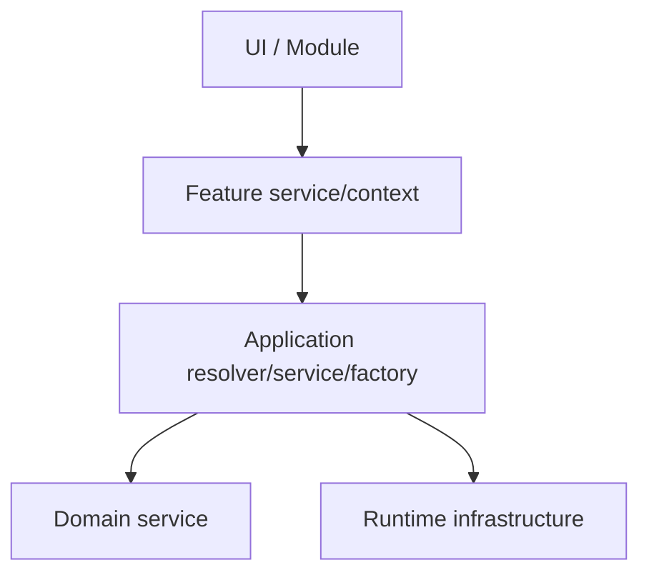
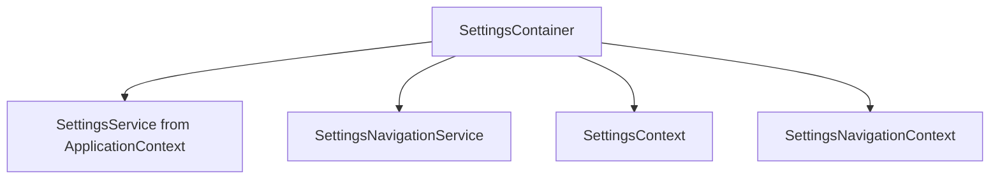
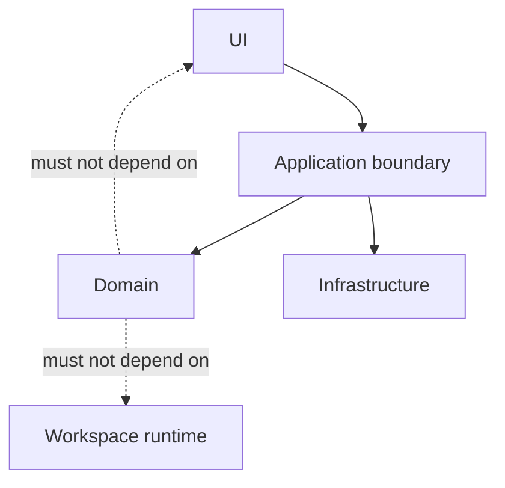

# Resolver and Boundary Design

## Status

**Application Standard / Architecture Guidance**

Save in the repository as:

```text
docs/03_implementation/runtime/009-resolver-boundary-design.md
```

---

# 1. Purpose

This document defines how KJVOnly.bible should use resolvers, factories, services, and contexts to keep architecture boundaries explicit.

The recurring pattern is:

```text
caller knows semantic identity
    ↓
boundary resolver/service
    ↓
implementation/runtime lookup
```

Examples already used successfully include:

```text
ModuleResourceSelectionResolver
Settings definition resolvers
Settings icon resolver
Settings custom-view resolver
Module component resolver
Navigation service facades
ModuleBufferFactory
```

The central rule is:

> **Callers should ask for semantic capabilities or values; boundary objects should hide traversal, lookup, construction, and implementation details.**

---

# 2. Why Boundaries Matter

Without an explicit boundary, knowledge spreads.

Example:

```text
component
    knows Pane tree
    knows Buffer structure
    knows ResourceSelections map
    knows Resource ID format
    knows fallback rules
```

This makes every caller responsible for architecture.

With a resolver:

```text
component
    asks:
        require resource selection
```

The boundary contains the traversal.

---

# 3. Resolver Definition

A resolver primarily answers:

```text
Given semantic identity/context, what value or implementation corresponds to it?
```

Examples:

```text
page ID
    → page definition

row ID
    → row definition

icon ID
    → SVG component

paneID + Resource Type
    → PublishedResourceReference

Module ID
    → Svelte Module component
```

Resolvers should generally be side-effect-light.

---

# 4. Factory Definition

A factory primarily answers:

```text
How is a valid new runtime object constructed?
```

Example:

```text
ModuleBufferFactory
```

It ensures new Buffers receive:

```text
new identity
Module type
explicit bag
Resource-selection snapshot
```

Callers should not reproduce that construction manually.

---

# 5. Service Definition

A service primarily owns:

```text
stateful behavior
orchestration
side effects
application capabilities
```

Examples:

```text
SettingsService
NavigationService
SettingsNavigationService
WorkspaceRuntime
```

A service may call resolvers/factories internally.

---

# 6. Context Definition

A context exposes a capability/state scope through the component tree.

Examples:

```text
ApplicationContext
SettingsContext
SettingsNavigationContext
future PaneNavigationContext
future ModuleRuntimeContext
```

Context is not a replacement for resolvers/services.

It is a delivery mechanism for scoped capabilities.

---

# 7. Boundary Layering

A healthy dependency direction looks like:



Generic lower layers should not import feature-specific UI logic.

---

# 8. `find` Versus `require`

Resolvers should clearly distinguish optional lookup from invariant lookup.

## `find`

Use when absence is expected:

```ts
findSettingsPage(id)
```

returns:

```text
value | undefined
```

## `require`

Use when absence means architecture/configuration is invalid:

```ts
requireSettingsPage(id)
```

returns:

```text
value
```

or throws a clear error.

---

# 9. Fail Fast at Boundaries

A boundary should reject impossible states close to the point where they become invalid.

Examples:

```text
missing required Resource selection
unknown Settings page ID
wrong Settings row type
unknown custom view ID
unregistered Module Resource contributor
```

Failing early is usually better than:

```text
returning undefined deep into UI
silently rendering nothing
falling back to unrelated state
```

---

# 10. Narrow Inputs

A resolver should accept the narrowest meaningful input.

Good:

```text
paneID + Resource Type
```

rather than:

```text
entire Application
entire Workspace
entire Settings object
```

Narrow inputs make contracts easier to test and reduce accidental coupling.

---

# 11. Narrow Outputs

Return what the caller actually needs.

Example:

```text
PublishedResourceReference
```

rather than:

```text
Pane + Buffer + ResourceSelections + internal store state
```

This protects lower-level runtime details.

---

# 12. Hide Traversal

Callers should not repeatedly traverse architecture graphs.

Bad:

```text
find Pane
find Buffer
inspect ResourceSelections
parse key
throw if missing
```

in many components.

Good:

```ts
moduleResourceSelectionResolver.require(...)
```

Traversal belongs in one boundary.

---

# 13. Hide Construction

Callers should not reproduce valid-object construction.

Bad:

```text
new Buffer()
set componentName
copy bag
copy Resource selections
assign UUID assumptions
```

Good:

```text
ModuleBufferFactory.related(...)
```

The factory protects invariants.

---

# 14. Semantic Facades

A feature-specific service may wrap a generic service.

Settings uses:

```text
SettingsNavigationService
    ↓
NavigationService
```

The feature facade understands:

```text
group row
select row
custom row
search result
```

The generic navigation service only understands:

```text
push
pop
views
```

This is a strong application-wide pattern.

---

# 15. Generic Services Must Stay Generic

Avoid feature branching inside shared runtime code.

Bad:

```ts
if (module === Modules.BIBLE) { ... }
if (module === Modules.NOTES) { ... }
```

inside:

```text
ModuleBufferFactory
generic NavigationService
Workspace core runtime
```

Feature/domain policies belong behind registered contributors or feature services.

---

# 16. Contributors as Policy Boundaries

The Resource-selection contributor architecture is an example of a policy boundary.

Generic flow:

```text
target Module
    ↓
registered contributor
    ↓
Module-specific policy
    ↓
ResourceSelections
```

The builder remains generic.

Adding Bible-specific behavior should normally update:

```text
Bible contributor
```

not:

```text
generic builder
```

---

# 17. Resolvers and Open/Closed Design

Resolvers help preserve:

```text
add a new semantic mapping
```

without:

```text
edit many callers
```

Examples:

```text
new icon ID
    → add resolver mapping

new custom Settings view
    → add custom-view mapping

new Module Resource policy
    → add contributor registration
```

---

# 18. Semantic IDs at Boundaries

Use stable semantic IDs to cross boundaries.

Examples:

```text
rowID
pageID
icon ID
custom view ID
module ID
paneID
bufferKey
Resource Type
```

Avoid making callers pass concrete implementation objects unnecessarily.

---

# 19. Framework Separation

Semantic data should not depend directly on Svelte constructors when a resolver can map it.

Good:

```text
view: "font-size"
```

Resolver:

```text
font-size
    → FontSize.svelte
```

This keeps configuration testable and implementation replaceable.

---

# 20. Resolver Location

Resolvers should live near the layer whose semantic vocabulary they understand.

Examples:

```text
Settings row/page resolver
    Settings module

Module Resource selection resolver
    application runtime/resource boundary

Domain parser/resolver
    owning domain
```

Do not place every resolver in one global utilities directory.

---

# 21. Boundary Ownership

A boundary should answer one coherent architectural question.

Good:

```text
ModuleResourceSelectionResolver
    How does Module UI read its captured Resource selection?

ModuleBufferFactory
    How is a valid Module Buffer constructed?

SettingsNavigationService
    What does a Settings semantic navigation action mean?
```

Bad:

```text
UtilsService
    everything
```

---

# 22. Context Provider as Composition Boundary

Containers often create/provide feature-specific boundaries.

Example:



The container composes.

Children consume.

---

# 23. Avoid Propagating Infrastructure

A feature child should not need to know:

```text
WorkspaceRuntime
Pane tree
BufferFactory
ResourceSelectionService
NavigationService internals
```

if it only needs:

```text
navigate to X
read selected Resource Y
update Setting Z
```

Expose the capability it needs.

---

# 24. Capability-Oriented APIs

Prefer APIs phrased as capabilities.

Examples:

```text
require(RESOURCE_TYPE)
pushModule(MODULE, bag)
updateSetting(key, value)
back()
requireSettingsPage(id)
```

rather than making every caller manipulate underlying storage structures.

---

# 25. Avoid Leaky Return Types

If a resolver returns an internal storage record when the caller only needs a semantic value, internal representation leaks outward.

This makes refactoring harder.

Prefer stable application/domain contracts.

---

# 26. Error Message Quality

`require...` boundaries should fail with enough semantic context to debug quickly.

Good:

```text
Settings select row not found: font-family
```

Good:

```text
No Resource selection contributor registered for module: Notes
```

Avoid generic:

```text
undefined
invalid
error
```

---

# 27. Resolvers Should Be Deterministic Where Possible

Given the same:

```text
semantic ID/context
```

a resolver should return the same logical result unless its contract explicitly depends on runtime state.

This makes it testable.

---

# 28. Runtime Resolvers

Some resolvers intentionally depend on current runtime state.

Example:

```text
paneID
    → current Pane
```

In that case, the resolver's contract should clearly indicate that it resolves the **current** runtime object.

Do not cache its result unless the lifecycle guarantees stability.

---

# 29. Snapshot Resolver Boundaries

For Module Resource selections, resolution should respect the Module's captured Buffer snapshot.

A future persistent cross-module stack must avoid:

```text
hidden Module
    → paneID
    → current top Pane.buffer
```

if that Buffer belongs to another stack entry.

The resolver boundary must preserve the correct identity source.

---

# 30. Resolver Evolution

When architecture changes, update the resolver rather than every consumer.

This is one of the main benefits.

Example future change:

```text
Resource lookup
    from paneID
```

may become:

```text
Resource lookup
    from ModuleRuntimeContext / bufferKey
```

If consumers already depend on a narrow resolver capability, the migration is smaller.

---

# 31. Boundary Tests

Every important boundary deserves focused tests.

Resolver tests:

```text
valid lookup
missing lookup
wrong semantic type
runtime replacement behavior
```

Factory tests:

```text
identity creation
context copying
policy invocation
snapshot construction
```

Service tests:

```text
state transition
side effect
subscriber behavior
failure behavior
```

---

# 32. Test the Boundary Contract, Not Its Internals

For example, test:

```text
related Buffer gets compatible Resource selections
```

rather than:

```text
private helper called exactly twice
```

unless call count itself is the contract.

---

# 33. Resolver JSDoc

Resolver JSDoc should explain:

```text
what identity it accepts
what layer it resolves into
whether absence is allowed
whether result is live/current or snapshot-bound
what failure means
```

Example:

```ts
/**
 * Returns the Resource source captured for the current Module interaction.
 * Fails when the Module Buffer does not contain the required Resource Type.
 */
```

---

# 34. Boundary Review Questions

Before adding a direct dependency, ask:

```text
Does a resolver/service already own this lookup?
Am I traversing Workspace/Buffer internals from feature UI?
Am I constructing an object that should come from a factory?
Am I adding feature-specific logic to a generic service?
Can this dependency be narrowed to a semantic capability?
```

---

# 35. When to Introduce a Resolver

Introduce one when:

```text
lookup/traversal repeats
stable semantic identity exists
implementation mapping should be centralized
failure semantics matter
callers should not know storage/runtime shape
```

Do not create a resolver just to wrap:

```ts
map[id]
```

if there is no meaningful boundary or future value.

---

# 36. When to Introduce a Factory

Introduce one when object creation requires invariants.

Examples:

```text
new identity
copied context
registered policy
Resource snapshot
default values
```

The more callers must remember to construct correctly, the stronger the factory case.

---

# 37. When to Introduce a Feature Service

Use a feature service when semantic actions need orchestration.

Example:

```text
Settings semantic navigation
```

is more than lookup.

It maps semantic rows into navigation state transitions.

---

# 38. Avoid "Manager" Objects Without a Contract

Names such as:

```text
Manager
Helper
Utils
Common
```

often hide unclear ownership.

Prefer precise boundary names:

```text
Resolver
Factory
Service
Contributor
Context
Store
Publisher
```

when they match the actual role.

---

# 39. Boundary Dependency Direction

The desired direction is:



Application/runtime may coordinate domain/infrastructure.

Domain should remain independent from UI/runtime navigation mechanics.

---

# 40. Anti-Patterns

Avoid:

## Repeated manual lookup

Same traversal copied into components.

## Generic runtime special cases

Feature logic inside central services.

## Construction scattered across callers

Invariants become optional.

## Resolver returning too much

Leaks internals.

## Silent fallback

Hides configuration errors.

## Svelte constructors in persistent semantic data

Framework coupling.

## Context containing unrelated services

Becomes a second ApplicationContext.

## Deep domain imports to bypass a public boundary

Breaks domain ownership.

---

# 41. Architecture Invariants

1. Repeated architectural lookup belongs behind a resolver.
2. Valid runtime-object creation belongs behind a factory when invariants matter.
3. Stateful orchestration belongs in a service.
4. Context scopes capabilities; it does not replace services.
5. Feature facades may wrap generic services.
6. Generic services do not accumulate feature/domain special cases.
7. Semantic IDs cross boundaries more safely than implementation objects.
8. `require` boundaries fail clearly on invariant violations.
9. Resolvers return narrow contracts.
10. Domain services remain independent from Workspace/navigation mechanics.
11. Boundary behavior is tested directly.
12. Containers compose dependencies; leaf feature components consume capabilities.

---

# 42. Summary

The application should prefer:

```text
semantic request
    ↓
clear boundary
    ↓
implementation/runtime detail
```

rather than:

```text
every caller knows everything
```

The practical toolbox is:

```text
resolver
    for semantic lookup

factory
    for valid construction

service
    for orchestration/state/side effects

context
    for scoped delivery

contributor
    for pluggable feature/domain policy
```

Used consistently, these boundaries make future refactors cheaper because implementation changes remain localized instead of propagating throughout UI code.
