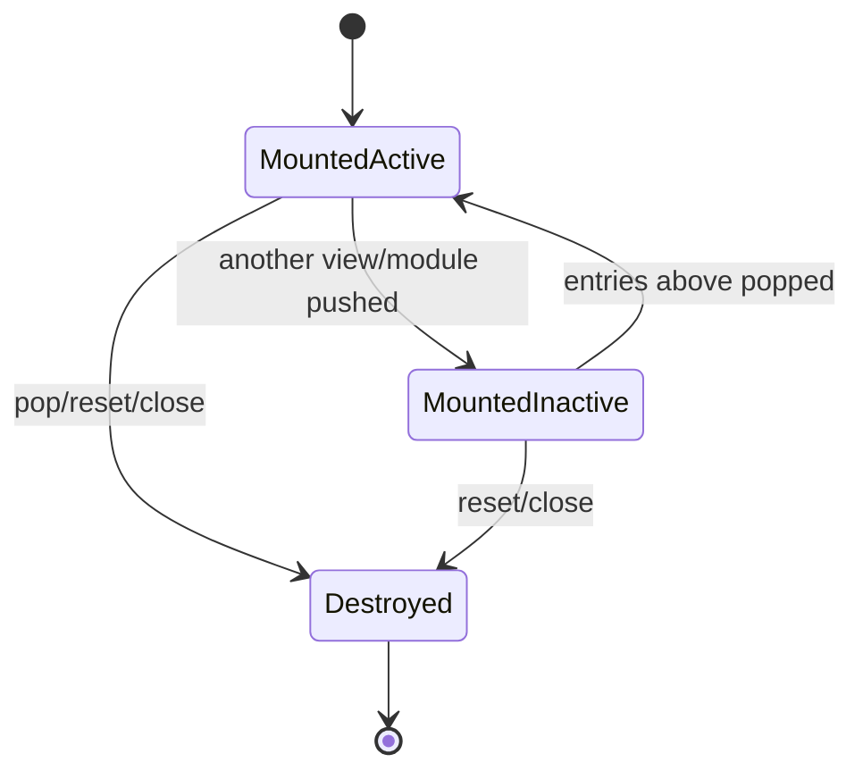
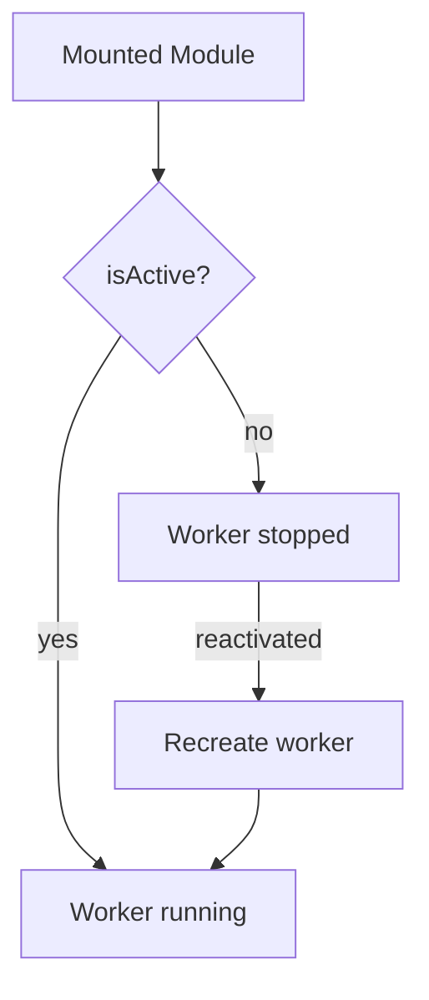
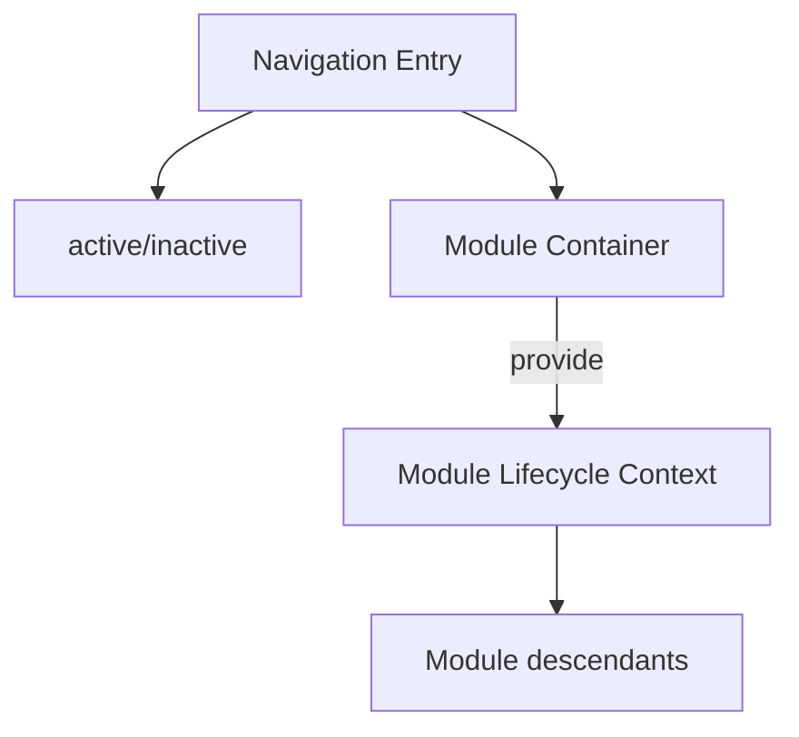

# Persistent UI Lifecycle

## Status

**Application Standard / Architecture Guidance**

Save in the repository as:

```text
docs/03_implementation/runtime/010-persistent-ui-lifecycle.md
```

---

# 1. Purpose

This document defines lifecycle semantics for UI that remains mounted while temporarily hidden.

The Settings navigation refactor proved the value of persistent mounted views:

```text
search state survives
scroll survives
input values survive
DOM identity survives
Back is cheap
```

The proposed application-wide navigation architecture extends that behavior to full Modules.

That introduces an important lifecycle distinction:

```text
active
inactive but mounted
destroyed
```

The application must treat these as different states.

---

# 2. Traditional Component Assumption

Many components implicitly assume:

```text
visible
    = mounted

not visible
    = destroyed
```

Persistent navigation breaks that assumption.

A component may be:

```text
mounted
reactive
subscribed
running effects
hidden
```

for an extended period.

---

# 3. Lifecycle State Model



These states should be explicit in architecture.

---

# 4. Mounted Active

Active means:

```text
mounted
visible
current navigation entry
user-interactive
```

The component may run:

```text
workers
subscriptions
timers
media
focus behavior
network updates
```

subject to feature requirements.

---

# 5. Mounted Inactive

Inactive means:

```text
mounted
hidden
not current navigation entry
state preserved
DOM preserved
```

It does **not** automatically mean:

```text
onDestroy ran
subscriptions stopped
workers terminated
timers paused
observers disconnected
```

If expensive behavior must stop, the component needs an explicit activity signal.

---

# 6. Destroyed

Destroyed means:

```text
component unmounted
cleanup callbacks run
DOM removed
subscriptions should be released
workers owned by component should be disposed
```

Destroyed state should not be confused with temporarily hidden.

---

# 7. Why Persistent Mounting Is Valuable

Persistent mounting avoids reconstruction code for state the browser/framework already owns.

Examples:

```text
input contents
scroll position
selection state
expanded sections
temporary form state
focus-related DOM
component-local caches
```

Instead of:

```text
serialize state
destroy component
recreate component
restore state
```

the application can:

```text
hide component
later reveal same component
```

---

# 8. State Preservation Contract

When a view is pushed underneath another persistent view, the default expectation is:

```text
local UI state remains unchanged
```

unless the feature explicitly chooses to react to deactivation.

This is a meaningful user-facing contract.

---

# 9. Visibility Versus Activity

A hidden component may still be computationally active.

Therefore:

```text
visibility
```

and:

```text
activity
```

should be treated separately.

Possible future runtime context:

```ts
interface NavigationEntryContext {
    isActive: boolean;
}
```

or equivalent.

---

# 10. Why Activity State Matters

Full Modules may own expensive resources:

```text
Web Workers
FlexSearch indexes
audio playback
timers
network subscriptions
ResizeObserver
IntersectionObserver
large in-memory caches
media streams
polling
```

Keeping all of those fully active for hidden Modules can waste memory/CPU.

---

# 10.1 Performance Principle: Preserve UI, Release Recreatable Work
Persistent navigation should not treat the choice as:
```text
keep the entire Module alive at full cost
    or
tear down the entire Module and lose its UI state
```

The preferred optimization boundary is:
```text
preserve lightweight mounted UI state
    +
release expensive recreatable runtime resources while inactive
```

Candidates include:
```text
search workers
FlexSearch indexes
Notes workers/indexes
Reading Plans workers/indexes
Strong's workers/indexes
large temporary parsing state
```

This principle should guide future ephemeral-worker work.

A hidden Module may keep:
```text
DOM
scroll
query text
selected IDs
navigation state
local presentation state
```

while terminating or releasing an expensive worker/index that can be reconstructed from persisted/local data when the Module becomes active again.

Do not destroy the entire persistent navigation entry merely to reclaim one expensive resource.

---
# 11. Pause Without Losing UI State

The desired pattern is often:

```text
inactive
    preserve UI state
    pause expensive runtime work

active again
    resume/recreate runtime work
```

This aligns well with the existing idea of ephemeral workers.

---

# 12. Ephemeral Workers and Persistent UI

A Module can remain mounted while its worker does not.

Conceptually:



The Module preserves:

```text
query
selection
UI state
navigation state
```

while expensive processing can be reclaimed.

---

# 13. Worker Ownership

The component/service that creates an ephemeral worker should own its termination.

Lifecycle policy should be explicit:

```text
on mount
    maybe create

on active
    ensure running

on inactive
    optionally terminate

on destroy
    definitely terminate
```

---

# 14. Subscription Ownership

Persistent hidden components may continue receiving application/domain updates.

Whether that is correct depends on the subscription.

Examples:

```text
Settings live updates
    likely continue while hidden

expensive search-result subscription
    may pause

audio progress
    depends on playback semantics
```

Do not apply one universal rule.

---

# 15. Live Data While Hidden

Sometimes hidden UI should continue receiving live state so it is immediately correct when revealed.

Example:

```text
Settings module A hidden
Settings changed elsewhere
A should show latest values when revealed
```

This is different from expensive background computation.

---

# 16. Snapshot Data While Hidden

Some Module context should not change merely because the component is hidden.

Example:

```text
Buffer.resourceSelections
```

A hidden Module keeps the Resource snapshot associated with its interaction.

Reactivation should not silently replace it with current global selections.

---

# 17. Timers

Timers should be reviewed individually.

Questions:

```text
Does elapsed real time matter while hidden?
Is the timer purely visual?
Does hidden execution waste CPU?
Should state catch up on resume?
```

Avoid leaving animation-only intervals running invisibly.

---

# 18. Media

Audio/video needs explicit policy.

Possible semantics:

```text
navigation push pauses playback
```

or:

```text
playback continues across navigation
```

This is product behavior, not an automatic lifecycle consequence.

The owner should document it.

---

# 19. Focus

Hidden content must not remain normal keyboard focus targets.

The stack renderer should use hiding/inert semantics that prevent inactive entries from participating in ordinary navigation.

On push:

```text
focus should enter active destination
```

On pop:

```text
focus should return sensibly to revealed origin
```

---

# 20. Scroll

Persistent views naturally retain scroll when their scrolling DOM remains mounted.

Do not add manual scroll restoration unless a component destroys/recreates its scroll container or product behavior intentionally changes it.

---

# 21. DOM Identity

Persistent navigation promises same-instance restoration.

Browser tests should verify:

```ts
expect(restoredElement).toBe(originalElement);
```

when DOM identity is part of the architecture.

---

# 22. Svelte Effects

Svelte reactive effects continue to exist while the component remains mounted.

If an effect should only run while active, guard it with activity state.

Conceptually:

```ts
$effect(() => {
    if (!isActive) {
        return;
    }

    // expensive active-only work
});
```

---

# 23. `onMount` / `onDestroy`

Persistent hidden state does not trigger:

```text
onDestroy
```

Therefore cleanup tied only to `onDestroy` happens only when:

```text
entry is popped
stack reset
pane/module destroyed
```

Do not expect hiding to trigger destruction cleanup.

---

# 24. Activation Hooks

App-wide navigation may benefit from an explicit abstraction equivalent to:

```text
onActivate
onDeactivate
```

This does not need to be invented immediately.

A reactive:

```text
isActive
```

context value may be sufficient initially.

Add higher-level hooks only when real repeated patterns justify them.

---

# 25. Lifecycle Context Scope

Activity state belongs to:

```text
one navigation entry
```

not globally to the Module type.

Two Bible instances can have different state:

```text
Bible A
    inactive

Bible B
    active
```

Therefore activity must be instance-scoped.

---

# 26. Module Container Boundary

The Module container is a good place to consume navigation-entry lifecycle and provide it to descendants.

Conceptually:



---

# 27. Internal View Lifecycle

Internal navigation has the same semantics.

Example:

```text
Settings root
    inactive but mounted

Appearance
    inactive but mounted

Color Theme
    active
```

Internal views may usually be cheap enough to remain fully reactive.

Do not optimize prematurely.

---

# 28. Full Module Lifecycle

Full Modules are more likely to require activity-aware resource management.

Examples:

```text
Search
Strong's
Audio
Notes with large indexes
Plans worker
Dictionary
```

Audit these during migration to persistent cross-module navigation.

---

# 29. Memory Versus UX Tradeoff

Persistent mounting intentionally trades some memory for stronger UX/state preservation.

The solution should not immediately abandon persistent mounting when memory increases.

Instead:

```text
preserve lightweight UI
release expensive recreatable resources
```

This is a more targeted optimization.

---

# 30. Classify Module Resources

For each Module, classify runtime resources.

## Preserve while inactive

Examples:

```text
small local state
DOM
form drafts
scroll
navigation state
selected IDs
```

## Pause while inactive

Examples:

```text
polling
animation loops
high-frequency subscriptions
```

## Recreate on activation

Examples:

```text
large search worker
large in-memory index
temporary parsing worker
```

## Keep running intentionally

Examples:

```text
background operation whose completion matters
audio if product behavior permits
critical shared sync
```

---

# 31. Background Operations

Some tasks should outlive the UI entry that started them.

Examples may include:

```text
Archive import/export
Outbox publication
Resource download
```

These should not be owned exclusively by a navigation entry if destruction should not cancel them.

Move such work to the application/domain service that truly owns the operation.

---

# 32. UI-Owned Versus Application-Owned Work

Ask:

```text
Should closing this Module cancel the operation?
```

If:

```text
yes
```

Module ownership may be appropriate.

If:

```text
no
```

the operation likely belongs to an application service/background runtime.

---

# 33. Inactive Component Events

Hidden components should not normally react to user input because they are not reachable.

But application/service events may still arrive.

Handlers should know whether their behavior:

```text
must update hidden state
may defer until active
should be ignored while inactive
```

---

# 34. Reactivation

On reactivation, a Module should:

```text
already have preserved UI state
resume required runtime resources
reflect live application state that intentionally stayed subscribed
continue using its captured interaction snapshots
```

Reactivation should not be equivalent to full remount.

---

# 35. Destroy Cleanup

When popped/destroyed, cleanup must release all Module-owned resources.

Examples:

```text
unsubscribe
terminate workers
remove event listeners
disconnect observers
clear timers
release media
dispose editors
```

Persistent navigation increases the importance of correct eventual cleanup because entries may live longer.

---

# 36. Subscription Leak Tests

For important services:

```text
mount
subscribe
pop/unmount
assert unsubscribed
```

This protects long-lived navigation sessions from accumulating dead subscribers.

---

# 37. Worker Leak Tests

Where practical:

```text
activate Module
worker created
deactivate
worker paused/terminated according to policy
reactivate
worker recreated/resumed
destroy
worker definitely gone
```

---

# 38. Lifecycle Test Matrix

| State transition | What to test |
| --- | --- |
| mount → active | resources initialize |
| active → inactive | DOM preserved, expensive work policy applied |
| inactive → active | same DOM/state restored, resources resume |
| active → destroyed | cleanup |
| inactive → destroyed | cleanup still runs |
| push/pop | correct active entry |

---

# 39. Browser Tests Are Required

Persistent lifecycle semantics depend on actual component mounting.

Unit tests alone cannot prove:

```text
same DOM remains
onDestroy did not run on hide
focus behavior
browser input state
scroll state
```

Use browser tests for these contracts.

---

# 40. Minimal Lifecycle Harness

A focused browser fixture can:

```text
mount view/module A
expose lifecycle counters/state
push B
inspect A
pop B
inspect A again
unmount
```

Do not bootstrap the entire application unless necessary.

---

# 41. Lifecycle Instrumentation

Avoid shipping debug-only global instrumentation just for tests.

Prefer test fixtures or injectable lightweight services when lifecycle observation is required.

---

# 42. Avoid Hidden Global Work

A persistent hidden component that continues expensive work without clear reason is a performance smell.

During module migration, audit:

```text
workers
intervals
subscriptions
observers
event listeners
large caches
```

---

# 43. Avoid Destroy/Recreate as the Default Optimization

Destroying inactive UI fixes resource usage at the cost of losing the primary navigation benefit.

Prefer targeted cleanup of expensive resources.

---

# 44. Avoid Manual State Serialization Without Need

Do not serialize:

```text
search input
scroll
expanded section
editor draft
```

merely to support Back when persistent mounting already preserves them.

Manual restore code adds failure modes.

---

# 45. Lifecycle and Buffer Identity

A hidden Module entry keeps:

```text
its Buffer key
its Buffer bag
its Resource snapshot
```

When reactivated, it resumes the same interaction.

Do not replace its Buffer merely because it became active again.

---

# 46. Lifecycle and Pane Identity

The Pane remains stable through navigation activity changes.

```text
paneID
```

does not change when:

```text
push
hide
show
pop
```

The lifecycle belongs inside the Pane navigation session.

---

# 47. Lifecycle and Persistence

Initial app-wide navigation may persist only:

```text
active top Buffer
```

while the historical stack remains ephemeral.

If the application reloads, persistent DOM state is naturally lost.

That is acceptable unless full history restoration becomes a requirement.

Do not confuse:

```text
persistent while mounted
```

with:

```text
persistent across reload
```

---

# 48. Visibility CSS

The stack implementation should use a consistent hiding strategy.

Requirements:

```text
inactive entry not visible
inactive entry not taking interactive focus
active entry owns visible surface
layout not duplicated
```

Exact classes/attributes can evolve.

---

# 49. Accessibility

Inactive mounted UI must not create duplicate accessible content.

The navigation stack should ensure screen readers and keyboard navigation treat only the active entry as current interactive content.

This should be included in browser/a11y regression coverage where practical.

---

# 50. Active State and Context

A future context may expose:

```ts
interface ModuleLifecycleContext {
    isActive: boolean;
}
```

or fold this into:

```text
ModuleRuntimeContext
```

The exact API should remain minimal until multiple Modules need it.

---

# 51. JSDoc Expectations

Lifecycle-sensitive functions should document:

```text
whether hidden state stays mounted
whether resources pause
whether cleanup happens on deactivate or destroy
whether state resumes
```

Example:

```ts
/**
 * Stops the Module's ephemeral search worker while the navigation entry is
 * inactive. UI state remains mounted and is reused when the entry becomes
 * active again.
 */
```

---

# 52. Migration Audit Checklist

Before placing a Module in a persistent stack, inspect:

```text
onMount
onDestroy
$effect
subscriptions
workers
timers
observers
audio/media
large caches
global event listeners
focus assumptions
scroll ownership
```

Decide what each does in inactive state.

---

# 53. Suggested Module Migration Table

For every migrated Module, document:

```text
Module:
    Search

UI state:
    preserve

Worker:
    terminate inactive / recreate active

Subscriptions:
    keep/pause

Media:
    n/a

Resource snapshot:
    preserve Buffer

Destroy cleanup:
    terminate worker, unsubscribe
```

This makes lifecycle policy reviewable.

---

# 54. Anti-Patterns

Avoid:

## Assuming hidden means destroyed

Cleanup will not have run.

## Keeping every expensive resource active

Wastes CPU/memory.

## Destroying all hidden UI

Loses navigation-state benefits.

## Replacing Buffer on reactivation

Changes interaction identity.

## Storing active state globally by Module type

Multiple instances can coexist.

## Letting inactive UI remain keyboard-accessible

Accessibility bug.

## Background operations owned by disposable UI when they should survive it

Wrong lifecycle owner.

---

# 55. Architecture Invariants

1. Active, inactive-mounted, and destroyed are distinct lifecycle states.
2. Push deactivates the previous entry without destroying it.
3. Pop destroys only the popped entry and reactivates the previous one.
4. UI state remains preserved while inactive unless explicitly designed otherwise.
5. Expensive resources may pause/recreate independently from UI mounting.
6. Buffer identity remains stable while an entry is inactive.
7. Pane identity remains stable across navigation lifecycle transitions.
8. Hidden entries must not participate in normal keyboard/accessibility interaction.
9. Destroy cleanup releases all entry-owned resources.
10. Application-owned background work is not accidentally canceled by UI destruction.
11. Activity state is scoped per navigation entry/module instance.
12. Browser tests protect persistent lifecycle contracts.

---

# 56. Summary

Persistent navigation changes the lifecycle model from:

```text
visible
    or
destroyed
```

to:

```text
active
inactive but preserved
destroyed
```

That distinction allows the application to get both:

```text
strong Back/navigation UX
```

and:

```text
controlled CPU/memory usage
```

The recommended strategy is:

```text
preserve UI
pause expensive work
resume on activation
clean up fully on destruction
```

This should become the default lifecycle model for Modules and views participating in persistent navigation.
