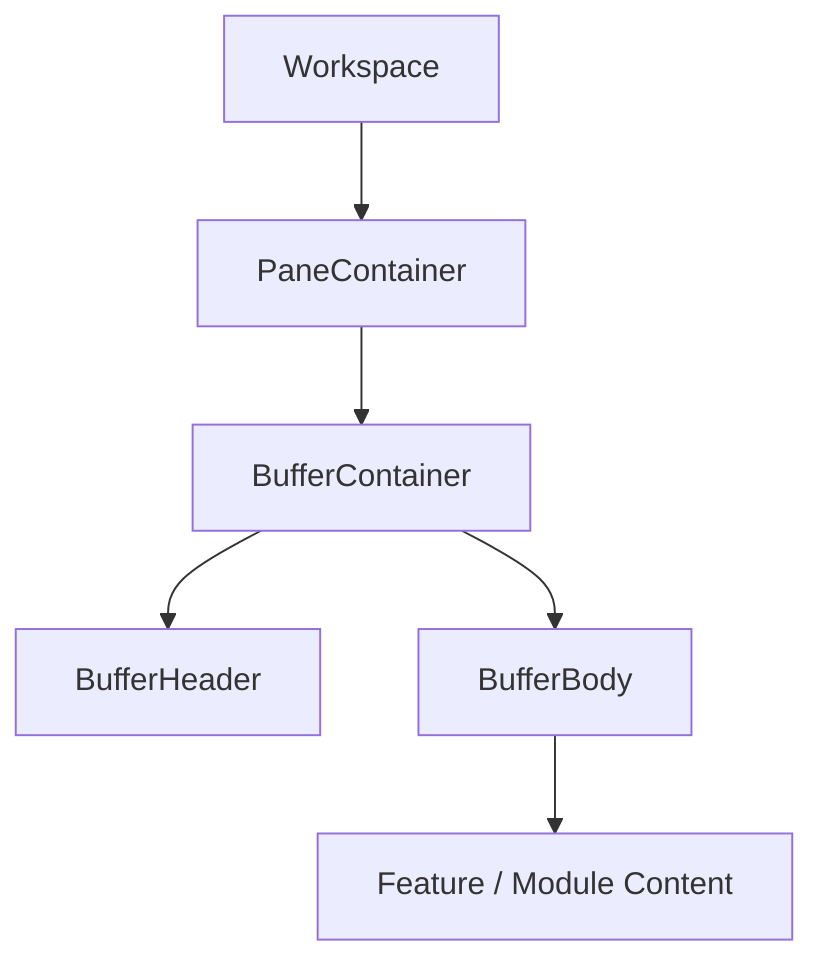
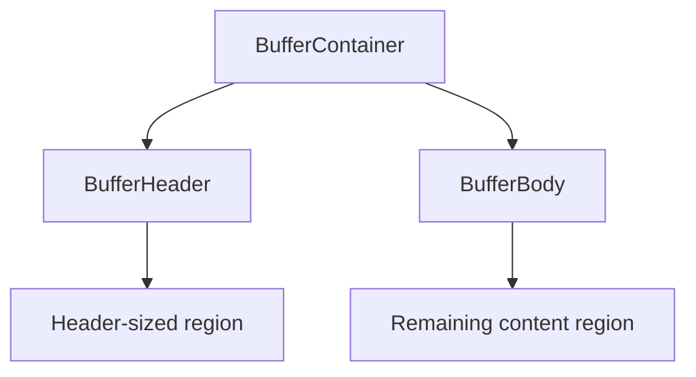
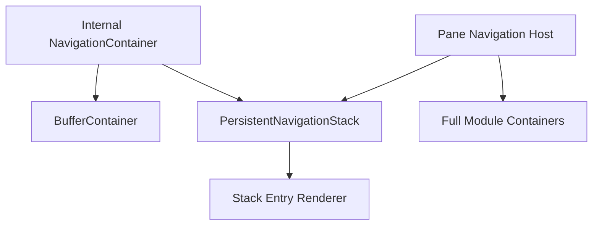

# UI Shell and Layout Ownership

## Status

**Application Standard / Architecture Guidance**

Save in the repository as:

```text
docs/03_implementation/runtime/011-ui-shell-layout-ownership.md
```

---

# 1. Purpose

This document defines ownership rules for application layout shells and the UI responsibilities that commonly become duplicated across nested components.

The recurring problem is not usually CSS syntax.

It is unclear ownership of:

```text
height
width
overflow
scrolling
outline/border
padding
header placement
body placement
focus surface
module shell
navigation shell
```

The central rule is:

> **Each layout responsibility should have one clear owner at a given hierarchy level.**

When two nested components both attempt to own the same dimension or scrolling boundary, regressions become difficult to reason about.

---

# 2. Current Shell Hierarchy

The common application structure is conceptually:



Each layer should own a different concern.

---

# 3. Workspace Ownership

The Workspace owns:

```text
pane tree
grid placement
split geometry
overall workspace dimensions
which Pane occupies which grid area
```

Feature Modules should not directly manipulate Workspace CSS grid placement.

---

# 4. PaneContainer Ownership

`PaneContainer` owns the visible Pane surface.

Typical responsibilities include:

```text
Pane structural placement
Pane-level sizing
Pane identity
Module rendering boundary
Pane-level outline/surface if required
```

It should not duplicate feature-level scrolling or body padding.

---

# 5. BufferContainer Ownership

`BufferContainer` is the primary Module surface shell.

It should own the relationship between:

```text
header
body
available client height
module-level surface sizing
```

Conceptually:



A Module should not normally wrap another full `BufferContainer` inside one that already owns the Module surface.

---

# 6. BufferHeader Ownership

`BufferHeader` owns:

```text
header height
header alignment
leading action slot
title region
trailing action slots
header-specific padding
```

Feature views supply content/actions.

They should not recreate a parallel header shell unless they are themselves a nested independent surface.

---

# 7. BufferBody Ownership

`BufferBody` owns the normal content area beneath the header.

Depending on the established implementation, it may own:

```text
remaining height
primary scrolling boundary
overflow
content surface
```

Feature components should not casually add another competing full-height scroll container.

---

# 8. Feature Component Ownership

Feature content should generally own:

```text
feature-specific spacing
feature-specific internal grouping
feature-specific list/item layout
local alignment
semantic sections
```

It should not own the Pane/Buffer shell unless the feature is explicitly implementing a nested independent surface.

---

# 9. One Scrolling Owner

A particularly important rule is:

> **There should normally be one intentional vertical scrolling owner for a Module surface.**

Bad:

```text
BufferBody
    overflow-y-auto

child wrapper
    h-full
    overflow-y-auto

inner list
    h-full
    overflow-y-auto
```

This creates:

```text
double scrollbars
lost scroll events
height calculations that depend on ancestors
scroll restoration ambiguity
mobile overscroll problems
```

---

# 10. Scroll Ownership Decision

Ask:

```text
What exact region should remain fixed?
What exact region should scroll?
```

Example:

```text
header
    fixed

body
    scrolls
```

Then only the body boundary should own the full Module scroll.

Inner lists may scroll only when the product intentionally requires nested scrolling.

---

# 11. Height Ownership

Avoid several nested layers all asserting:

```text
h-full
min-h-0
height: 100%
clientHeight
```

without a clear reason.

Height should flow deliberately:

```text
Workspace
    provides Pane area

PaneContainer
    fills Pane area

BufferContainer
    fills Pane

BufferBody
    receives remaining space
```

Children should consume the available space rather than redefining the whole chain.

---

# 12. Why `min-h-0` Matters

In flex/grid layouts, scroll children often require:

```text
min-h-0
```

on the correct ancestor so content is allowed to shrink.

Do not scatter `min-h-0` everywhere.

Place it at the layout boundary whose child must be allowed to shrink into a scrollable region.

---

# 13. Outline Versus Border

The application intentionally uses `outline` in places where a visible boundary must not affect layout dimensions.

A CSS border participates in box sizing.

That can change:

```text
height
width
scroll calculations
available body space
```

An outline does not consume layout space.

Therefore:

```text
outline
```

is appropriate for visual Pane/Module boundaries when adding pixels to the box would disturb height calculations.

---

# 14. Visual Boundary Ownership

Do not apply equivalent Pane/module boundaries at multiple levels.

Bad:

```text
PaneContainer outline
BufferContainer outline
feature root outline
```

unless they represent visually distinct semantic regions.

Repeated shell decoration makes ownership unclear and may cause double edges.

---

# 15. Padding Ownership

Padding should belong to the layer that owns the spacing contract.

Examples:

```text
BufferHeader
    owns standard header padding

SettingsScreen
    may select standard body padding

feature list item
    owns item padding
```

Avoid:

```text
BufferBody px-4
child page px-4
section px-4
row px-4
```

unless the cumulative indentation is intentional.

---

# 16. Full-Bleed Versus Padded Content

Some views intentionally need:

```text
full-bleed lists
```

while others need:

```text
padded content
```

The shell should support this explicitly rather than requiring children to cancel parent padding with negative margins.

A useful pattern is:

```text
screen/body shell accepts body classes
```

while preserving one owner for the body region.

---

# 17. SettingsScreen Lesson

Settings introduced a shared screen shell:

```text
SettingsScreen
```

It centralizes:

```text
BufferHeader
BufferBody
title
Back
Close
body classes/padding
```

This avoids separate root/group/choice/custom screens each reconstructing the same shell.

The general lesson is:

> **If several views repeatedly recreate the same shell, extract the shell before fixing each copy independently.**

---

# 18. Navigation Shell Lesson

The Settings navigation work also exposed a different rule:

```text
persistent stack rendering
```

and:

```text
BufferContainer shell
```

are separate responsibilities.

For Settings internal views, combining them is convenient.

For app-wide stacked Modules, full Module containers already own their Buffer shell.

Therefore the stack renderer must be separable from the shell.

---

# 19. Persistent Stack Primitive

Desired separation:



The stack primitive owns only:

```text
mount entries
hide inactive entries
show active entry
unmount popped entries
```

It should not automatically own:

```text
header
body
scroll
BufferContainer
```

---

# 20. Avoid Wrapper Inflation

A wrapper should exist because it owns a real responsibility.

Avoid wrappers whose only effect is:

```text
another div
another h-full
another overflow-hidden
another flex
```

without a clear ownership contract.

Every wrapper increases the number of places a layout regression may originate.

---

# 21. Container Versus View

A useful distinction:

```text
Container
    composes runtime/shell/contexts

View
    renders feature content
```

Containers may own:

```text
Buffer shell
context providers
client height
navigation infrastructure
```

Views should remain focused on feature presentation.

---

# 22. Popup Ownership

A popup is another shell.

When a Module or feature is rendered inside a popup:

```text
popup shell
```

owns the popup boundary.

The child should not assume:

```text
Workspace Pane close semantics
Pane outline
Pane sizing
```

unless the popup deliberately embeds the same Module container contract.

---

# 23. Reuse Full Containers for Full Behavior

The Settings popup bug demonstrated a useful lesson:

If a feature requires the full Module composition behavior:

```text
contexts
navigation
sizing
subscriptions
```

prefer rendering its full container rather than bypassing directly to a nested root view.

This avoids two subtly different entry paths.

---

# 24. Header Ownership

The application design rule is approximately:

```text
one leading control
title
at most three trailing slots
```

A feature should not render competing header bars inside the same surface unless it represents a deliberately nested sub-surface.

Nested navigation generally changes the current header content rather than stacking several full headers vertically.

---

# 25. Action Ownership

Header actions belong to the currently visible screen.

Do not leave actions from hidden navigation views visible.

Persistent navigation preserves hidden DOM, but shell rendering should ensure only the active entry's interactive header is presented.

---

# 26. CSS Responsibility Review

When a visual bug appears, inspect ownership before changing classes.

Ask:

```text
Who owns height?
Who owns scrolling?
Who owns outline?
Who owns body padding?
Who owns header?
Who owns overflow clipping?
```

If two answers point to two components for the same concern, resolve ownership first.

---

# 27. Sizing Inputs

When a component needs actual measured size, pass/provide it from the shell that owns that size.

Example:

```text
BufferContainer
    determines clientHeight
```

A deeply nested feature should not independently infer another interpretation of Module height if the shell already knows it.

---

# 28. Avoid Measurement Dependency When CSS Can Own It

Do not introduce:

```text
clientHeight plumbing
ResizeObserver
manual pixel calculations
```

when normal flex/grid layout can express the contract.

Use measurement only for features that genuinely require numeric dimensions.

---

# 29. Semantic Layout Components

Shared layout components should encode application semantics:

```text
PaneContainer
BufferContainer
BufferHeader
BufferBody
SettingsScreen
PersistentNavigationStack
```

rather than generic names such as:

```text
Wrapper
Box
Container2
```

Semantic names clarify ownership.

---

# 30. Nested Scroll Exception

Nested scrolling can be appropriate for:

```text
horizontal carousels
code editors
large table regions
specialized virtualized lists
```

But it should be deliberate and documented.

Do not create nested vertical scroll merely to "make it fit."

---

# 31. Overflow Hidden

`overflow-hidden` can mask an ownership bug.

Before adding it, determine:

```text
which element is supposed to scroll?
which element is accidentally overflowing?
```

Use clipping intentionally, not as a generic fix.

---

# 32. Responsive Ownership

Mobile-first behavior should remain owned at the appropriate shell.

For example:

```text
header action constraints
body sizing
pane fill
```

should not need feature-specific media-query duplication in every Module.

---

# 33. Testing Layout Ownership

Browser tests are useful when regressions depend on real layout/lifecycle.

Potential contracts:

```text
header remains fixed while body scrolls
nested navigation does not create second Buffer shell
popup and Pane entry render same Module behavior
persistent hidden view does not affect visible layout
```

Avoid pixel-perfect tests unless exact dimensions are a requirement.

---

# 34. Architecture Review Checklist

Before adding a wrapper/container, ask:

```text
What responsibility does this layer own?
Does an ancestor already own it?
Does a child already own it?
Will it introduce another scroll boundary?
Will it alter box dimensions?
Does it need full height?
Does it need to measure height?
```

---

# 35. Anti-Patterns

Avoid:

## Duplicate full-height ownership

Several ancestors all trying to define the same vertical area.

## Nested vertical scroll by accident

Multiple `overflow-y-auto` layers.

## Border used where layout-neutral boundary is required

Use outline when appropriate.

## Full Module shell nested inside another full Module shell

Separate navigation stack from Buffer shell.

## Repeated header implementations

Use shared header/screen components.

## Negative margins to undo shell padding

Fix padding ownership.

## Wrapper-only components

Require a real responsibility.

---

# 36. Architecture Invariants

1. Workspace owns layout geometry.
2. PaneContainer owns the Pane surface.
3. BufferContainer owns the Module shell.
4. BufferHeader owns header layout.
5. BufferBody owns the normal Module content/scroll region.
6. Feature components own feature layout, not Workspace shell layout.
7. One primary vertical scroll owner is preferred.
8. Visual boundaries have one clear owner.
9. `outline` is preferred where a boundary must not affect box dimensions.
10. Persistent stack rendering is separable from Buffer shell rendering.
11. Containers compose shells/contexts; views render feature content.
12. Measurement is used only when CSS layout cannot express the requirement.

---

# 37. Summary

Most shell bugs are ownership bugs.

The default hierarchy should remain:

```text
Workspace
    owns placement

PaneContainer
    owns Pane surface

BufferContainer
    owns Module shell

BufferHeader
    owns header

BufferBody
    owns primary body/scroll

Feature
    owns feature content
```

When adding or debugging layout code, identify the owner before adding another:

```text
h-full
overflow
padding
outline
wrapper
measurement
```

Clear ownership produces simpler CSS, fewer regressions, and reusable shells.
