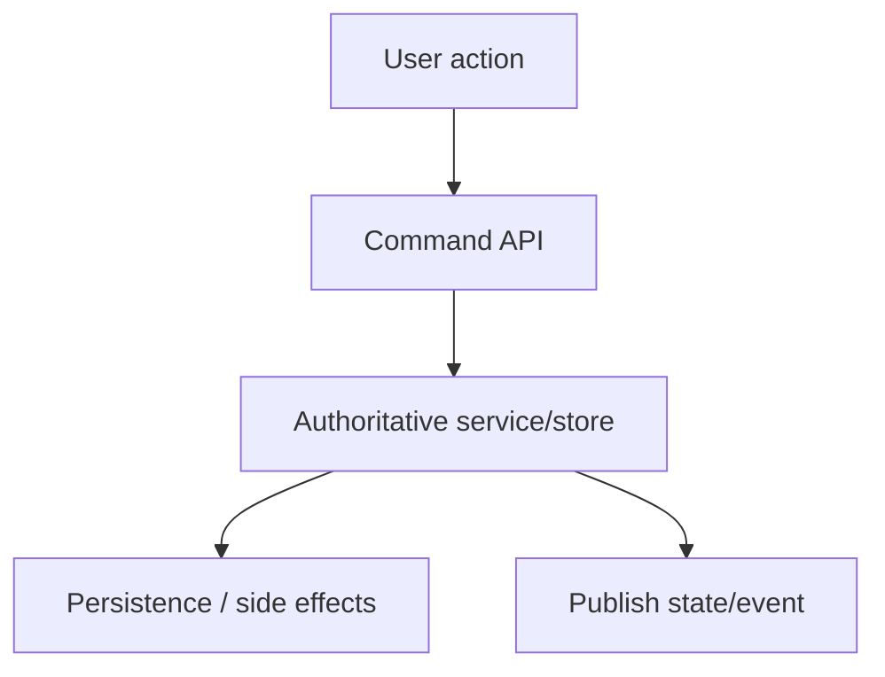
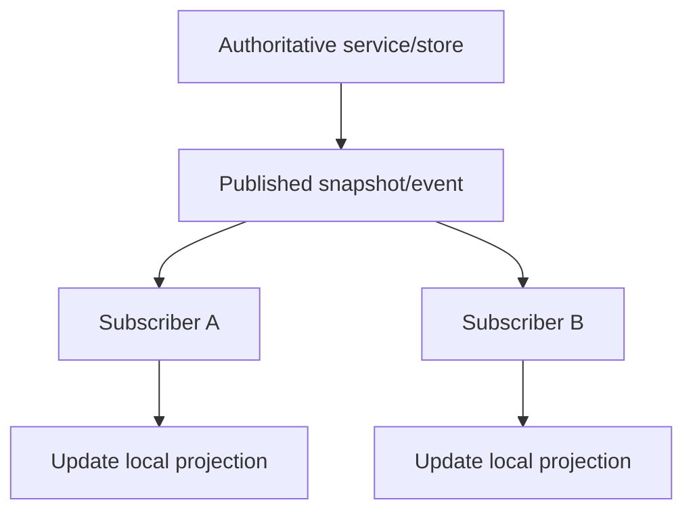
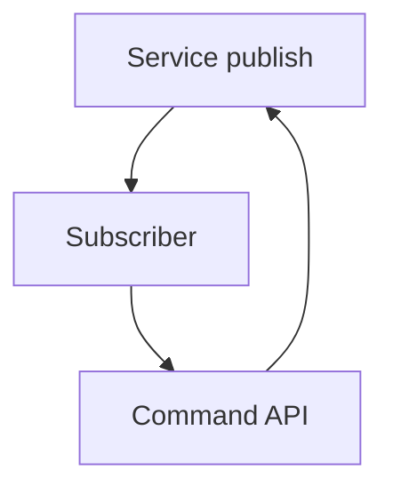
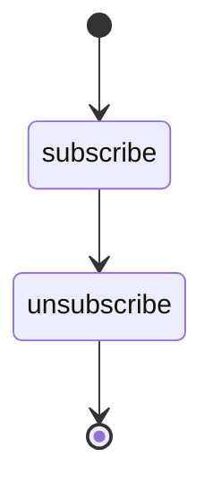

# Mutation and Synchronization Rules

## Status

**Application Standard / Architecture Guidance**

Save in the repository as:

```text
docs/03_implementation/runtime/012-mutation-synchronization-rules.md
```

---

# 1. Purpose

This document defines how KJVOnly.bible should distinguish:

```text
user/domain commands
authoritative mutations
subscriber synchronization
local projections
events
derived updates
```

The Settings multi-instance work exposed a broadly reusable rule:

> **The path that originates a change must be different from the path that receives and synchronizes that change.**

Failing to separate these paths can create:

```text
feedback loops
duplicate persistence
stale-state overwrites
repeated publication
hard-to-debug reactive cascades
```

---

# 2. Command Path

A command represents an intentional state change.

Examples:

```text
user toggles Setting
user saves Note
user marks reading complete
user edits Text Markup
user changes Resource selection
```

Conceptually:



The command path owns mutation.

---

# 3. Synchronization Path

Synchronization means an observer learns that authoritative state changed.

Conceptually:



Subscribers should normally update their projections.

They should not automatically send the same mutation back through the command API.

---

# 4. Settings Reference Example

User-originated change:

```text
SettingsRow
    ↓
SettingsContext.update()
    ↓
SettingsService.updateSetting()
    ↓
persist
apply
broadcast
```

Synchronization:

```text
SettingsService broadcast
    ↓
SettingsContainer subscriber
    ↓
Object.assign(local reactive Settings)
```

The subscriber does not call:

```text
SettingsContext.update()
```

again.

---

# 5. Feedback Loop Failure

Incorrect:



This can create:

```text
infinite loop
duplicate writes
duplicate network publication
repeated effects
```

Even if equality checks prevent a literal infinite loop, the architecture is still ambiguous.

---

# 6. Authority Owns Writes

Each logical state should have one authoritative mutation boundary.

Examples:

```text
Settings
    SettingsService

Workspace
    WorkspaceRuntime

Notes
    Notes domain/store service

Outbox
    Outbox service/store

Resource selections
    ResourceSelectionService / Module buffer creation path
```

UI components should not bypass the authority.

---

# 7. Local Projection

A local reactive object may exist for rendering convenience.

Example:

```text
SettingsContext.settings
```

It is a projection, not the write authority.

Projection updates can come from:

```text
initial load
subscriber synchronization
optimistic local command result
```

The write boundary remains explicit.

---

# 8. Stale Merge Problem

A dangerous pattern is:

```ts
service.update({
    ...localProjection,
    changedField: value
});
```

when `localProjection` may be stale.

Example:

```text
Module A local projection
    old fontFamily

Module B
    changes fontFamily

Module A
    changes showPericopes using old projection
```

If A sends its entire stale object, it can overwrite B's newer field.

---

# 9. Merge Against Current Authority

For single-field live updates, the authority should merge against current authoritative state.

Conceptually:

```ts
updateSetting(key, value) {
    updateSettings({
        ...getCurrentSettings(),
        [key]: value
    });
}
```

The command states:

```text
change this field
```

rather than:

```text
replace the world with my local copy
```

---

# 10. Patch Semantics Versus Replace Semantics

Mutation APIs should distinguish:

```text
patch/change one part
```

from:

```text
replace complete object
```

Do not use whole-object replace APIs for ordinary field edits unless replacement is the intended contract.

---

# 11. Domain Commands

Domain operations should express semantic intent.

Prefer:

```text
completeReading(id)
saveNote(note)
setMarkup(...)
```

over generic mutation such as:

```text
setState(any)
```

Semantic commands make:

```text
validation
persistence
publication
testing
```

clearer.

---

# 12. Subscriber Payloads

Subscriber APIs should clearly define whether they publish:

```text
complete snapshot
patch/delta
event
```

Consumers should not guess.

Settings currently broadcasts a complete Settings snapshot.

That makes synchronization simple:

```text
replace/assign local projection from snapshot
```

---

# 13. Snapshot Publication

Complete snapshots are useful when state is small.

Benefits:

```text
subscriber does not need patch ordering
late subscriber can receive complete value
projection can synchronize deterministically
```

Cost:

```text
larger payload
```

For Settings this is appropriate.

---

# 14. Delta Publication

For large/high-frequency state, deltas may be appropriate.

If used, define:

```text
ordering
versioning
missing delta behavior
initial snapshot
```

Do not introduce deltas merely for theoretical efficiency.

---

# 15. Events Versus State Updates

An event says:

```text
something happened
```

A state snapshot says:

```text
this is the current value
```

Examples:

```text
ArchiveImported
    event

Settings snapshot
    state

PANE_BUFFER_REPLACED
    event about runtime transition
```

Do not force all communication into one pubsub abstraction without preserving semantics.

---

# 16. Event Consumers

An event consumer may legitimately trigger:

```text
refresh
re-query
invalidate cache
navigate
```

It should not treat the event itself as permanent state unless that is the event contract.

---

# 17. Optimistic Updates

If UI updates optimistically before authority confirms persistence, the architecture must define:

```text
what happens on success
what happens on failure
how authoritative state reconciles
```

Do not create implicit optimistic behavior simply by mutating a bound object before persistence.

---

# 18. Pessimistic Updates

For some operations, update UI only after authority accepts the command.

This may be simpler when:

```text
validation can fail
publication matters
persistent write must succeed first
```

Choose deliberately.

---

# 19. Local Drafts

A draft is allowed to diverge from authority.

Example:

```text
Note editor draft
Font Size temporary value
```

The command boundary occurs on:

```text
Save
Publish
Apply
```

Draft state should be named/owned as draft state.

---

# 20. Auto-Save

Auto-save changes the command trigger, not the ownership model.

Conceptually:

```text
local draft changes
    ↓
debounce/timer
    ↓
semantic save command
    ↓
authority
```

Do not make the component itself become the persistence service.

---

# 21. Last-Write-Wins

Some systems deliberately use last-write-wins.

Example:

```text
Outbox entry by Domain Object ID
```

If last-write-wins is the contract, document:

```text
identity key
what constitutes a newer write
whether intermediate writes matter
```

---

# 22. Idempotence

Commands that may be retried should be idempotent where practical.

This is especially useful around:

```text
publication
import notifications
background processing
network retries
```

Idempotence reduces duplicate side effects.

---

# 23. Subscriber Identity

When subscribers require explicit IDs, those IDs should be stable for the subscription lifetime and released on cleanup.

Example:

```text
Settings module instance
    creates unique subscriber ID
    subscribes
    unsubscribes on destroy
```

This prevents stale observers.

---

# 24. Subscription Lifetime

Provider/container lifecycle should match subscription lifetime.



Hidden persistent views may remain subscribed because they are still mounted.

That should be intentional.

---

# 25. Synchronization While Inactive

A hidden Module may still need state synchronization.

Example:

```text
hidden Settings instance
```

should normally continue receiving current application Settings.

This ensures it is up-to-date when revealed.

Expensive computations can be paused separately.

---

# 26. Command Context

Commands should usually originate from the context/service that owns the semantic capability.

Examples:

```text
SettingsContext.update()
PaneNavigationContext.pushModule()
NotesService.save()
```

Leaf UI does not need to know persistence mechanics.

---

# 27. Avoid Direct Storage Mutation

UI should not directly mutate:

```text
localStorage
IndexedDB
Outbox DB
domain tables
```

when a service/store boundary owns the data.

Direct storage writes bypass:

```text
validation
events
synchronization
normalization
side effects
```

---

# 28. Avoid Shared Mutable Object Mutation

Passing one mutable object through many components and letting any component mutate it creates unclear command ownership.

Prefer:

```text
read projection
+
explicit mutation method
```

when synchronization or persistence matters.

---

# 29. Svelte Bindings

`bind:` is appropriate when two components intentionally share ownership under Svelte's binding contract.

It should not be used merely to silence ownership warnings.

If the child semantically issues a command to the parent/service, use:

```text
callback
context method
service command
```

instead of mutating an unbound prop.

---

# 30. Ownership Warning Lesson

Svelte's ownership warnings can reveal real architecture problems.

Example:

```text
child mutates unbound selectedSubView prop
```

The fix should identify the real owner:

```text
parent owns value
child emits callback
```

or:

```text
shared context/service owns value
```

Do not suppress warnings before deciding ownership.

---

# 31. Command Naming

Command methods should use verbs:

```text
updateSetting
saveNote
completeReading
publish
pushModule
removePane
```

Projection/state accessors can use nouns/getters:

```text
settings
views
currentPane
```

Naming makes mutation boundaries visible.

---

# 32. Synchronization Naming

Synchronization methods should make their role clear.

Examples:

```text
onSettingsChange
applySnapshot
refreshFromStore
handleImported
```

Avoid naming subscriber handlers like commands when they do not originate a write.

---

# 33. Side Effects

A mutation boundary should document its side effects.

Example `SettingsService.updateSettings()` may:

```text
normalize
persist
apply DOM theme
broadcast
```

Callers should not duplicate those side effects.

---

# 34. Transaction Boundaries

When several storage operations must remain atomic, define the transaction at the service/store boundary.

Do not rely on UI sequencing such as:

```text
write A
then write B
hope no failure occurs
```

The authority should own consistency.

---

# 35. Import/Archive Lesson

Archive import demonstrates event-after-commit behavior.

Desired model:

```text
worker/import processing
    ↓
commit Domain state
    ↓
publish ArchiveImported
    ↓
subscribers refresh
```

Notification should represent committed state, not speculative state.

---

# 36. Publication Boundary

Publication should also follow explicit mutation ownership:

```text
Domain change
    ↓
ResourcePublication
    ↓
Outbox
    ↓
Publisher
```

UI should not bypass this by publishing directly.

---

# 37. Derived UI Updates

If UI can derive a value from synchronized authority, derive it rather than creating another synchronization channel.

Example:

```text
selected Settings option label
```

comes from:

```text
current setting + definition
```

No separate selected-label state is necessary.

---

# 38. Mutation Test Strategy

Unit/service tests should verify:

```text
command changes authority
persistence called/updated
broadcast occurs
invalid command rejected
stale local projection does not overwrite unrelated state
```

---

# 39. Synchronization Test Strategy

Integration/browser tests should verify:

```text
instance A command
    updates instance B projection

subscriber update
    does not republish

destroyed instance
    no longer receives updates
```

---

# 40. Loop Regression Test

For important synchronized state, test that receiving a service update does not invoke the command path again.

This can be checked through:

```text
publish count
storage write count
service spy
```

at the correct service boundary.

---

# 41. Multi-Writer Review

Before allowing another write path, ask:

```text
Why does this layer need to write?
Is there already an authority?
Will the write publish/normalize/persist consistently?
Can two writers race?
```

Often the correct answer is:

```text
route through existing service
```

---

# 42. Command Versus Event Matrix

| Situation | Pattern |
| --- | --- |
| User wants to change state | Command |
| Service tells consumers current value | Snapshot synchronization |
| Something completed/happened | Event |
| UI temporarily edits before save | Draft |
| Value can be calculated | Derived state |

---

# 43. Anti-Patterns

Avoid:

## Subscriber republishes synchronized state

Creates feedback.

## Whole-object replace from stale local copy

Overwrites unrelated changes.

## UI writes storage directly

Bypasses authority.

## Child mutates unbound prop

Unclear ownership.

## Same logical mutation implemented in several services

Multiple authorities.

## Event represented as permanent boolean state

Confuses event and state.

## Draft treated as current persisted truth

Ambiguous lifecycle.

---

# 44. Architecture Invariants

1. Every logical mutation has a clear authoritative command boundary.
2. Synchronization handlers do not automatically republish through the command path.
3. Local reactive copies are projections unless explicitly authoritative.
4. Single-field live changes merge against current authority, not stale local projections.
5. UI does not bypass persistence/domain services.
6. Subscriber lifecycle matches owning component/service lifecycle.
7. Events and state snapshots remain semantically distinct.
8. Draft state is explicitly separate from committed state.
9. Commands expose meaningful semantic intent.
10. Mutation side effects are centralized.
11. Bound props are mutated only under intentional shared-ownership contracts.
12. Svelte ownership warnings are treated as architecture signals before suppression.

---

# 45. Summary

The core distinction is:

```text
command
    originates change

authority
    validates/persists/applies change

publication
    communicates result/current state

subscriber
    synchronizes projection
```

The subscriber is not another command origin.

Keeping these paths separate makes multi-instance UI, persistence, publication, and reactivity substantially more robust.
